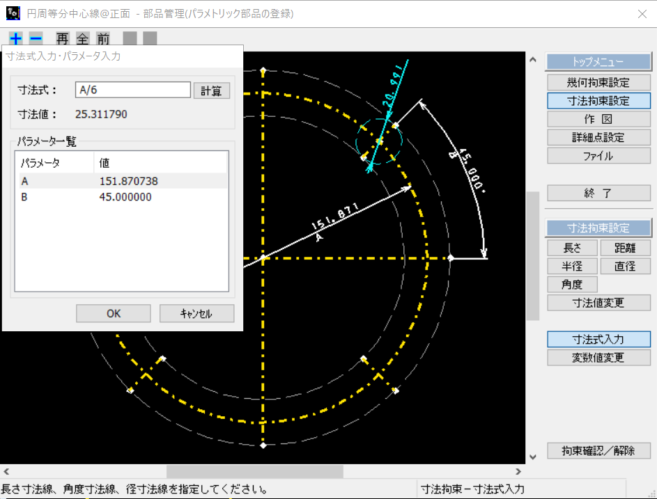
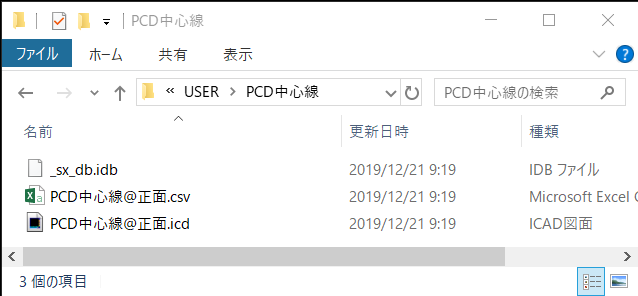
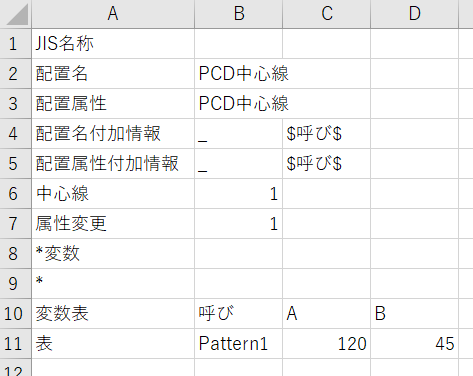
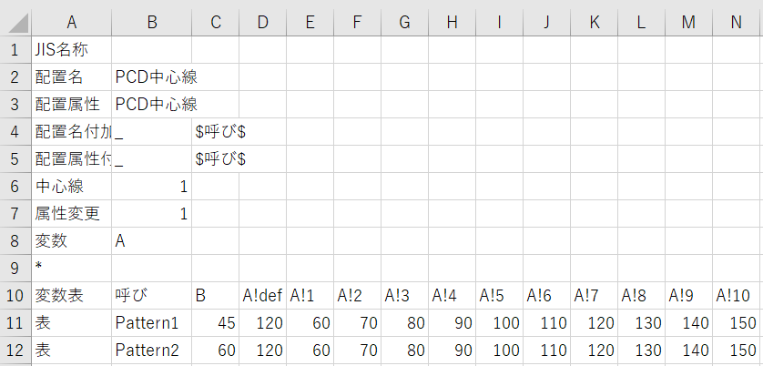
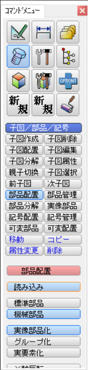
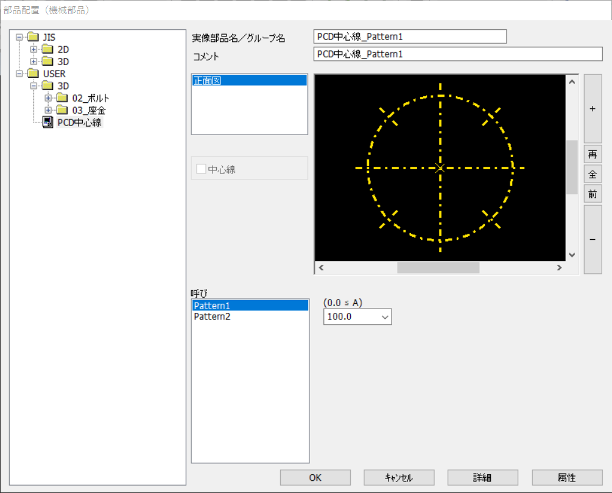
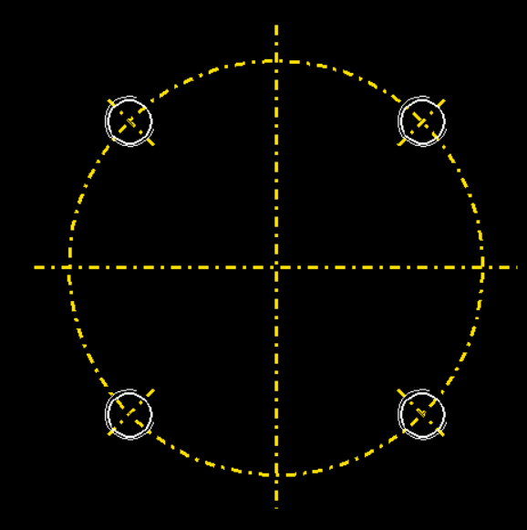
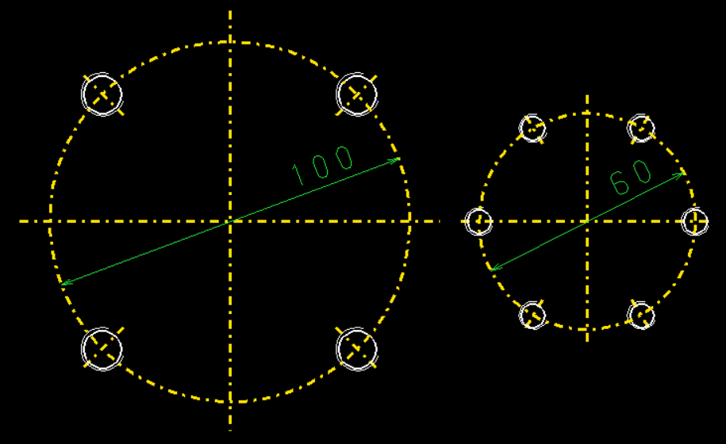

---
categories:
- CAD
date: "2025-02-15T23:42:35+09:00"
draft: false
images:
- images/icad.svg
description: iCADで作成したパラメトリック部品を挿入時に寸法指定できるように、変数表の設定の仕方を解説します。
summary: iCADで作成したパラメトリック部品を変形させるため、変数表を編集します。CSVファイルに変化させるパラメータを書き込み保存するとパラメトリック部品挿入時に寸法を指定できるようになります。
tags:
- iCAD/SX
title: iCAD/SX 2Dパラメトリック部品の登録 - パラメータの設定
---

[前回の記事](../icad-parametric-parts-1)でiCAD上で作成したパラメトリック部品の変数表を編集していきます。

CSV出力をチェックし保存すると iCADインストールフォルダ\\JISPARTS\\USER
フォルダに名前を付けた「PCD中心線」フォルダとその中に図面ファイルとCSVファイルが作成されます。

CSVファイルをExcelなどで開くと下のような中身になっています。AとBがパラメトリック部品で定義した変数名です。

わかりにくいのですが、2通りパラメータ変化を定義することができます。A11セルの「表」行の下に行を追加し「呼び」、各パラメータを追加していく方法と、A8セルの「変数」の右隣B8セルに変数名を書いて、その変数を列方向にパラメータリストを追加していく方法です。

呼びの行方向の変化で角度Bを45°と60°の2パターン作り、直径Aを変数として変化させるように編集しました。A8セルの「\*変数」の「\*」を消して「変数」とし、隣にパラメータ名「A」を記入します。変数は列の一番右に記載する必要があるので、AとBの列を入れ替えます。

変数は「変数名!def」でデフォルト値を、「変数名!数字」で選択リストに表示される値を入れます。「変数名!max」「変数名!min」で最大、最小値も指定できます。また、リストに無い値でもパラメトリック部品挿入時に手打ちで指定できます。

CSVファイルを保存したら完了です。

作成したパラメトリック部品を挿入してみます。コマンドメニューで「子図／部品／記号」「部品配置」「機械部品」「読み込み」をクリックします。

機械部品選択ダイアログでUSERフォルダの下に作成した「PCD中心線」が作成されているので選択します。呼びと変数を先程編集したCSVファイルで指定した値に選択できます。

Pattern1、A=100を選択し部品を配置してみます。

45°線の中心に機械部品のタップ穴を配置します。

パラメータを変更して同じようにもう一つ部品を配置してみます。

思った通りに変化してくれました。パラメトリック部品にタップ穴まで含めようかとも思いましたがパラメトリック部品の中に機械部品を含められないのでタップ穴径毎にパラメータが必要になりそうで、さらにタップ穴個数を変化させられるかわかりませんでした。

キリ穴、ザグリ穴の場合もありますし穴の配置はそんなに面倒では無いので中心線だけでよしとします。
