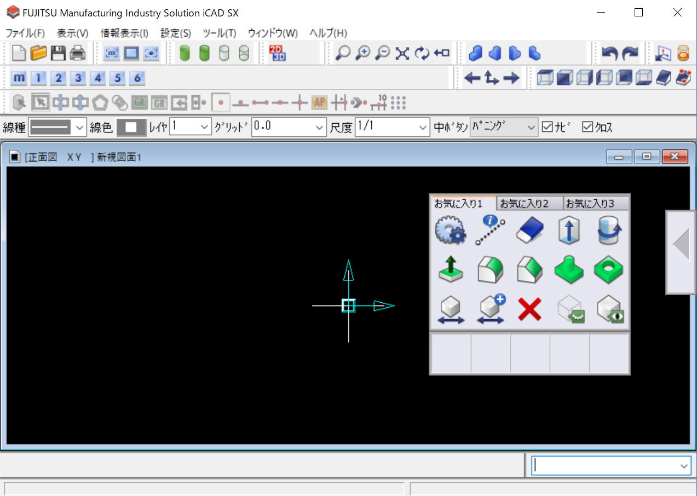
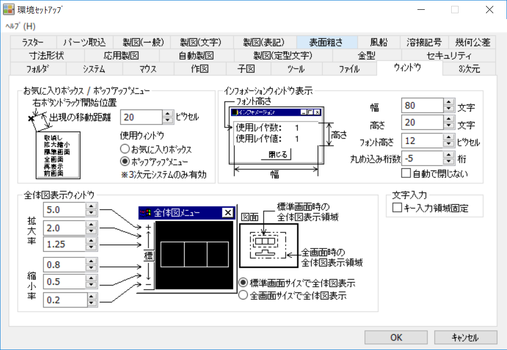
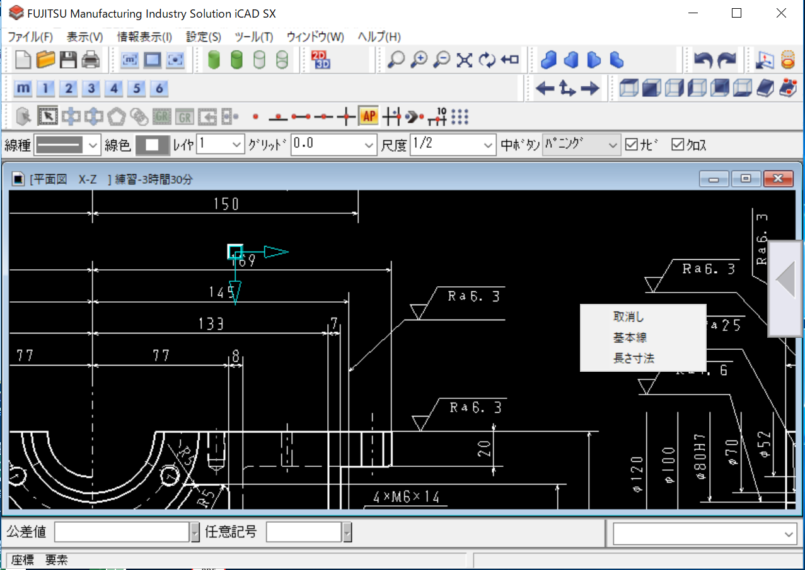

---
categories:
- CAD
date: "2025-02-15T23:42:26+09:00"
draft: false
images: 
- images/icad.svg
summary: iCAD/SXで右クリックしながらドラッグするとお気に入りボックスが表示されますが、2次元設計で便利なポップアップメニューを表示するカスタマイズ方法を解説します。
tags:
- iCAD/SX
title: iCAD/SX ポップアップメニューの表示
---

iCAD/SXで右クリックしながらドラッグするとお気に入りボックスが表示されアイコンメニューからよく使用するコマンドを登録できます。しかし、アイコンメニューは３次元設計で使用する項目がほとんどなので２次元設計メインで使う場合はあまり役に立つコマンドが登録できません。２次元で使うのは機械部品配置、距離測定くらいでした。

ヘルプを読むと「ポップアップメニュー」なるものがあるとのこと。２次元設計モジュールでしか表示されないと注意書きがあります。環境セットアップのウィンドウタブにお気に入りボックスの替わりにポップアップメニューを表示させる設定がありました。

これでポップアップメニューが表示できました。コマンドメニューのコマンドが登録できるので２次元設計ではこちらのほうが使いやすいですね。ポップアップメニューの項目は環境設定ツールのメニューセットアップから設定します。

しかし３次元でもポップアップメニューが表示されるようになるので３次元設計するときは不便になりますね。iCAD/SXは２次元と３次元のデータが１つのファイルになっていて２次元←→３次元の行き来が楽なのですが、操作インターフェースは２次元と３次元で切り替わってくれるといいのにと思います。
