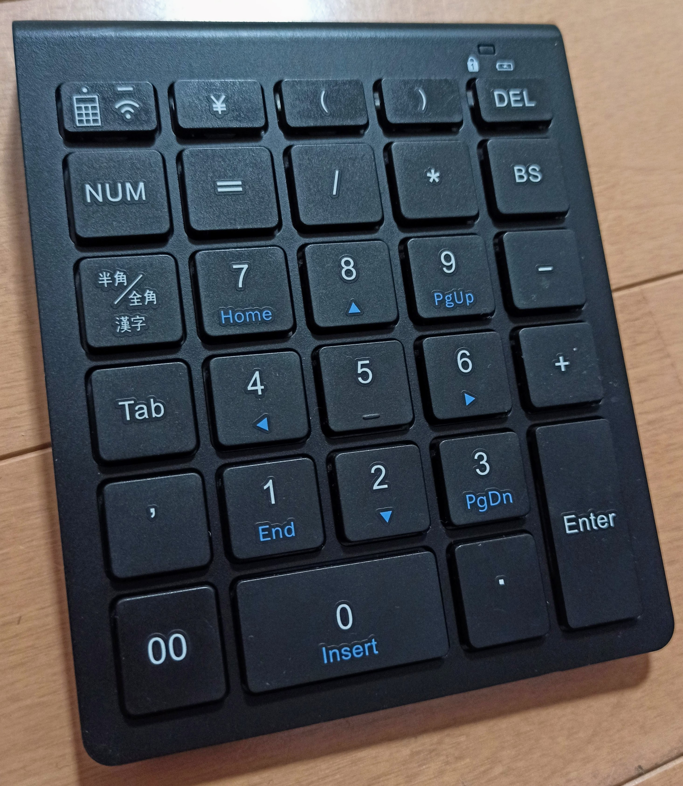
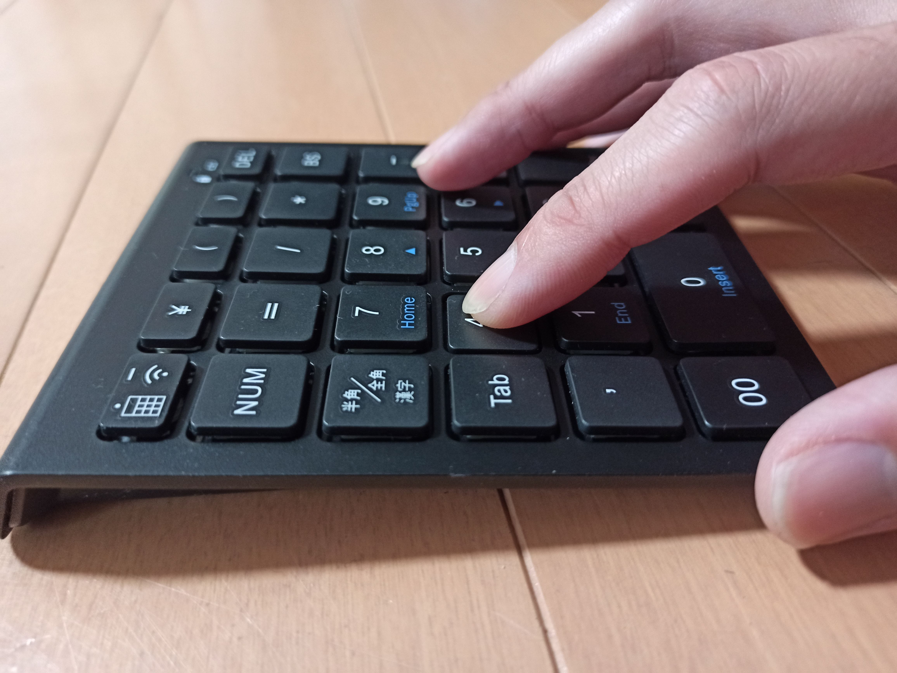
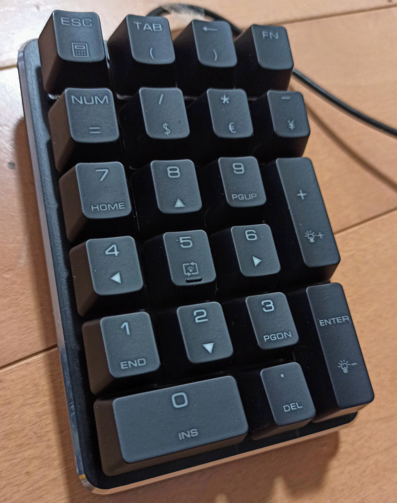
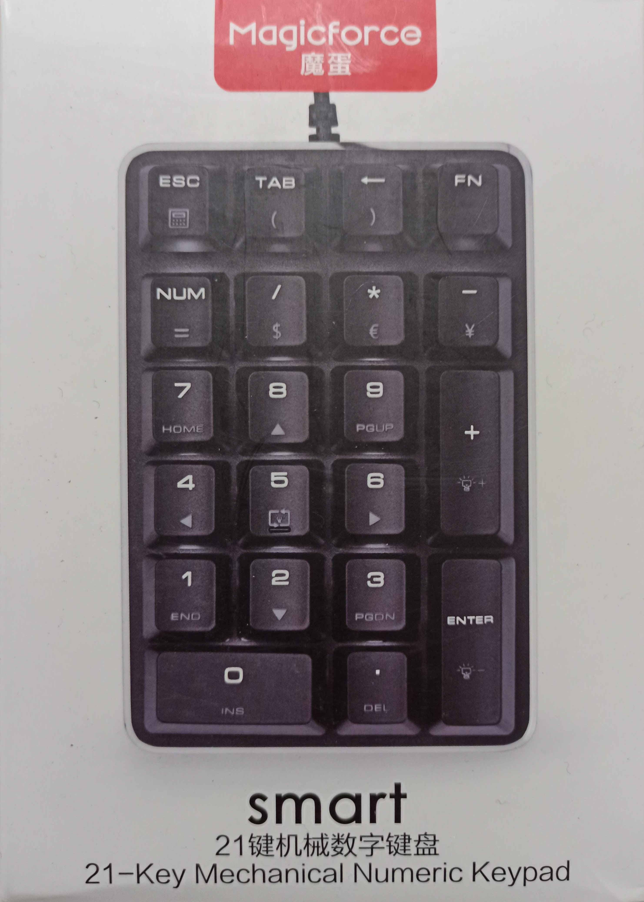
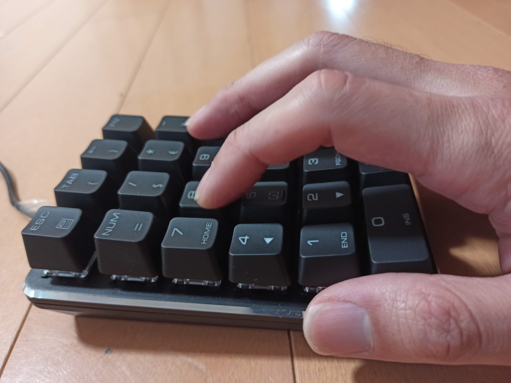
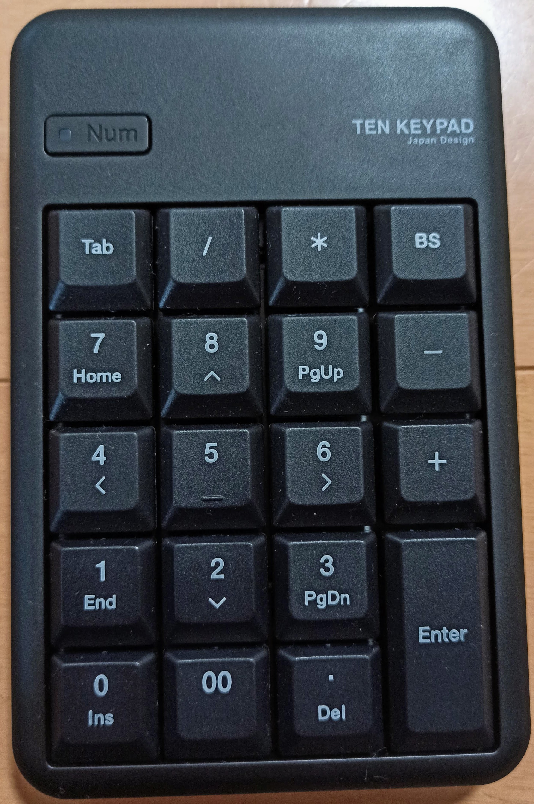
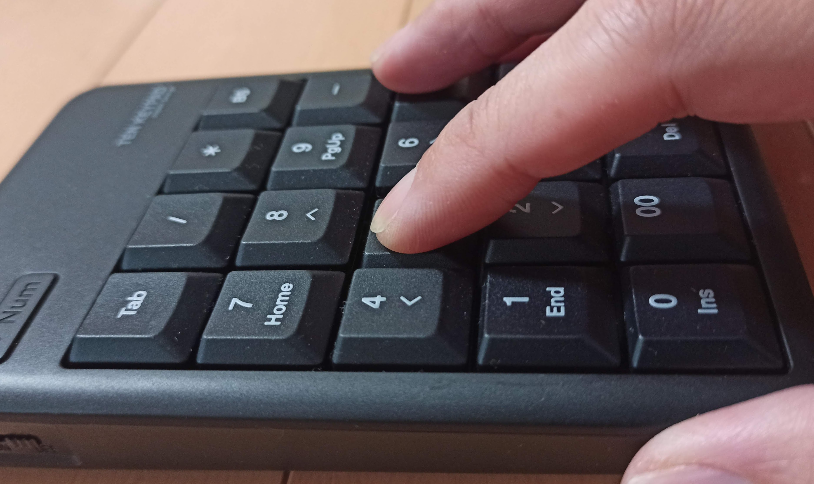
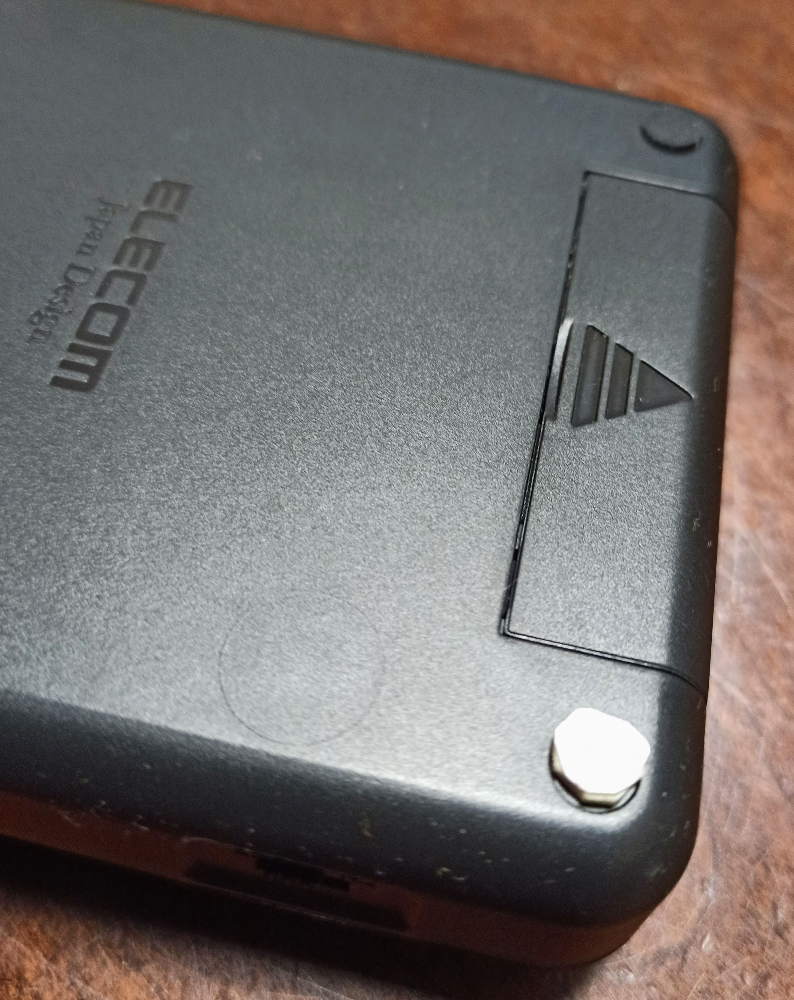

---
categories:
- CAD
date: "2025-02-15T23:42:37+09:00"
draft: false
images:
- images/IMG_20200216_125045.jpg
description: CAD作業に最適なテンキーを選ぶためパンタグラフ式、メカニカル式、メンブレン式を購入、レビューし比較しました。
summary: CAD操作では数字の入力を頻繁に行います。左手はショートカットキー入力、右手はマウス操作で、数字を入力する際は右手でマウスを置いてテンキーを叩いています。テンキーのみマウスの近くに配置できたら作業効率が上がるかなと思いいくつか購入し試してみました。
tags:
- iCAD/SX
- テンキー
title: iCAD/SX テンキーパッド選び
js: js/paad.ts
---

先日の記事で片手キーボードのことを書きましたが、CAD操作では数字の入力も頻繁に行います。

左手はショートカットキー入力、右手はマウス操作で、数字を入力する際は右手でマウスを置いてテンキーを叩いています。

テンキーのみマウスの近くに配置できたら作業効率が上がるかなと思いいくつか購入し試してみました。

## テンキーパッドに求めるもの

いろいろなものが売られていますが、下記を重視して選定しました。

1.  ワイヤレス(2.4GHz)
2.  キーの押しやすさ、押し心地
3.  キーの静音性
4.  落ち着いた高級そうなデザインで黒色

ワイヤレスなのは、マウスの近くに置くので線が邪魔になるのが嫌で、Bluetoothは付いていないのでUSBにレシーバーを挿すタイプにしました。その他は単純に好みです。

## 購入したテンキーパッド

結論から言うと、下に挙げた順に購入していき、最後のエレコムに落ち着いたわけですが、順番にそれぞれのレビューを書いていきます。

1.  ミヨシ MCO TEN24G01/BK
2.  Magicforce メカニカル式テンキーパッド 赤軸 21キー
3.  エレコム テンキー TK-TDM017BK

## ミヨシ MCO TEN24G01/BK

アルミ筐体にパンタグラフキーで薄く高級感に溢れる佇まいで見た目が気に入りました。さらにキー数も多く丸括弧などが入力でき、エクセルを使う際にも便利かなということで購入。

結果は、キーストロークが浅いため、入力した感が薄く、数字が画面に表示されるのを見るようになってしまい速く入力するという目的には自分としてはいまいちでした。

不具合はないし見た目はすごく良いのでパンタグラフが好みの方にはとてもおすすめです。

## Magicforce メカニカル式テンキーパッド 赤軸 21キー

次に選んだのがキーの押し心地重視でメカニカルキーのこれ。若干凹んだ中国語の箱に入ってきました。箱のデザインはiPhoneを思わせるなかなか素敵な感じです。

メカニカルキーは音がうるさいイメージがあるので、メカニカルキーの中では比較的静かな赤軸のモデルを選びました。メカニカルだけあってキータッチは心地よく、入力した感もしっかり指に伝わります。

しかし、欠点は高さが結構あること。入力の際に手の付け根をテーブルに当て入力するのですが、高くて指を上げるような感じになってしまい疲れます。

手を浮かせて打つ人であればよいのだとお思いますが自分の入力の仕方には合いませんでした。

## エレコム テンキー TK-TDM017BK

パンタグラフ、メカニカルとキーの押し心地が合わなかったということで、最後は普通のメンブレン方式のこれを試しました。

メンブレンは普通すぎて安物感もあり、キータッチも期待していませんでしたが、キーを押した感が必要十分に伝わるキーストロークと静音がとても良く、これに決めました。

3種類の中で一番安いのですが、見た目もキーの触り心地も良いです。

唯一の難点は、底のゴム足が弱い両面テープでくっついているのですぐに1個取れてなくなってしまいました。

極厚の強力両面テープを丸く切り抜きゴム足として使っています。

ということで、これが一番おすすめです。


