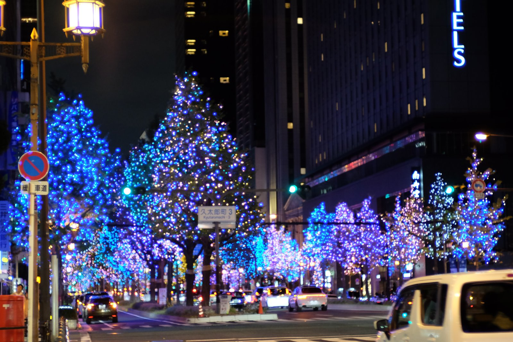
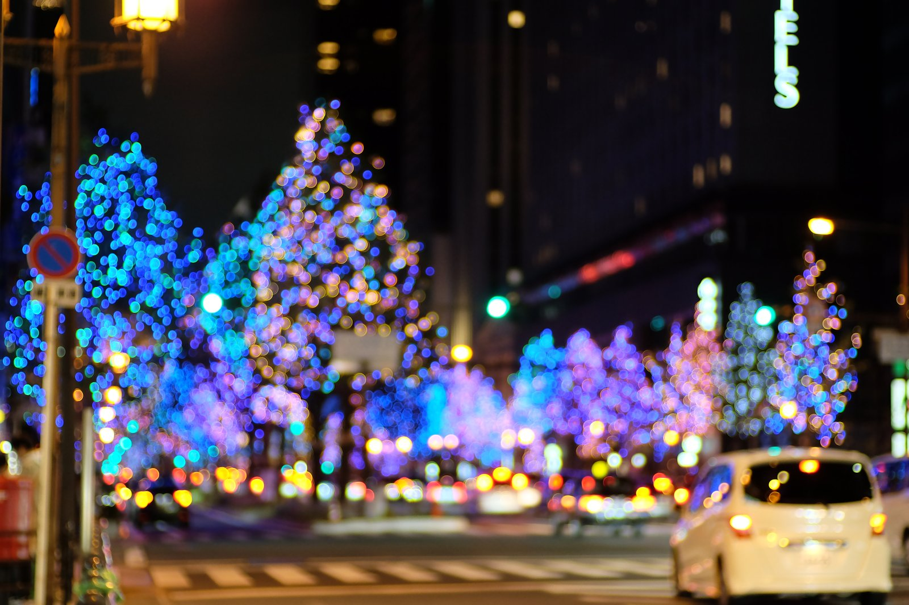

---
categories:
  - アウトドア
  - 旅行
date: "2025-02-15T23:44:16+09:00"
description: クリスマスシーズンのイルミネーション、大阪･光の饗宴。御堂筋沿いのイチョウ並木を梅田から難波までを光に包む大規模なイルミネーションを見るウォーキングルートをご紹介します。
draft: false
images:
  - images/0015.jpg
summary: クリスマスシーズンが近づくと夜のイルミネーションがきれいです。大阪では毎年、大阪･光の饗宴と題して様々な場所でイルミネーションが行われます。その中でも御堂筋沿いのイチョウ並木を梅田から難波まで光に包む大規模なイルミネーションを見ながら御堂筋を歩きました。
tags:
  - イルミネーション
  - クリスマス
  - 大阪
  - 御堂筋
  - 家族でお出かけ
title: 大阪･光の饗宴 御堂筋イルミネーション ウォーキング
js: js/gmap.ts
---

クリスマスシーズンが近づくと夜のイルミネーションがきれいです。大阪では毎年、大阪･光の饗宴と題して様々な場所でイルミネーションが行われます。その中でも御堂筋沿いのイチョウ並木を梅田から難波まで光に包む大規模なイルミネーションを見ながら御堂筋を歩きました。

## マップとアクセス

{{< gmap json="track.json" center="{ \"lng\": 135.50095663, \"lat\": 34.69 }" zoom="13" style="roadmap" >}}

大阪を南北に走るメインストリート、御堂筋の阪神前交差点から難波西口交差点まで、電車の駅でいうと梅田駅から南海電鉄のなんば駅前までです。

## 梅田周辺 水都ブルーとランドマークレーザー

電車で梅田駅まで行き、スタートです。
[公式サイト](https://www.hikari-kyoen.com/midosuji/)
によると、阪神前交差点から始まりますが、微妙にずれて阪急前から入ってしまいました。御堂筋イルミネーションとは関係ないのですが、HEP
FIVE前にきれいなクリスマスツリーがありました。

阪急東交差点前までくると、青色のランドマークレーザーが空高く出ているのがよく見えます。

ランドマークレーザー前まで近づいてきました。イルミネーションの中でこれが一番すごかったです。レーザーの付近に青紫色に光っているオブジェのようなものは梅田換気塔で地下街ホワイティうめだを換気している設備です。

レーザーの放出口です。

御堂筋の街路樹はエリアごとに決められたテーマ色でイルミネーションされています。梅田から大江橋北詰までは経済成長に向けて輝き出した光、水都ブルーがテーマです。

幻想的な雰囲気の中、歩道を歩いていきます。南に行くにしたがって人が多くなってきますが、梅田から大阪市役所あたりまではあまり人もいなく、じっくりとイルミネーションを楽しむことができます。

車道を見るとこんな感じです。

## 大阪市役所イルミネーションファサード・フォトモニュメント

大阪市役所はイルミネーションファサード・フォトモニュメントという長い名前でひときわ目を引くオブジェが光っています。

「ひろがる絆」をコンセプトに「人と人とのつながり」を表す光の八角形で表現しているとのことです。

大阪市役所のすぐ脇、土佐堀川沿いに、「OSAKA光のルネサンス2023
中之島イルミネーションストリート」の光のアーチが奥に見えます。ここも寄りたかったのですが家族が先に行ってしまったので奥から写真を撮るのみにして南へ進みます。

淀屋橋から土佐堀川の風景です。

## 進むにつれてイルミネーションの色が変わっていく

淀屋橋を越えると、イルミネーションが青色から金色に変わっていきます。スポーツカーが列を作って走っていきました。写真を撮り遅れ後ろ姿です。

バブル期の華やかな光、シャンパンゴールドがテーマです。コーヒーショップの看板もイルミネーションを背景に素敵な絵になりますね。

バブルは夜の街も今よりずっとにぎやかだったのでしょうか。このあたりもまだ人は少ない方です。係員の方らしき人がぽつぽつ歩いているので女性や子供にも安心感があります。

本町まで来ました。多様性に富んだ光、ミックスでインターネットの時代90年代〜2000年代を現しているようです。

青、紫、ピンクの色が幻想的できれいです。

ちょっとボカシてみました。

道路脇の低い木も白い光でイルミネーションされています。

難波神社付近、これまでの色全員集合でカラフルです。ミックスのあとは、ピンク、パープル×ゴールドと続くはずなのですが、子供達が飽きて先へ先へ進み出したのでなんだかわからなくなってしまいました。しかしとにかく大通り沿いにこれだけ大規模なイルミネーションはなかなか日本中にも無いのではないでしょうか。素晴らしい景色でした。

## 道頓堀を越えて地下鉄なんば駅まで

御堂筋線で梅田からなんばまで4駅もあり、かなり遠いだろうと想像していたのですが歩いてみると意外と歩ける距離です。もうなんばの１つ手前、心斎橋まで来ました。ここから御堂筋の側道が閉鎖されて歩道になったので広い歩道に多くの人が歩いており、明るく都会の雰囲気に変わってきます。

道頓堀にグリコの看板です。コロナの自粛も無くなり、すごい人出に戻りつつあります。

歩道が広いためか、ところどころ歩道にプロジェクションマッピングされていたりします。

金龍ラーメン、なんばの飲み屋街はにぎやかですね。

御堂筋線のなんば駅入口まで来ました。この先、南海電鉄なんば駅前までイルミネーションは続き、最後は未来のホワイトになるようですが子どもたちがブーブー言い出したのでここで電車に乗って今回のイルミネーションウォーキングは終了です。

イルミネーション終点のなんば広場では12/2よりランドマークレーザー&プロジェクションマッピングが開催されるようなのでまた12月に再訪したいと思います。

## まとめ

大阪･光の饗宴
御堂筋イルミネーションは梅田からなんばまで、約1時間イルミネーションに包まれながらウォーキングしました。車で通ったり、通して歩かずにポイントで見たりしてもきれいですが、平坦な道なので意外と楽に歩けるためじっくり堪能するには歩くのもおすすめでした。

12月からは他にも様々なイルミネーション、イベントが開催されるので冬の楽しみですね。
