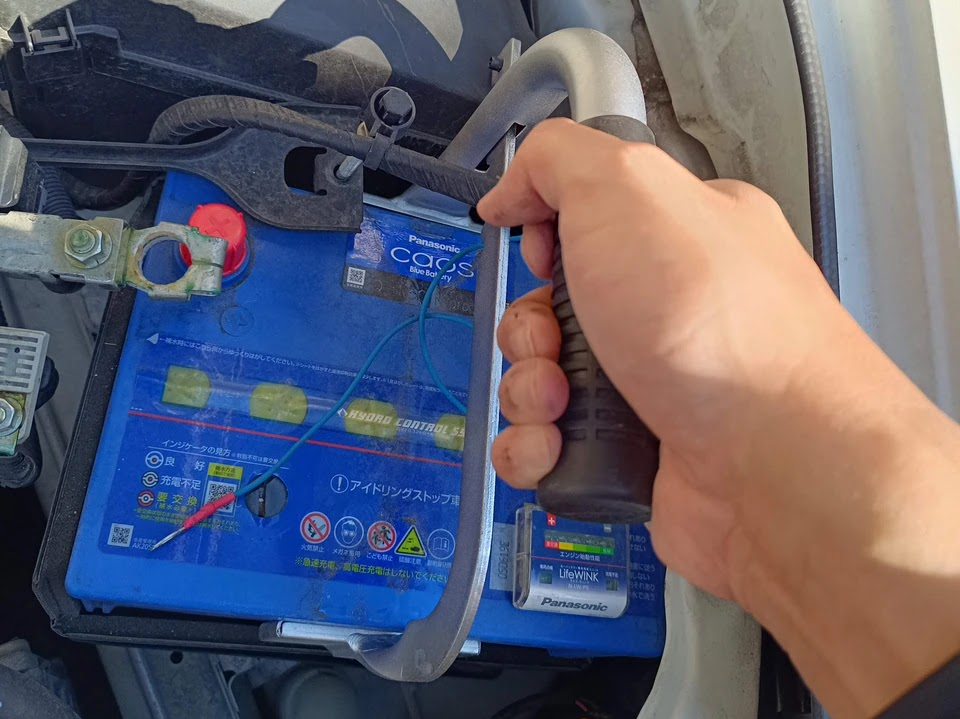

---
categories:
  - 車
date: "2025-02-15T23:44:17+09:00"
description: 車のバッテリー交換で、意外と苦労したのが重いバッテリーをスペースの無いエンジンルームから抜く作業です。手が入るスペースが無くバッテリーが抜けない！そんな悩みを解決する、簡単にバッテリーを持ち上げられる便利ツール、バッテリーキャリアをご紹介。
draft: false
images:
  - images/0006.jpg
summary: 車のバッテリー交換で、意外と苦労したのが重いバッテリーをスペースの無いエンジンルームから抜く作業です。手が入るスペースが無くバッテリーが抜けない！そんな悩みを解決する、簡単にバッテリーを持ち上げられる便利ツール、バッテリーキャリアをご紹介。
tags:
  - 工具
  - バッテリー交換
title: カーバッテリーを持ち上げる便利なツール、バッテリーキャリア
js: js/paad.ts
---

車のバッテリー交換で、意外と苦労したのが重いバッテリーをスペースの無いエンジンルームから抜くところです。

初めてバッテリー交換をした際、バッテリー周りに手の入る隙間が無く、四苦八苦しました。バッテリーはとても重いので、下まで両手を回さないと持ち上げられませんが、ここにどう手を突っ込めと？

バッテリーをずらしたり傾けたり、ガチャガチャやってなんとか抜いた記憶があります。

## バッテリーキャリア

そんな悩みを解決する、簡単にバッテリーを持ち上げられる便利ツール、バッテリーキャリアです。

いろいろなメーカーから製品が出ていますが、概ね上の写真のような形をしており、2本のアームでバッテリー側面を挟んで持ち上げるというものです。



## 使い方

わざわざ説明するまでのものではありませんが、側面からの摩擦だけで重いバッテリーが持ち上がるのか、試してみます。新品のバッテリー、パナソニックのCaosです。持ち手が付いているのでバッテリーキャリア要らないじゃないか、というツッコミは置いといて。

使い方は至ってシンプル、バッテリー側面をこんな感じで挟むだけです。フリーアームのギザギザ部分をずらすことで様々なバッテリー幅に対応しています。ロック機構だとか、バネなどで挟む力をかけるような機構は無く、こんなんで持ち上がるのか不安しかありません。

上に上げてみると、、、なんと、普通に持ち上げることができました！

おそらく、右側のフリーアームの先端ゴムをバッテリーに接触させ、持ち上げるとバッテリーに対し、先端ゴムが滑る
→ フリーアームが摩擦で右回りに回転しようとする →
右回りに回転すると、先端ゴムは左に動こうとし、バッテリーを挟む力が働く、というメカニズムと思われます。パイプレンチがパイプを喰らい込んで回す仕組みみたいな感じでしょうか。単純な機構ですが面白いですね。

では、本命の古いバッテリー外しに使ってみます。今回は、同じメーカーのバッテリーに交換するので、新品バッテリーに付いていた持ち手を付け替えればよいのでは、というツッコミは置いといて、、、バッテリーキャリアで掴みます！

前回四苦八苦したのが嘘のようにあっさりと持ち上げてバッテリーをエンジンルームから抜くことができました。

まあ、新品バッテリーを入れるときは付属の持ち手を使いましたよ。

## まとめ

これがあるとかなり作業性が良くなるのでDIYでバッテリー交換をする方にはぜひおすすめしたいツールです。ただ、今回のように同じメーカー品で交換する場合で、新品バッテリーに持ち手が付いている場合は、古いバッテリーに付け替えることもできるのでその場合は無くても良いでしょう。


