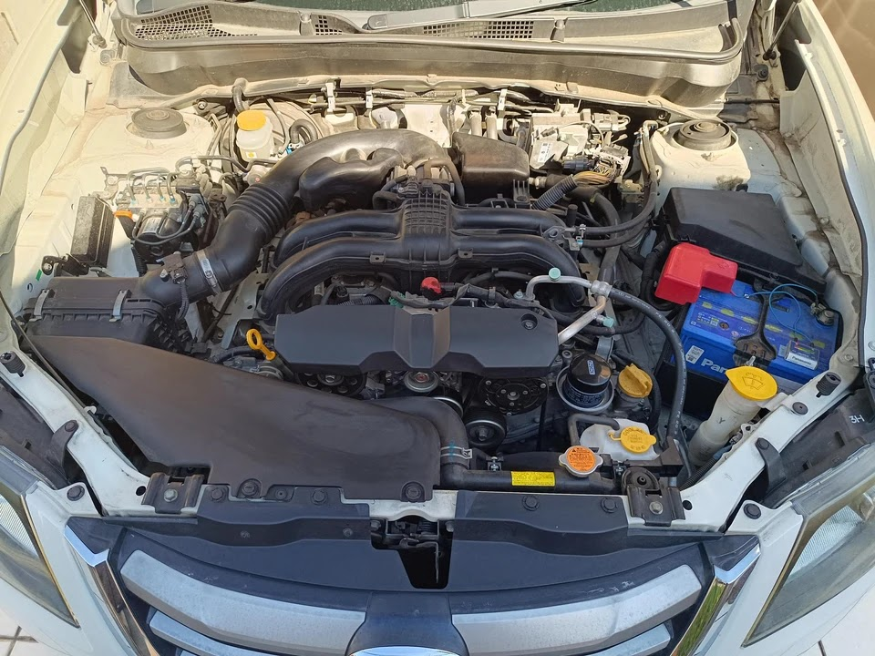
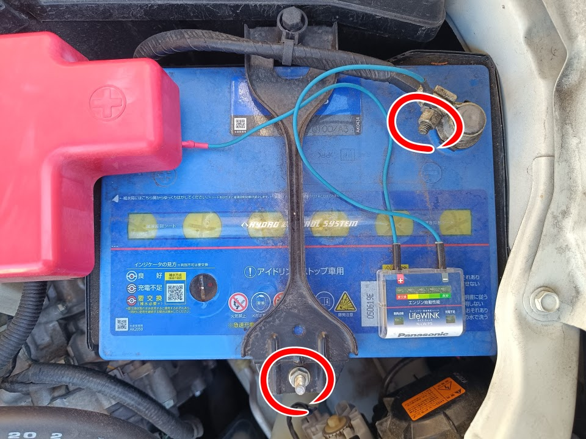
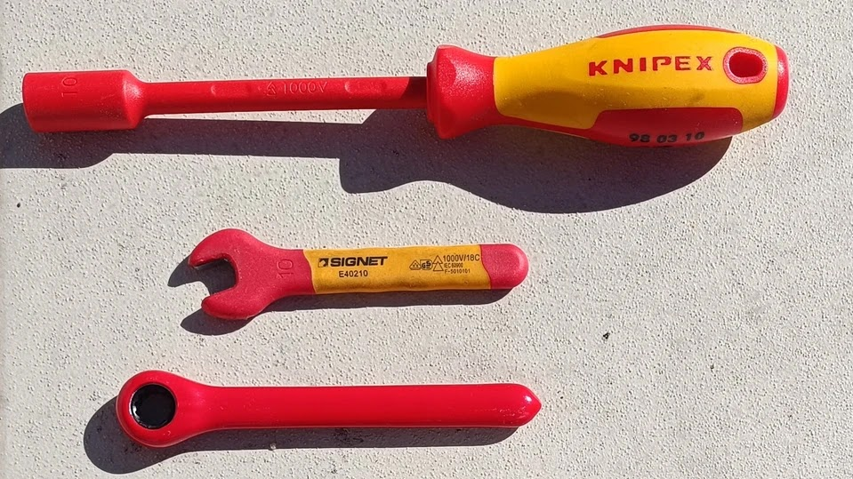
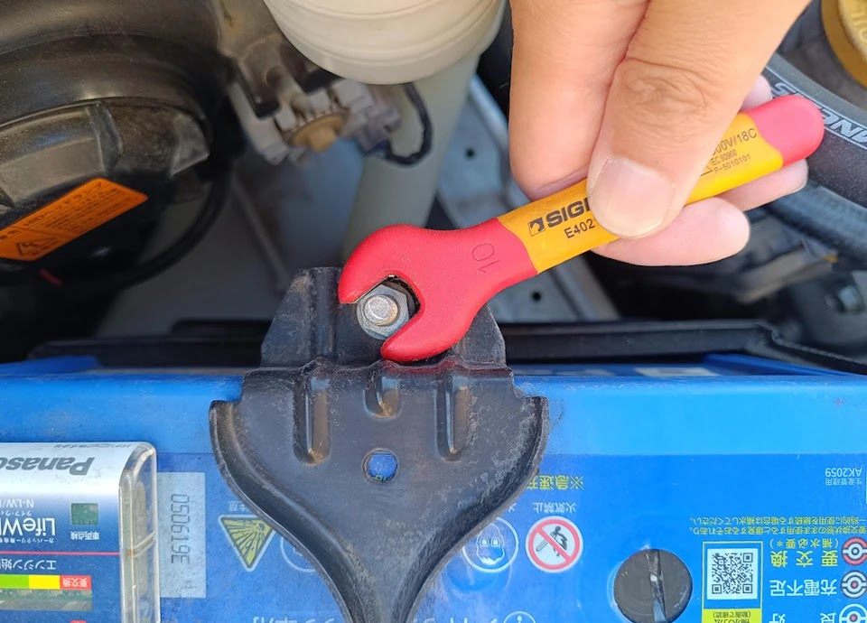
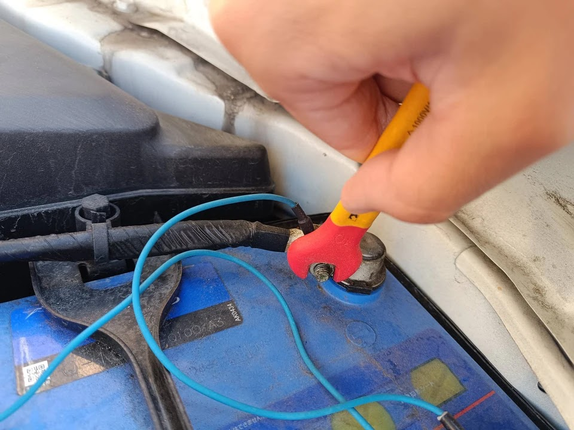
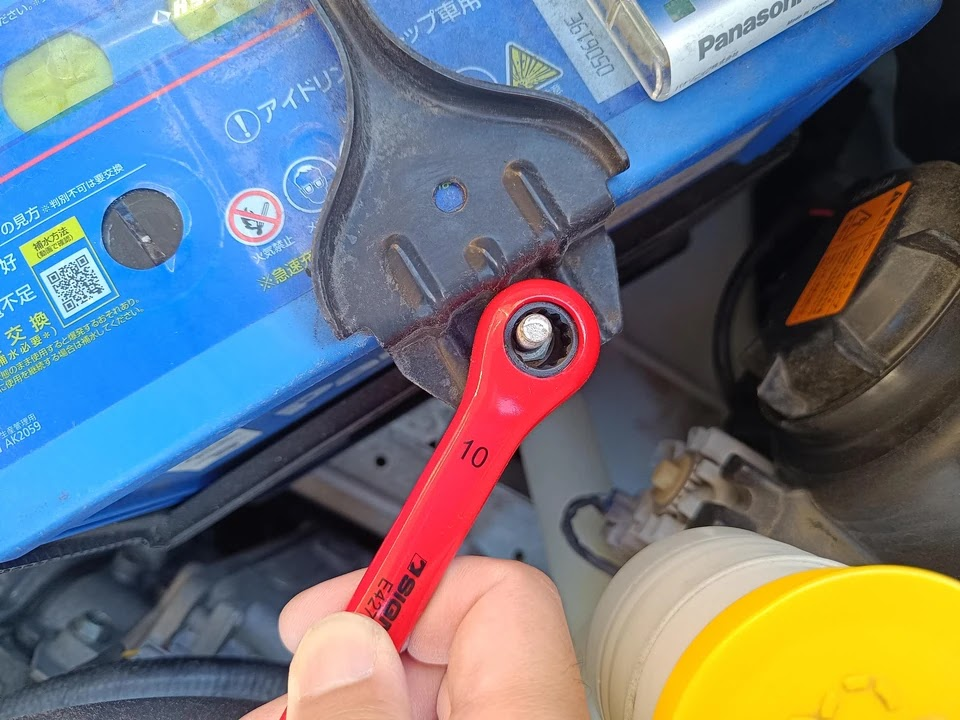
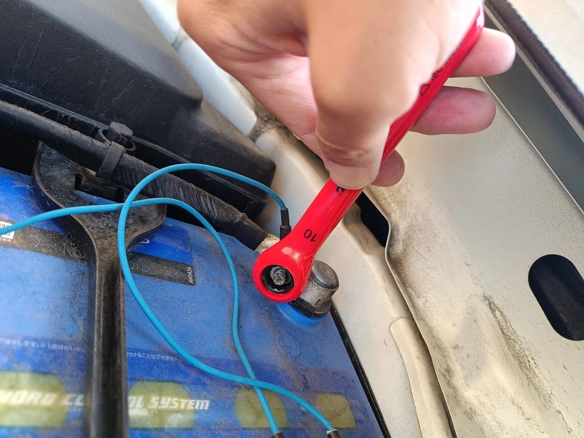
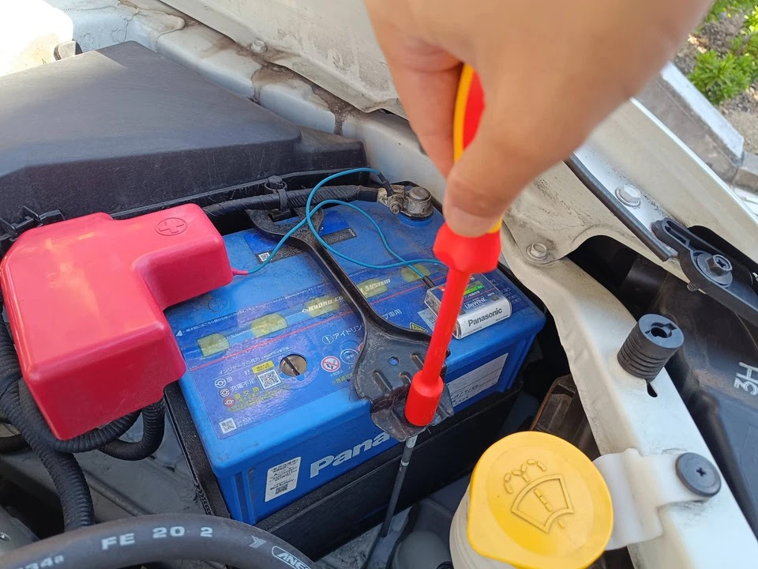
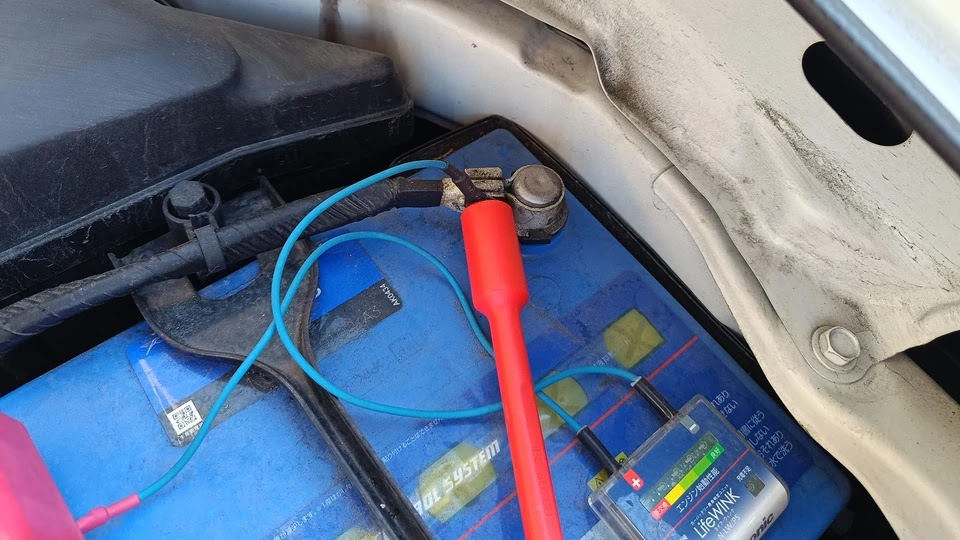

---
categories:
  - 車
date: "2025-02-15T23:44:16+09:00"
description: 車のバッテリー交換で端子のM6ナットを回すのに便利な工具をご紹介します。絶縁片口スパナ、絶縁ギアレンチ、絶縁ナットドライバー3種類の使用感を比較します。
draft: false
images:
  - images/0001.jpg
summary: 車のバッテリー交換で端子のM6ナットを回すのに便利な工具をご紹介します。絶縁片口スパナ、絶縁ギアレンチ、絶縁ナットドライバー3種類の使用感を比較します。
tags:
  - 工具
  - バッテリー交換
  - レンチ
title: 車のバッテリーターミナル用絶縁レンチ比較
js: js/paad.ts
---

購入してから7年が経つスバル・エクシーガクロスオーバー7の2度めのバッテリー交換時期がやってきました。

前回のバッテリー交換時は、初めてDIYで交換してみましたが、難儀した作業が2点ありました。

1.  バッテリー押えと端子のM6ナットを絶縁レンチで外すのが微妙にやりにくい
2.  エンジンルームにうまく手が入らず、古いバッテリーを持ち上げるのが大変

1.ですが、写真下の六角ナットでサイズはM6、二面幅10mmのものです。

今回、1. の絶縁レンチについて、前回使用した片口スパナの他に絶縁ギアレンチ、絶縁ナットドライバーも購入し、使用感を試しました。

バッテリー交換手順については、下記記事にまとめていますのでご参照ください。



## 試した工具

写真の上から順に、

1.  絶縁ナットドライバー
2.  絶縁片口スパナ
3.  絶縁ギアレンチ

です。



## 絶縁片口スパナの課題

まずは基本の絶縁片口スパナです。「エーモンの安いやつ」が鉄板ですが見た目が微妙なのでSIGNETの製品を使っています。耐圧1000Vなんでオーバースペックですが。

バッテリー押えを外します。特に問題なくナットを回せるのですが、ネジ部が長く、しかもナットを緩めても反対側のナットが利いているため、バッテリー押えが斜めになりながら上がってくるため手で回せるようになかなかならず、このスパナで何回も回していく必要があり、なかなか面倒です。

端子部分のナットです。ここはまあ、許容できますが絶縁レンチは樹脂で覆われているため端子と微妙に干渉してナットからスパナが外れそうでやややりにくいです。

## 絶縁ギアレンチ

そこでラチェットで回せる絶縁ギアレンチを購入しました。メーカーは、ギアレンチで有名なSIGNETのものです。早速バッテリー押えに強力な威力を発揮すると思いきや、、、

まさかの干渉で使えませんでした😢

次は端子部分です。こちらはかなり便利です。絶縁片口スパナ同様、ターミナル部分にやや干渉気味でナットのかかりが浅い感がありますが6面をしっかりホールドしてくれるので安定感があり、しかもラチェットでカチャカチャ前後させればすぐにナットを緩めることができます。

## 絶縁ナットドライバー

最後に絶縁ナットドライバーです。

バッテリー押えに絶縁ギアレンチのように干渉はせず、出っ張ったねじ部も干渉しない十分な深さがあり、完璧にフィットします。が、ナットが締め込まれた状態では固く、回せません。なので片口スパナで少し緩めてから絶縁ナットドライバーでクルクル回すと快適に早くナットを取ることができました。

ターミナル部分も同様です。絶縁片口スパナか絶縁ギアレンチで軽く緩めてからこれを使うと快適です。

## まとめ

3種類の工具を試しましたが、どれも万能ではなく、バッテリー押えと端子両方にこれ1本で使えるのは絶縁片口スパナだけでした。しかし、絶縁ギアレンチ、絶縁ナットドライバーを組み合わせると作業を快適、効率的に行うことができました。

-   バッテリー押えには絶縁片口スパナと絶縁ナットドライバー
-   端子には絶縁ギアレンチ

という組み合わせが最適だと思います。

バッテリー押えは絶縁である必要はないと思うので、ナットドライバーは絶縁で無くてもよいかもしれません。


