---
categories:
  - ビジネス
date: "2025-02-15T23:44:09+09:00"
description: 在宅勤務に使用するオシャレなキャンプ用テーブル、「ユニフレーム焚き火テーブルラージ」をレビューします。
draft: false
images:
  - images/0011.jpg
summary: 新型コロナで始まった在宅勤務を今でもたまにしており、今更ですが簡易的なテーブルが欲しくなりました。せっかくなのでキャンプにも使えるオシャレな「ユニフレーム焚き火テーブルラージ」を購入しました。
tags:
  - ユニフレーム
  - キャンプ用品
title: ユニフレーム焚き火テーブルラージを在宅勤務用テーブルとして使う
js: js/paad.ts
---

新型コロナウイルス感染症は5類感染症に位置づけられ、外出規制は無くなり、マスクも個人の判断となって会社の勤務も通常に戻ってきましたが、在宅勤務の制度は残っているところも多いのではないでしょうか。今でも在宅勤務をたまにしており、今更ですが簡易的なテーブルが欲しくなり、せっかくなのでキャンプにも使えるオシャレな「ユニフレーム焚き火テーブルラージ」を購入しました。

## 求める機能

会社にあるような普通の事務用デスクと椅子が置ければこれにこしたことはありません。しかし、そんなスペースを取れるほど家は広くありません。

はじめのうちは、ダイニングテーブルや子供の机を使ったりしていましたが、毎日いちいち片付ける必要があり、子供が帰ってきたりと不自由でした。

## Bauhutteゲーミングデスクを使ってみて

そこでやはり机が欲しくなるのですが、前述の通り設置スペースが無く悩んでいたいところ、ローテーブルであれば子供のベッドの下にすっぽり入るのでは、とひらめきます。ローデスクのゲーミングデスクがあったのでちょっとお値段張りますが購入して使っていました。



これは幅100cmと広く、ノートPC＋外部モニタまで置くスペースがあり気に入っていたのですが、子供部屋に設置したことでお父さんがいる部屋に入るのを嫌がられ、子供の部屋を取ってしまった形となりこれはいかんと思った次第です。

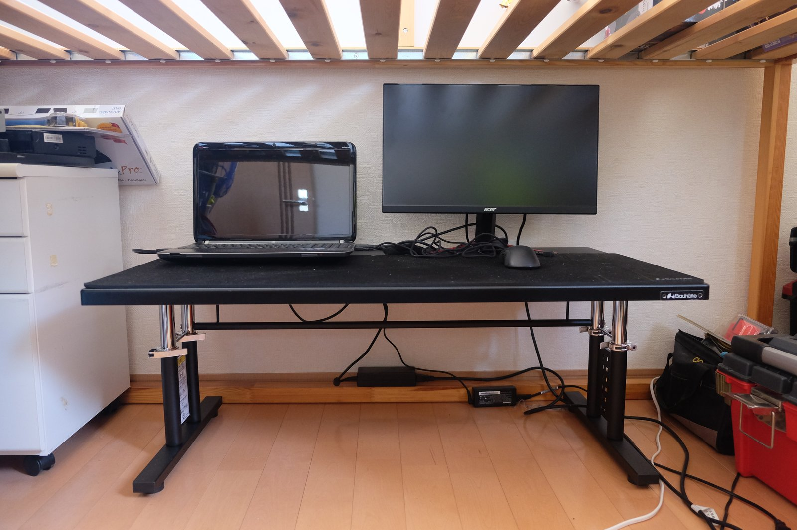

そこで、使用するときだけリビングに出すことができれば解決ですが、常設型のデスクなので容易に動かせません。

## ユニフレーム焚き火テーブルラージを購入

ということで、折りたたみできる小型のローテーブルを探しました。デザインが安物チックだったり、なかなか購入しようと思うものが無く悩んでいたところ、キャンプ用品はどうだろうと思い検索したところ、スノーピークのテーブルとユニフレームの焚き火テーブルがなかなかオシャレで目にとまりました。



スノーピークのローテーブルはクオリティが高そうでこれが一番欲しいと思ったのですが、やはりスノピ、価格がびっくりでおいそれと購入できません。

ユニフレームの焚き火テーブルもキャンプで評判がよく、いつか使っていみたいと思っていたのでこちらを購入しました。ちなみに、通常サイズ(55x37cm)は小さすぎると思うのでラージサイズ(70x45cm)がおすすめです。

キャンピングムーンなど、他のメーカーからほとんど同じものが半額くらいで売られていますがスノーピークの価格に比べるとユニフレームオリジナルのものでも安く感じ、せっかくなので本家本元のユニフレームの焚き火テーブルを購入しました。

## ユニフレーム焚き火テーブルラージの組み立て

届いたユニフレームの焚き火テーブルラージです。

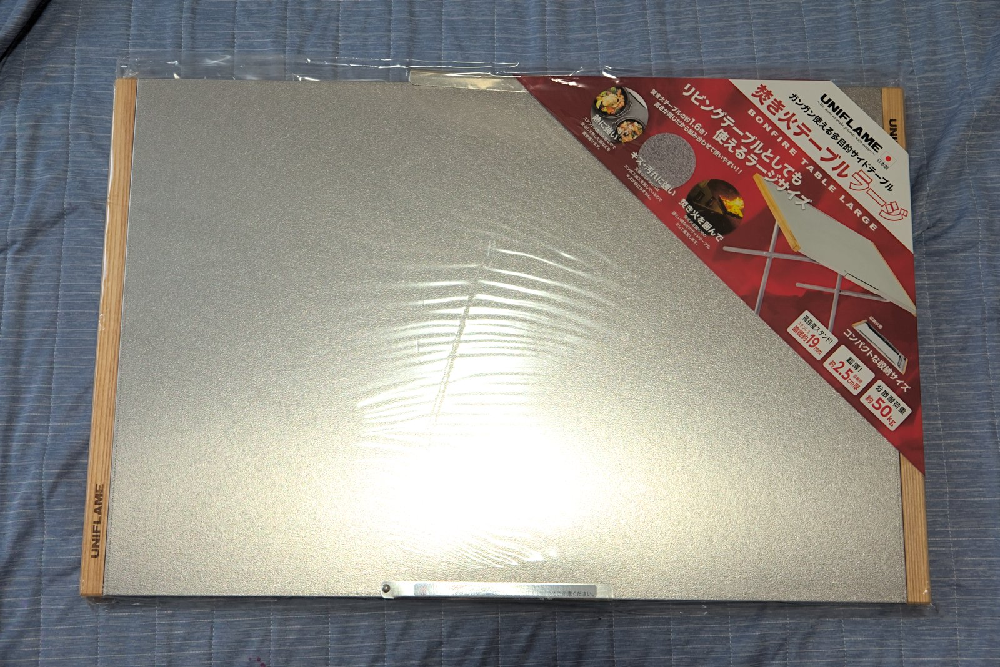

天板は2.5mm厚のステンレス、足もステンレスパイプで耐荷重50kgとキャンプ用テーブルとしては頑丈な作りです。

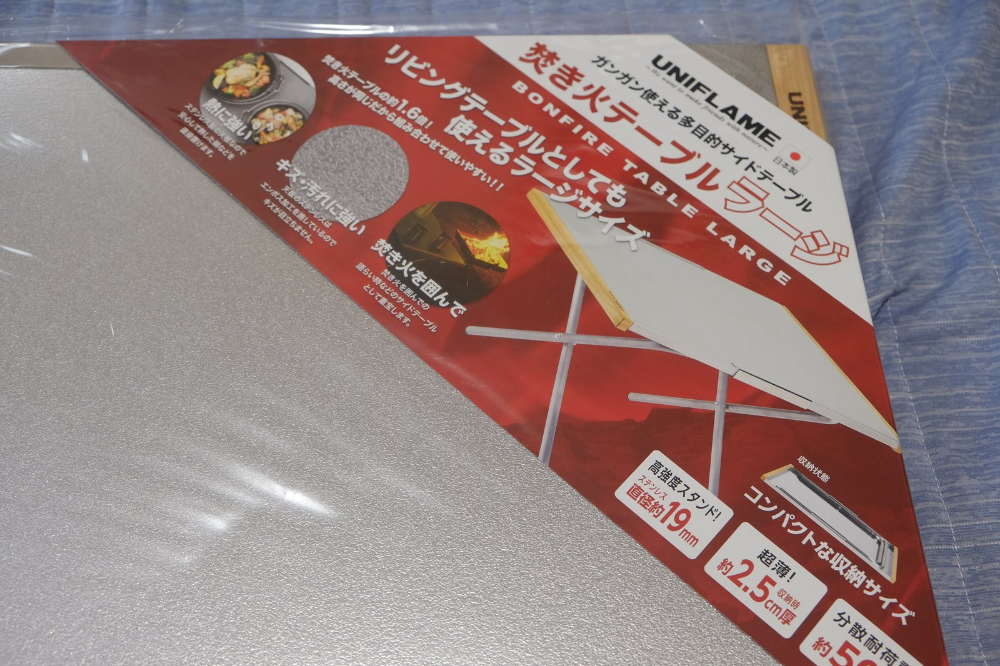

エンボス加工の天板のサイドに木が付いており、UNIFLAMEの文字が刻印されています。キャンプブログなどでよく見る憧れのテーブルです。

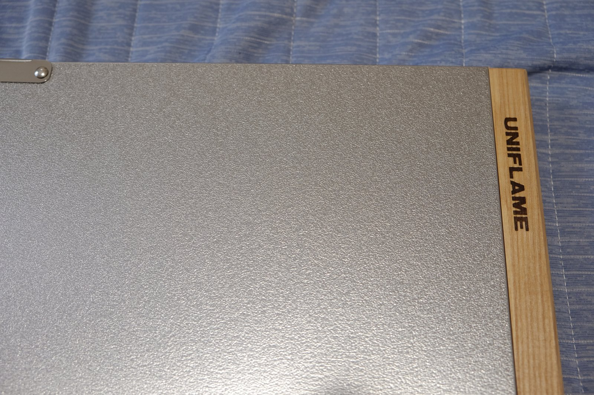

早速組み立てましょう。天板の裏面に足が付いています。

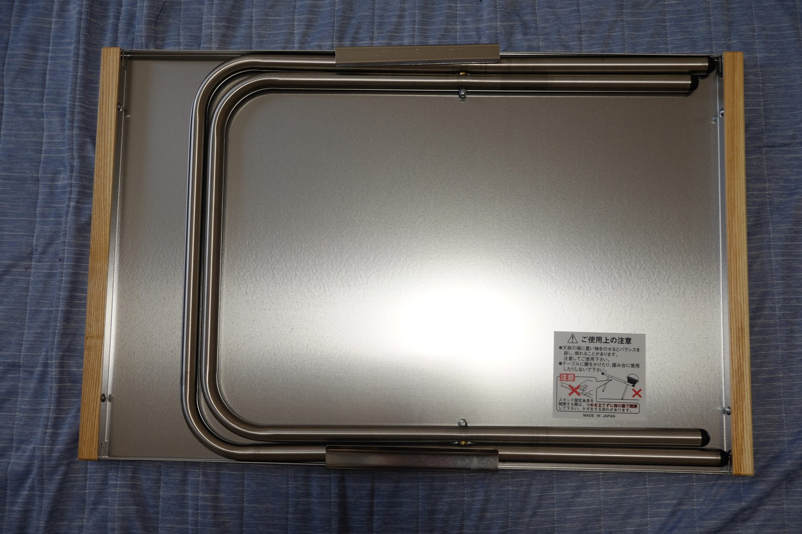

足はコの字の板金で天板と固定されています。

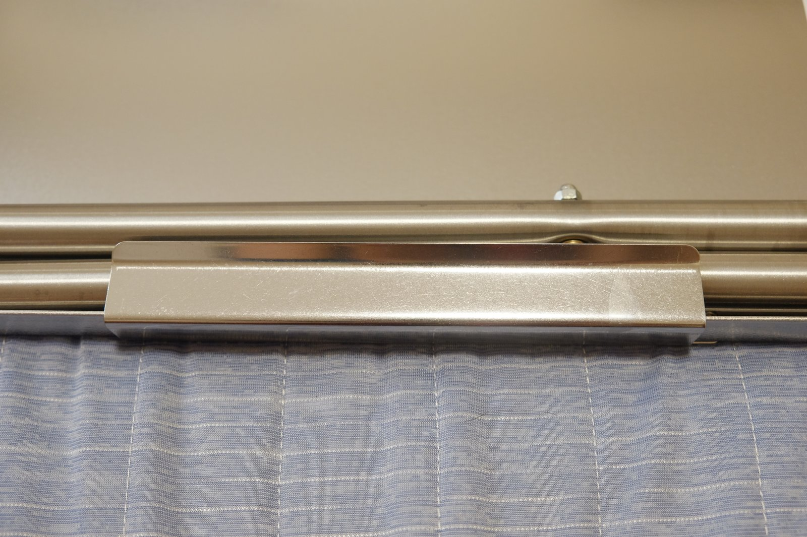

板金を回転させると足が取り出せるようになります。

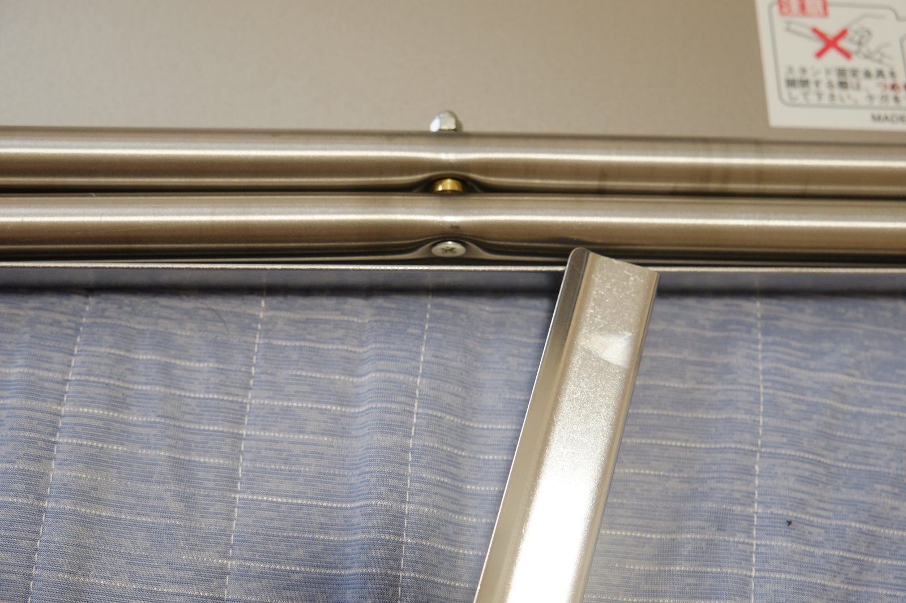

取り出した足です。

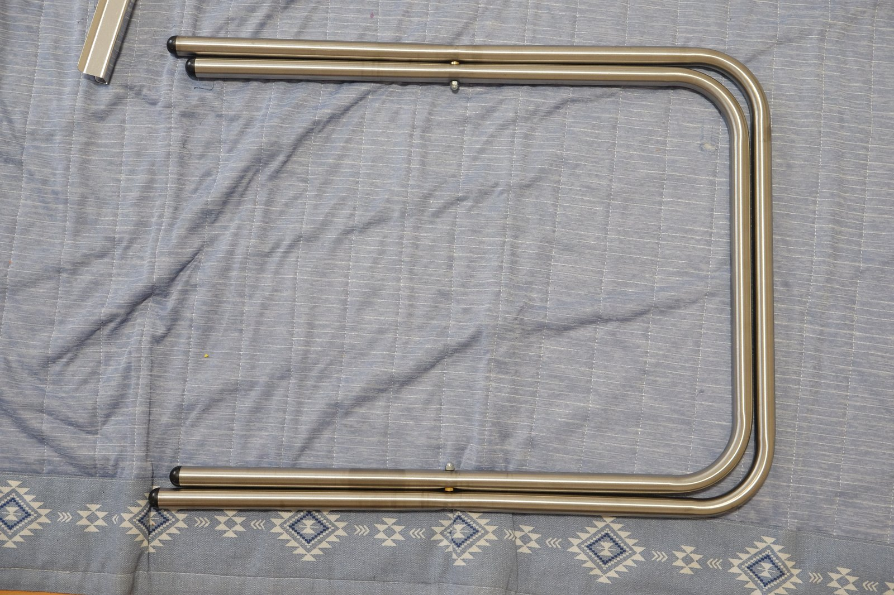

足を天板の上で開きます。

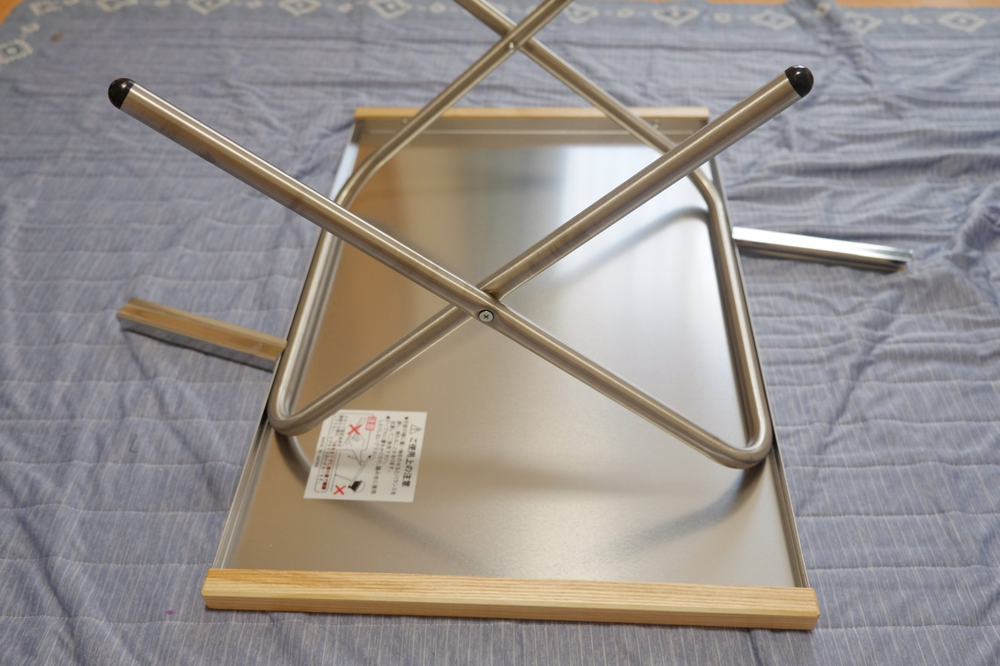

先程足を固定していたコの字板金を戻し、足のパイプを固定します。

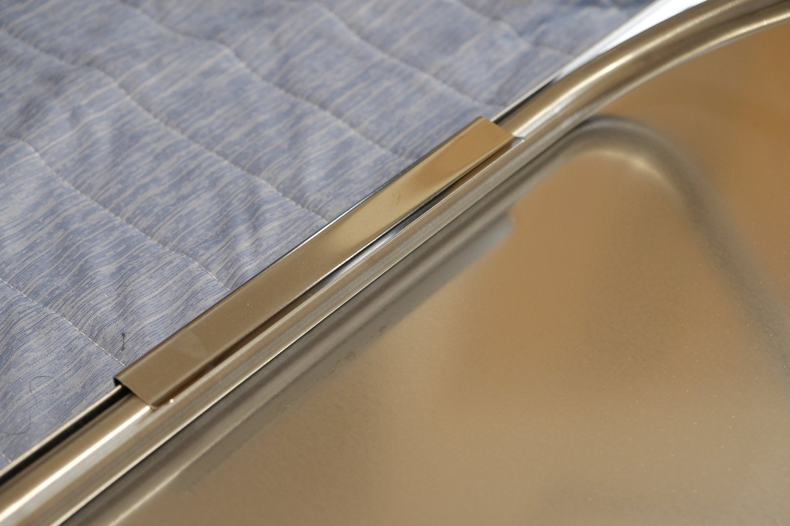

完成です！

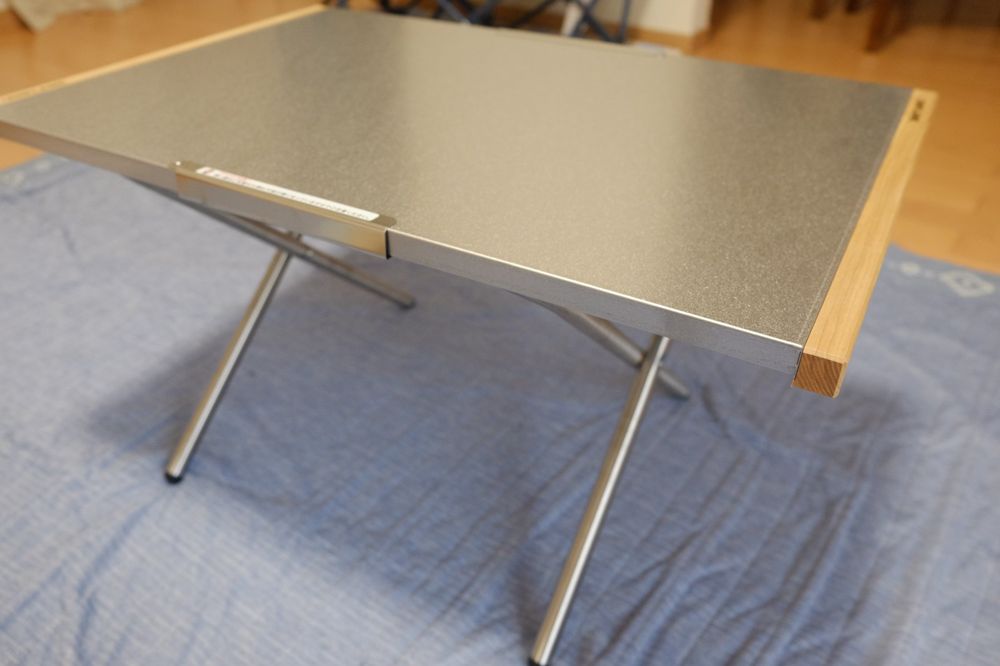

## 使用感

ノートPCを載せるとこんな感じになります。

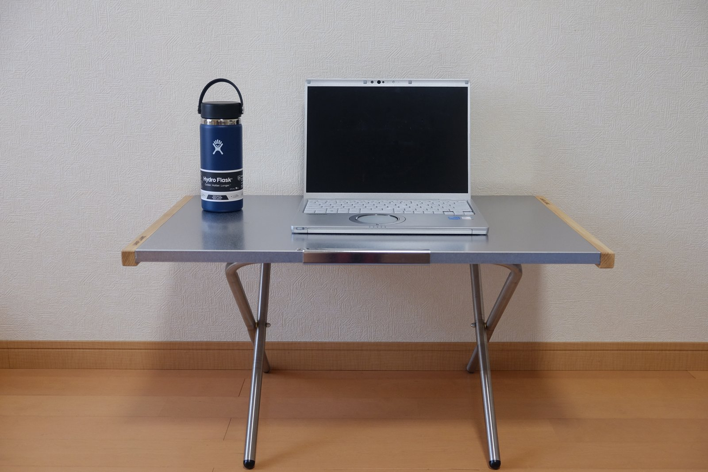

マウスとドリンクが置けるほど十分な広さがあります。

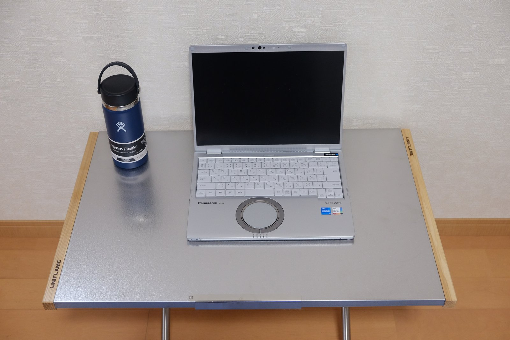

天板の上で直接マウスを動かしても問題無く作業ができ、見た目より頑丈で安定するので快適に在宅勤務ができそうです。

設置、片付けも簡単でキャンプにも持っていくのも楽しみです。

金属天板なので夏はひんやりして気持ち良いですが、冬はちょっと冷たいかもしれませんね。冬にどうかはまたレポートしたいと思います。

## まとめ

ユニフレーム焚き火テーブルラージはキャンプだけでなく、在宅勤務のPC作業デスクとしても快適に使えました。コンパクトで運びやすく、かつ必要十分なスペースで在宅勤務でデスクのないお父さんにおすすめのテーブルでした。
