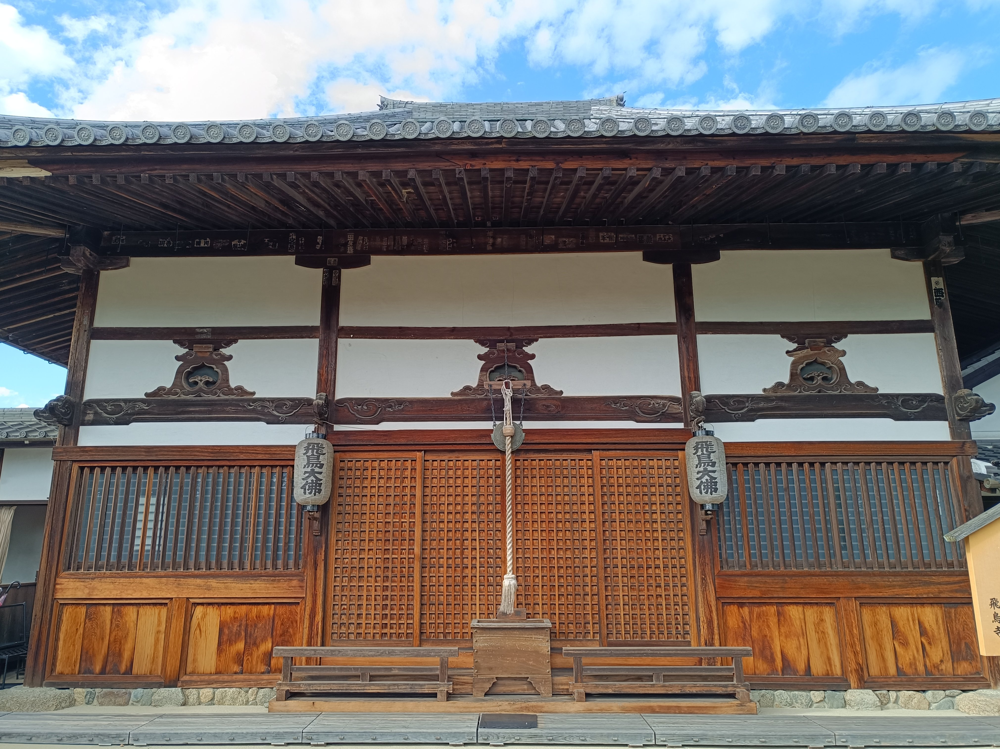
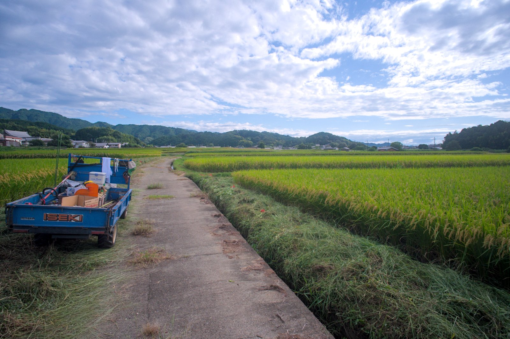
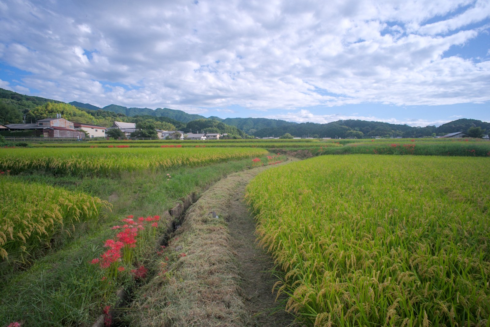
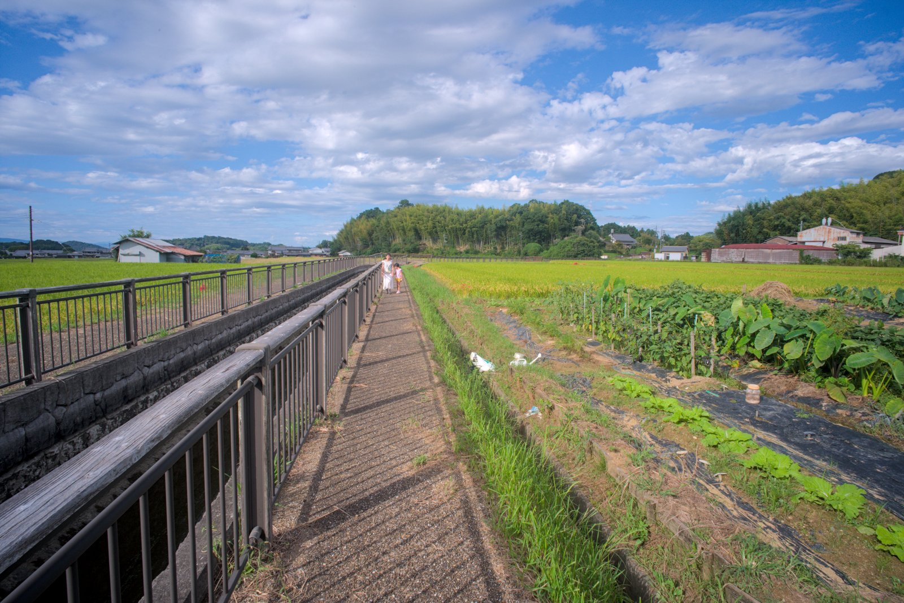
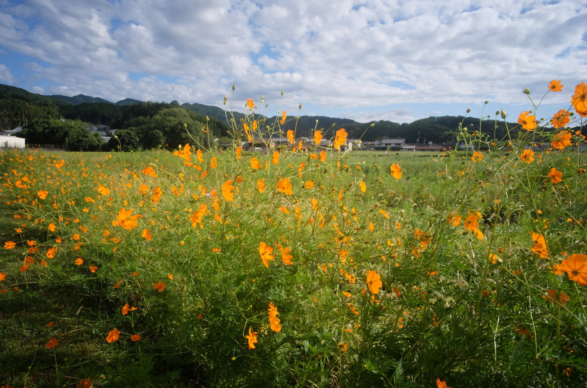
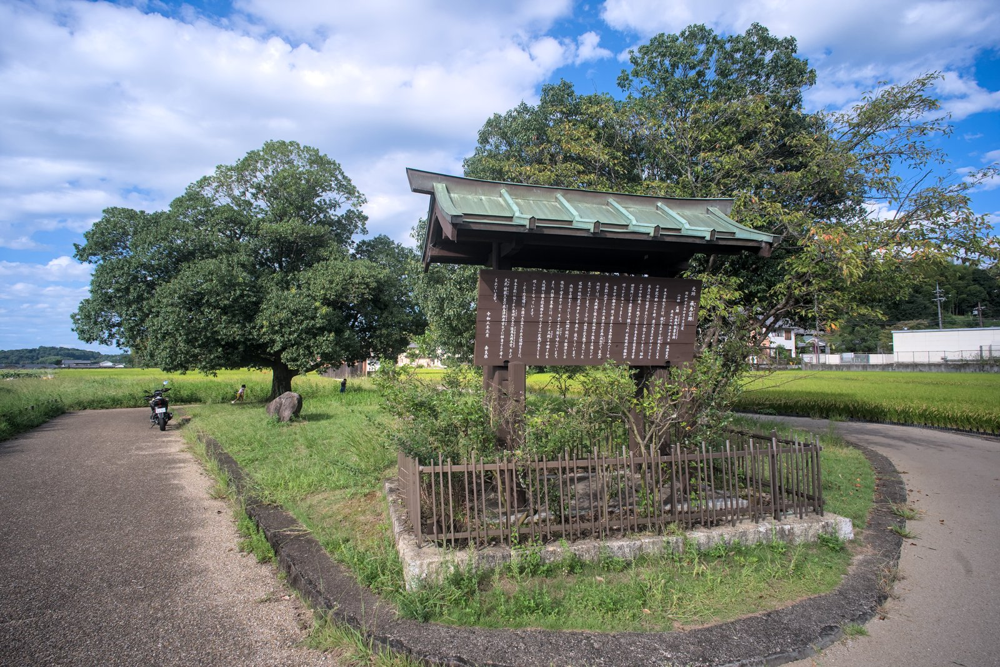
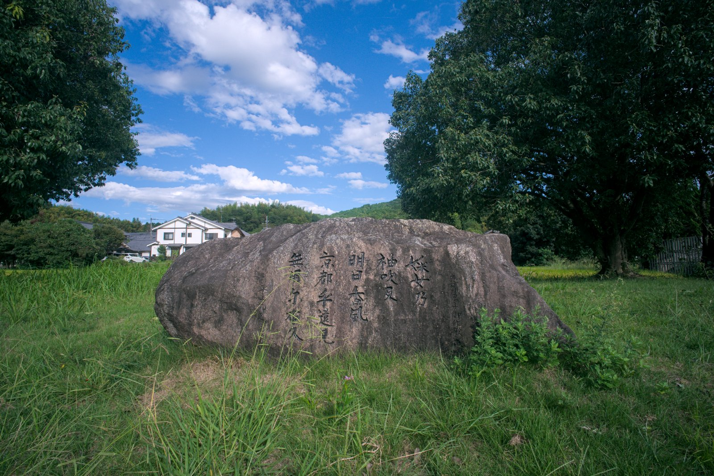
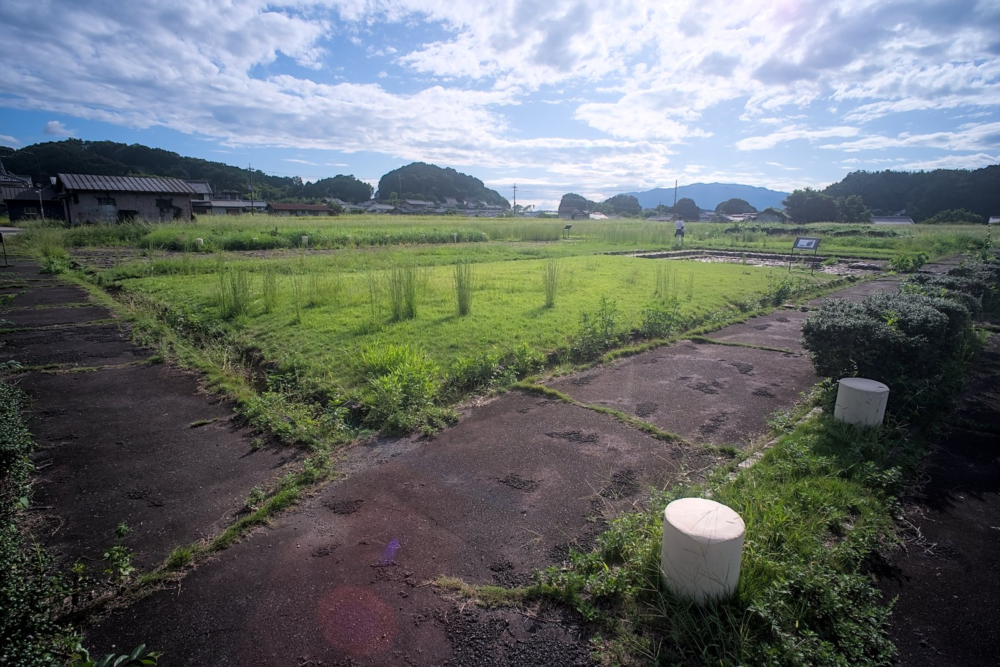
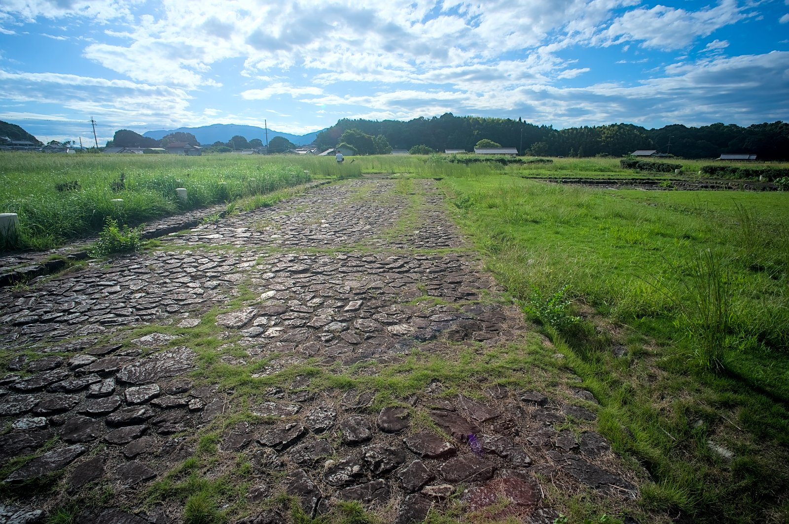

---
categories:
  - アウトドア
  - 旅行
date: "2025-02-15T23:44:19+09:00"
description: 飛鳥時代、6世紀末から7世紀後半まで現在の奈良県高市郡明日香村にあった飛鳥京の中心で、天皇の宮の跡地と考えられている遺構、飛鳥宮跡に行ってみました。
draft: false
images:
  - images/0000.jpg
summary: まだ暖かい秋にGoogleマップでふと見つけた奈良県の明日香村にある飛鳥宮跡を訪れてみました。平安京、平城京、藤原京と、さらにその前にこの地に日本の中心の都があったと思うと日本人としては外せない場所、、、かもしれません。
tags:
  - 奈良
  - 明日香
  - 飛鳥宮
  - 古墳
title: 【関西B級観光スポット】飛鳥宮跡
---

まだ暖かい秋にGoogleマップでふと見つけた奈良県の明日香村にある飛鳥宮跡を訪れてみました。

## 飛鳥宮とは

飛鳥時代、6世紀末から7世紀後半まで現在の奈良県高市郡明日香村にあった飛鳥京の中心で、天皇の宮の跡地と考えられている遺構です。

飛鳥岡本宮（630 - 636年）、飛鳥板蓋宮（643 -
645、655年）、後飛鳥岡本宮（656 - 660年）、飛鳥浄御原宮（672 -
694年）と時代ごとに作り直されていったようです。とくに、飛鳥板蓋宮は、「大化の改新」の幕開けとなる蘇我臣入鹿の中大兄皇子等による暗殺の舞台となったということで、歴史的にも有名な場所ですね。

## アクセス、マップ



飛鳥宮跡付近には駐車場がなく、500m程度歩きますが、奈良県万葉文化館の駐車場が無料でおすすめです。今回は、さらに遠いですが飛鳥寺の大仏を見てからそのまま歩いて行きました。

電車の場合、近鉄橿原神宮前駅、飛鳥駅にレンタサイクルがあるので有名な石舞台古墳など、他も回るのにはレンタサイクルも良さそうです。

## 日本最古の大仏、飛鳥寺

大仏といえば東大寺や鎌倉の大仏が有名ですが、飛鳥寺にはなんと日本最古の大仏があるということで、ここに車を停めてまずは大仏を見学してからスタートです。

門から入るといきなり右手に大仏のいる本堂です。

参拝料を払い、大仏を見ます。写真撮ってよいかわからず、そのまま出てしまいましたが思ったより小ぶりでした。日本最古の大仏で、重要文化財に指定されていますが、鎌倉時代の火災で大部分が後世の作ということで国宝にはなれない残念なところがあります。

## 田んぼの中を歩き飛鳥宮跡へ

飛鳥寺の南へ、のどかな田園風景の広がる中、飛鳥宮跡を目指し歩き始めます。とてもいい雰囲気ですが実はこの道、最後は無くなり草が生えた田んぼの脇を通ることになるため奈良県立万葉文化館のある車道から歩いて行くのをおすすめします。

途中から道の舗装が無くなってしまいました。

さらに道が無くなり、田んぼの脇の草をかき分けなんとか用水路沿いにある細い道に出ました。

まだまだ暑さが残る日でしたが秋を感じさせる黄色いコスモスが咲いています。この奥が飛鳥宮跡なのですが、、、何かがありそうな雰囲気は全くありません。

## 飛鳥宮跡の石敷井戸

Googleマップに誘導され、とりあえず着きました。何も無さそうですが、説明文が書かれた看板がポツンと立っています。

看板の近くには和歌の刻まれた石が置かれています。

そしてこの石の後ろ、細い道を挟んだ反対側が飛鳥宮跡の入口？です。なかなか趣のあるというか、ほったらかし感のある印象です。飛鳥寺あたりは結構観光客や修学旅行の自転車に乗った学生達がたくさんいましたが、ここまでは来ないのか、自分たち以外は1人だけでした。

きれいに整備されすぎているよりこのくらいの方が遺跡の雰囲気を感じられますが、敷地の大半は草に埋もれており、確認できるのは周囲の石畳と、石敷井戸くらいでした。

これがおそらく飛鳥宮跡のハイライト、石敷井戸さんです。

いや、確かに事前のネット検索では上の写真くらいしか出てこなかったのですが、それも納得。まあ、これだけです。

## おしまい

飛鳥宮跡は、なかなか渋い観光スポットでした。平安京、平城京、藤原京と、さらにその前にこの地に日本の中心の都があったと思うと日本人としては外せない場所、、、かもしれません。

周辺には歴史的な観光スポットがたくさんあるため、これだけのために来るとがっかりするかもしれませんが、石舞台古墳などと合わせて歴史探索してみるのもよいでしょう。
