---
categories:
  - アウトドア
  - 旅行
date: "2025-02-15T23:44:19+09:00"
description: 奈良県桜井市にある小さな古墳、箸墓古墳をご紹介します。あの邪馬台国の女王、卑弥呼の墓ではないかと言われている、日本の歴史上重要な古墳かもしれません！？
draft: false
images:
  - images/3346px-Hashihaka-kofun_zenkei-2.jpeg
summary: 奈良県桜井市に箸墓古墳というこじんまりとした古墳があります。あの邪馬台国の女王、卑弥呼の墓ではないかと言われており、気になったので行ってみることにしました。
tags:
  - 古墳
  - ヒミコ
  - 奈良
  - そうめん
title: 【関西B級観光スポット】ヒミコの墓！？箸墓古墳
js: js/gmap.ts
---

古墳といえば教科書などでよく見る大阪府堺市の大仙陵古墳（仁徳天皇陵古墳）が有名ですが、最近は密かに古墳ブーム到来の予感か、五色山古墳など整備された古墳も見られます。実は古墳というものは小さいものを含めるととてつもない数があり、その多くは誰の墓かよくわからなかったりして観光名所になることもなくひっそりと存在しています。

今回ご紹介するのは奈良県桜井市に箸墓古墳というこじんまりとした古墳です。Googleマップで見る限りは冴えない小さな古墳ですが、実はこれ、あの邪馬台国の女王、卑弥呼の墓ではないかと言われており、気になったので行ってみることにしました。

## アクセス



奈良盆地の南東端、奈良県の桜井市にあります。大阪からは車だと西名阪自動車道天理ICから国道169号を南へ、または阪和自動車道を新庄出入り口まで行き、国道165号を西→北へ進むと着きます。駐車場は卑弥呼の庭駐車場か、三輪素麺のお店、三輪山本で名物のそうめんを買いついでに見に行っても良いでしょう。

公共交通機関だとJR桜井線（万葉まほろば線）巻向駅から徒歩になります。

## 箸墓古墳周辺マップ {#マップ}

{{< gmap json="track.json" center="{ \"lng\": 135.8395790955927, \"lat\": 34.53926283636445 }" zoom="16" style="hybrid" >}}

箸墓古墳は、日本最古の前方後円墳と言われ、小ぶりながらもきれいな鍵型をしています。円が大きく、頭でっかちのようにも感じますが、なかなかかわいらしく好みの形です。

有名所の古墳は周囲が濠で囲われていますが、この古墳は北側に池があるのみで古墳の端まで近づくことができます。前方部分の端に拝所があります。まあ、近づいても樹木に覆われた山のような感じなので特に見どころがあるわけではないのですが。

今回、まずは三輪山本直販店で名物の三輪素麺を買ってからそのまま古墳の北側、卑弥呼の庭あたりまで歩きつつ箸中大池越しに古墳を眺め、そのあと古墳の南西側にある卑弥呼の庭駐車場に車を停めて倭迹迹日百襲姫命大市墓
拝所に行きました。

歩いて古墳を一周してもよいと思いますが、あまり見どころは無さそうなので。

## 箸墓古墳と卑弥呼

箸墓古墳について、Wikipediaによると以下の記述があります。

> 実際の被葬者は不明だが、宮内庁により「大市墓（おおいちのはか）」として第7代孝霊天皇皇女の倭迹迹日百襲姫命の墓に治定（じじょう）されている。また、笠井新也の研究以来、邪馬台国の女王卑弥呼の墓ではないかとする学説がある。

卑弥呼の墓 *「ではないか」*
ということです。まあ、邪馬台国が九州説、畿内説とどこにあったかわからないので、そういうことですね。

ただ、昔このあたりに邪馬台国があり、卑弥呼がいたと想像するとなんとなくロマンを感じます。

## 三輪そうめんと箸中大池から古墳全体を見る

天理ICから南下し、箸墓古墳に近づくにつれて三輪そうめんの看板が目につきました。このあたりはそうめんが名産のようで、せっかくなので箸墓古墳眼の前にある三輪そうめんの老舗、創業300年という三輪山本さんに車を停め、素麺をゲットです。

スーパーで売っているそこらへんのそうめんとは違い、パッケージも高級感があってお値段もそこそこです。太さもいろいろあり迷います。白龍というのを買い、帰っておいしくいただきました。中で食事もできるので、知っていればお昼に合わせて来るのも良かったかなと思いました。

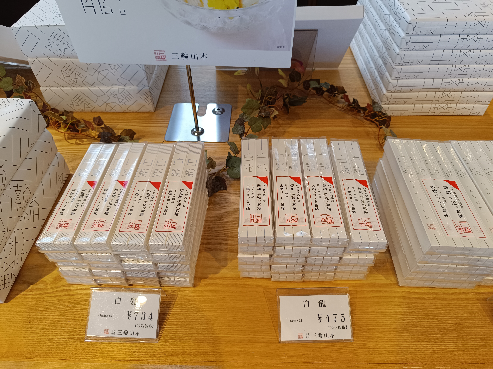

いきなりそうめんの紹介になってしまいましたがここから車道に出て、北側へ歩いていきます。「卑弥呼の庭」という場所が気になるのと、古墳はやはり濠で囲まれたイメージがあるので箸墓大池越しに見るのがかっこいいと思ったので。車道越しに箸墓古墳が見えています。こんもりとした小さな山ですが、卑弥呼の墓と思うとテンションがあがります。

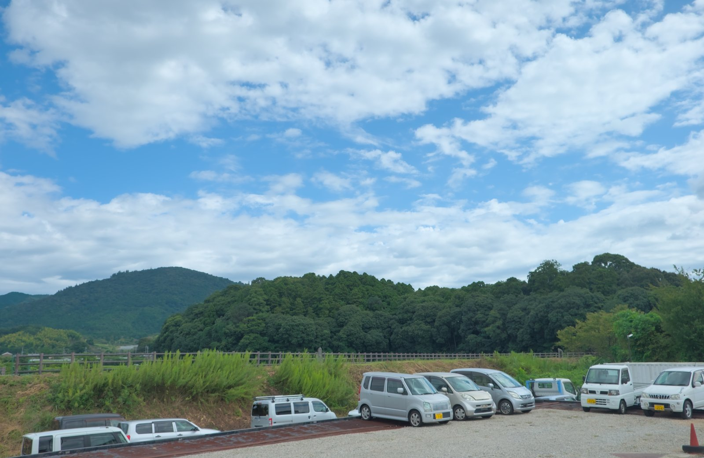

箸中交差点で右へ曲がります。

細い道を歩いていきます。右手が古墳ですが住宅があり、なかなかその姿が見えません。

住宅の切れ目から、古墳の全体が見えました！これが今回のベストショット、箸中大池と箸墓古墳です。前の畑がちょっと微妙な構図ですね。。。

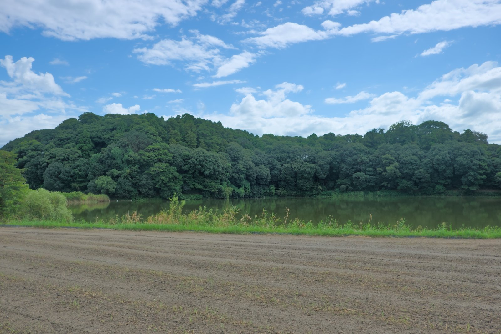

すぐ先に卑弥呼の庭という場所があります。勾玉磨きとか、気になりますがすごく時間がかかりそうなので今回はパスします。カフェもあるようで、この施設の中に入ればもっといいアングルで箸墓古墳を見ることができそうです。

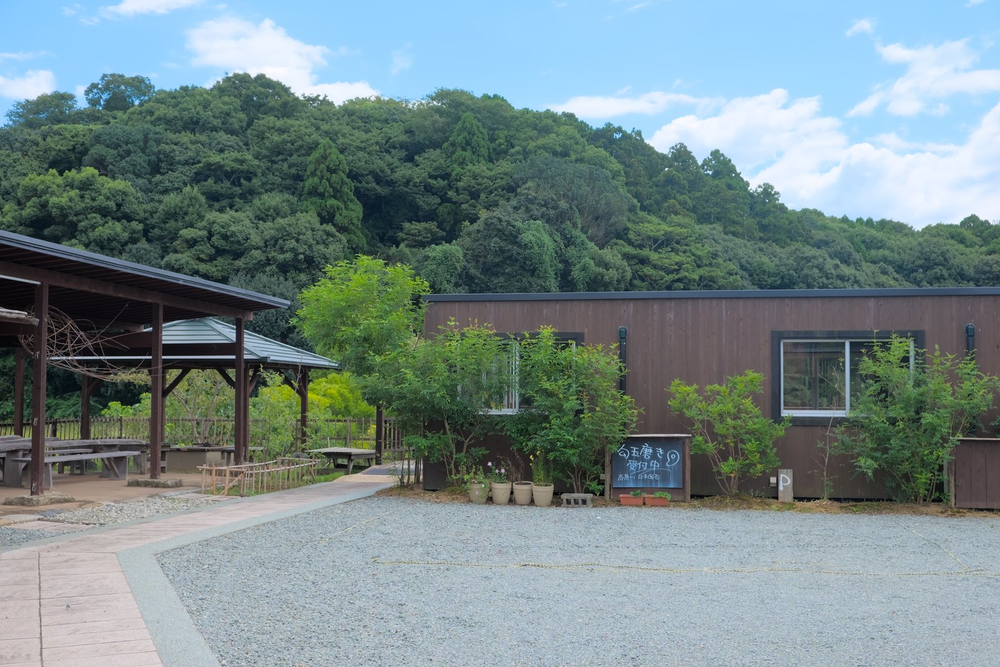

卑弥呼の庭の先は、前方後円墳の「後円」のみが見える構図となり、また微妙な写真になってしまいます。

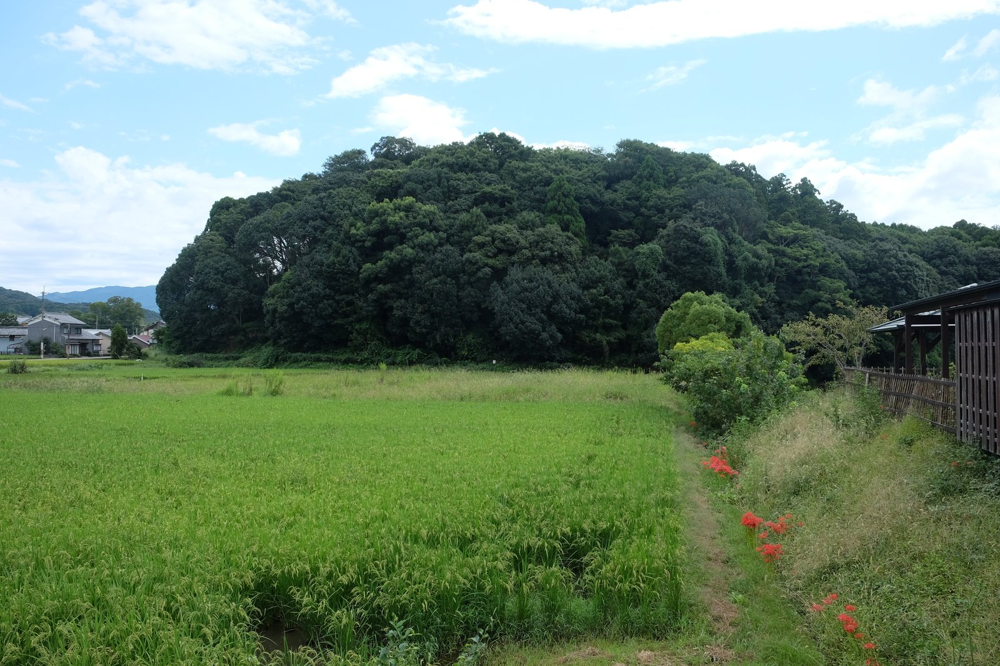

このまま一周してもいいのですが、これ以上先に行っても何もなさそうなので一旦引き返します。微妙な写真ばかりになってしまったのでWikipediaの写真を引用させてもらいます。

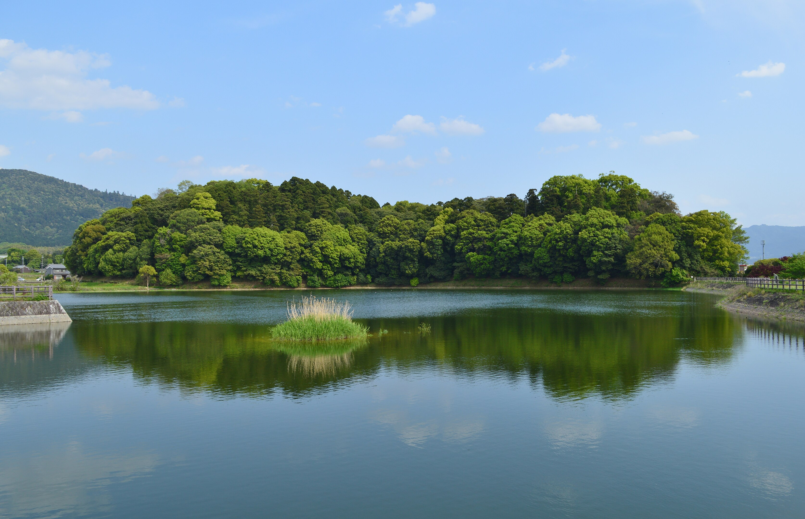
[Saigen Jiro](http://commons.wikimedia.org/wiki/User:Saigen_Jiro "User:Saigen Jiro") - 投稿者自身による著作物, [CC0](http://creativecommons.org/publicdomain/zero/1.0/deed.en "Creative Commons Zero, Public Domain Dedication"), [リンク](https://commons.wikimedia.org/w/index.php?curid=88822998)による

## 倭迹迹日百襲姫命大市墓 拝所

三輪山本からすぐ南へ、箸中南交差点を左折すると卑弥呼の庭駐車場があります。無料の駐車場でした。自分たちの他に車が1台停まっているだけで、日本人全員が知っていると言っても過言ではない、そんじょそこらのアイドルより有名な卑弥呼ですが、ほとんど人はいませんでした。

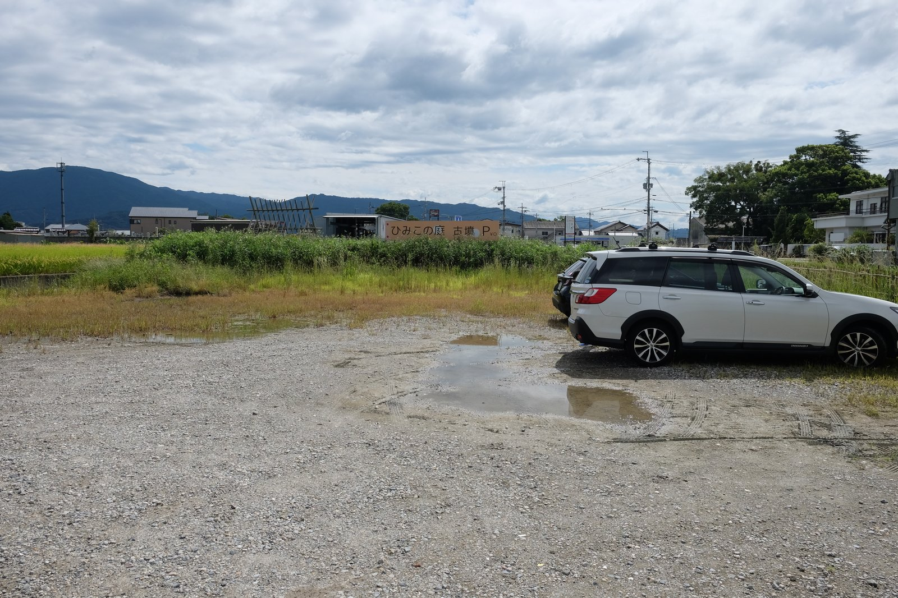

のどかな奈良の田園風景が広がる道を歩いていきます。歩くといってもすぐそこ、左手の森のような場所が箸墓古墳です。

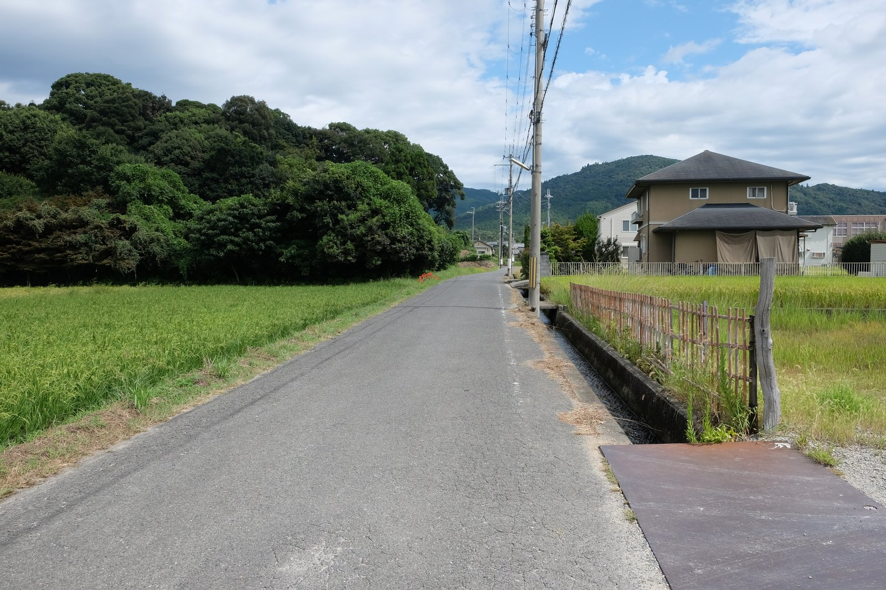

こんもりしています。この角度から見るとこれが古墳とは思えません。

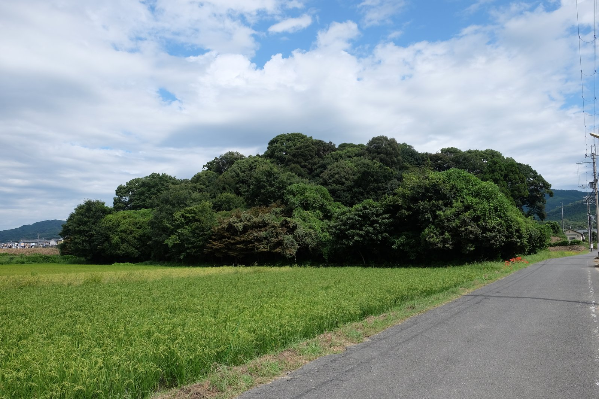

彼岸花がきれいに咲いています。

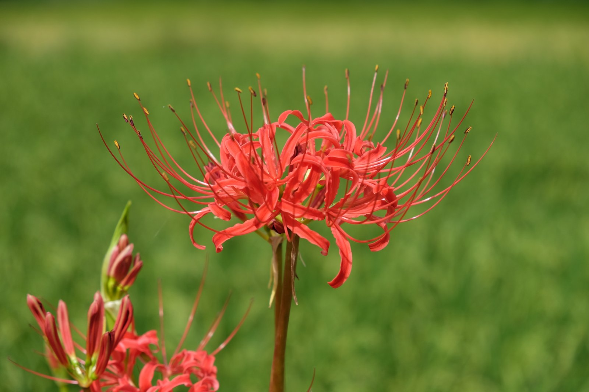

田んぼ越しにこじんまりと佇む倭迹迹日百襲姫命大市墓 拝所が見えました。

女王の墓の入口なのですが、田んぼ脇のあぜ道から入るという、なんとも言えないアクセスです。

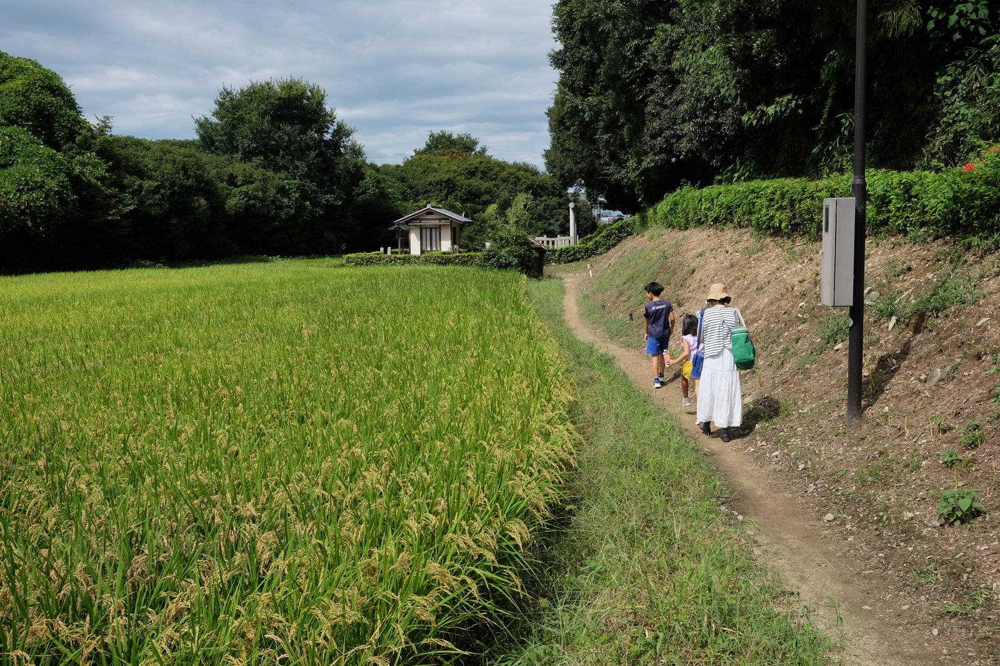

着きました！石の鳥居と門、床は砂利を敷き詰め宮内庁の「みだりに入らないこと」看板に小屋と古墳界隈では「いつものセット」が揃っています。そして、誰もいないところも他の古墳同様です。

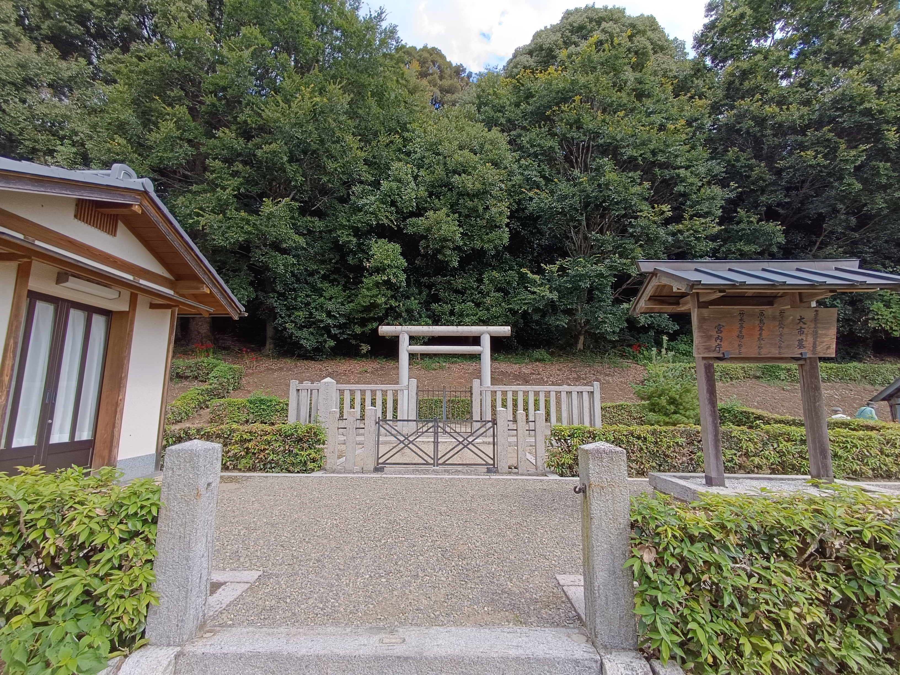

濠が無いので、目の前に古墳が迫りますが、ただの森のようにしか見えないので微妙なビジュアルです。

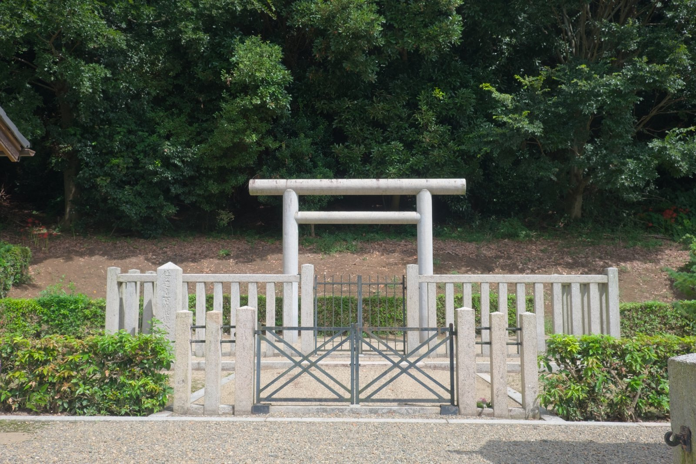

これだけなのですが、卑弥呼の時代に思いを馳せ、帰宅しました。卑弥呼かどうかはわかりませんけどね！

## まとめ

箸墓古墳はなにか特筆すべき見どころがあるわけではありませんが、卑弥呼の墓（かもしれない）ということで、日本の歴史や古墳に興味のある方は一度は訪れておきたい古墳だと思います。

一瞬で見終わってしまうので、これだけのために来るのは微妙なのですが、奈良県にはたくさんの歴史ある場所が点在しているので「何かのついでに」行ってみるのがよいでしょう。
