---
categories:
- アウトドア
date: "2025-02-15T23:43:00+09:00"
draft: false
images: 
- images/EPSN0182.jpg
summary: 滋賀県の琵琶湖東側にある3つのお寺、湖東三山の1つ、金剛輪寺を紹介します。紅葉がきれいなお寺です。
tags:
- 紅葉
- 湖東三山
- 神社
- 滋賀
title: 滋賀県の紅葉 － 湖東三山 金剛輪寺
---

今年も紅葉の季節になってきました。滋賀県は観光地としては大阪、京都、奈良などと比べるとマイナー感がありますが、古くから近江の国として歴史ある城、神社、寺などが多く、紅葉の時期に見どころが多いです。琵琶湖のまわりを山で囲まれていて、少し標高の高いところに寺などがあるため、京都などより一足先に紅葉を見るのにおすすめです。
今回は滋賀県の中ではメジャー（？）な、琵琶湖東側にある3つのお寺、湖東三山の1つ、金剛輪寺を紹介します。

## アクセス



住所：〒529-1202 滋賀県愛知郡愛荘町松尾寺８７４

湖東三山スマートICより県道220号をすぐ

## 金剛輪寺の概要

滋賀県の琵琶湖東側、鈴鹿山脈麓にある西明寺、金剛輪寺、百済寺をひとまとめにして湖東三山と呼びます。金剛輪寺は、天台宗のお寺で公式ホームページにそのあらましが記載されています。

> 剛輪寺は、奈良時代の中頃、天平13年（741）に聖武天皇の勅願で行基菩薩によって開山されました。言い伝えによりますと行基菩薩が一刀三礼で観音さまを彫り進められたところ、木肌から一筋の血が流れ落ちたため、その時点で魂が宿ったとして、粗彫りのまま本尊としてお祀りされました。後の世に「生身（なまみ）の観音」と呼ばれるようになり、全国の観音信徒より篤い信仰を集めています。
> 出典元： <http://kongourinji.jp/history/index.php>

## 紅葉の金剛輪寺

下記情報は数年前の11月下旬に行ったものです。今年2020年はまだ見頃は少し早いかもしれません。

入り口の門をくぐると早速道の両脇の木がきれいに紅葉しており紅葉の下をまっすぐ歩いていきくと参拝受付があります。

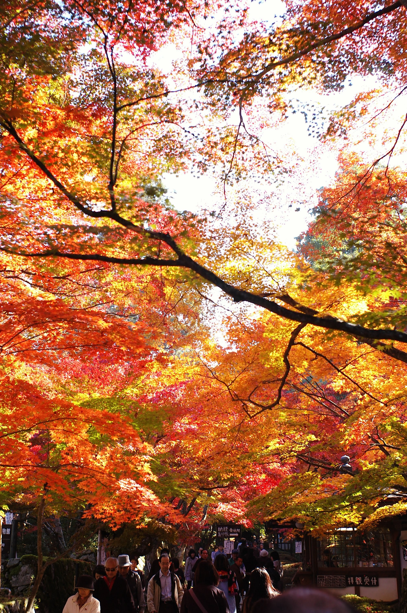 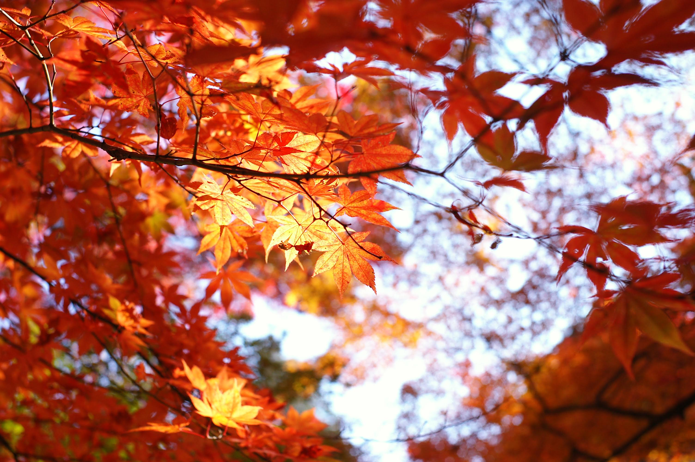

真っ直ぐ進み、西谷堂です。

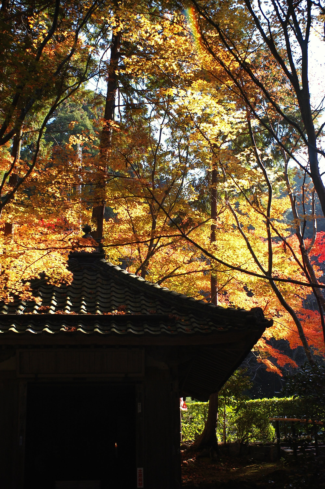

左へ折れて明寿院を見ます。

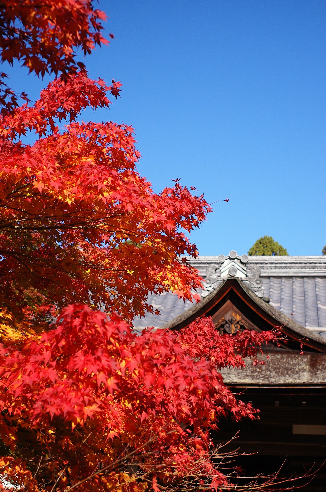

明寿院手前の名勝庭園です。真っ赤なもみじが苔で覆われた石に落ちています。

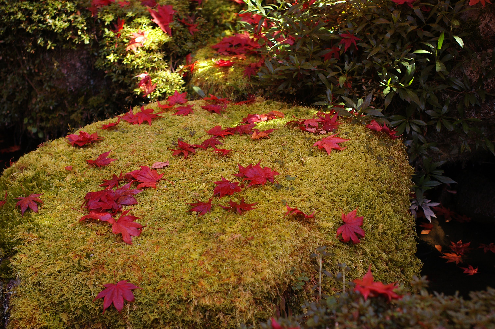 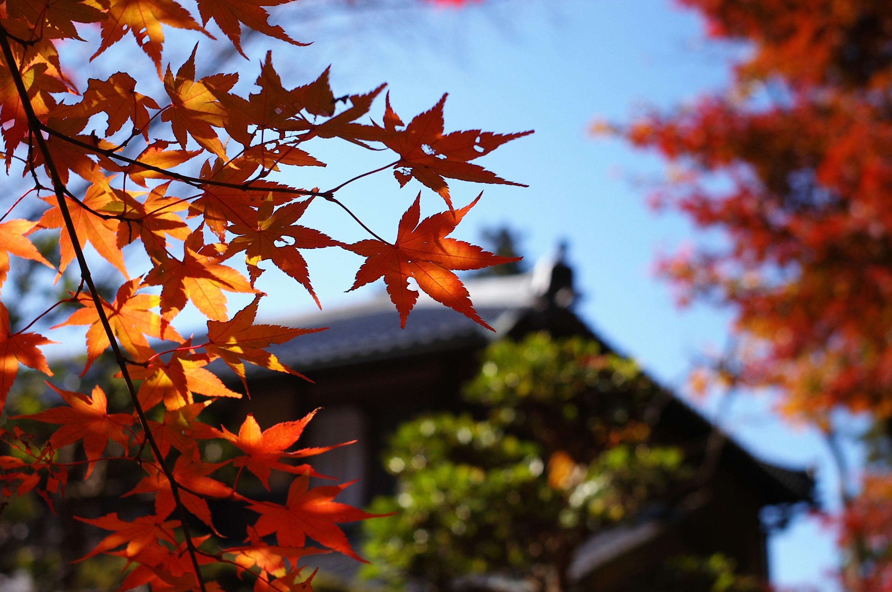

本堂への参道に戻り進むと道沿いに千体地蔵が並んでいます。風車を持っているのがかわいいですね。

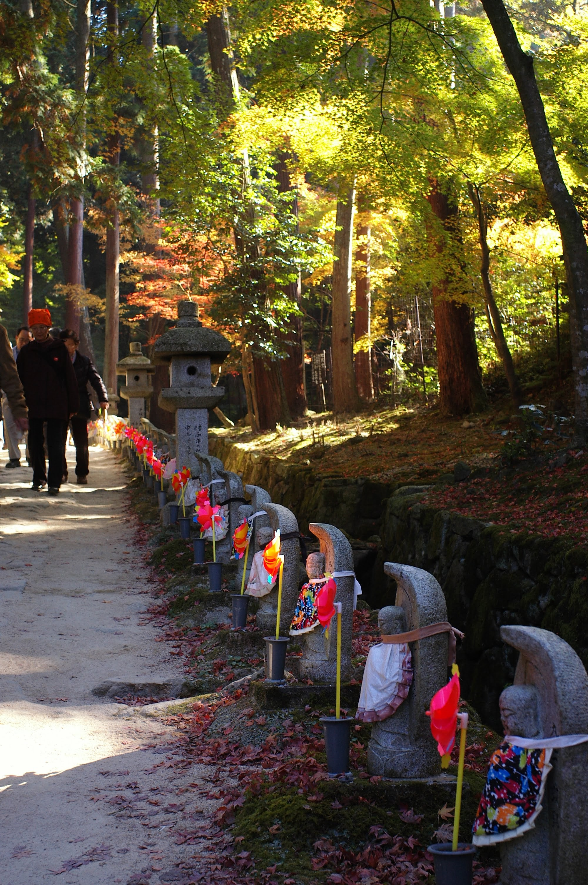 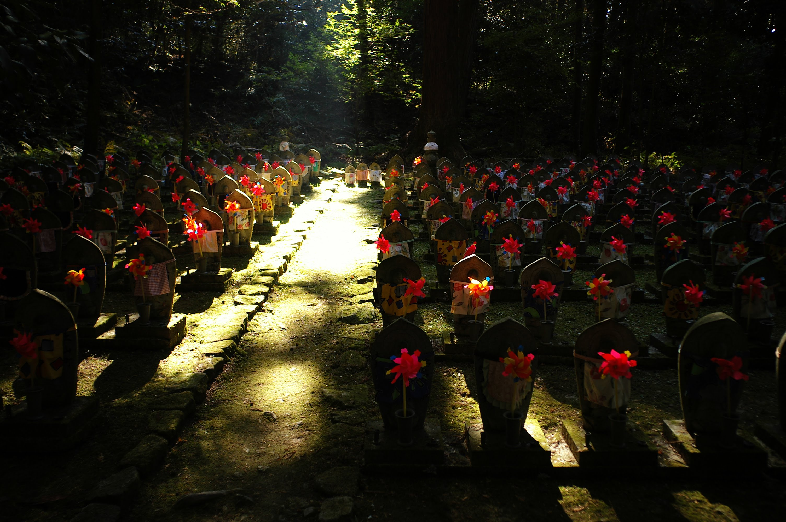

最後まで進むと本堂と三重塔があります。本堂を写真に撮り忘れてしまいました。三重塔を見上げます。

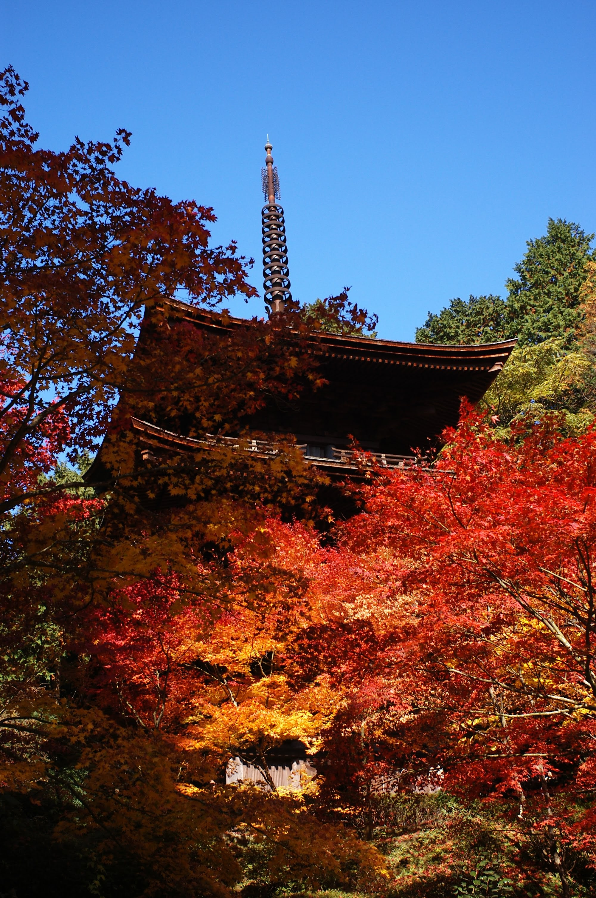

少し下の道から紅葉に囲まれた三重塔です。赤、黄のコントラストがきれいです。

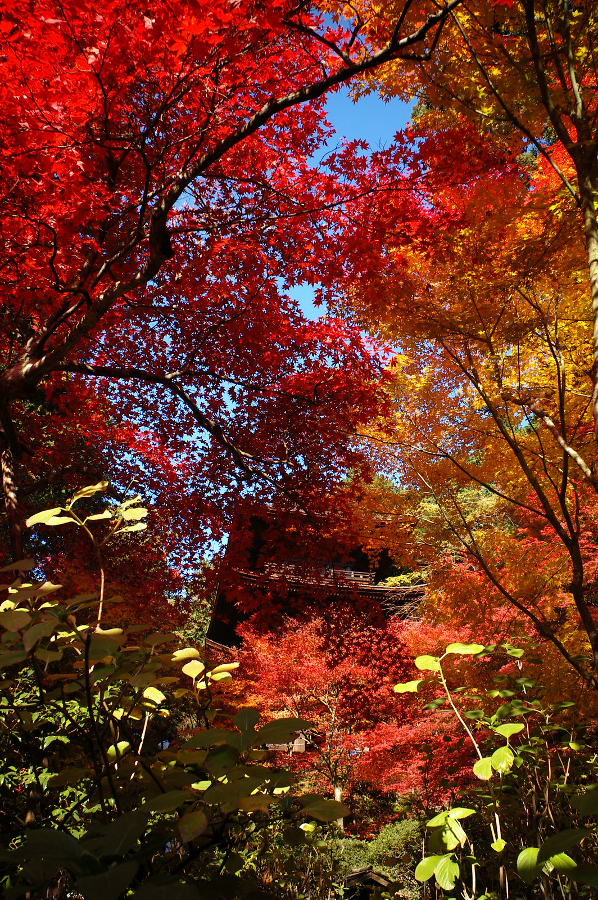

人の手が入っていないワイルドな自然の風景が基本的に好きですが、紅葉はお寺で見るのが風情があっていいですね。京都の有名なお寺は紅葉の時期になると激混みですが滋賀県はまだ京都に比べると人が少なくゆっくり見られます。他の紅葉おすすめスポットについても書いてみたいと思います。

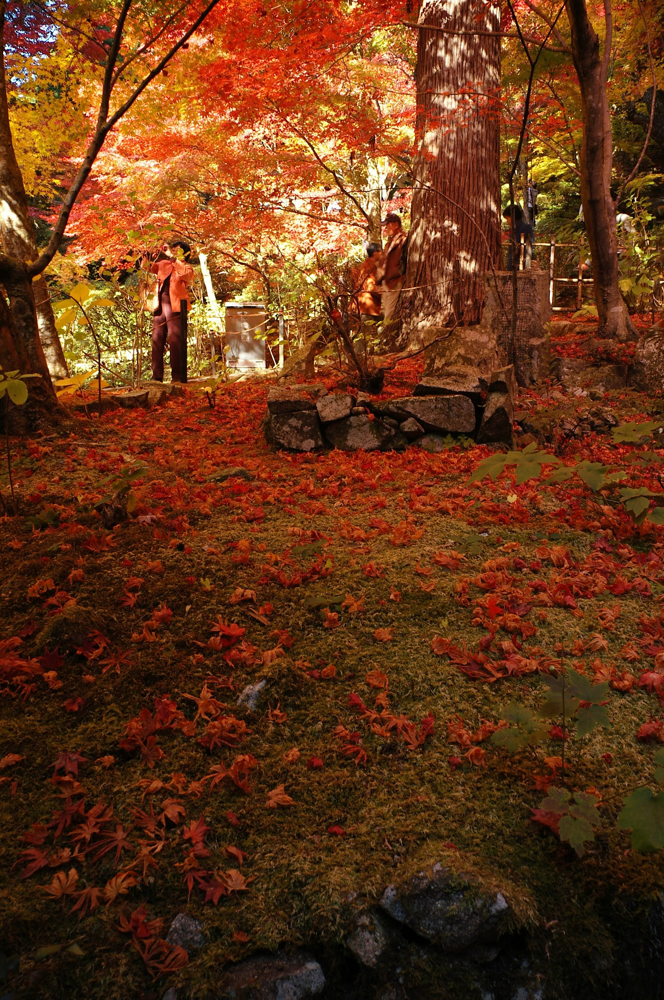
