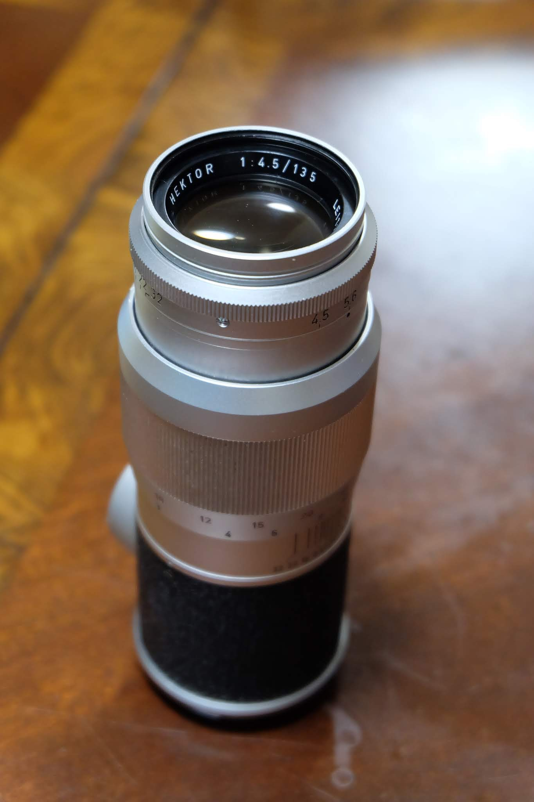
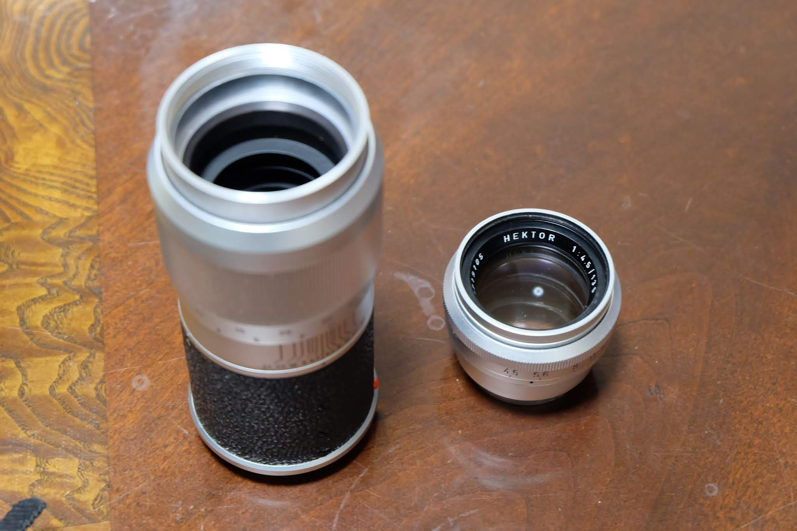
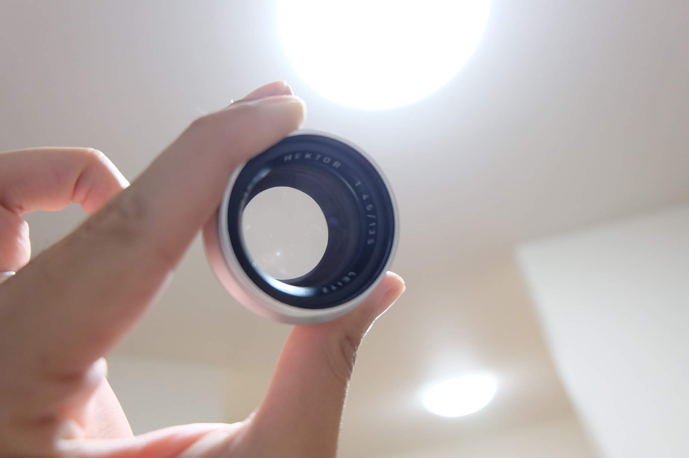
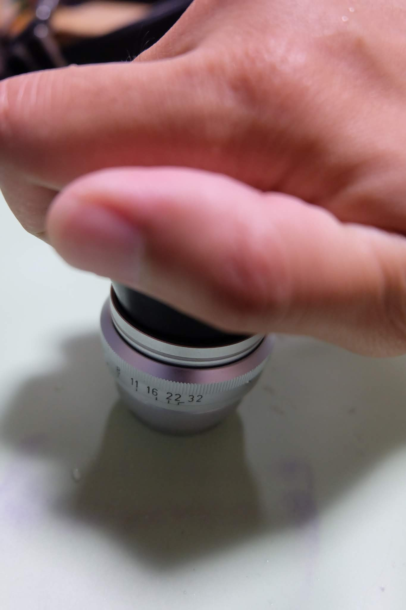
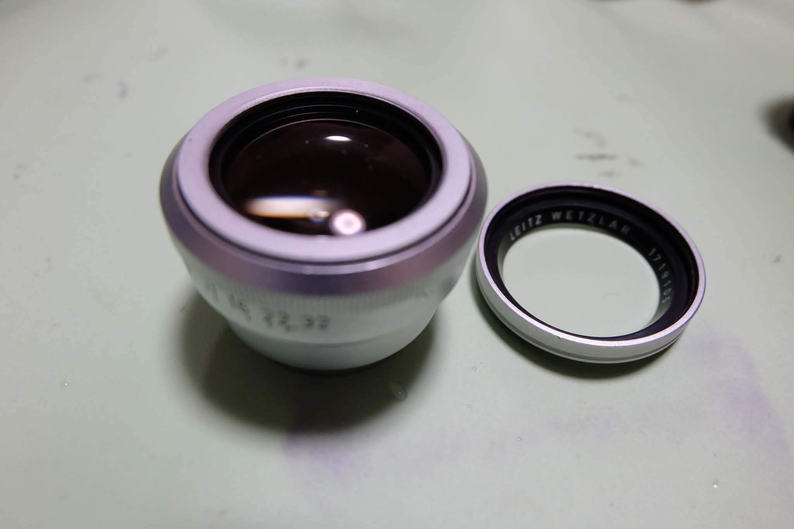
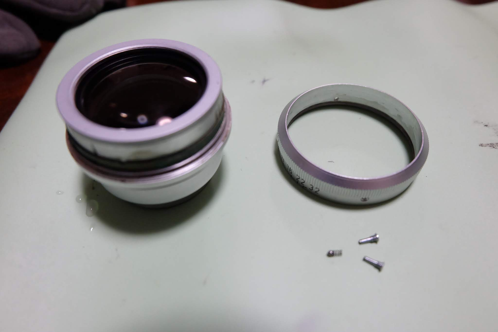
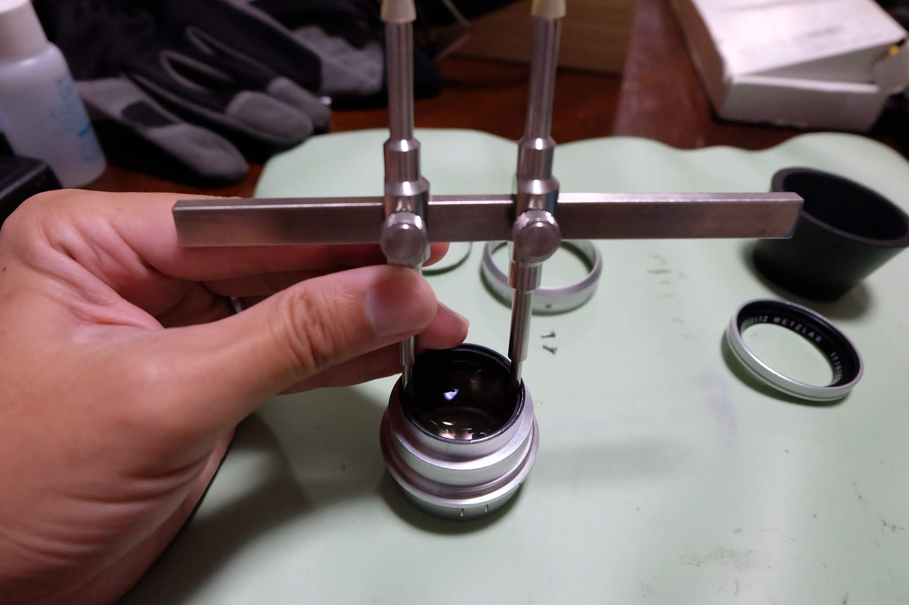
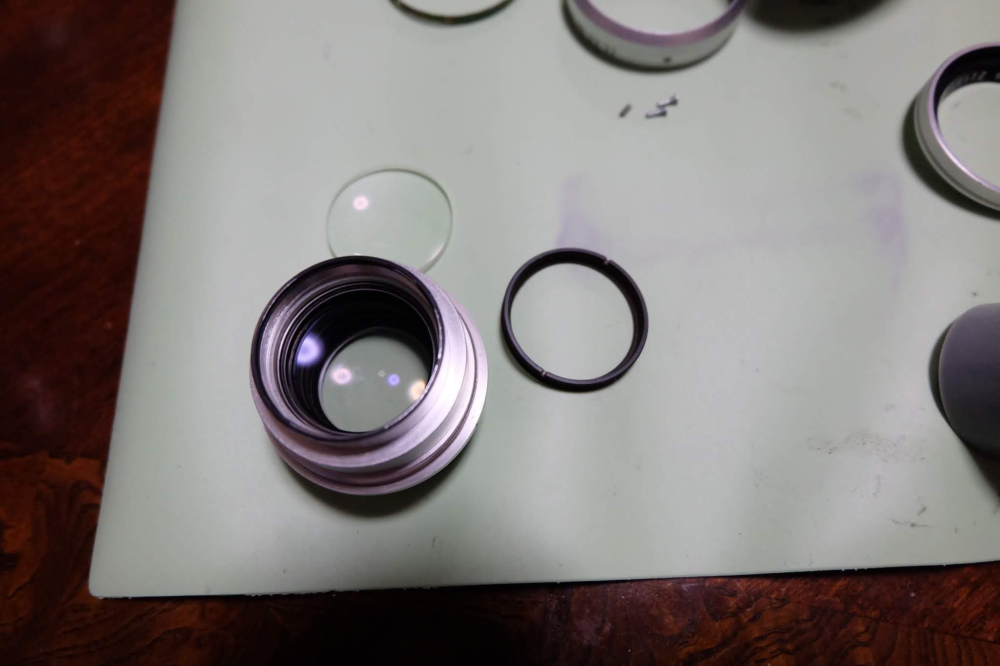
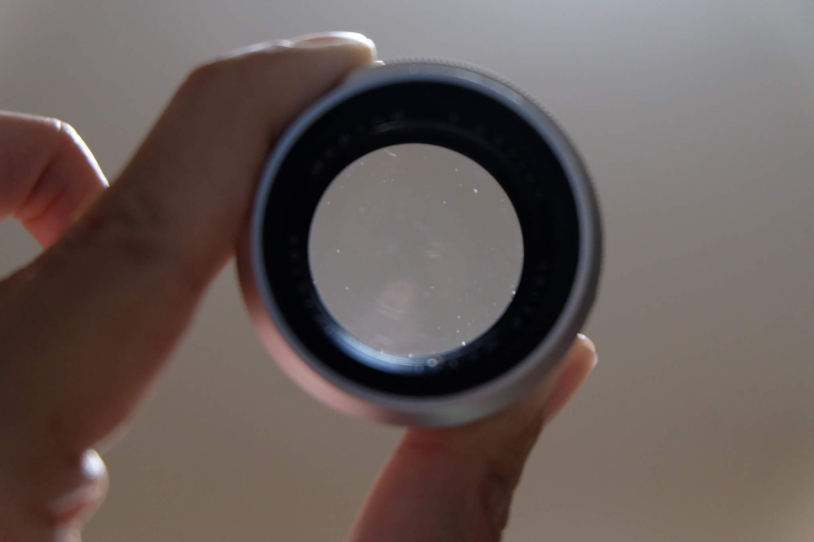

---
categories:
- カメラ
- レンズ
date: "2025-02-15T23:42:26+09:00"
draft: false
images: 
- images/DSCF4484.JPG
summary: 中玉にカビの生えたHektor 135/4.5 を分解清掃しました。
tags:
- Hektor 135/4.5
- Leica
title: Hektor 135/4.5 分解清掃
---

中玉にカビの生えたHektor 135/4.5 を分解清掃しました。

先端のレンズユニットが長いヘリコイドにねじ込まれているので先端を捻ると２つに別れます。

 

ちょっとわかりにくいですが左下の白い点がカビ。

まず前玉側からはずそうとゴムでリングを押さえ弛めます。

取れました。が、このリングが前玉を固定しているのではないようです。シルバーのリングと、内側に細く黒いリングが見えます。

とりあえず絞りリングを外してみると、シルバーのリングも緩めれば取れそうに見えるのですが緩めようとしても回りません。

ここで前玉側は諦めて後玉から分解を試みます。後玉を止めているリングはカニ目で回せます。

後玉が外れました。ここで中玉のカビは後側だったのでこのままアルコールで拭き上げきれいになりました。

