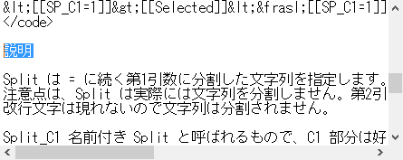
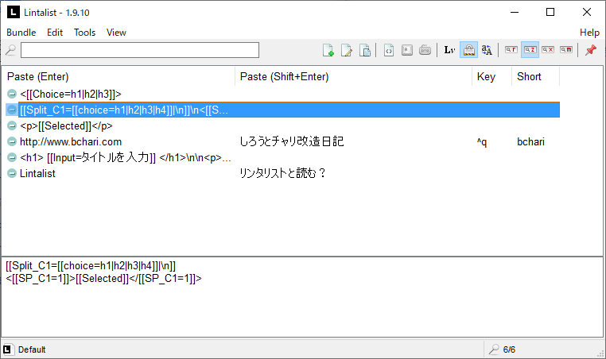
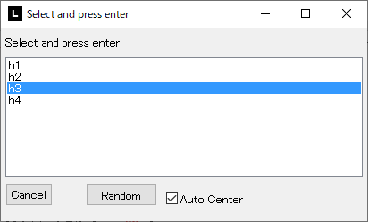
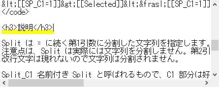

---
categories:
- ソフトウェア
date: "2025-02-15T23:42:45+09:00"
draft: false
image: images/lintalistbw.png
summary: 定形文を挿入できる便利ツール、Lintalistをさらに使いこなし、選択範囲をHTMLタグで囲む際、タグの種類を選べるように設定しました。
tags:
- PC
- Windows
- フリーソフト
- Lintalist
title: Lintalistの便利な使い方 － HTMLタグを選択し選択範囲をタグで囲む
---

## Snippet の中で動的にタグを選びたい

前回の記事
[Lintalistの便利な使い方 － 選択範囲をHTMLタグで囲む](lintalist-tag)
で選択範囲をHTMLタグで囲むやり方を紹介しました。

いろいろなタグを登録していけば便利なのですが、例えば h1, h2, h3,,,
など似たタグをたくさん登録すると選択ウィンドウで探すのが大変です。

そこで、Snippet の中で動的にタグを選択できるやり方を考えてみました。

Lintalist には、Snippet の中で選択候補を出す Choice
プラグインがあります。例えば、下のような Snippet を登録します。

```text
<[[Choice=h1|h2|h3]]>
```

Snippet
を貼り付けようとすると、下のような選択ウィンドウが現れます。ここで例えば
h2 をダブルクリックすると \<h2\> が挿入されます。

閉じタグも入力したいのですが、Choice
で選択したテキストをもう一度参照できれば簡単ですが、
そういった変数等は無さそうです。選択したテキストを変数に入れるなどの方法も無さそうです。

公式サイトを読んで Named split と Choice
を組み合わせることで実現できました。

[Lintalist - Combining Split and Choice to create a Snippet with
Logic.](https://lintalist.github.io/#combiningsplit)

こんな Snippet を登録します。

```text
[[Split_C1=[[Choice=h1|h2|h3|h4]]|¥n]]
<[[SP_C1=1]]>[[Selected]]<⁄[[SP_C1=1]]>
```

## 使い方

タグで囲みたい文字列を選択します。



Lintalist の 検索ウィンドウを表示(デフォルト
CAPSLOCKキー)して登録したSnippetをダブルクリックして貼り付けます。



選択ウィンドウが出るので、タグを選びダブルクリックします。



選んだタグで選択範囲が囲まれました。



## 説明

Split は =
に続く第1引数に分割した文字列を指定します。第2引数は分割するためのセパレータ文字です。
注意点は、Split は実際には文字列を分割しません。第2引数に改行 (¥n)
を指定しますが 改行文字は現れないので文字列は分割されません。

Split_C1 名前付き Split と呼ばれるもので、C1
部分は好きな文字列で良く、あとから SP_C1 で Split
した文字列を参照できます。

Choice は前述した通り、文字列を動的に選択する機能です。

この Snippet を貼り付けると、まず Choice
の選択ウィンドウが出ます。ここで例えば h3 を選択します。

すると、Split は文字列 \"h3\"
を改行文字をセパレーターとして分割しようとしますが、改行文字は無いので
分割後の1番目の要素がそのまま \"h3\" となります。

そして名前付き Split の1番めの要素は SP_C1=1
で参照できるのでこれを使い選択した文字列 \"h3\"
を複数箇所に挿入できるようになります。

Selected
は選択範囲の文字列なので、選択範囲を開始タグと終了タグで囲むことになります。

Choiceの結果を好きな変数に直接代入できるとよいのですが、名前付き Split
を使って トリッキーなやり方で実現しました。
