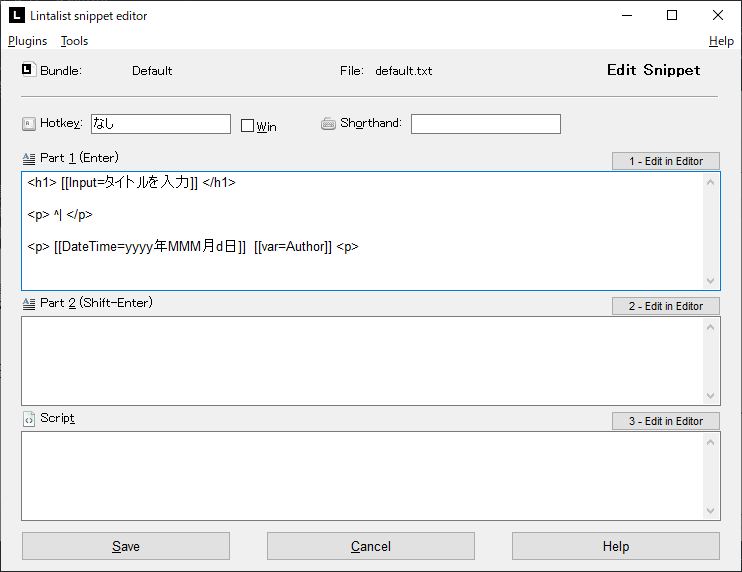
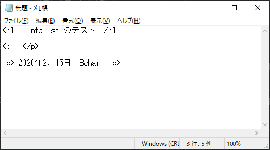

---
categories:
- ソフトウェア
date: "2025-02-15T23:42:36+09:00"
draft: false
images:
- images/lintalistbw.png
description: LintalistのBundleとSnippetについて解説します。定型文の貼り付けだけでなく様々な機能を実現する特殊文字（プラグイン）の詳細も記載します。
summary: Lintalist では、Snippet をひとまとめにしたものを Bundle と呼び、必要なBundle を読み込みSnippetを使用します。Snippetでは、特殊文字（プラグイン）を使うことで単なる定型文貼り付けだけでなく貼り付ける内容を動的に選択したり、カーソル移動したりすることができます。
tags:
- PC
- Windows
- フリーソフト
- Lintalist
title: Lintalistの使い方 - Bundle と Snippet
---

## Bundle とは

Lintalist では、Snippet をひとまとめにしたものを Bundle と呼び、必要な
Bundle を読み込み Snippet を使用します。

Bundle は Lintalist 実行ファイルがあるフォルダの bundles\\
以下にBundleごとにファイルで保存されます。

## Snippet の中身

Snippet は下表の通り5つの項目で構成されています。

|       項目             |       内容                                               |
|------------------------------|----------------------------------------------------------------|
|       Part1          |       Enter で貼り付けられるテキスト                               |
|       Part2          |       Shift+Enter で貼り付けられるテキスト                         |
|       Hotkey         |       Hotkey で指定したキーを押すと Part1 の内容が貼り付けされる             |
|       Shorthand      |       登録した単語(略語)を入力すると Part1 の内容に置き換えられる               |
|       Script         |       AutoHotkey スクリプトを登録。上のPart1の代わりにスクリプトが実行される      |

Script を登録するとPart1だけでなく Hotkey, Shorthand も Script
が実行されるようになります。

## Snippet で利用できる特殊文字（プラグイン）

Snippet には、\[\[ と \]\]
で囲んだ特殊な意味を持つ文字を使うことで貼り付け時に文字を入力、選択したり貼付け後のカーソル位置を指定したり様々なことができます。ここではざっとだけ紹介します。詳しくは公式
Web サイトに記載されています。

|       コード・変数                                                      |       内容                                                                                                            |
|---------------------------------------------------------------------------|-----------------------------------------------------------------------------------------------------------------------------|
|       ^\| , ^$                                                    |       カーソル位置。例："Hello, this is a sample ^\|text" は、貼付け後、text の t の前にカーソルを移動する                                       |
|       \[\[C=Char\|Repeat\]\]                                      |       文字 Char を Repeat 回数貼り付ける。例："\[\[C=\-\|30\]\]"で \- を 30 個貼り付ける                                                 |
|       \[\[Calc=\]\]                                               |       式の計算結果を貼り付ける                                                                                                  |
|       \[\[Calender=format\|LCID\|to\]\]                           |       カレンダーを表示し、選んだ日付を format の記法で貼り付ける。LCID はマイクロソフトの地域で日本は ja\-JP など。to を指定すると開始、終了2つの日付を入れられる                    |
|       \[\[Choice=item1\|item2\|\.\.\.\]\]                         |       複数の項目から選択して貼り付け                                                                                               |
|       \[\[Clipboard\]\]                                           |       クリップボードの中身を貼り付け                                                                                               |
|       \[\[Comment=\]\]                                            |       コメント。貼付け時に削除される                                                                                               |
|       \[\[Counter=Name\|Value\|Reset\]\]                          |       カウンタ。Name はカウンタ名。貼付け時に Value 分だけカウントアップする。 Reset を指定するとその値に書き換えられる。                                           |
|       \[\[DateTime=Format\|Value\|TimeUnits\|LCID\]\]             |       現在の日付時刻。Value, TimeUnits を指定すると Value 分だけ後の日付時刻になる                                                            |
|       \[\[File=Filename\|select\|clean\]\]                        |       ファイルの内容を貼り付け。select を指定すると フォルダからファイルを指定する。clean は、ファイル内に \|\[\] 文字があると意図した結果にならないためあらかじめこれら文字を除去するオプション      |
|       \[\[FileList=?Options\|path\]\]                             |       path 内のファイル名。ワイルドカード使用可。?Opthions はたくさんあるので公式ドキュメント参照                                                         |
|       \[\[Input=Text                                              |       Default\]\]                                                                                                   |
|       \[\[PasteMethod=0\|1\|2\]\]                                 |       順にクリップボードは書き換えない。クリップボードを貼り付けたテキストに書き換える。貼り付けせずにクリップボードのみ書き換える                                                |
|       \[\[Random=1\|10\]\] or \[\[Random=a\|b\|c\]\]              |       ランダム                                                                                                          |
|       \[\[Selected\]\]                                            |       現在選択中のテキスト                                                                                                    |
|       \[\[Snippet=Shorthand\]\]                                   |       他のスニペットの内容を参照する                                                                                               |
|       \[\[Split=input\|?1\|?2\]\]                                 |       テキストを配列に分割する                                                                                                  |
|       \[\[SplitRepeat=input\|?1\|?2\|?3\]\]                       |       テキストを配列に分割する                                                                                                  |
|       \[\[Var=Name\]\]                                            |       変数 Name の値を挿入。変数は Bundle 間をまたいで使用できる                                                                          |
|       \[\[String=text\|option\]\]                                 |       文字列操作。大文字、小文字に変換など                                                                                            |
|       \[\[Query\]\], \[\[Query1\]\], \[\[Query2\]\]               |       Snippet の検索に使用した文字列                                                                                           |
|       \[\[html\]\], \[\[md\]\], \[\[rtf=\]\], \[\[image=\]\]      |       プレーンテキスト以外のフォーマットで貼り付けする場合に使用する。指定した形式で貼り付けできるかは受け取り手のアプリケーション次第                                              |
|       \[\[llpart1\]\], \[\[llpart2\]\]                            |       Script から llpart1, llpart2 の内容を参照する際に使用する                                                                     |

## 使用例

例えば、下記のようにスニペットを登録してみます。変数 Author には bchari
と登録しておいています。

スニペットを選択し Enter
を押すと、タイトルを入力するウィンドウが開きます。

タイトルを入力するとこんな感じで貼り付けされます。カーソル位置は \<p\>
タグ後に移動しています。

結構複雑なこともできそうですが、たいていは普通に登録した文字列を貼り付けるだけで事足りてしまいそうで、ここに挙げた機能はあまり使用しなそうです。使うとしたらカーソル移動と選択中の文字列を加工するくらいでしょうか。考えればいろいろ面白いことができそうです。
