---
categories:
- ソフトウェア
date: "2025-02-15T23:42:27+09:00"
draft: false
images: 
- images/lintalistbw.png
description: 日頃PCで作業していると、自分の名前、メールアドレスなどよく使うテキストを繰り返し入力することがあります。シンプルで機能も多く、フリーソフトのLintalistを紹介します。日本語の情報がほとんど無いですが、優れた入力支援ツールです。
tags:
- PC
- Windows
- フリーソフト
- Lintalist
title: 定型文入力支援ツール Lintalist でテキスト入力を楽々に
---

## Lintalistとは

日頃PCで作業していると、自分の名前、メールアドレスなどよく使うテキストを繰り返し入力することがあります。こういったテキストを登録し、簡単に呼び出せる入力支援ツールです。有名どころではtext
expanderなどがありますが、Lintalistはフリーでシンプルなので使っています。日本語の情報がほとんど無いので簡単に紹介してみようと思います。

できること：

-   定型文の登録
-   ホットキーでメニューを呼び出し定型文を選択し貼り付け
-   特定の定型文にホットキーを割り当て、ホットキーで直接定型文を呼び出す
-   定型文にショートハンド（略語）を割り当て、ショートハンドを入力すると定型文に展開
-   定型文にAuto Hot Keyのスクリプトの割当も可能

## Lintalistの入手とインストール

https://lintalist.github.io/ より最新版をダウンロード。

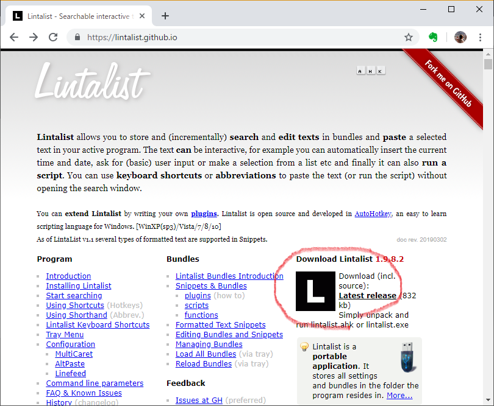 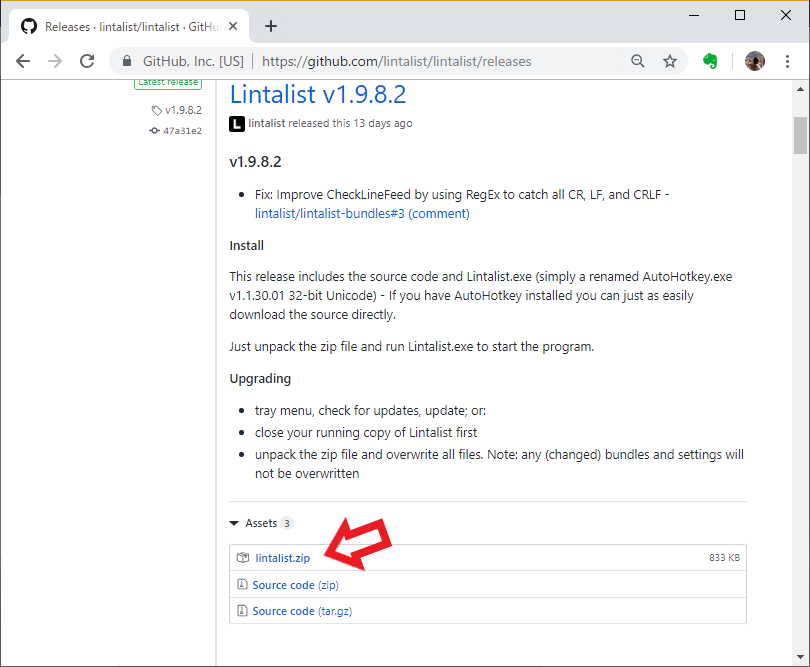

インストールは不要なのでZipファイルを適当なフォルダに展開するだけです。

## Lintalistの起動と初回の設定

Zipファイルを展開したフォルダ内のLintalist.exeをダブルクリックすると起動します。

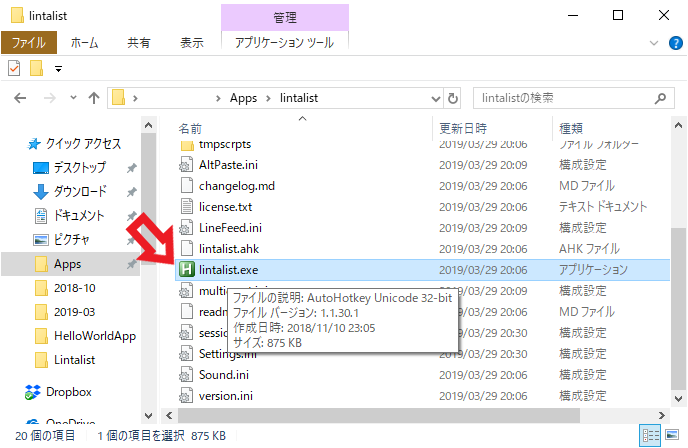

Lintalist Quick Start
Guideというウィンドウが表示され、簡単な使い方説明が記載されています。まず、とにかくCAPSLOCKキーで定型文の登録、呼び出し（検索）ができそうなのでCAPSLOCKキーを押してみます。

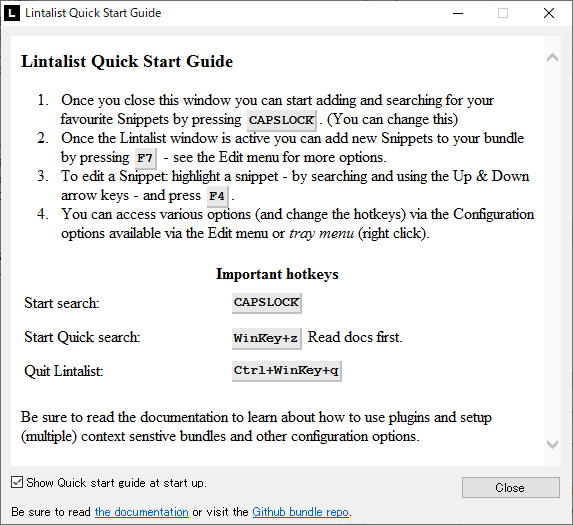

あれ、何も起こらない？？CAPSLOCK単体でもShift+CAPSLOCKでも何も起こりません。Quick
searchのWindowsキー+Zは効くようです。日本語キーボードなのか使っているキーボード特有なのかわかりませんが、CAPSLOCKで起動させるには、設定を変える必要がありました。

タスクトレイの\"L\"マークをクリックしConfigrationをクリックすると設定画面が出ます。

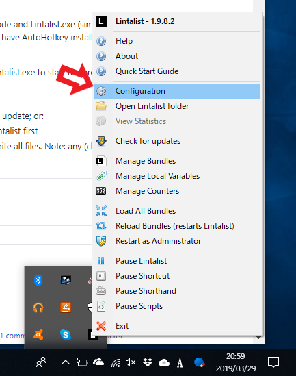 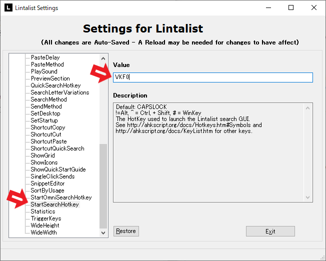

## 定型文の登録

CAPSLOCKキーを押すと定型文の一覧が表示されます。ここでノートに鉛筆マーク(ショートカットキーF4)を押すとSnippet
editorが表示され、定型文を登録できます。

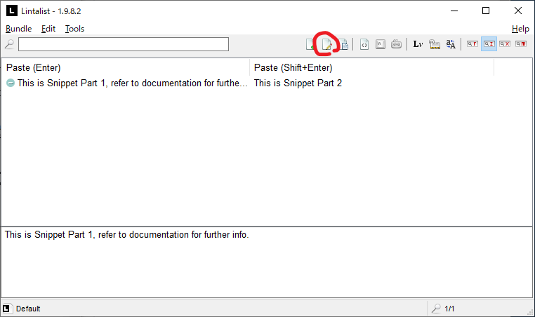

定型文にはPart1とPart2と2つの文を登録でき、定型文一覧からEnterを押して選択した場合はPart1が、Shift+Enterを押して選択した場合にはPart2が挿入される仕組みになっています。ホットキーとShorthand（略語）の設定もできますが、これらの方法で挿入した場合はPart1が挿入されます。Scriptの説明はここでは割愛します。

例として、下の画像のような定型文を登録してみました。

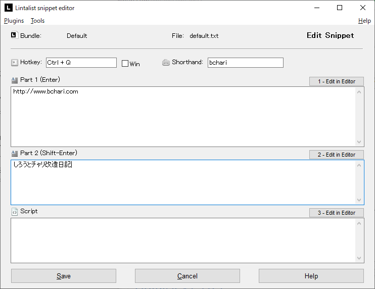

## Snippetの挿入

### Start Searchホットキーから挿入

CAPSLOCKキーを押すと定型文一覧の中に先程登録した項目が表示されます。そのままEnterを押すと一番上に表示されている項目が挿入されます。マウスで選択や検索ボックスから候補を絞り込むこともできます。ここではマウスで選択しEnterを押します。

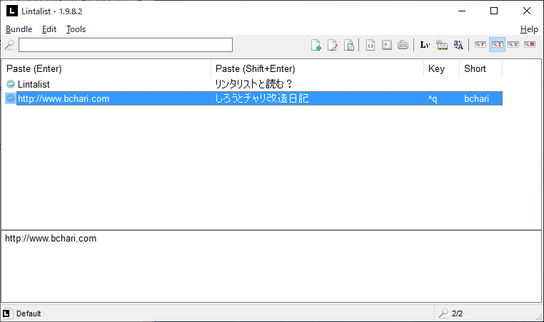

定型文のPart1が挿入されました。

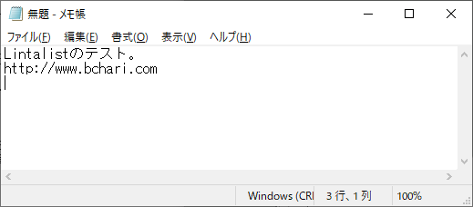

次に、同様にマウスで選択しShift+Enterを押します。定型文のPart2が挿入されました。

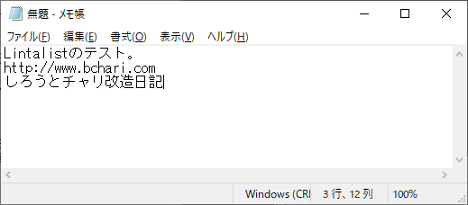

### Shorhandからの挿入

こんどは、bchariと入力しスペースを押します。

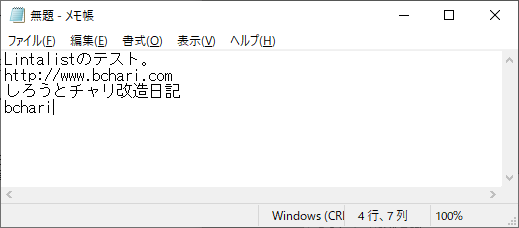

定型文のPart1が挿入されました。

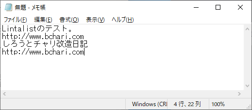

### Hotkeyからの挿入

先程HotkeyにControl+Qを登録しましたので、Control+Qを押しても定型文のPart1が挿入されます。

## Lintalistは便利な定型文入力支援ツール

基本的な使い方を説明しましたが、普段メールアドレスとか、自分の名前やブログのURLなどを入力する際にとても便利なツールだと思います。特にフリーでインストール不要なのがUSBで持ち運びなどもできて便利です。公式URL、マニュアルなど全て英語なのでとっかかりにくいですが少なくとも単純な使い方では日本語による不具合なども見られず良いツールだと思います。

Bundleを作って定型文リストの使い分けや、日付など動的な文の挿入、AutoHotKeyのスクリプトなど、高度な機能もあるので紹介していきたいと思います。
