---
categories:
  - ブログ
date: "2025-02-15T23:43:30+09:00"
description: インタラクティブなマップをブログに埋め込むことができる無料のサービス、uMapの使い方をご紹介します。プログラミングの知識が必要なく、直感的な操作でマップを作成できるおすすめのサービスです。
draft: false
images:
  - images/I6zk6.webp
summary: インタラクティブなマップをブログに埋め込むことができる無料のサービス、uMapの使い方をご紹介します。プログラミングの知識が必要なく、直感的な操作でマップを作成できるおすすめのサービスです。
tags:
  - Webサービス
  - マップ
  - uMap
title: uMap - ブログに埋め込む地図を無料で作成！
---

ブログに地図を埋め込みたい場合、Googleマップを始めとしたサービスがいくつかあり、前回の記事でそれぞれの特徴について比較しました。

その中でもGPSログやピンを配置でき、見た目のカスタマイズも自由にできるのにフリーのサービスであるuMapの使い方をご紹介します。

## uMapとは

OpenStreetMapという誰でも自由に地図を使えるよう、みんなでオープンデータの地理情報を作るプロジェクトがあります。uMapは、OpenStreetMapのデータを使ってカスタマイズした地図を作れるサービスです。uMap自体もOpenStreetMapの関連プロジェクトのようです。

OpenStreetMapはOpenStreetMap財団 (OSMF)がOpen Data Commons Open Database
License (ODbL)
の下にライセンスするオープンデータです。uMapで作成した地図を公開する場合は、クレジット等の表記が必要ですが勝手に入るので基本的には気にせず無料で使うことができます。

地図のカスタマイズもuMap上で直感的にでき、JavaScriptを書いたりする必要もないため使い勝手がよいサービスです。

## マップを作成

では早速地図を作ってみましょう。
[uMap](https://umap.openstreetmap.fr/ja/)
にアクセスすると、右上に「マップを作成」ボタンがあるので、クリックするとマップ作成画面が出てきます。

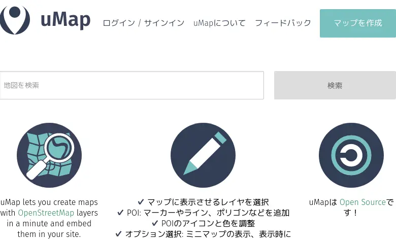

ヨーロッパあたりの地図が出てきました。英語ですね。

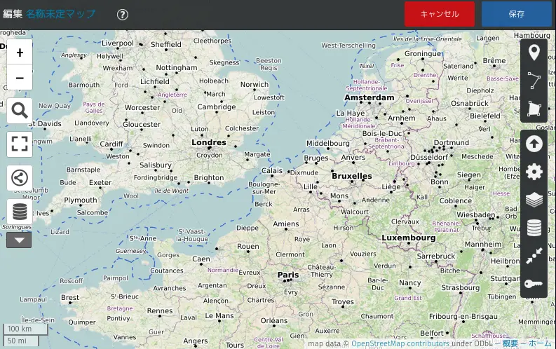

地図をドラッグして大阪あたりを見てみます。英語です。もっと拡大すると日本語が出てきますが、これではいまいちですね。

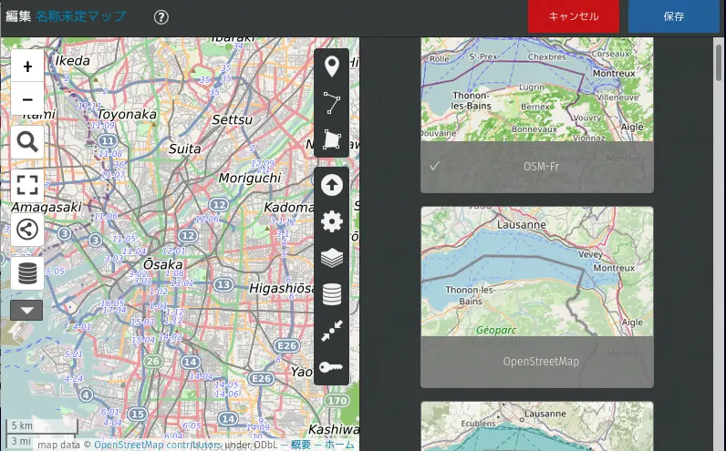

地図右端のレイヤボタンをクリックして、マップを選択します。デフォルトでチェックの付いているOSM-Fr（フランスの地図ということでしょうか）から、OpenStreetMapに変更します。地名表示が日本語になりました。左上の地図のタイトルも入れておきましょう。

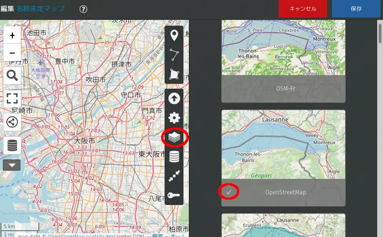

## GPSログを読み込み

次に、GPSデータを読み込んでみましょう。

[サイクリングでJR岸辺駅から生駒山の暗峠を目指した](/bike/madone21-kuragaritouge)
GPSログです。GPSサイコンのXOSS
Gで取得したログを、STRAVAにアップロードしたデータを使ってみます。



STRAVAにログインし、ダッシュボードから目的のワークアウトを選択し、メニュー（「・・・」のボタン）から「GPXをエクスポート」を選択すると、GPXデータがダウンロードできます。

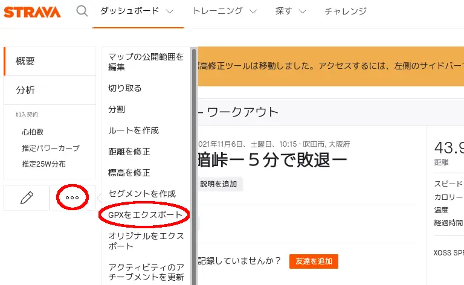

uMapでデータインポートボタンを押して、先程ダウンロードしたGPXファイルをインポートします。

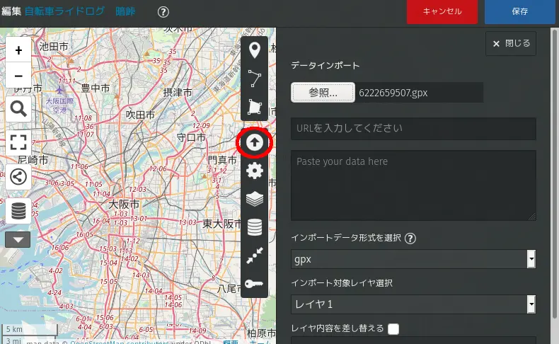

GPSデータが青線で表示されました。線の色、濃さ、太さ等も指定できます。

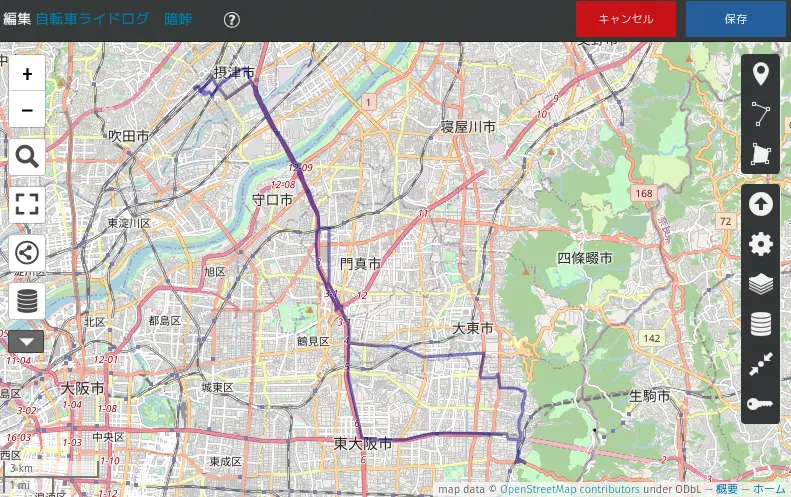

## ピンを配置

次にスタート地点、目的地などのマーカーを配置してみます。「マーカーを配置」ボタンを押してから、地図上をクリックするとマーカーを配置できます。説明、色、アイコン形状、アイコンシンボルなどをカスタマイズできます。

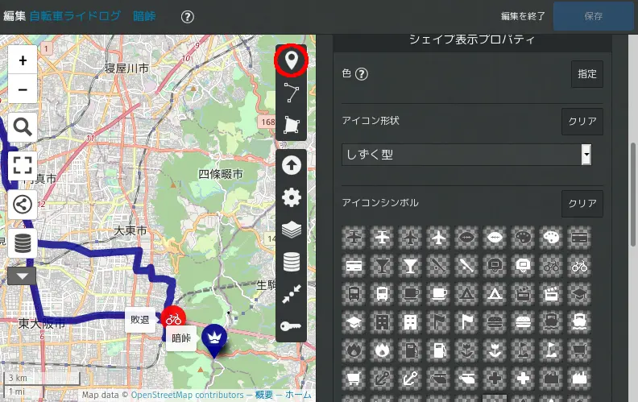

## 中心、スケールを調整

GPSログ、マーカーが配置できたら、地図の中心、縮尺を調整して、「地図中心点とズームレベルを保存」ボタンをクリックします。最後に、右上の保存ボタンを押せば地図が完成です。

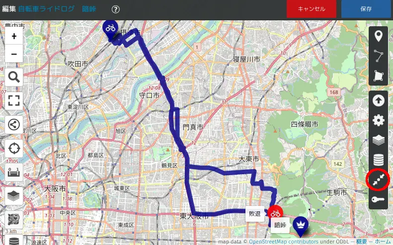

## 埋め込みHTMLコードを取得

地図が完成したら左側の共有ボタンをクリックすると埋め込みHTMLコードが出てきますので、これをまるまるコピーします。

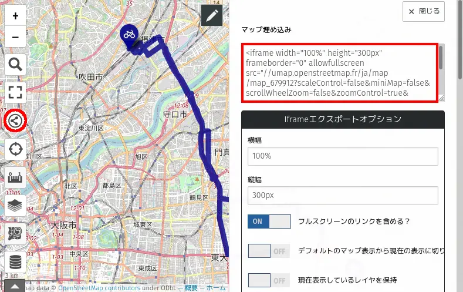

## ブログへ貼付け

ブログ（このブログはBloggerを使ってます）の記事にHTMLコードを貼り付けることで作成した地図を埋め込むことができます。

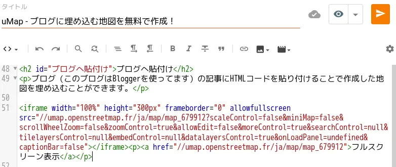

今回作成した地図を下に載せます。PC、モバイルなど画面の大きさが異なると表示範囲も違ってくるため一度表示してみてから中心、スケールを微調整するとよいでしょう。


<iframe allowfullscreen="" frameborder="0" height="300px" scrolling="no" src="//umap.openstreetmap.fr/ja/map/map_679913?scaleControl=false&amp;miniMap=false&amp;scrollWheelZoom=false&amp;zoomControl=true&amp;allowEdit=false&amp;moreControl=true&amp;searchControl=null&amp;tilelayersControl=null&amp;embedControl=null&amp;datalayersControl=true&amp;onLoadPanel=undefined&amp;captionBar=false#11/34.720337700667/135.61513043453743" style="max-width:100%" title="uMap 暗峠サイクリングマップ" width="100%">
</iframe>


[フルスクリーン表示](//umap.openstreetmap.fr/ja/map/map_679912)

## uMapへの登録

単発での使用でしたら以上のように、特にユーザー登録もせずに地図を作れてしまいます。ただ、今後たくさん地図を作っていく場合は、作った地図がわからなくなってしまわないようにアカウントを作っておくと良いでしょう。

## まとめ

uMapは、多機能で使いやすく、これが無料でいいの！？というくらい素晴らしい地図が作成できるサービスです。このサービスがずっと継続していけるのか若干心配にもなってきますがGoogleやmapbox等の商用サービスで無料枠が気になる方などは積極的に使ってみることをおすすめできる地図作成サービスです。
