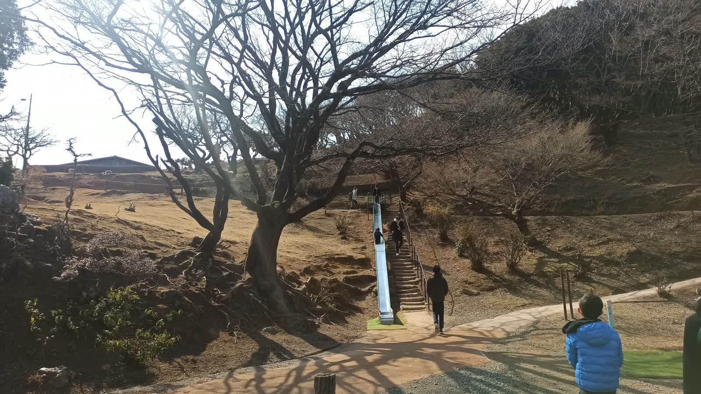
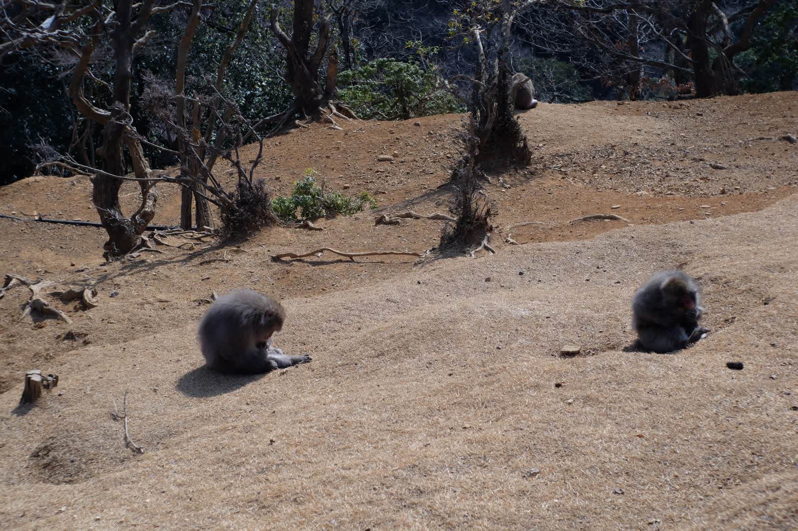
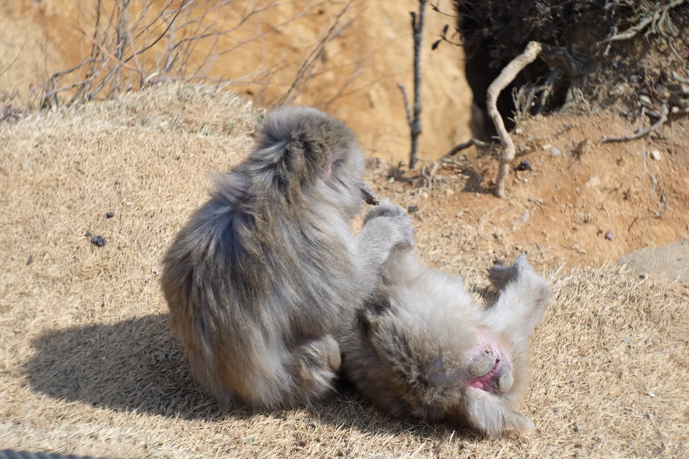

---
categories:
  - アウトドア
  - 登山
date: "2025-02-15T23:43:40+09:00"
description: 冬の嵐山観光でモンキーパークへ子供を連れていき、天龍寺や竹林の小径を歩きました。寒い2月の午前中は駐車場も空いていてゆっくり観光を楽しめます。
draft: false
images:
  - images/3yQh2.jpg
summary: 京都嵐山は観光名所が多く、休日ともなると渡月橋は人だらけで車も渋滞しているイメージですが冬は比較的空いているのではと思いモンキーパークへ子供を連れていき、天龍寺や竹林の小径を歩きました。寒い2月の午前中は駐車場も空いていてゆっくり観光を楽しめました。
tags:
  - 家族で登山
  - 観光
  - 京都
  - 嵐山
title: 冬の嵐山散策−嵐山モンキーパークいわたやま
---

京都嵐山は観光名所が多く、休日ともなると渡月橋は人だらけで車も渋滞しているイメージですが冬は比較的空いているのではと思いモンキーパークへ子供を連れていき、天龍寺や竹林の小径をぶらぶらしてみました。寒い2月の午前中は駐車場も空いていてゆっくり観光を楽しめました。

## マップ

京都市嵐山観光駐車場から渡月橋を渡り嵐山モンキーパークいわたやまでおさるさんを見た後、渡月橋を戻り嵐山駅を過ぎ天龍寺の庭園に入り、竹林の小径を通って桂川沿いに駐車場へ戻りました。

{{< mbox json="track.json" center="{ \"lng\": 135.675, \"lat\": 35.013 }" zoom="14" style="" >}}

## 京都市嵐山観光駐車場

大きな駐車場ですが休日は朝すぐに埋まってしまうことが多いようです。今回は2月の真冬だったので10時頃に着きましたが余裕で停められました。昼前くらいまでは空いていそうでした。駐車料金1,040円と観光地らしい設定です。

## 渡月橋を渡る

駐車場からすぐに渡月橋が見えます。紅葉の秋には人がうじゃうじゃいますが、山も枯れ木で寒い冬の朝は人もまばらです。

モンキーパークは渡月橋を渡って川の向こう側です。

嵐山公園も寒くて人がいないですね。。。

渡月小橋から船が浮かんでいるのが見えます。京都らしい風景です。

## 嵐山モンキーパークいわたやまでおさるにエサをあげる

船着き場の山手側に嵐山モンキーパークの入口があります。神社の階段を登って入ります。

眼の前に神社が。

と思いきや、左手に入口です。

入口から結構山を登ります。

なかなか着きません。モンキーはどこ？

飽きないよう途中にオサルクイズが！

まだまだ登ります。なんだかんだで上まで20分ほどかかりました。

やっと上に着きました。公園になっています。

公園から滑り台の右上がおさるさんがたくさんいる場所です。

山の上はサルだらけ。

展望が抜群の場所です。

小屋の中ではエサ（ピーナッツなど）を買って網の間からおさるさんにエサをあげることができます。

外ではエサをもらえないと知っているのか、おさるさん達は人間に目もくれず思い思いにのんびり過ごしておりました。

## 嵐山駅キモノフォレスト

モンキーパークを降りて渡月橋を渡りまっすぐ進むと右手にミッフィーのパン屋さんがあります。

さらに進むと嵐山駅です。豪華な駅舎ですね。

中は改札も無い小さな駅ですが、かわいらしい電車です。

駅の奥には着物の柄が描かれた筒がたくさん並んでいて、キモノフォレストというちょっとした観光名所になっています。

駅前の道をさらに少し行くと左手に天龍寺の入口です。

せっかくなので曹源池庭園へ入ります。中学生の修学旅行で来た記憶がかすかに思い出されます。

庭園から北側へ、竹の小径に出ます。

竹は冬でも青々として1年中見頃ですね。

竹の小道を抜けて桂川に降りる途中に梅の花が咲いていました。

桂川沿いを歩いて駐車場に戻り、今回のおでかけは終了です。さすがに午後は駐車場が満車になっていました。

## まとめ

冬の嵐山は比較的人が少ないので車で行っても渋滞せず駐車場も空いていました。モンキーパークは暑い夏に登るのが大変そうなので冬に行くのが正解でした。
