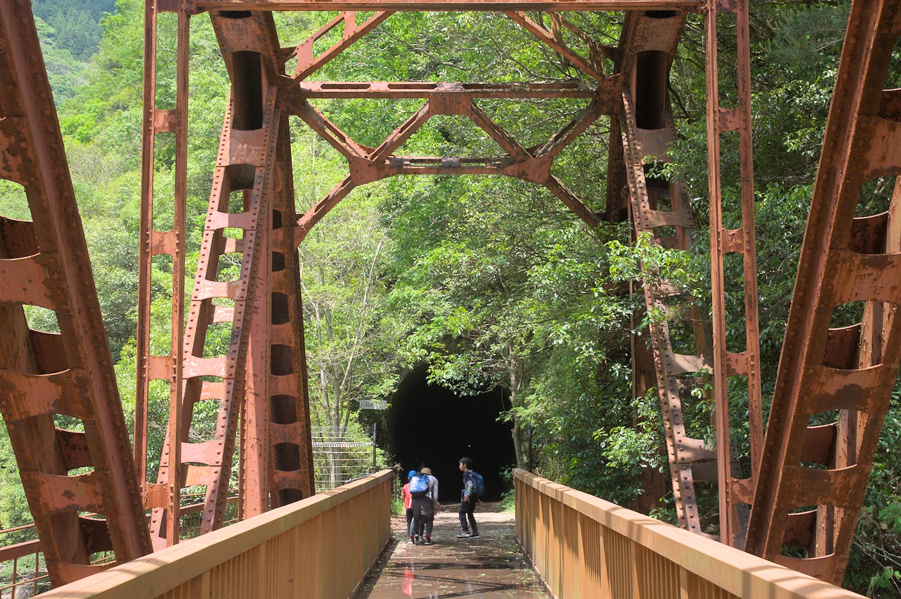
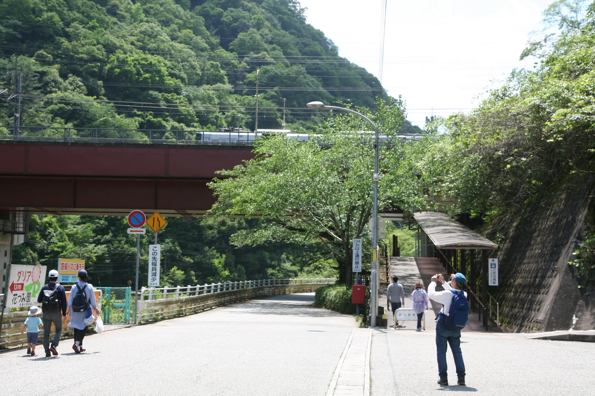

---
categories:
  - アウトドア
  - 登山
date: "2025-02-15T23:43:12+09:00"
description: 兵庫県西宮市の武庫川沿いにかつて機関車が走っていたJR福知山線の廃線敷がハイキングコースとして一般開放されています。全長4.7kmで線路の枕木が残っていたりトンネルに入ったりとなかなか面白いハイキングコースでした。
draft: false
images:
  - images/IMG_5709.webp
summary: 兵庫県西宮市の武庫川沿いにかつて機関車が走っていたJR福知山線の廃線敷がハイキングコースとして一般開放されています。全長4.7kmで線路の枕木が残っていたりトンネルに入ったりとなかなか面白いハイキングコースでした。
tags:
  - ハイキング
  - 廃線跡
  - 兵庫
title: JR福知山線廃線敷ハイキング
---

兵庫県西宮市の武庫川沿いにかつて機関車が走っていたJR福知山線の廃線敷がハイキングコースとして一般開放されています。全長4.7kmで線路の枕木が残っていたりトンネルに入ったりとなかなか面白いハイキングコースでした。

## アクセスとハイキングコース

JR福知山線西宮名塩駅から武庫川沿いに武田尾駅まで歩きます。武田尾駅から電車で1駅、西宮名塩駅に戻りました。電車でアクセスしてもよいですし、車の場合は西宮名塩駅、武田尾駅とも駅前に駐車場があります。歩く方向はどちらでも良いですが西宮名塩駅からスタートする人が多かったです。

{{< mbox json="track.json" center="{ \"lng\": \"135.321057\", \"lat\": \"34.840251\" }" zoom="12" style="gsi" >}}

[にしのみや観光協会のホームページ](https://nishinomiya-kanko.jp/fukuchiyamasen_haisenjiki2019/)
からマップをダウンロードできます。

## 注意事項

真っ暗で長いトンネルがあるのでので懐中電灯が必要です。落石注意の看板があます。通行者の自己責任が原則との注意喚起がなされています。詳しくは
[にしのみや観光協会のホームページ](https://nishinomiya-kanko.jp/fukuchiyamasen_haisenjiki2019/#e)
を参照ください。

## 西宮名塩駅からスタート

エコナールなじおの駐車場に車を停めてスタートです。名塩駅前は意外と栄えています。

方向が良くわからず迷いましたが、駅の改札を見て左手の階段を登りスタートです。

階段を登り、ロータリーを左に出て細い道に出て道沿いに進んでいきます。

## 廃線敷への入り口

廃線敷の入り口に着きました。ここから左手に下ります。

下り道の途中、写真中央奥に簡易トイレがありました。トイレはここから、武田尾側の道路に出るまでありません。

下ると早速廃線跡の道です。

## 廃線敷を歩く

気持ちの良い道を歩いていくと、ところどころ線路の枕木が残っていてテンションが上がります。

右手には武庫川です。連日の雨で水量は多い方だと思います。下は後ろを振り返った写真です。水の色は、、、汚いですね。

## 真っ暗なトンネル！

しばらく進むとトンネルが現れました。北山第一トンネルです。廃線敷には6つのトンネルと1つのトンネルもどきのようなものがあります。

中は真っ暗です。懐中電灯を点けて進みます。かなり長いです。

やっとトンネルを抜けました。

新緑に囲まれた廃線敷が続きます。夏は暑そうですが、今の時期は最高に気持ちの良いハイキングです。

線路の標識の跡でしょうか。柵もろともサビサビで哀愁が漂います。

武庫川は岩がゴツゴツしていて荒々しく、川に下れる場所も後半に1箇所しかなく川遊びをするような場所ではありません。

## 第2武庫川橋梁

溝滝尾トンネルを抜けると、橋が見えました。

第2武庫川橋梁です。真っ赤に錆びた鉄の橋が圧巻です。ここが一番の写真スポットでしょうか。

さらに次のトンネル長尾第1トンネルへ進みます。

## 親水広場から武田尾駅へ

しばらく進むと川に下りられる場所、親水広場です。水は濁っていて深そうなので川遊びをする感じではありませんね。

川の上は桜の木が植えられた広場になっていてお弁当を食べている人がたくさんいました。

親水広場からトンネルを越えて少し進むとゴールが見えてきます。

廃線敷が終わり、道路にでます。目の前はカフェのようです。

ここはだだっぴろい広場がありました。きれなトイレもあります。

車道を歩き武田尾駅に到着です。お疲れさまでした。

## 電車で西宮名塩駅へ戻る

外は寂れた無人駅のようですが、ホームはトンネルの中にありこんなかんじでなかなか現代的です。

ここから電車で一駅戻り、帰路につきました。

## まとめ

JR福知山線廃線敷は廃線跡を歩ける珍しいハイキングコースです。平坦な道なので子供でも体力的にはそれほど辛くなく、枕木やトンネル、鉄橋など見どころもあり家族でちょっとした冒険気分を味わえるハイキングコースでした。
