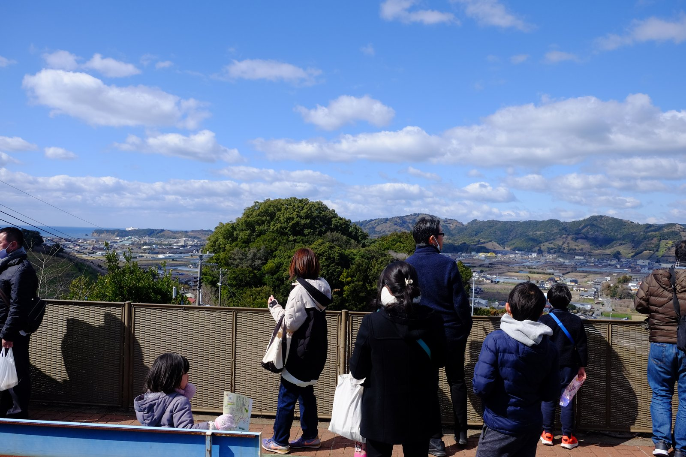
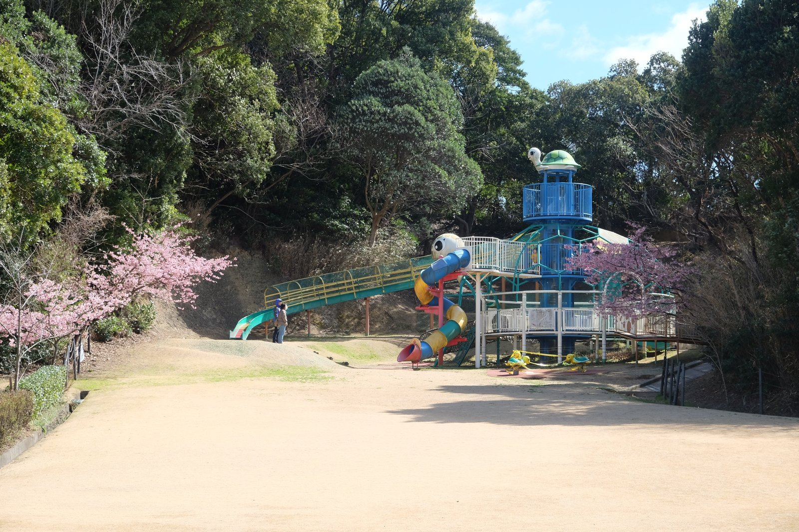

---
categories:
  - アウトドア
  - 登山
date: "2025-02-15T23:44:04+09:00"
description: 一目百万香り十里といわれ、約8万本もの梅が咲く南部梅林をご紹介します。多くの人で賑わう山の中をハイキングしながら梅の花見を楽しむことができます。
draft: false
images:
  - images/minabe.jpg
summary: 一目百万香り十里といわれ、約8万本もの梅が咲く南部梅林に行きました。多くの人で賑わう山の中をハイキングしながら梅の花見を楽しみました。
tags:
  - 家族で登山
  - 和歌山
  - 南部
  - 南部梅林
  - 花
  - 梅
title: 和歌山県の梅の名所 南部梅林
---

一目百万香り十里といわれ、約8万本もの梅が咲く南部梅林に行きました。コロナウィルスの影響で3年ぶりの開園となり、多くの人で賑わう中梅の花見を楽しみました。

## アクセス



阪和自動車道みなべICより約7分。駐車場は入口のすぐ前にあります。開園時期は混雑するため少し北に広い空き地も駐車場になります。午後には行列ができるほど混むので午前中の早い時間に来ることをおすすめします。

## 開園時期

令和5年(2023年)の開園は、1月28日(土)〜3月5日(日)でした。

## 南部梅林マップ

入場門から坂を上がり、料金所を通りBコースを回りました。約3km、1時間のコースになります。

{{< mbox json="track.json" center="{ \"lng\": 135.34369, \"lat\": 33.784 }" zoom="14" style="gsi" >}}

道はほとんどが舗装されており、標高差71mと登山とまでは行かないですがそれなりのハイキングになります。

## 駐車場は混雑

訪れた日は2月26日の日曜日でお昼前に到着しました。入口手前の駐車場は満車で少し離れた空き地に誘導され、待つことなく入ることができましたが駐車場はかなり混雑しています。帰りには行列ができるほどでした。

入口まで少し歩きます。平地にも梅の花が咲いています。

## 坂を登り料金所へ

ネットで良く見る「歓迎南部梅林」の門から登り坂がスタートします。

途中には梅干しや、梅干しを漬けていた液、梅酢などが売っています。

坂道が意外と疲れますがきれいな梅の花が咲いています。

 

この門の先が料金所です。入場料は大人300円、子供100円でした。

## 梅の花を見ながらウォーキング

入場するとすぐ右手には梅林が広がります。梅の花は遠くから見るとあまり目立ちませんがすごい本数です。

左手に小殿神社という神社を過ぎて進みます。

梅林に降りて入ることもできます。時期は少し遅く花はやや散っていました。ハチの可愛らしいぬいぐるみがありました。

もう少し登ると展望台があり、海の方まで見渡せます。

ほとんどが白い花でしたが、観光用か目につくところには少しピンクの花をつける木もあります。

梅林公園まで登ってきました。赤と白のコントラストがきれいな広場です。イベントなどもここで開催されるみたいです。

歩いているとところどころにトロッコと水のタンクのようなものが設置されています。

梅林公園から先は、見渡しの良い山上の尾根道のようになっています。

梅の木が急な斜面にたくさん植えられています。梅の実をトロッコで収穫するのは大変そうですね。

尾根道をさらに進みます。

一番高いところあたりに着きました。梅林一帯が見渡せと遠くに海の絶景でしたが、写真だと梅の花が地味で遠くの梅の花はよくわかりませんね。。。

この先にAコースとBコースの分岐があります。短いBコースを選び右側に進みました。

ほとんどの梅の花は、下の写真のような白い花です。

下りが始まります。

梅林を囲むような道なので、写真奥の山の上付近にこれまで来た道が見えます。

登りは梅林の外側の舗装路を歩きましたが、下りは梅林の中を歩く道になっています。

山を下って来ました。逆光に輝く梅林の中にトロッコの線路が伸びています。

山を下るとしばらく樹林帯を歩きます。新池、旧池と池がありますが特に見所はありません。

樹林帯を抜け、平地の梅林に出ました。これで梅林はおしまいです。

帰り道の住宅街には、梅の木を植えている家が多く、立派な梅の花が見られます。素敵な家ですね。

入口まで戻り、梅のお花見は終了です。

## みなべうめ振興館で梅について学ぶ

さて、2時間以上かけて来て、梅林は1時間ほどで見終わったのでややもの足りず、近くの道の駅みなべうめ振興館に寄ってみました。



コンクリート造りの近未来的な建物です。

中では梅に関する展示がありました。梅の種類や梅の栽培に適した気候のことなどが学べます。

屋上に出ることもでき、先程訪れたみなべ梅林方面を眺めます。よく見ると平地も梅林だらけです。まさに梅の街ですね。

## 小目津公園で遊び帰宅

最後は子供を満足させるため公園に寄って帰ります。海辺に小目津公園というのがあったので行っていました。



南国風の木にフカフカの芝生できれいな公園です。

遊具も充実しています。

海辺に出ると遠くに釣りをしている人もいます。

暖かい時期に来ると楽しそうな磯もあり、水もきれいですがまだ生き物はいませんでした。

公園で遊んでから帰路につきました。

## まとめ

みなべ梅林は、日本最大級というだけあってスケールの大きい場所でこれでもかというくらいの梅の花を見ることができました。歩くと1時間程度もかかりますが一見の価値ありです。
