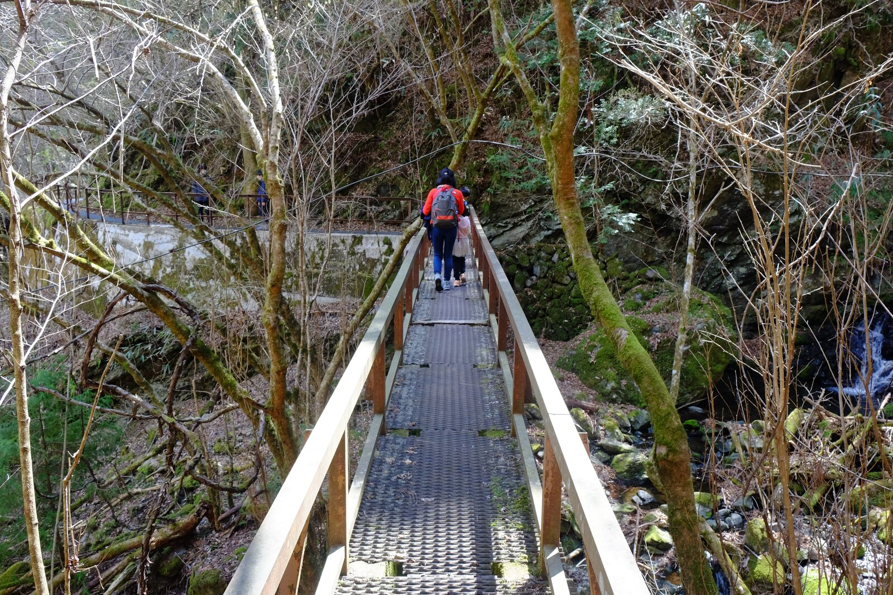
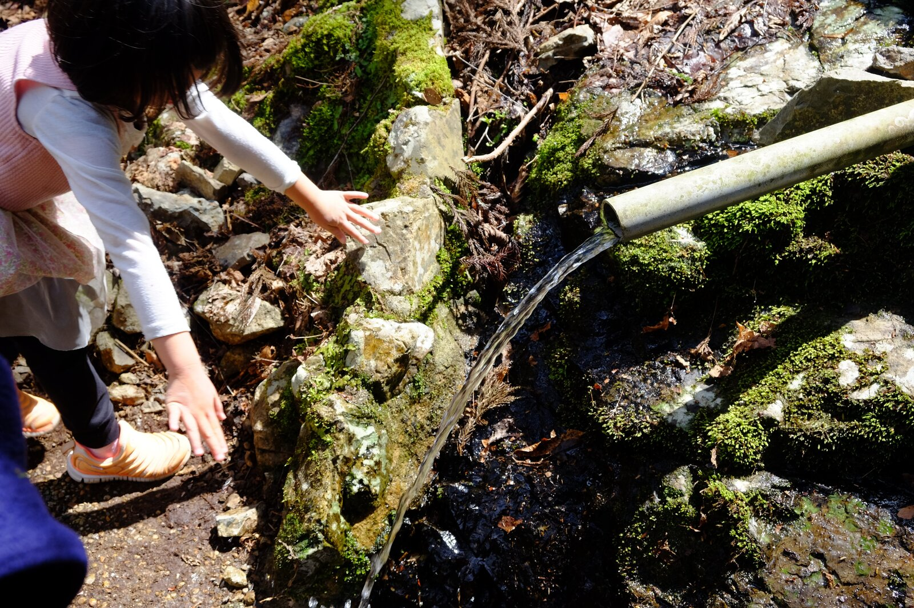
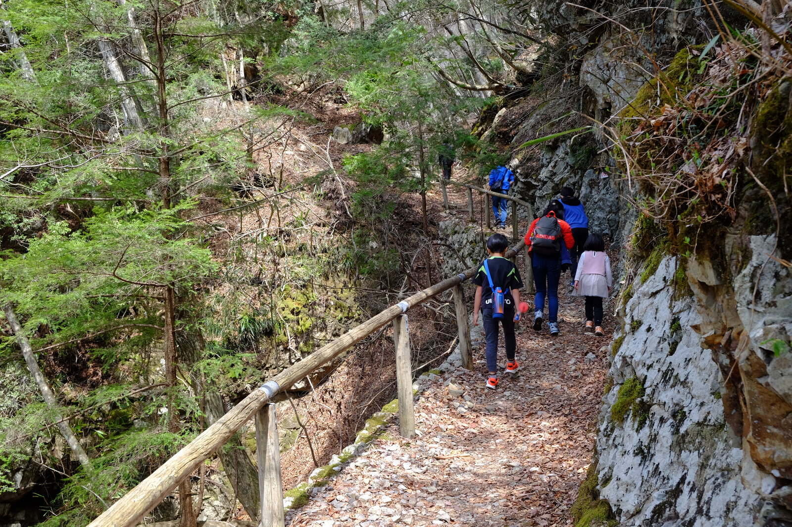

---
categories:
  - アウトドア
  - 登山
date: "2025-02-15T23:44:05+09:00"
description: 奈良県天川村の驚くほどきれいな清流を見ながらウォーキングができるみたらい渓谷遊歩道をレポートします。
draft: false
images:
  - images/23.jpg
summary: 今年もだんだん暖かくなり、アウトドアの季節がやってきました。奈良県天川村の驚くほどきれいな清流を見ながらウォーキングができるみたらい渓谷遊歩道を歩いてみました。
tags:
  - ハイキング
  - 奈良
  - 川
  - みたらい渓谷
title: 【家族でお出かけ】みたらい渓谷ハイキング
---

今年もだんだん暖かくなり、アウトドアの季節がやってきました。奈良県天川村の驚くほどきれいな清流を見ながらウォーキングができるみたらい渓谷遊歩道を歩いてみました。

## アクセス

大阪方面から、京奈和自動車道御所南ICより国道309号を南へ約50分。今回のゴールである洞川温泉には大きな駐車場があるのですが、みたらい渓谷入口付近にはあまり駐車場の情報がありません。YAMAPアプリに載っていた天川村役場の駐車場に車を停めました。

## コース

天川村役場から洞川温泉まで、みたらい遊歩道の端から端まで歩く約7.5kmのコースです。休憩、お昼ご飯入れて2:50でした。途中のみたらい休憩所で川に降りられます。

{{< mbox json="track.json" center="{ \"lng\": 135.867664, \"lat\": 34.250821 }" zoom="14" style="gsi" >}}

## 天川村役場からみたらい遊歩道入口まで車道歩き

事前に調べた限りでは、このあたりには駐車場の情報があまり無く、天川村役場も空いているのか不安でしたが、まだまだオフシーズンということもあり普通に停められました。途中の天川村総合案内所も数台しか駐車スペースはありませんが、空いていました。GWや夏場、紅葉の季節などは朝早くから満車になってしまうようなのでこの時期でよかったです。

駐車場からしばらく車道歩きです。

しばらく歩くと左手にキャンプ場があり、大きな木が花を咲かせていました。

桜かと思い近づいてみると、桃の花ですね。桜の巨木といったくらいこんなに大きな桃の木を見たのは初めてです。

キャンプ場を過ぎてすぐ、橋の手前右側にみたらい遊歩道入口があります。

木の門をくぐりみたらい遊歩道に入ります。

## 清流を見ながらウォーキング

谷の斜面途中に細い道が作られています。川は左手、かなり下にあります。

 

途中で橋があったりしながら道が続きます。

杉林の中に入りました。

木があるため見通しは良くないですが、間から天ノ川の透き通った清流を見ることができます。だいぶ高いところから見ていますが、川底が見えるほどの透明度です。

夏場だと葉が多く川がよく見えなくなりそうですね。

河原には大きな岩がゴロゴロしており、ボルダリングをしている人もいました。

小さな橋がありました。この橋は渡らず、手前の階段を登ります。

 

ところどころに冷たい水が斜面を伝って川に流れています。

少し歩いたら、

山上川、白倉川、川迫川が合流し天ノ川になるところまで来ました。川迫川にかかる赤い橋を渡ります。

赤い橋を渡ると車道に出てこんどは白倉川を渡るとみたらい休憩所の建物が見えます。

みたらい休憩所に着きました。

## みたらい休憩所で川に降りて休憩

みたらい休憩所から階段で川まで降りることができます。

びっくりするほど透明度の高い水です。夏は川遊びもできそうですが、それほど広くはありません。

このコースの中で、川まで降りられるのは唯一ここだけです。

 

## 橋を渡り滝を見る

みたらい休憩所から先は、階段を登り、山上川沿いを登る道に入ります。

階段を登るとコンクリートの吊橋を渡ります。この構造で強度大丈夫なの！？と思ってしまうような形をしています。

コンクリートの道路のような橋ですが、結構揺れを感じます。コンクリートってこんなにしなるものなの、と思いながら渡りました。

どんどん階段を登る感じで、途中に滝があったりします。

階段が続き結構ハードでした。

まだまだ歩きます。

 

杉林を抜け吊橋を渡ると観音峯登山口休憩所です。

## 観音峯登山口休憩所でお昼ご飯

左の休憩所にはベンチがあり、この中でお昼ご飯を食べました。

写真では解りにくいですが、川には大きなマスらしき魚がたくさん泳いでいました。

 

ここには20台くらいは車を停められそうなスペースがあります。

観音峯登山口休憩所からは一度車道に出ます。

謎の門のようなモニュメントを越えてしばらく車道歩きです。

右手にみたらい遊歩道入口があり、ここからまた山道に入ります。

## 杉林を抜けて洞川温泉センターへ

ここから洞川温泉まではひたすら杉林を歩いていく感じで、あまり見どころがありません。

手のひらサイズの大きなカエルがいてびっくり！踏みそうになってしまいました。写真を撮るとノソノソ逃げていきました。ニホンヒキガエルでしょうか。

杉林を歩いていると、だんだん川との高度が近くなってきました。

杉林を抜け、

鉄の足場の上を歩いて岩場を通り過ぎます。

 

その後はまた杉林に入ります。

いきなり杉林が終わり、広場のような場所が現れました。臨時駐車場でしょうか。広場と川の間に続く細い道を進みます。

この細い道を最後まで進むとゴールです。

みたらい遊歩道の終点に着きました！

洞川温泉の眼の前がゴールです。広い駐車場があり、混雑する季節はこちら側に車を停めるのがよさそうですね。

## 帰りは？

さて、帰はバスで近くまで戻ることができるのですが、一日数本しか無く、時間が合わなかったため家族を置いてダッシュで車道を走り戻りました。車道だと観音峯登山口休憩所から近道ができるため、運動不足のおじさんが走って歩いて約30分で戻ることができます。これが一番疲れました。

バスを利用する際は、スタート時間を考えたほうが良いでしょう。

## まとめ

みたらい遊歩道は、透き通る天ノ川の清流を見ながら子供でも歩いていける気持ちの良いハイキングコースでした。4月上旬であれば日曜日でも駐車場に困ることは無さそうですが、ハイシーズンは駐車場に入るのに苦労するかもしれません。また、コースは長くバスの本数が少ないため、帰りのことも計画して行くことをおすすめします。
