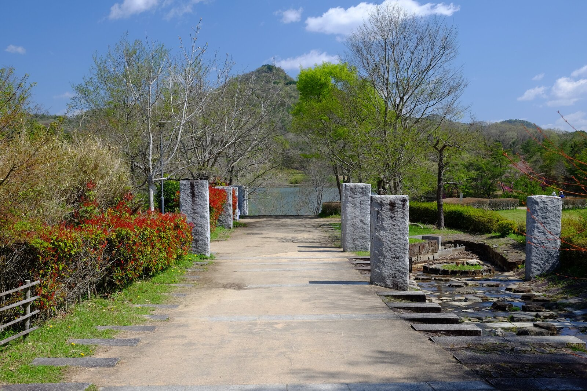
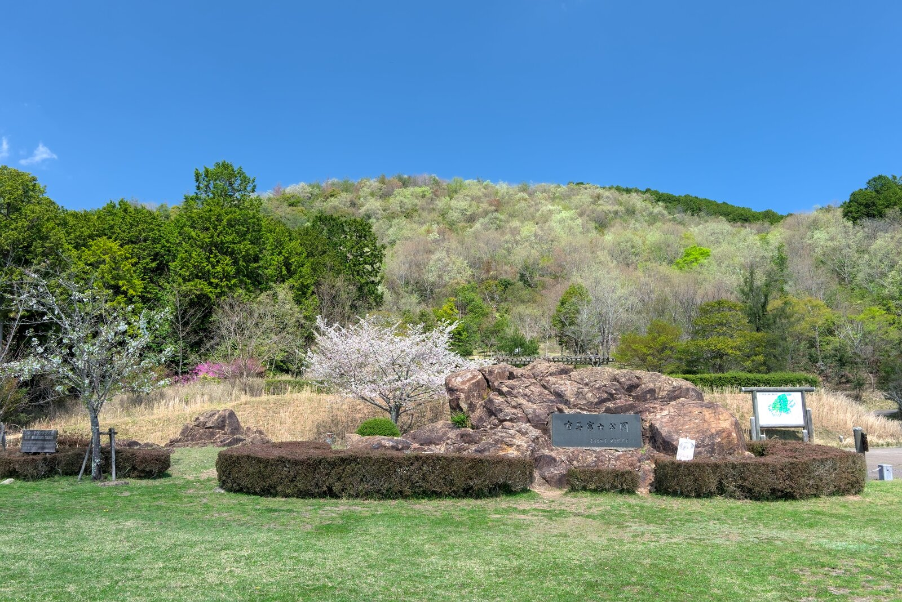
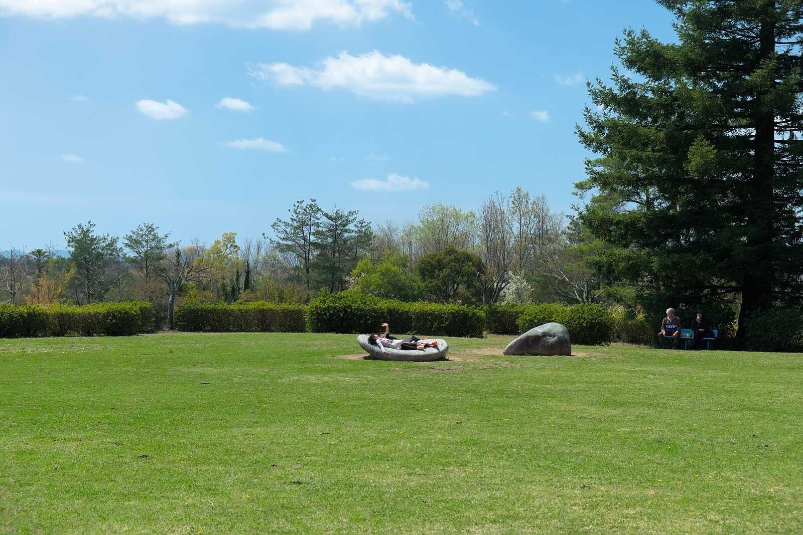
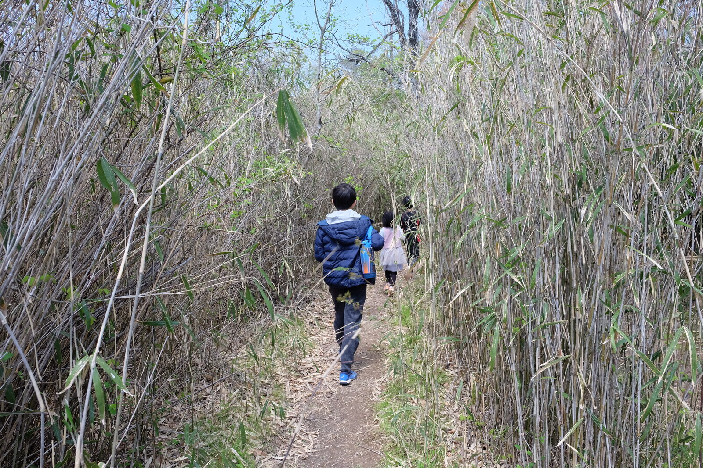

---
categories:
  - アウトドア
  - 登山
date: "2025-02-15T23:44:05+09:00"
description: 兵庫県の六甲山よりやや北、三田市に有馬富士という低山ながら美しい三角形の山があります。一帯は有馬富士公園としてウォーキングコースや自然学習センター、遊具などが整備されています。子供でも気軽に登れる登山コースをご紹介します。
draft: false
images:
  - images/0014.jpg
summary: 兵庫県の六甲山よりやや北、三田市に有馬富士という低山ながら美しい三角形の山があります。一帯は有馬富士公園としてウォーキングコースや自然学習センター、遊具などが整備されています。有馬富士は子供でも気軽に登れ展望も良い山です。
tags:
  - 兵庫
  - 有馬富士
  - 公園
title: 【家族で登山】兵庫県 有馬富士
---

兵庫県の六甲山よりやや北、三田市に有馬富士という低山ながら美しい三角形の山があります。一帯は有馬富士公園としてウォーキングコースや自然学習センター、遊具などが整備されています。有馬富士は子供でも気軽に登れ展望も良い山です。

## アクセス

大阪方面より、中国自動車道神戸三田ICより、県道570号を北東に約15分。駐車場は第1、第2、第3駐車場合わせて約500台＋臨時駐車場ととても広いですが、午後に帰る際には満車で待ちができていました。駐車場は無料です。一帯が有馬富士公園として登山や散策、自然学習センターなどがあり、そしてあそびの王国という大きな遊具のある公園もあるため人気のようです。

## コース

駐車場からすぐ近くにある有馬富士自然学習センター（キッピー山のラボ）に少し寄り道した後、福島大池西側の道を進み有馬富士頂上へ到着します。下りは福島大池の東側を回りあそびの王国まで行きます。あそびの王国から駐車場へはすぐです。

{{< mbox json="track.json" center="{ \"lng\": 135.22670452164184, \"lat\": 34.9195 }" zoom="13" style="gsi" >}}

## 有馬富士公園入口からスタート

有馬富士公園の駐車場に車を停め、スタートです。駐車場は広いですが、日曜日の午前10時でこの通りそれなりに車が入っています。

有馬富士公園の入口です。

入口にあるパークセンター付近は桃の花や桜の花が咲いてきれいでした。

パークセンターから左へ、北方面の道で有馬富士へ向かいます。

## 有馬富士自然学習センターに寄ってみる

少し進むと、三田市有馬富士自然科学センターという建物が現れました。

昆虫が壁にめり込んだようなオブジェがあり、気になって入ってみることに。

中は様々な展示やちょっとした遊びができるようなものがいろいろあります。朝早いためか、スタッフさん以外ほとんど人がいません。目に付いたのが大きな鯉のぼり！

クワガタの模型があります。壁の外にあった昆虫のおしりはこのクワガタだったのですね。横に踏み台があり、登ることもできます。

川魚の水槽などもありました。

他にも動物の毛皮や足跡スタンプなどちょっとした面白いものがあり、一通り遊んだ後、建物を出て有馬富士に向かいます。

## 三角形の有馬富士を見ながら池の傍を歩く

歩き始めからきれいな三角形をした有馬富士がよく見えます。標高374mと低山ですが目立つ姿をしています。

一度池に向かって坂を降りていく形で進んでいきます。

降りる途中で有馬富士と福島大池を見渡せる展望台がありました。とても絵になる素晴らしい景色ですね。

福島大池に近づいてきました。

福島大池まで来たら、池を一周する道があります。有馬富士を見ながら池の西側を歩いていきます。

池の中に小さな神社がありました。名前は分かりませんでしたが有馬富士をバックにいい感じの風景です。

カメやカモなどを見ながらさらに池の脇を歩いていきます。

池を過ぎると少しずつ山登りの雰囲気になってきます。

坂道になりました。

途中にはコバノミツバツツジという花が満開です。

砂利道になり、登りも結構急になってきます。

山の北側まで回ってくると、広場の手前で右に曲がる山頂への分岐があります。

## 登山の始まり、最後は急斜面の岩場

ここから最後の登りがキツい。ひたすら階段を直登していきます。

山頂直下の最後は岩場になり、両手も使いながら登っていきます。最後の急斜面は普通に登山道といった感じで大変です。

そうは言っても分岐から10分程度でしょうか。無事山頂に着きました。

## 山頂からの景色は最高

有馬富士山頂です！374mとはいえ、なかなか登りごたえのある楽しい山登りでした。アゲハチョウが飛んでいて、虫取り網を持った方がちらほら来ています。

山頂は広くありませんが、南側に見渡しの効く開けた場所があります。

右にあるのがさきほど進んできた福島大池です。なかなかの絶景です。

## コバノミツバツツジの花を見ながら下る

北側から登ってきましたが、下りは南側の道に進みます。こちらも山頂直下は岩場なので転ばないよう慎重に下ります。

岩場が終わり杉林を抜けてきます。

平地にまで降りてきました。コバノミツバツツジがたくさん咲いており、奇麗です。

芝生広場まで来ました。登ってきた有馬富士を見上げます。近すぎるのかここからだと形がだいぶ異なりますね。

芝生広場はとても広く、気持ちの良い場所でしたがよく見ると鹿のフンだらけです。だからか、遊んでいる人などは誰もいませんでした。ここにも駐車場があるので、有馬富士に登るだけならここから往復が最短ルートです。

## 最後はあそびの王国で子供を遊ばせ帰宅

芝生広場からは公園内の舗装された道を歩いて戻るだけです。

途中にターザンの遊具があったりします。

笹の迷路なんかもあります。

そして駐車場あたりまで戻り、最後はあそびの王国へ着いて今回のコースは終了です。

あそびの王国には大きな遊具があり、人もたくさん来て賑わっていました。

遊具のお山の上からも有馬富士が奇麗です。

一通り遊んで帰宅しました。

## まとめ

有馬富士は形が美しく、公園内から見ても良し、登っても展望良しで低山ながらいい運動になりました。子供の喜ぶ遊具もあるので家族で行くのにおすすめです。帰りは近くのめんたいパークやアウトレットに寄ってもよいですね。
