---
categories:
- アウトドア
- 登山
date: "2025-02-15T23:42:58+09:00"
draft: false
images: 
- images/IMG_20201115_115412.jpg
summary: 先週の金剛山に続き、今週も家族で登山に行きました。大阪府と奈良県を隔てる生駒山です。登山といっても山頂は遊園地になっていて車で簡単に行くことができます。
tags:
- 家族で登山
- 生駒山
- 大阪
title: 家族で登山 － 生駒山と生駒山上遊園地
---

先週の金剛山に続き、今週も家族で登山に行きました。大阪府と奈良県を隔てる生駒山です。登山といっても山頂は遊園地になっていて車で行くことができます。

## 登山コース

{{< mbox json="track.json" center="{ \"lng\": \"135.67916042094635\", \"lat\": \"34.68036546123567\" }" zoom="15" style="gsi" >}}

大阪からは府道8号を東へ進み、信貴生駒スカイラインを経て生駒山上遊園地へ行きます。

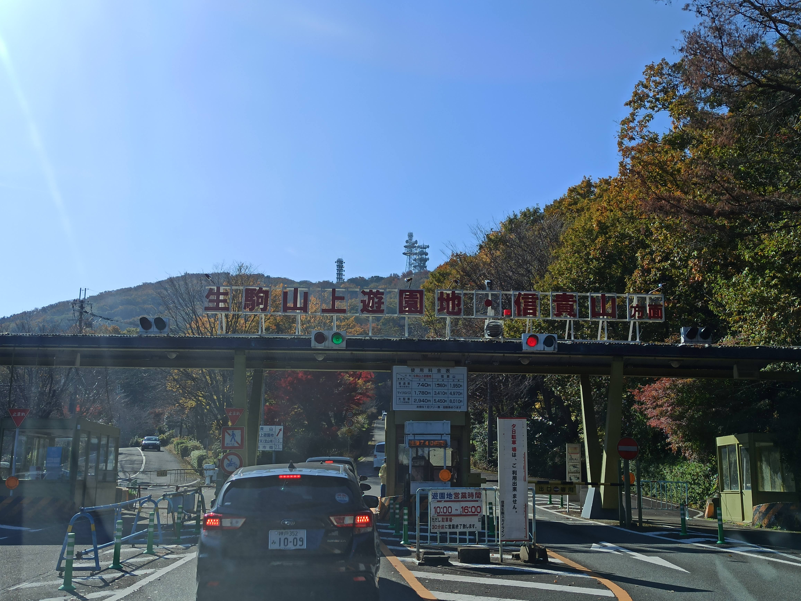

生駒山上遊園地駐車場から登ります。山頂は生駒山上遊園地内にあり、ここから山頂まで10分程度ですが、コロナで事前予約しないと入園できないため入園が一番の難関でしょう。スマホの予約画面を見せて手を消毒、体温を測って入場です。

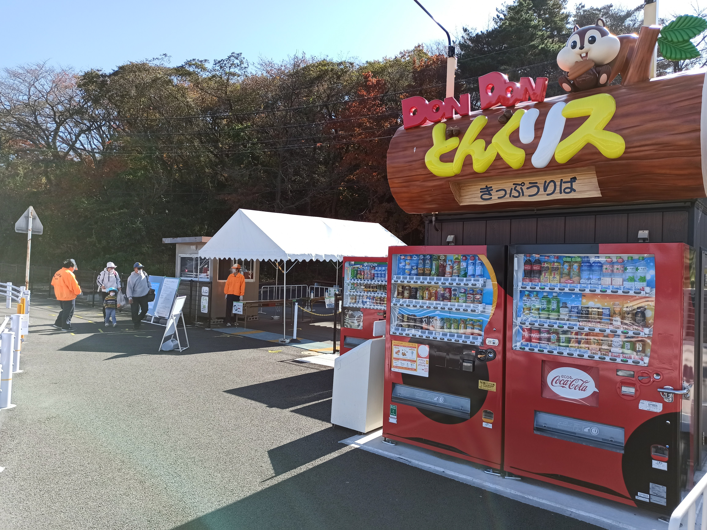

入り口すぐにリスさんのケーブルカーがいます。往復500円。

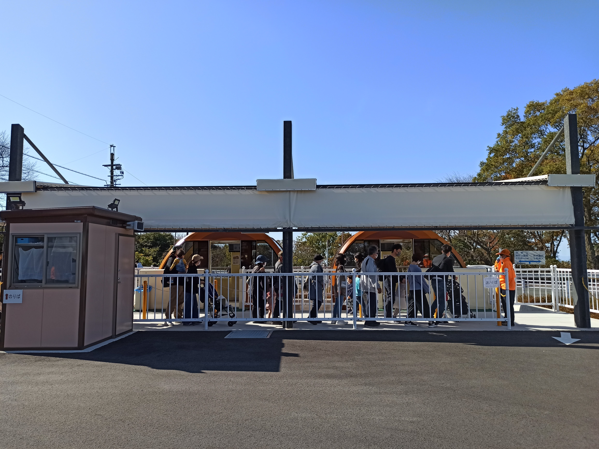

これに乗ってしまうと登りがほぼ無くなってしまうので隣の階段から歩いて上がります。

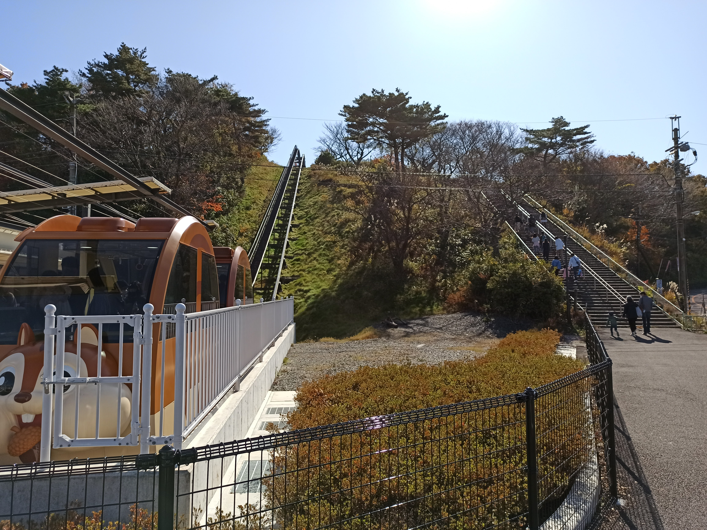

ここが一番の難所。ケーブルカー代をケチった人たちと共にゼェゼェ言いながら階段を登ります。

登り終えるとそこは遊園地。展望台がありました。

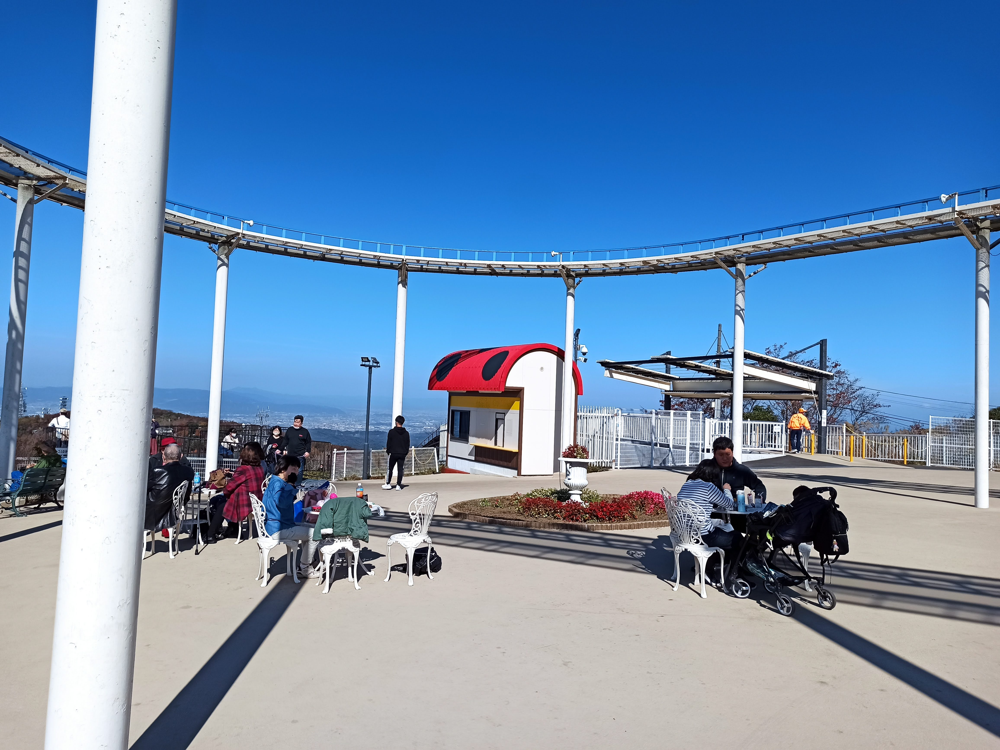

展望台からは西から大阪湾、大阪中心部のビル群、奥に六甲山、北に北摂～京都、東は奈良の平野が少し見え、見晴らしは抜群です。

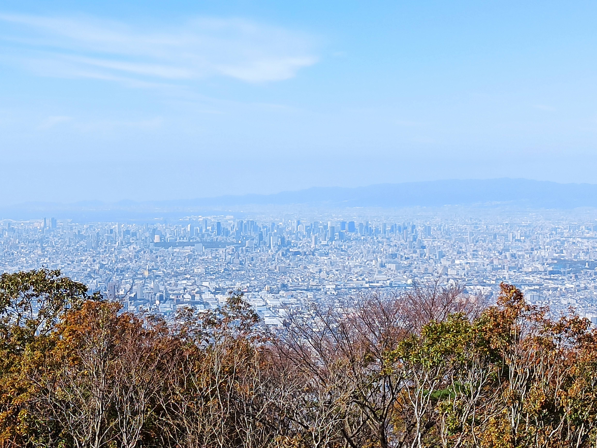

遊園地のチケット売り場です。チケットを買う必要はありません。

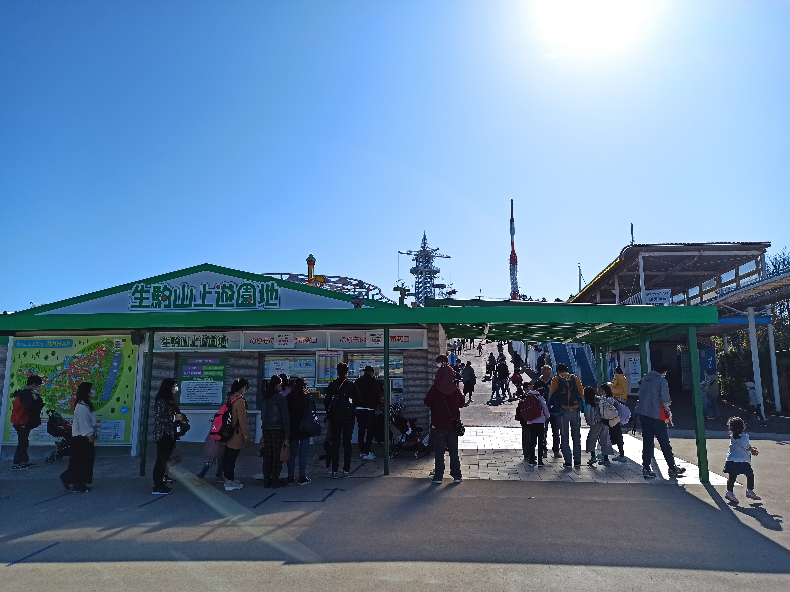

遊園地の乗り物を見ながら前に進みます。

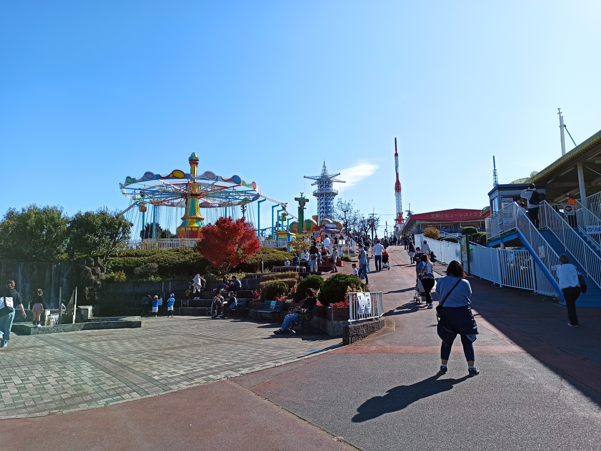

このあたりが山頂なんだけど、、、特に看板とかは見つからずうろうろします。

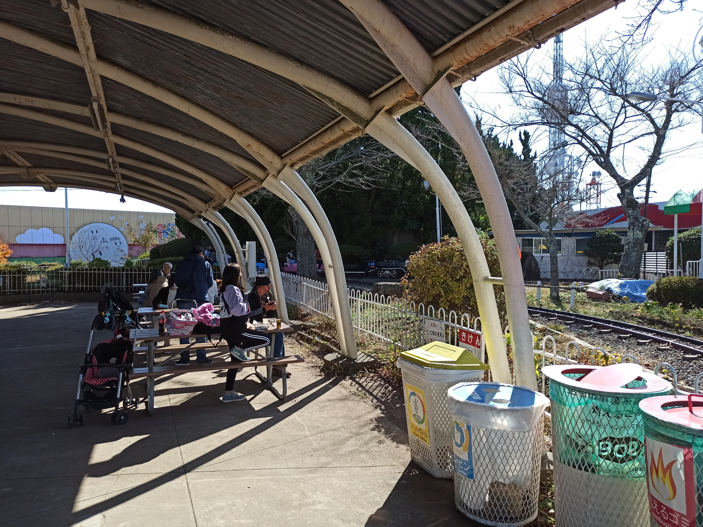

山頂あたりにはSLの乗り物があります。

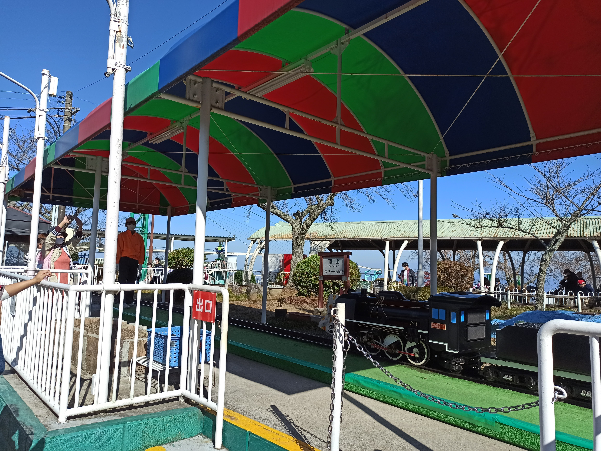

よく見ると、、、頂上駅！ということは！？

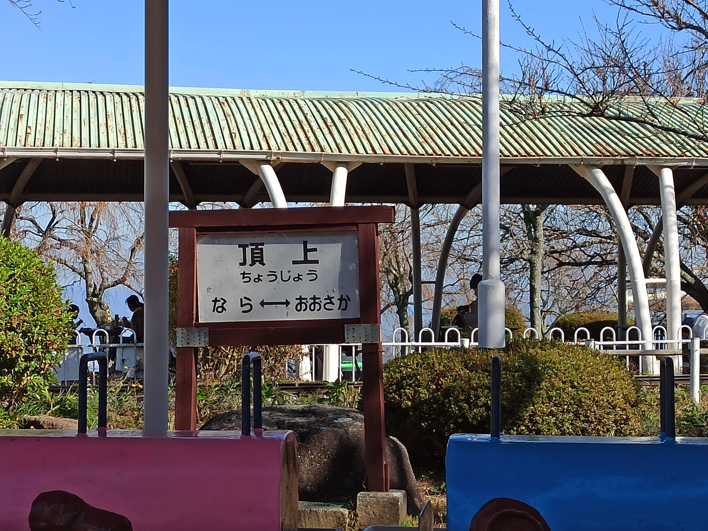

SL敷地内かな？？

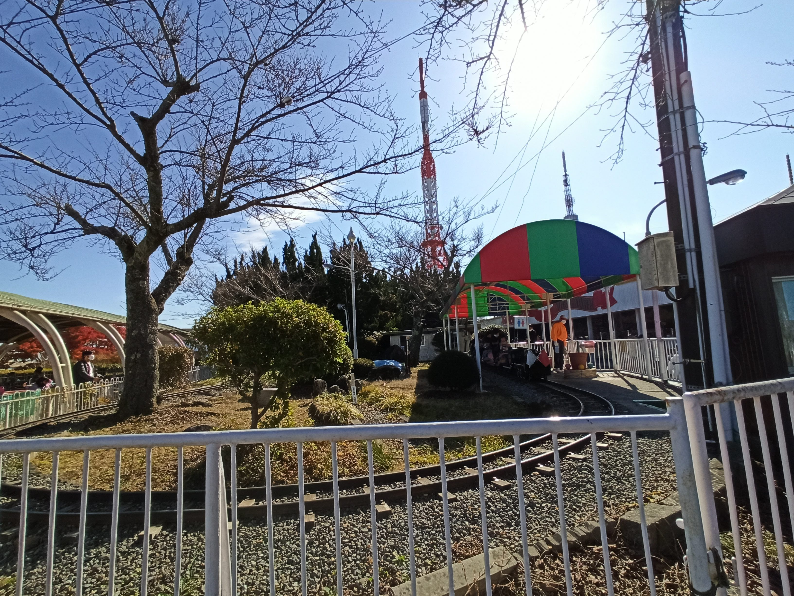

ありました、一等三角点！小さな看板が立て掛けてあるだけです。ここを踏むにはSLに乗って看板の前で飛び降りて、、、なんてことはいい大人ができません。この写真で登頂とします。

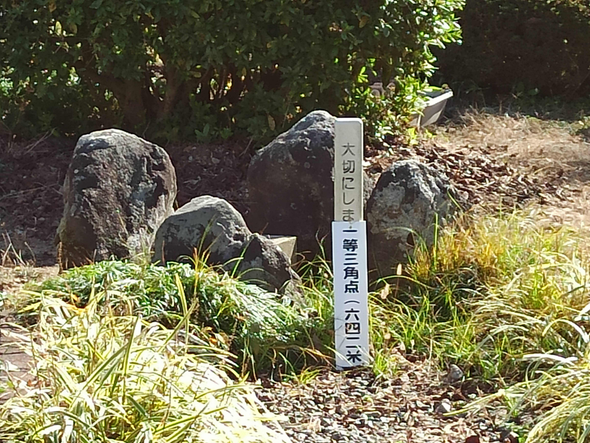

ちなみにみなさん遊園地のお客さんばかりでこの看板を目指して来る人はいなそうでした。

## 生駒山上遊園地

さすがにこのまま帰ることはせず、生駒山上遊園地で子供を遊ばせました。子供の頃はよく遊園地に行った思い出がありますが、どんどん減ってしまいました。小さくて古き良き遊園地を久しぶりに堪能しました。

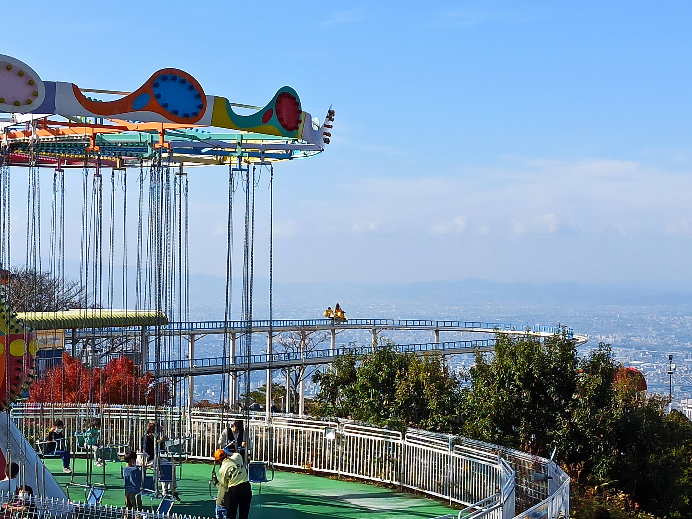

## まとめ

生駒山への登山ルートはいろいろありますが、簡単に山頂へ行くには生駒山上遊園地の駐車場から10分程度で行けてしまいます。生駒山上遊園地で遊ぶのがメインになりますね。小さな子どもには喜ばれます。

先にも書きましたが、現在コロナ対応で事前予約しないと入れないのと、山頂はSL敷地内で一等三角点は踏めないのが注意です。
