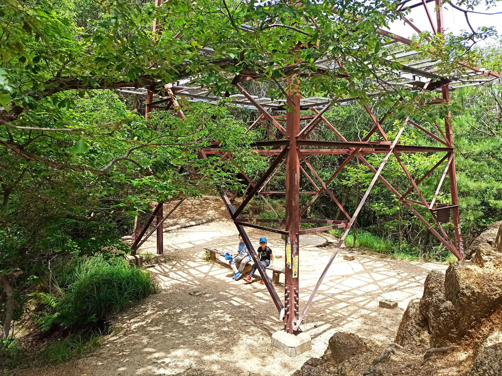
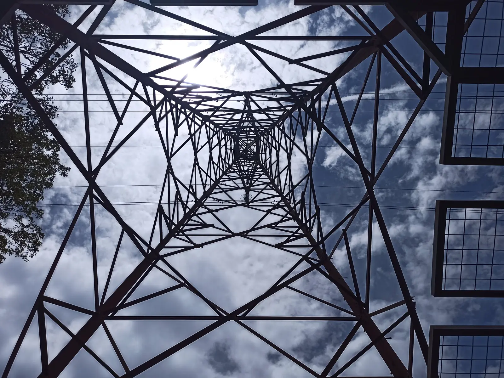
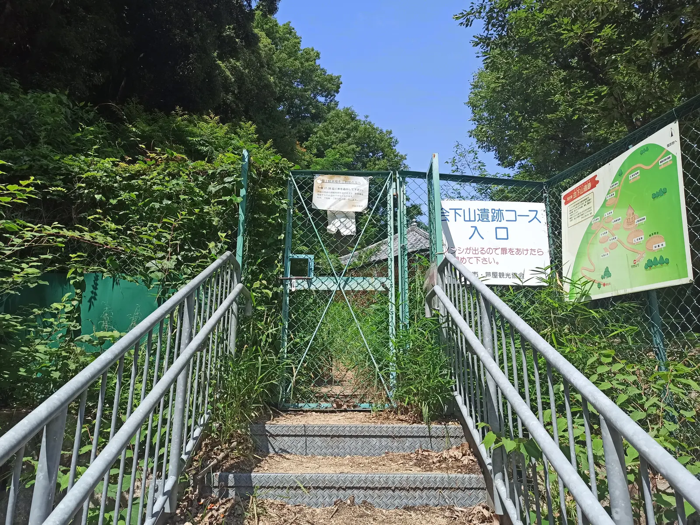
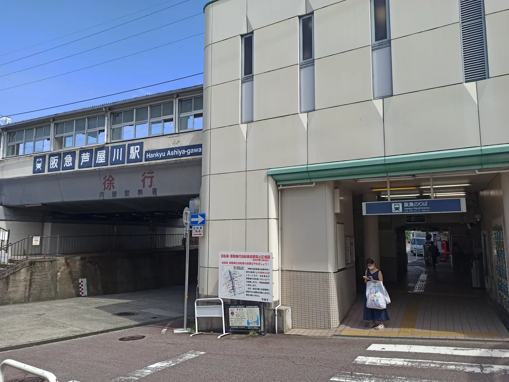

---
categories:
  - アウトドア
  - 登山
date: "2025-02-15T23:43:16+09:00"
description: 関西で一番有名な山と言ってもいい六甲山はたくさんのルートがあります。低山ながらロッククライミング気分が味わえる面白いコース、ロックガーデンの登山ルートをご紹介します。
draft: false
images:
  - images/IMG_20210606_125713.webp
summary: 梅雨の中、良い天気の休日に六甲山のロックガーデンへ登山しに行きました。花崗岩の岩肌が見応えあり、ロッククライミング気分で楽しく登っていく登山コースです。
tags:
  - 家族で登山
  - 六甲山
  - 兵庫
title: 家族で登山 六甲山 ロックガーデン
---

梅雨の中、良い天気の休日に六甲山のロックガーデンへ登山しに行きました。花崗岩の岩肌が見応えあり、ロッククライミング気分で楽しく登っていく登山コースです。

## コース

阪急神戸線芦屋川駅から芦屋の高級住宅街を北へ歩きロックガーデン入り口へ。高座の滝を越えたあとからロックガーデンの岩登りをして風吹岩が目的地。カエル岩を経て会下山遺跡へ下り芦屋川駅まで戻るコースです。

{{< mbox json="track.json" center="{ \"lng\": 135.28924749515156, \"lat\": 34.742603916969706 }" zoom="13" style="gsi" >}}

芦屋川駅付近に小さなコインパーキングがいくつかありますが満車のところも多いので注意です。

## 芦屋川駅近くに車を停め高級住宅街を歩く

朝11時前と少し遅い時間に着いたため、満車のコインパーキングもあり駐車場を少し探して線路沿いの三井のリパークに車を停めてスタートです。

まずは駅前のコンビニでおにぎりを買って線路をくぐり北へ向かいます。

看板が出ているので迷いません。

高い塀に囲まれた大きな豪邸を見ながら坂を登っていきます。

## ロックガーデンスタート！

住宅街が終わり少しあるくとロックガーデン入り口です。

レトロな感じの大谷茶屋。

このあとすぐに高座滝があります。水がきれいで足を浸かっている人がたくさんいました。

滝を超えるとすぐに岩が次々と現れます。

どんどん登っていきます。3歳の娘も頑張って登ります。みんな楽しそうに登っていますが結構しんどくなかなか進みません。

下からも次々と人が登ってきます。六甲山はアクセスが良いので人が多いですね。

ところどころに休憩できる平なスペースがあります。

まだまだ続きます！

赤く錆びた鉄塔に着いて一呼吸。

このあたりから少し傾斜は緩やかになってきます。

花崗岩は侵食されやすいのでこんなかんじになだらかになっている岩もあり面白いです。

途中でお腹が空いてお昼休憩です。コンビニおにぎりとアメリカンドッグで腹ごしらえ。

もうひとつ鉄塔を越えると、、、

展望の良い開けた場所に出ました。風吹岩はすぐそこです。

## 風吹岩

ついに今回の目的地、風吹岩に着きました。

とりあえず、登ります。

風吹岩の上はたくさんの人が次々とやってきます。山々の小ピークの一つといった感じなのでそれほど展望が素晴らしいわけでもありませんが、岩登りをした後の達成感を感じられる場所でした。

このまま六甲山頂まで行き有馬温泉に下るルートも有名ですが、子供もいるのでここまで。風吹岩を後にし下ります。

## カエル岩へ

岩が丸くなってその上に砂があり、滑ります。滑り台のように滑りながら下ります。

少し下ると岩場は少なくなり、普通の低山の山道といった感じです。下の方は笹が生い茂ってきています。真夏は暑そうですね。

途中にカエル岩というのがありました。うーん、カエルに見えないこともないけど。。。

## 会下山遺跡

笹の道をさらに下ると広場に出ました。ここは会下山遺跡という弥生時代中期から後期の高地性集落遺跡があります。

少し下ると高床式倉庫があったりしますが、そちらは行き止まりなので注意です。

一度上に戻り正規のルートを下ります。

金網の扉を開いて山から住宅街へ出ます。ここで登山道は終わりです。

久しぶりの運動でみんなヘトヘトです。よくがんばりました。

## 住宅街を下り芦屋川駅へ

あとは住宅街を下り駅へ戻ります。「自動販売機でジュース買いたいー」と子供達。しかし高級住宅街には自動販売機などありません。

駅まで着きました。ローソンでジュースを買って飲んだら今日の登山は終了です。

## まとめ

駅から近く、住宅街からすぐそこで低山なのにびっくりするほどの岩場が続きロッククライミング気分を体験できるなんて面白い山はそうはありません。六甲山は車で簡単に頂上まで行けるし登山対象として魅力は感じていませんでしたが、なかなか素晴らしい山だと再認識し人気があるのも納得しました。

小学生くらいであれば問題なく登れ、アスレチック気分で楽しめるおすすめのコースです。
