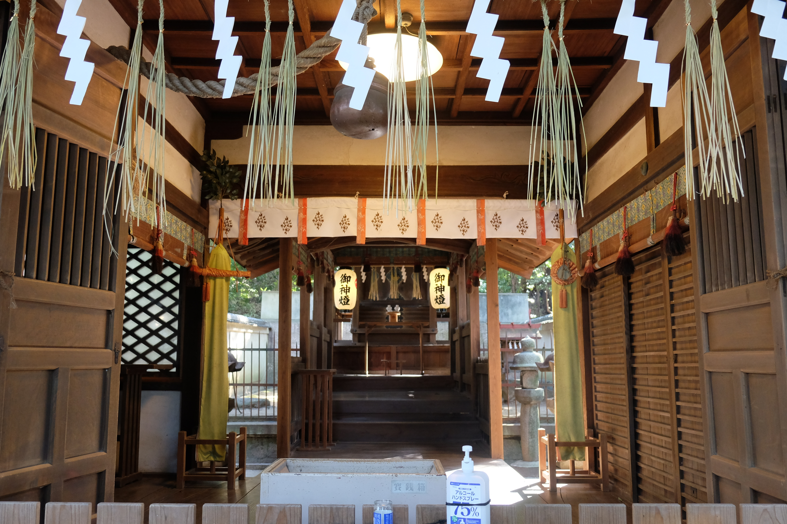

---
categories:
  - アウトドア
  - 登山
date: "2025-02-15T23:44:00+09:00"
description: 大阪の水仙の名所である柏原水仙郷は生駒山地の南端、高尾山への途中にあります。水仙を見ながら山登りコースをご紹介します。
draft: false
images:
  - images/0032.jpg
summary: 大阪の水仙の名所である柏原水仙郷は生駒山地の南端、高尾山への途中にあります。水仙を見ながら山登りをしました。
tags:
  - 家族で登山
  - 高尾山
  - 大阪
  - 花
title: 【家族で登山】 柏原水仙郷と高尾山
---

大阪の水仙の名所である柏原水仙郷は生駒山地の南端、高尾山への途中にあります。水仙を見ながら山登りをしました。

## コース

{{< mbox json="track.json" center="{ \"lng\": 135.6368653, \"lat\": 34.5876 }" zoom="14" style="gsi" >}}

柏原市太平町、石神社前のコインパーキングに車を停め、太平町の古い町並みやぶどう畑を見ながら鐸比古鐸比賣神社（ぬでひこぬでひめじんじゃ）へ。神社奥から山道へ入り、水仙郷を通って高尾山頂を目指します。帰りはパノラマ展望台を通り鐸比古鐸比賣神社まで下りました。

## アクセス

電車だと近鉄大阪線堅下駅またはJR大和路線柏原駅から東へ歩き鐸比古鐸比賣神社をから山へ入ります。車だと府道20号沿いなどにいくつかあるコインパーキングを利用します。今回は少し離れた石神社近くのコインパーキングを利用しましたがもう少し近い場所もありました。

## コインパーキング目の前にあった石神社

車を停めて歩き始めると巨大な木が目に付きます。地図では石神社（いわじんじゃ）という神社があるようなので寄ってみることに。

巨大な木はクスノキみたいです。神社の入口にずどんと生えています。Wikipediaによると周囲約6ｍ・高さ約16ｍ以上で樹齢700～800年、大阪府指定天然記念物のようです。

大きさが伝わるでしょうか。

本殿は長い階段の上にあります。せっかくなので階段を登ってお参りします。

小さな神社ですがよく管理されています。

平安時代からある歴史ある神社みたいですが、ネットで調べた限りではあまり情報がありませんでした。巨大なクスノキがインパクトのある神社でした。

## 太平町の町並みとぶどう畑

ここから登山口のある鐸比古鐸比賣神社を目指して歩きます。古い町並みが保存されていて趣があります。

住宅街から山側へ進み、ぶどう畑を通り山側の車道に出ます。

ぶどう畑、太平町の奥には大阪の街がよく見渡せます。

途中にレモンやミカン畑も見られます。

ぶどう畑が一面に広がります。冬は枯れ木で寂しい景色ですね。ぶどうの季節にまた訪れたいです。

車道を来たへ進みます。

## 鐸比古鐸比賣神社から登山開始

鐸比古鐸比賣神社に着きました。ここまで結構長い道のりでした。この神社にも巨木がありますね。「ぬでひこぬでひめじんじゃ」と読みますが、調べないと絶対読めませんね。

立派な神社です。

神社前の道を少し登ると登山口です。杖が置いてあるので借りて登ることにします。

ここからは山道です。

ほどなく分岐があり、水仙郷方面へ向かう道を選びます。分岐にベンチがあったので少し休憩です。

ベンチの前にも水仙が少し咲いていました。

## 夫婦岩

このあと、水仙郷まではしばらく登りが続きますが、途中で夫婦岩へ行く分岐があります。往復10分くらいですがせっかくなので見に行きました。2つの岩が重なったような岩です。

## 柏原水仙郷

思っていたより本格的な山道で距離も結構ありましたが、やっと柏原水仙郷に到着しました。こんな山奥に広範囲にある水仙の群生は珍しいですが先日の雪で多くがなぎ倒されてしまったようで満開の花は見られず少し残念です。

それでも水仙の中を歩く登山道は綺麗です。

## 滑る坂道をロープを使い高尾山頂へ到着

水仙郷からさらに登ると車道と出会います。ここに鳥居の先が最後の登りです。

山頂直下は急で滑りやすくロープに掴まりながら登っていきます。

山頂が見えました！

山頂はこの通り狭いです。冬は木の葉が落ちて明るく開けていますが夏はほとんど展望がなさそうです。

標高は277.6mと低い山で比較的簡単に登ることができますが、山道や山頂からの眺めは登山を満喫できるものでした。

木の間から眼下に大和川を挟んだ街並みが眺望できます。

## パノラマ展望台から大阪の街を見て下る

帰りは水仙郷を通らず、パノラマ展望台があるコースを辿ってみます。

南パノラマ展望台です。山頂よりここの方が木が無く景色を楽しめます。

大和川の奥にこんもりとした山がいくつか見えますが、このあたりは古墳が密集しており一番大きなものはおそらく誉田御廟山古墳
(応神天皇陵)です。

水仙郷への道との分岐手前にたくさん水仙が咲いている場所がありました。こちらは満開です。

水仙郷は見頃を過ぎていて残念でしたがここで満開の水仙を見ることができ満足です。

鐸比古鐸比賣神社に出たらあとは車道を歩き駐車場へ戻り今回の山行は終了です。

## まとめ

目当ての柏原水仙郷は既に見頃を過ぎてしまいましたが、帰りのコースで満開の水仙を見ることができました。石神社やぶどう畑、鐸比古鐸比賣神社など見所もたくさんあり水仙の咲く冬こそ楽しめる山でした。

登山口の鐸比古鐸比賣神社からは往復2時間もかからないくらいなので子供と一緒に家族で登山するのにおすすめの山です。
