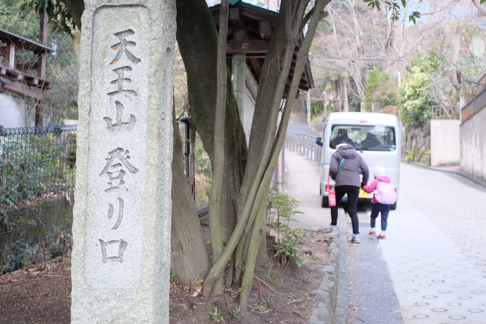
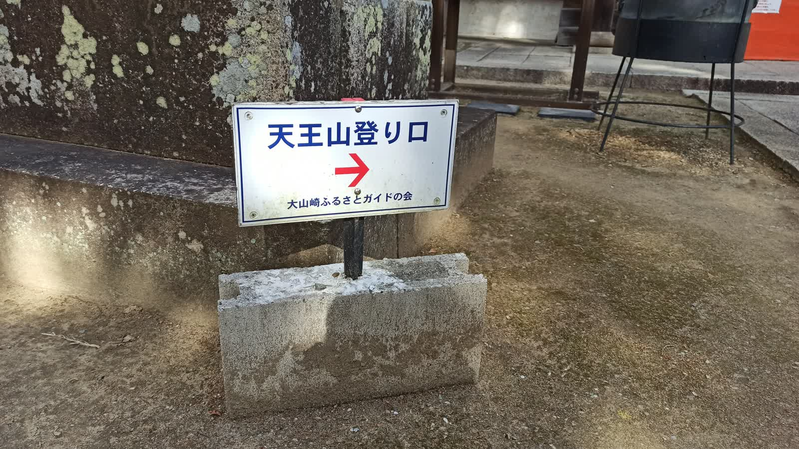
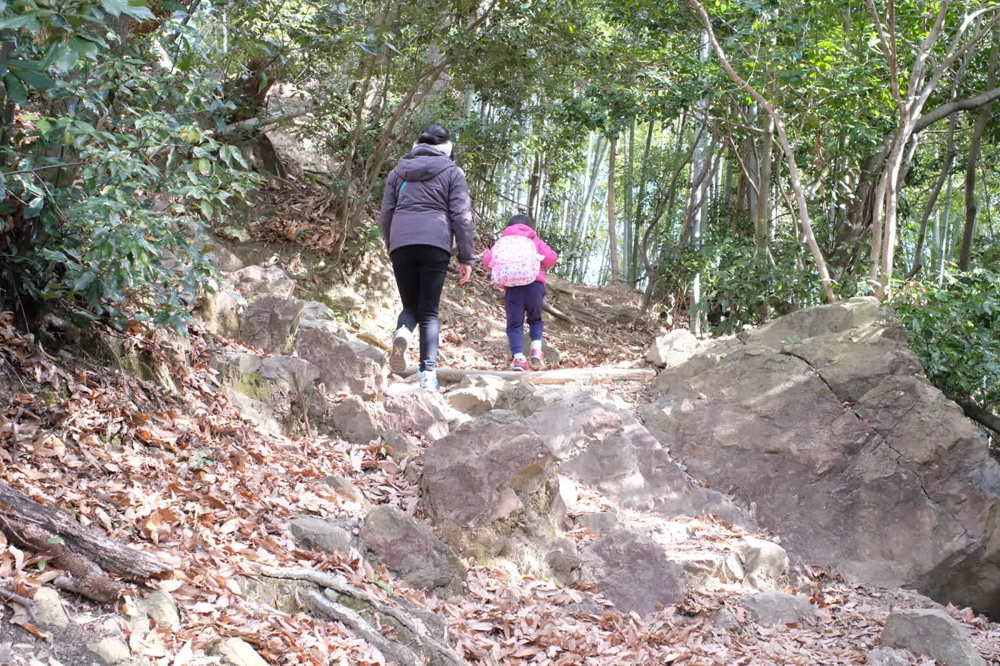
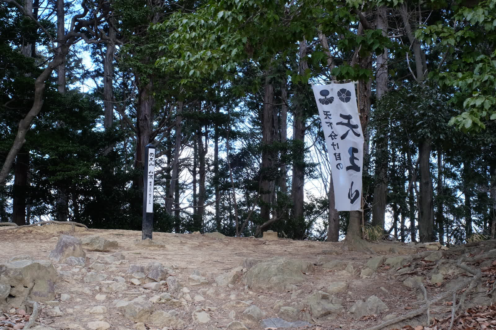

---
categories:
  - アウトドア
  - 登山
date: "2025-02-15T23:43:39+09:00"
description: 「天下分け目の天王山」として有名な京都と大阪の境、淀川近くに迫る低山、天王山の登山ルートをご紹介します。羽柴秀吉が明智光秀と戦った歴史を感じながらお散歩感覚で登れる山です。
draft: false
images:
  - images/HlI0X.jpg
summary: 「天下分け目の天王山」として有名な京都と大阪の境、淀川近くに迫る低山、天王山に登りました。羽柴秀吉が明智光秀と戦った歴史を感じながらお散歩感覚で登れる山です。
tags:
  - 家族で登山
  - 天王山
  - 京都
title: 【家族で登山】京都府 天王山
---

「天下分け目の天王山」として有名な京都と大阪の境、淀川近くに迫る低山、天王山に登りました。羽柴秀吉が明智光秀と戦った歴史を感じながらお散歩感覚で登れる山です。

## コース

JR山崎駅の線路を北側へ越え、登山口から天王山まで往復約2時間、標高差279mのコースです。

{{< mbox json="track.json" center="{ \"lng\": 135.6781981297477, \"lat\": 34.89818935227528 }" zoom="14" style="gsi" >}}

## アクセス

JR山崎駅、阪急京都線大山崎駅から登山口まですぐです。JRの踏切側に駐車場があります。

## 山崎駅前の駐車場から天王山を見る

駐車場に車を停め、線路の向こうにこんもり見える山がこれから登る天王山です。

線路4本の長い踏切を渡ります。

## 天王山登り口

踏切を渡った先の坂の入口が登山口です。

「天王山
登り口」と標識が立っているので迷うことは無いでしょう。いきなりなかなかの急坂です。

道沿いに椿の花がきれいに咲いています。

この舗装された坂道が今回の登山で一番辛かったです。

## 宝積寺

坂道を登りきったところで宝積寺 仁王門が現れます。
[WikiPedia](https://ja.wikipedia.org/wiki/%E5%AE%9D%E7%A9%8D%E5%AF%BA)
によると、かなり古くからあるお寺のようです。

> 寺伝では神亀元年（724年）、聖武天皇の勅願により行基が建立したと伝える。しばらくして本尊・大黒天神を天竺（インド）から招いて祀ったという。

大黒天と書かれた大きな提灯が目を見張ります。

登山道がよくわからなくなりましたが、仁王門をくぐり進んでみます。

立派なお寺です。

カラフルな巾着袋のようなものがたくさん掛けられていました。絵馬の代わりのようなものでしょうか。

山崎の合戦の折、秀吉がこの石に腰を下ろして采配を振るったと言われる出世石という石が置いてあります。

「天王山登り口」と書かれた小さな看板がありました。

お堂を右へ、お寺から登山道へ出ます。

## 山道スタート

ここから舗装も無くなり山道になります。

こんな看板が。50回登頂すると特製オリジナルグッズがもらえるようです。関西は六甲山や金剛山などアクセスの良い低山が多いので何回も登る人が多いのでしょうね。

小さな橋を渡ります。

山道の前半は勾配がきつく、後半にかけてだんだん緩やかになっていきます。

途中で登山道に並走してみかん畑とかで見るようなレールが走っています。畑など無さそうですが。

## 青木葉谷広場で休憩

途中に青木葉谷広場という開けた休憩所がありました。

テーブルやベンチの整備されています。ここで一旦休憩します。

南西側の眺めが開けています。眼下にはちょうど桂川が淀川と合流するところが見えます。左奥は生駒山です。

おやつを食べてさらに登ります。ここからは登りも緩やかになります。

## 合戦の絵

さらに進むと今度は鳥居が現れました。この先にある自玉手祭来酒解神社の鳥居です。

ここも開けた休憩所のようになっていて、羽柴秀吉と明智光秀の軍勢が激突した山崎の戦いを描いた絵がありました。

天下分け目の天王山と言われますが、実際には天王山の東にある沼地が戦場だったようです。

## 十七烈士の墓

さらに少し登ると分岐が。

天王山山頂近道の表示とともに「十七烈士の墓」と書いてあり何やら気になります。

幕末の尊皇攘夷運動の中で禁門の変で戦った志士たちのお墓ということでした。

## 自玉手祭来酒解神社

十七烈士の墓を過ぎるとすぐ、三社宮です。

このあたりは自玉手祭来酒解神社の敷地なのでしょうか、整備をしていると思われるおじさんから子供が天王山シールをいただきました！

眼の前は自玉手祭来酒解神社です。

元々の祭神は山崎神・酒解神で、出自は不明であるが橘氏の先祖神であると言われていて、奈良時代の建造だそうです。

お参りをして通り過ぎます。

## 天王山山頂

ここから平坦な山道を少し進みます。

眼の前のこんもりした場所の上が山頂です。

着きました、天王山山頂です！

木に囲まれた地味な場所にあります。全く写真映えしないですね。。。

山頂一帯には秀吉が山崎の戦いのあとに秀吉がここ天王山山頂一体に山崎城を築城しました。山頂一帯は開けておりかつて城があった雰囲気を感じさせますが特に遺構は残されていません。

井戸跡があるのみです。後から来た人たちが昔はこんなに開けていなかったと言っていたので、安土城跡のようにこれから整備されていくのかもしれませんね。

山頂でおにぎりを食べて帰ります。

登り口付近にはアサヒビールの大山崎山荘美術館があり、平日にもかかわらず人が来ている様子でしたが時間が無く次の機会に行ってみたいと思います。

## まとめ

天王山は往復2時間程度で標高差も280m程度と半日あれば十分登れてしまいます。昔からよく耳にする「天王山」という言葉の由来となった歴史的な山に実際に登ることができました。短いコースの途中には宝積寺、十七烈士の墓、自玉手祭来酒解神社などちょっとした見どころもたくさんあり、子連れで登山にもおすすめの山です。
