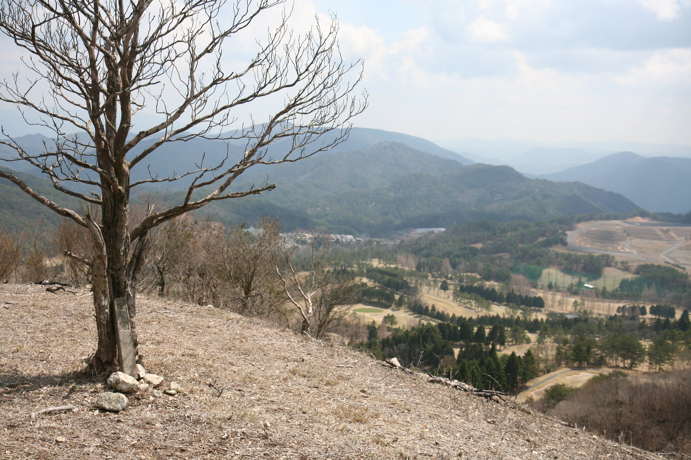
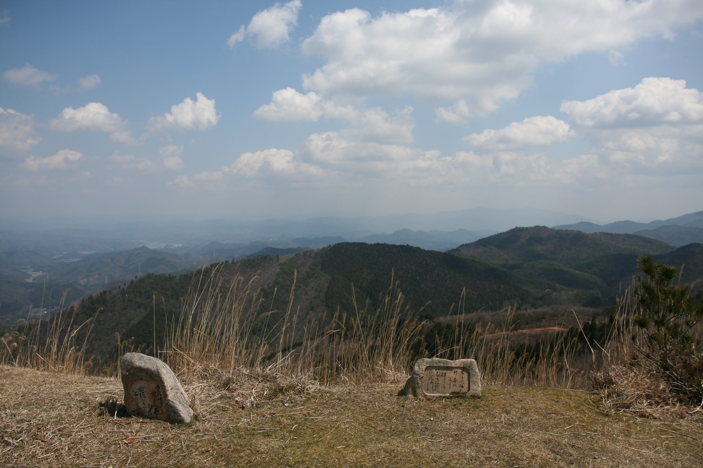

---
categories:
  - アウトドア
date: "2025-02-15T23:43:10+09:00"
description: 大阪、京都、兵庫の県境付近にある初心者向けの山、深山の登山コースを紹介します。るり渓駐車場から約3時間、距離も高低差も少ないので家族でもおすすめのコースです。
draft: false
images:
  - images/IMG_4955.JPG
summary: 春が来て暖かくなり、アウトドアの季節が始まりました。大阪近郊で春におすすめの楽々登山コース、深山をご紹介します。距離も高低差も少ないので家族でもおすすめのコースです。
tags:
  - 家族で登山
  - 京都
  - 深山
title: 家族で登山 － 京都府 深山
---

春が来て暖かくなり、今年もアウトドアの季節が始まりました。
大阪近郊で春におすすめの楽々登山コース、深山をご紹介します。
距離も高低差も少ないので家族でもおすすめのコースです。

## 登山コース

出典： 地理院地図（国土地理院）

コースタイム：往復約3時間（休憩、昼食込み）

るり渓温泉の駐車場が無料で使えます。敷地はかなり広く一帯がリゾート
地といった感じです。駐車場はとても広いので満車ということはほぼ無いの
ではないでしょうか。

ただし、登山道まで少し距離があり、車道歩きが結構あります。地図で見
ると①～②の距離にして半分近くが車道歩きですね、、、

## ①～② るり渓温泉から登山口

るり渓温泉の駐車場に車を停めてスタートです。温泉の建屋付近はそれな
りに車が停まっていましたが、登山道方面の駐車場はガラガラです。駐車場
はなんと、700台！

駐車場を左手に、車道に沿って脇の舗装された歩道をながながと歩いてい
きます。

しばらく進むと右手に登山道入り口があります。横断歩道が無い車道の向
こう側にあり、たまに車が通るので気をつけて渡りましょう。

かなりざっくりとした案内図ですね。。。

## ②～③ ゴルフ場脇の樹林帯を登る

登山道に入るとしばらく樹林帯が続きます。

ところどころに案内板があるためコースを外れる心配はなさそうです。

夏は暑そうなのでやはり春か秋が適期でしょうか。

## ③～④ 気持ちの良い尾根を歩き山頂へ

尾根に出ると一気に展望が開けます。木が少なく下にゴルフ場がよく見えます。

山頂に向かって尾根を歩いていきます。

山頂には突然大きな建物が。深山レーダ雨量観測所というものだそうです。

山頂の奥は神社になっています。

展望もこの通り抜群です。

山頂でお弁当を食べてあとは来た道を戻っておしまいです。

## 感想

大阪近郊でアクセスもよく、休憩込みでも3時間程度で往復できるため登山
初心者、家族で登山するのにおすすめの山でした。帰りはるり渓温泉で汗を
流すのもよさそうです。紅葉の季節はるり渓の観光も楽しめそうですね。
