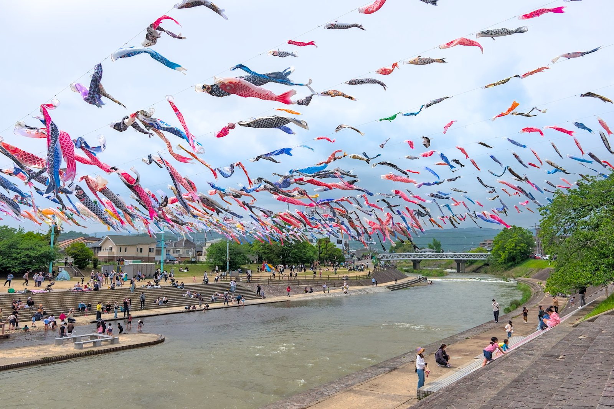
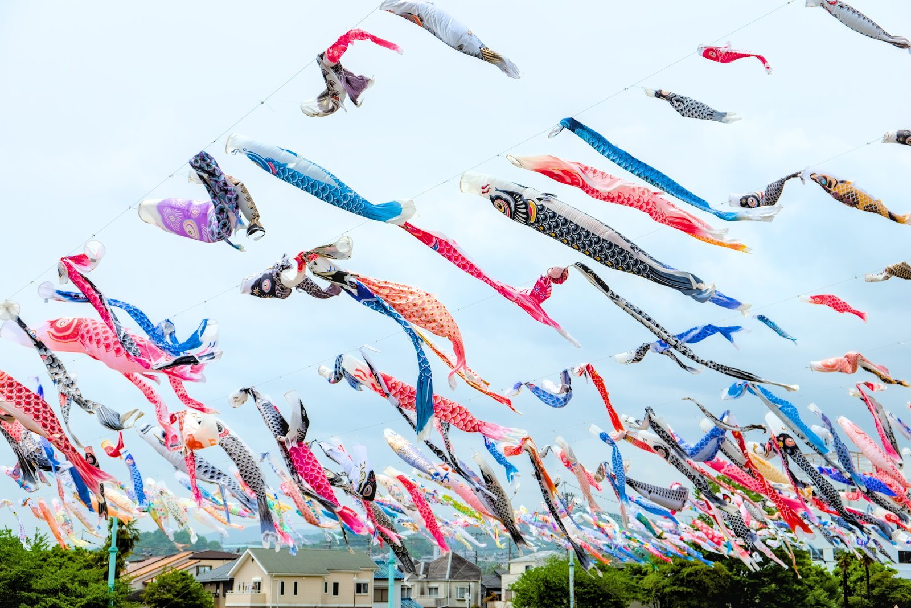
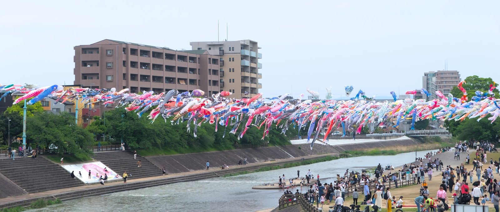
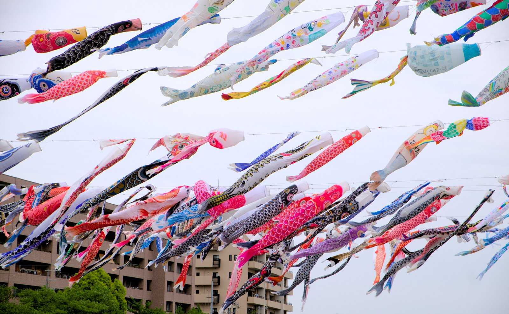
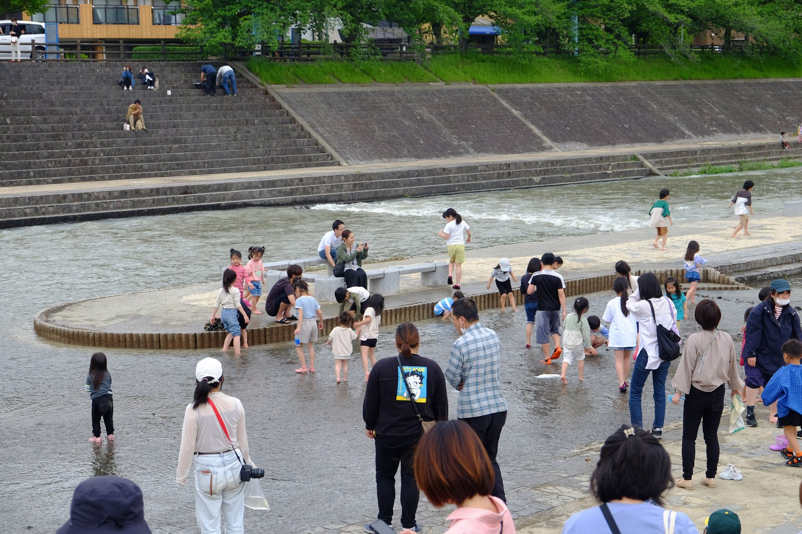
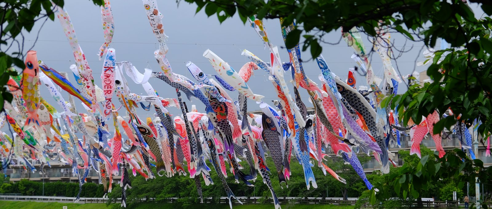

---
categories:
  - アウトドア
  - 公園
date: "2025-02-15T23:44:07+09:00"
description: 大阪府高槻市の芥川沿いにある芥川桜堤公園では、毎年4月下旬からGWまで1000本のこいのぼりが川の上空を泳ぐ「こいのぼりフェスタ1000」が開催されます。大量のこいのぼりが空を泳ぐ景色を見てきました。
draft: false
images:
  - images/0001.jpg
summary: 大阪府高槻市の芥川沿いにある芥川桜堤公園では、毎年4月下旬からGWまで1000本のこいのぼりが川の上空を泳ぐ「こいのぼりフェスタ1000」が開催されます。大量のこいのぼりが空を泳ぐ景色を見てきました。
tags:
  - 公園
  - 大阪
  - 鯉のぼり
  - 川遊びスポット
  - 芥川
title: 芥川桜堤公園のこいのぼりフェスタ1000
---

大阪府高槻市の芥川沿いにある芥川桜堤公園では、毎年4月下旬からGWまで1000本のこいのぼりが川の上空を泳ぐ「こいのぼりフェスタ1000」が開催されます。大量のこいのぼりが空を泳ぐ景色を見てきました。

## アクセス



JR高槻駅よりバスが出ています。詳しくは、
[高槻市営バスのサイト](https://www.citybus.city.takatsuki.osaka.jp/kankou/detail/akutagawasakurazutsumikoen/)
を参照ください。JR高槻駅から徒歩でも行くことができる距離です。徒歩の場合は約20分と少し遠いですがお散歩がてら歩くのも良いです。

芥川桜堤公園には駐車場がありません。付近には小さなコインパーキングに停めることになりますが、桜やこいのぼりの季節は満車の可能性があり、あまりおすすめできません。

## 芥川に泳ぐ1000本のこいのぼり

JR高槻駅から徒歩で歩いて行きました。芥川桜堤公園は川の西側がメインのようですが、川の東側に出てしまいました。眼の前に大量のこいのぼりが泳ぐ風景が広がります。

空は曇っていましたが風があり、悠々と泳ぐ1000本のこいのぼりが圧巻です。

芥川桜堤公園の北側から対岸へ渡ります。川の西側はすごい人出です。

頭上に泳ぐこいのぼり。

川の手前側は浅く、子供達が水に浸かって遊んでいます。小島の奥は流れが早いので入らないよう気をつけましょう。

すごい景色ですが、公園には小さな遊具が1つある程度です。写真を撮って子供が少し川に入ったらもう満足、芥川桜堤公園を後にし高槻駅に戻ります。

1日中遊べる公園では無いため、こいのぼりを見たあとは、高槻駅の東側にある安満遺跡公園に行くなど、なにかのついでや他の遊びと組み合わせると良いと思います。
