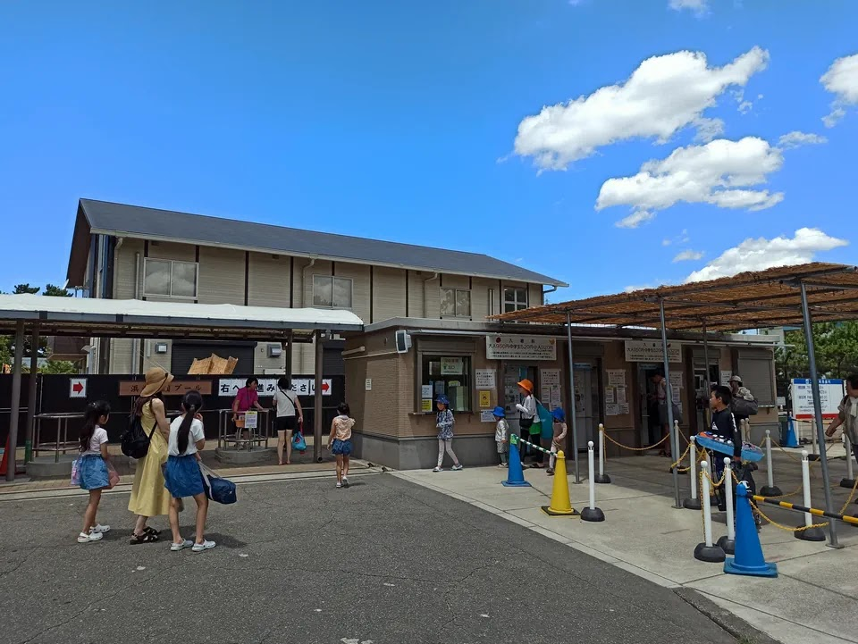

---
categories:
  - アウトドア
  - 公園
date: "2025-02-15T23:44:10+09:00"
description: 大阪府、浜寺公園のプールをご紹介。日本最古の公立公園として開園した浜寺公園は、広い敷地を持つ大阪府営公園です。美しい松林の中で無料でバーベキューができたり、ゴーカートや子供汽車など遊具の他にもいろいろと楽しむことができます。
draft: false
images:
  - images/0001.jpg
summary: 日本最古の公立公園として開園した浜寺公園は、広い敷地を持つ大阪府営公園です。美しい松林の中で無料でバーベキューができたり、ゴーカートや子供汽車など遊具の他にもいろいろと楽しむことができますが、夏はプールもオープンするので暑い中、子ども達と遊んできました。
tags:
  - プール
  - 大阪
  - 公園
  - 浜寺公園
title: 浜寺公園のプール
---

日本最古の公立公園として開園した浜寺公園は、広い敷地を持つ大阪府営公園です。美しい松林の中で無料でバーベキューができたり、ゴーカートや子供汽車など遊具の他にもいろいろと楽しむことができますが、夏はプールもオープンするので暑い中、子ども達と遊んできました。

## アクセス



阪神高速4号線、浜寺ICからすぐです。プールを利用する場合は、北側の第1駐車場か第2駐車場が近いです。

電車の場合は、南海本線「浜寺公園」駅、阪堺電軌阪堺線「浜寺駅前」駅、またはＪＲ羽衣線「東羽衣」駅から北西へ徒歩450m

## 浜寺公園のプール

流水プール、ジャイアントスライダー、25m、50mプールの他に、ドーム型のトランポリンのようなバブルヒルやクジラの滑り台のある変形プールなど、子供に楽しめるプールもあります。

### 入口

土曜日の午前10時前、浜寺公園へやってきました。プールの開園時間9:30を過ぎていましたが、第1駐車場まだ空きがあり、プールの入口はまだ人が並びぞろぞろと入場しているところでした。

入口の券売機でチケットを購入して入場です。

### 流水プール

特段珍しいものではないですが、2022年に作られた新しいプールできれいです。

### ジャイアントスライダーとその下のプール

ジャイアントスライダーは人気でしたが身長制限があるので、小さな子どもは滑ることができないため、今回は見るだけでした。

ジャイアントスライダーの下は、広いプールが広がっており、バブルヒルもこの中にあります。一部は膝下くらいの浅い場所もあります。

### バブルヒル

プールの中にドーム状のトランポリンがあり、これに登って跳ねたり滑ったりして遊びます。横から水が放水されているためツルツルな感じなのでしょう。一番写真映えするアトラクションですね。

決められて人数で時間ごとに交代していくので少し待つことになります。

### 変形プール

小さな子ども向けの浅いプールです。クジラの形をした小さな滑り台があります。

滑り台は、公園の滑り台といった感じで短いですが、小さな子どもにはちょうどよいですね。

### 25m、50mプール

学校にあるような長方形のプールです。25mプール中央の水深は130cmと、流水プールなどに比べるとやや深いです。25mプールはなんと3つもあります！

50mプールはさらに深いため、中学生以上でないと入ることができません。

## 営業期間、営業時間

2023年度の営業期間は、7/15(土)〜8/27(日)です。

営業時間は9:30〜18:00（入場は17:00まで、遊泳は17:30まで）です。
※日曜日・祝日、お盆（8/13～8/16）は9:00開場

## 料金

-   大人　950円
-   中学生　520円
-   4歳～小学生　320円

## 浜寺公園のプールに行ってみた感想

大阪の公営公園に併設されたプールはいくつかありますが、プールの種類、広さとも随一のプールではないでしょうか。子供と行かれる方は、ぜひバブルヒルを楽しませてあげてください！

