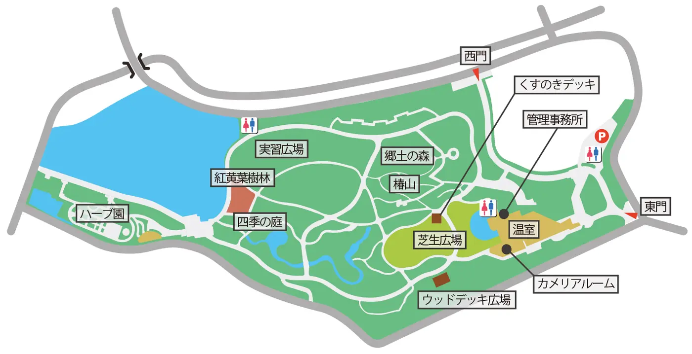
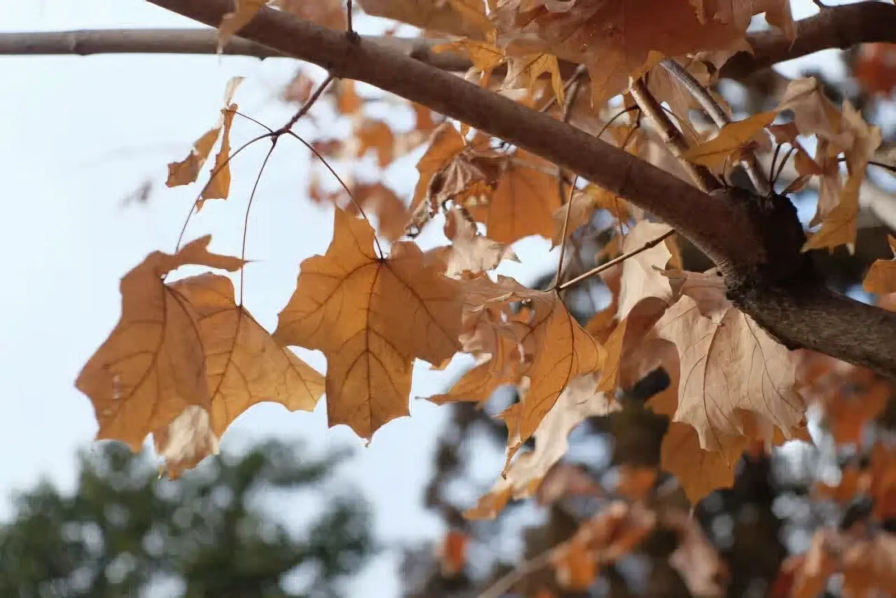
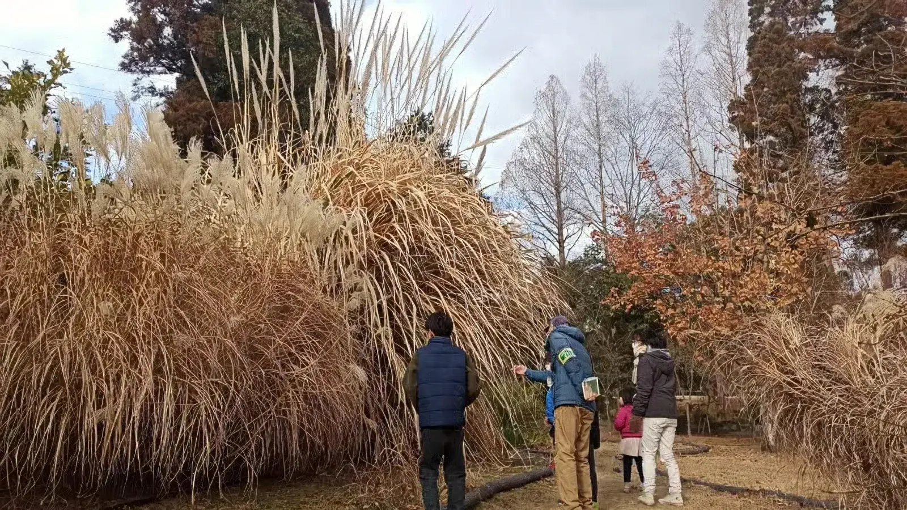

---
categories:
  - アウトドア
date: "2025-02-15T23:43:37+09:00"
description: 大阪の北部、服部緑地は遊具の他にプール、乗馬センター、日本民家集落博物館などがあり、バーベキューもできたりする広大な敷地の公園です。その端に都市緑化植物園という有料の植物園があります。温室もあるため冬でも花を見ることができます。
draft: false
images:
  - images/GExJz.webp
summary: 大阪の北部、服部緑地は遊具の他にプール、乗馬センター、日本民家集落博物館などがあり、バーベキューもできたりする広大な敷地の公園です。その端に都市緑化植物園という有料の植物園があります。温室もあるため冬でも花を見ることができます。
tags:
  - 公園
  - 植物園
  - 服部緑地
  - 花
  - 大阪
title: 冬でも楽しい植物園 - 服部緑地 都市緑化植物園 -
---

大阪の北部、豊中市にある服部緑地は遊具の他にプール、乗馬センター、日本民家集落博物館などがあり、バーベキューもできたりする広大な敷地の公園ですが、その隅に都市緑化植物園という有料の植物園があります。これまではいつも子供を遊具で遊ばせていましたが冬で寒く、温室もある都市緑化植物園に初めて入ってみました。

## 都市緑化植物園の場所

大阪府豊中市、服部緑地の敷地内で南東に飛び地になったように少し離れた場所にあります。電車だと堂筋線緑地公園駅から徒歩10分。車の場合は都市緑化植物園前に狭い駐車場がありますが埋まっていることが多いため服部緑地第4駐車場から歩いた方がよさそうです。



## 園内マップ

温室、敷地はそれほど広くなく、2時間もあれば回れてしまうでしょう。ボランティアの説明員さんがいて一緒に歩いて植物を説明してくれたりもします。

[都市緑化植物園](http://hattori.osaka-park.or.jp/guide/facility/arboretum/map_area/)
より引用

## 入園料

大人（高校生以上）220円、中学生以下無料です。

## 温室

入口からすぐ温室に入ります。いきなり目の前にはウツボカズラがお出迎えです。掌サイズの大きさにびっくりです。

2階から入って1階へ降りていく通路になっています。

サボテン、バニラなど熱帯の植物がありました。

1階には椿がたくさん植えられています。外にもたくさんあるのですが外の椿は鳥に花を落とされてしまうそうで、温室の椿の方が花が残っていてきれいだそうです。

椿を過ぎると小さな池が。

1階の開けた場所に出ました。

花なのか実なのかよくわかりません。

広くはありませんが植物の種類が多くなかなか楽しめました。

## 外にはスイセン、ロウバイなどが咲いている

外に出ると芝生の広場があり、テントを張ってのんびりしている人もいます。

ボランティアの説明員さんがいろいろ説明してくれます。これはザクロの木です。ザクロの実が干からびて少し残っていますが、夏にはたくさんザクロが成るそうです。

夏みかんです。

道端にはスイセンの花が咲いています。そろそろ見頃ですね。

道沿いには面白い植物が。フサフサの細長い葉の中にきれいな青い実が成っています。

草をかきわけると中から実がたくさん出てきます。

たくさん落ちているので拾ってみると宝石のようにきれいです。名前を教えてもらったのですが忘れてしまいました。

これはタチバナ、ちいさなみかんです。

ロウバイや菜の花、少しですが椿の花も咲いていました。

## 花以外にも見どころ

サトウカエデ、メープルの木は枯れてしまっていますが枯葉を付けた姿もなかなかいいですね。

こんなに高いすすきも。

説明を聞きながら一通り回り、家に帰りました。

## まとめ

冬に咲く花はほとんど無いのでスイレンかロウバイを見られたらと思ってあまり期待していませんでしたが、冬は冬でなかなか多くの見どころがありました。

四季を通じて楽しめそうなので春・夏・秋にも訪れてみたい服部緑地の都市緑化植物園でした。
