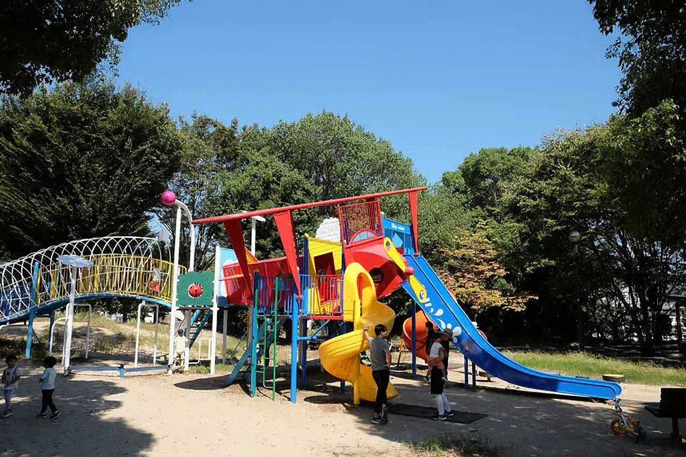

---
categories:
  - アウトドア
  - 公園
date: "2025-02-15T23:43:54+09:00"
description: 伊丹空港の滑走路北側には飛び立つ飛行機を見ることができる公園、エア・フロント・オアシス下河原があります。小さな公園ですが、飛んでいく飛行機を見ながら子供と遊べるエア・フロント・オアシス下河原に行ってみました。
draft: false
images:
  - images/DSCF6697.jpg
summary: 伊丹空港の滑走路北側には飛び立つ飛行機を見ることができる公園、エア・フロント・オアシス下河原があります。小さな公園ですが、飛んでいく飛行機を見ながら子供と遊べるエア・フロント・オアシス下河原に行ってみました。
tags:
  - 伊丹空港
  - 兵庫
  - 飛行機
title: 大阪国際空港の飛行機が間近に見れる公園 エア・フロント・オアシス下河原
---

大阪国際空港（伊丹空港）の周りには、飛行場のすぐそばで飛び立つ飛行機を間近に見ることのできる公園や場所がいくつかあります。

滑走路の西側にあり、飛行機を真横から見ることのできる伊丹スカイパークが有名ですが、南側には着陸する飛行機を真上に見ることのできる千里川土手、北側には飛び立つ飛行機を見ることができる公園、エア・フロント・オアシス下河原があります。

小さな公園ですが、飛んでいく飛行機を見ながら子供と遊べるエア・フロント・オアシス下河原に行ってみました。

## アクセス

国道171から箕面川沿いの細い道に入ると駐車場があります。



## 駐車場

駐車場は無料ですがとても小さく、10台程度の区画しかありませんが、結構人が来る人気スポットらしく常に満車状態です。駐車場の道路や、駐車場を出た箕面川沿いの道路にまではみ出して路駐されています。飛行機を見て帰る人も多いのか、少し待ったら運良く駐車場が空きました。

## 迫力のある飛行機が飛ぶ姿

駐車場からすぐ右手、日時計のモニュメントがある高台から滑走路が見渡せます。

大きなレンズで飛行機を狙っている方々もいます。有名な撮影スポットみたいです。

来て間もなく、早速飛行機が飛んでいきました。

持ってきた安物オールドレンズ、Takmar
200mmにレンズ交換して望遠撮影に挑戦です。手持ちで手ブレ補正など無いのでプルプルしながら搭乗口の方をパシャリ。オールドレンズなのでコントラストが低いのは仕方無いところです。

そうこうしていると飛行機が滑走路に進みました。飛びそうです。

飛びました！

近い！！なかなかの迫力です。

さて、それでは公園の方に行きましょう。モニュメントの奥には六甲山が良く見えます。

## 飛行機をモチーフにした遊具のある小さな公園

公園はこじんまりとしていますが遊具も新しくきれいな公園です。下の写真で左側にある遊具と、道の右側にはテーブル、ベンチとエクササイズ用の器具がいくつかあるだけです。公園内にも展望台が2ヶ所ありますが先程の日時計モニュメントの場所が一番良く飛行機を見られます。

飛行機のような形をした一番大きな遊具です。

小さな子供用の滑り台も飛行機の形で可愛らしいですね。

ベンチやテーブルもいくつかあり、おべんとうを持ってきて食べている方もいました。

 

子どもたちは遊具はすぐに飽きてしまい、何故かお団子作りを初めていて、お昼になりお腹が空いたので帰宅しました。

## まとめ

エア・フロント・ オアシス
下河原は大阪国際空港から飛んでいく飛行機を間近で見られる公園です。遊具は少ないながらも新しく綺麗な公園なので飛行機を見るだけでなく、子供は遊べて満足できる場所でした。
