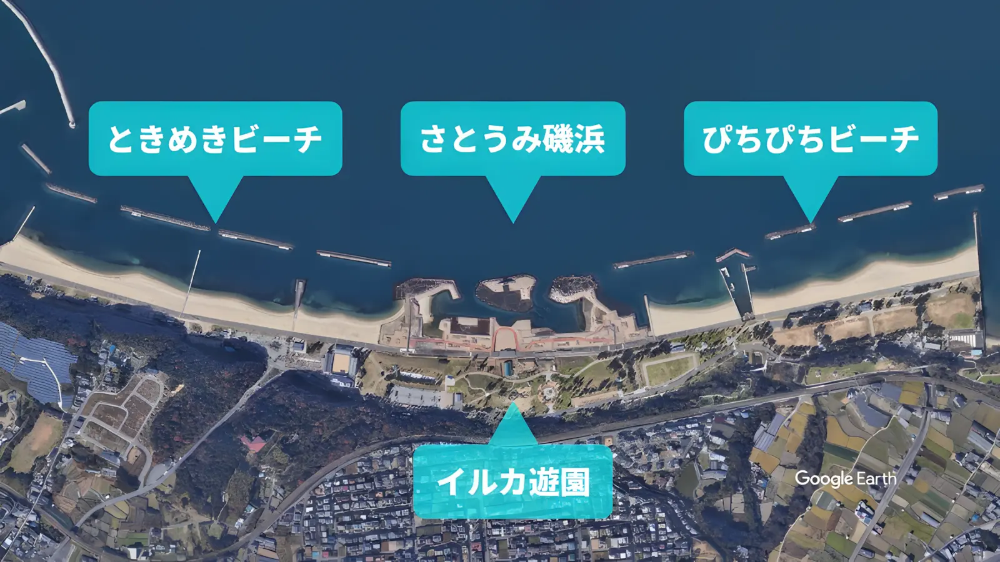

---
categories:
  - アウトドア
  - 公園
date: "2025-02-15T23:43:20+09:00"
description: 大阪府の南端、関西国際空港からさらに南の海沿いにある海水浴場を含む巨大な公園、せんなん里海公園をご紹介します。
draft: false
images:
  - images/IMG_20210807_152544.webp
summary: 大阪府の南端、関西国際空港からさらに南の海沿いにある海水浴場を含む巨大な公園、せんなん里海公園をご紹介します。
tags:
  - せんなん里海公園
  - 大阪
  - 家族でお出かけ
  - 海
title: 家族でお出かけ せんなん里海公園
---

大阪府の南端、関西国際空港からさらに南の海沿いにある海水浴場を含む巨大な公園、せんなん里海公園をご紹介します。

人工磯で生き物を観察したり大きな遊具で遊んだり、広い砂浜もあったりと家族で一日中楽しめる公園です。

## アクセス

県道752号からぴちぴちビーチ側とときめきビーチ側に2箇所、右へ入る道があります。



## 公園案内

せんなん里海公園は、大阪湾の海沿いに約2kmにも及びます。中央部のイルカ公園、人工磯の左右にときめきビーチ、ぴちぴちビーチと海水浴場があります。各ビーチ付近に無料のバーベキューエリアがあります。磯の観察やシーカヤックのほか、遊具の広場などもあり広大な敷地で様々な楽しみ方ができる公園です。

せんなん里海公園の中央部拡大です。

バーベキュー利用の注意事項、スケルトンカヤックの予約などの情報は、[公式ホームページ](https://www.osaka-park.or.jp/rinkai/sennan/main.html)でご確認ください。

### 駐車場

駐車場はときめきビーチ側の入り口すぐ先にあります。駐車料金は普通車¥640でハイシーズンの7月、8月は駐車料金が変更となります。

公園内には臨時駐車場がいくつもあり、ハイシーズンでも満車になることはあまりなさそうです。

### さとうみ磯浜

せんなん里海公園中央にある人工磯です。石を積み上げて作られており、貝ややどかりを見ることができます。たまにボラなど魚が入ってくることもあります。

水は夏は結構茶色いです。左奥がスケルトンカヤック乗り場です。

さとうみ磯浜内でスケルトンカヤック漕ぐことができます。

### イルカ遊園

大きな遊具があります。涼しい時期になると子供でいっぱいの場所ですが、暑い夏の日中はあまり人がいませんでした。

上に登って滑り降りるという遊び方がメインですが、巨大な遊具なので子供たちは大はしゃぎで楽しめます。

植えてある木が南国風です。

### ときめきビーチ・ぴちぴちビーチ

公園両サイドにはビーチがあり、春は潮干狩り、夏は海水浴が楽しめます。写真はときめきビーチ側です。

水質は、気温の低い時期は青くて綺麗な色ですが夏場はけっこう茶色く濁ってますね。。。水中の視界は期待できませんが泳げるレベルだと思います。

### バーベキュー

公園内の指定箇所でバーベーキューができます。現在はコロナ禍で禁止ですが、この場所はときめきビーチ手前の芝の区域で、駐車場の目の前なので車を付けて海を見ながら気軽にバーベーキューを楽しめる素敵な場所です。

無料ですが公園内には何も貸出、売店等は無いので道具や食材は持参です。

砂浜にはビーチバレーのネットが張れるようになっていて、潮騒ビバレーという国内唯一の観覧席を有するビーチスポーツ専用コートがあり、ビーチバレーが盛んなようで砂浜で練習している人たちがいました。

砂浜はきちんと清掃、管理されているようでとてもきれいです。

### その他

せんなん里海公園の自然を楽しく学習できるしおさい楽習館や、タコの遊具があるタコ遊園など、巨大な敷地内には他にも様々なスポットがあり1日いても飽きない公園です。

## まとめ

大阪府南端にあるせんなん里海公園は非常に敷地が広く、人工磯での生き物観察や海水浴、大きな遊具に海を見ながらバーベーキューもできて1日中飽きずに遊べる公園でした。
