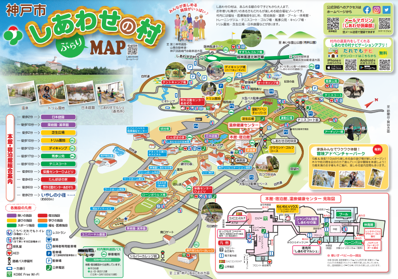
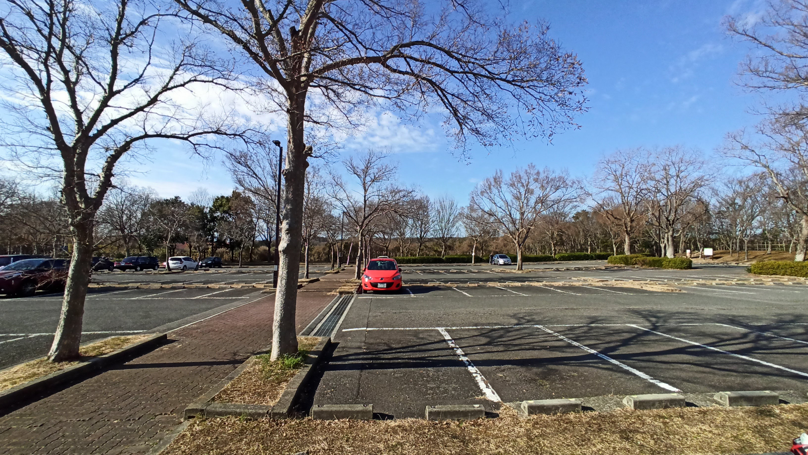
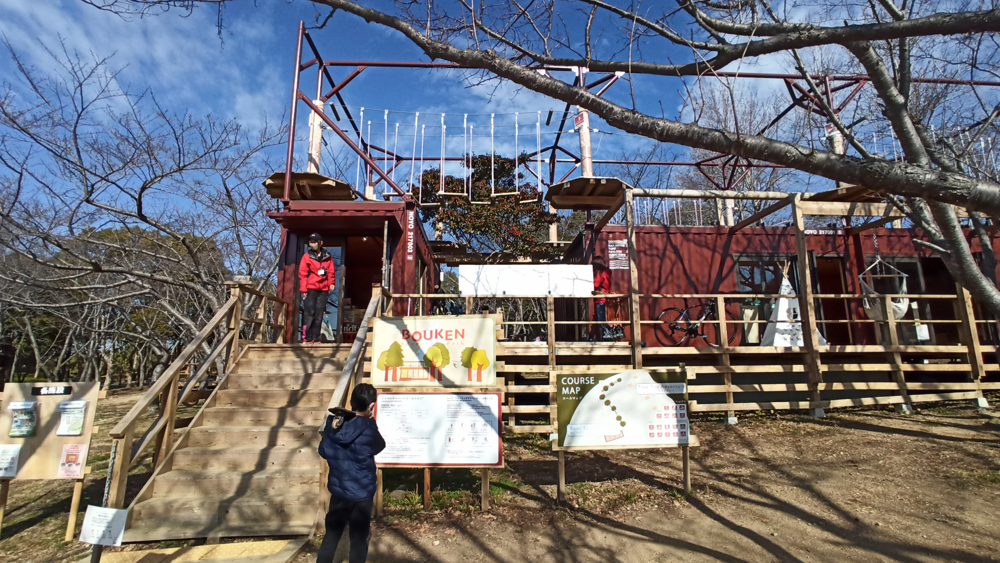
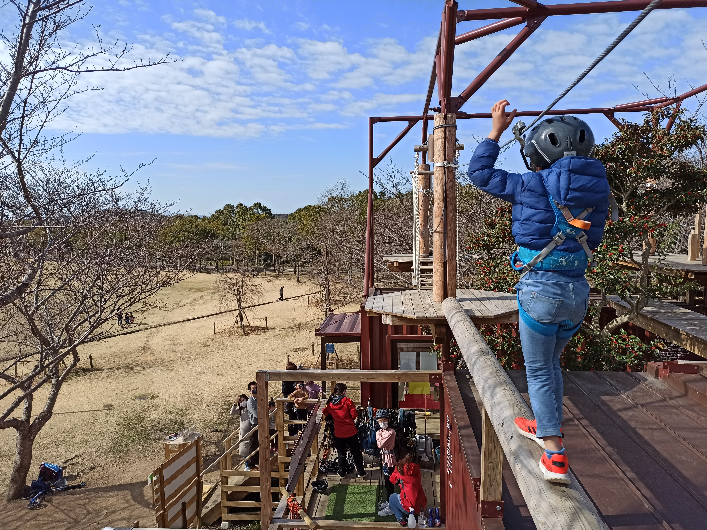
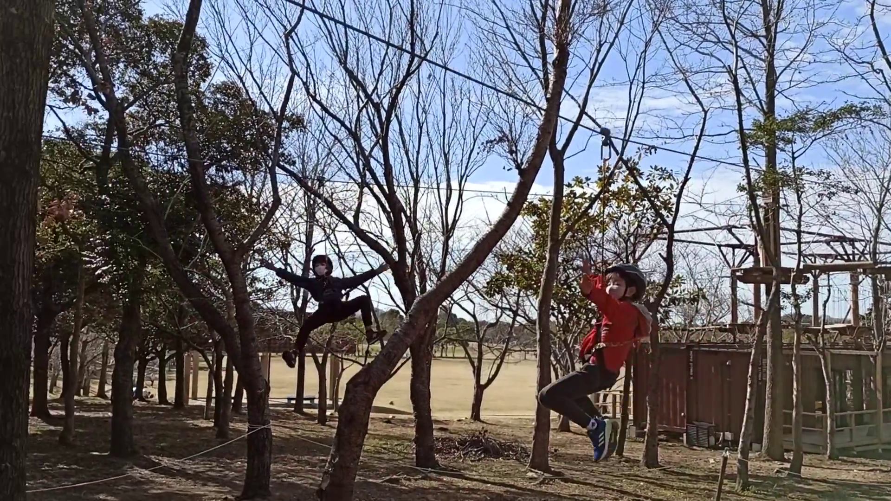
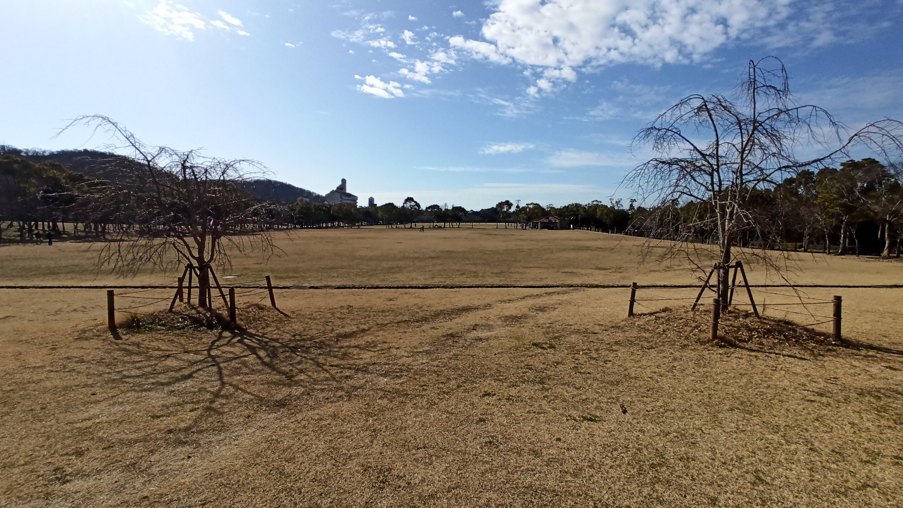
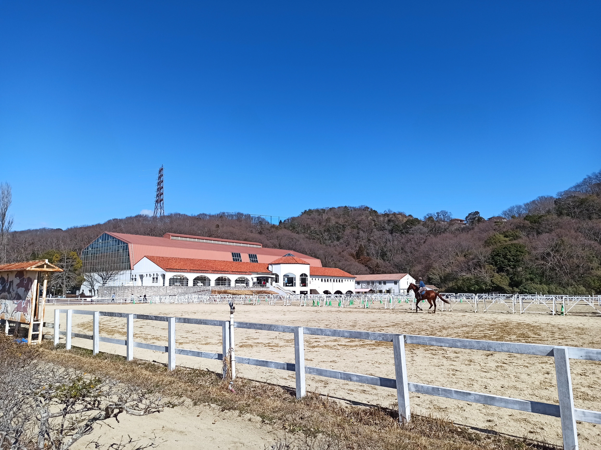

---
categories:
  - アウトドア
date: "2025-02-15T23:43:09+09:00"
description: 兵庫県の神戸から車で約30分、緑に囲まれた広大な敷地内にある総合福祉ゾーンしあわせの村に家族で遊びに行きました。冒険アドベンチャーパークでジップラインを楽しめるツリートップアドベンチャー、たくさんの遊具があるトリム園地など、子供が楽しめるおすすめスポットです！
draft: false
images:
  - images/IMG_20210214_101207.jpg
summary: 兵庫県の神戸から車で約30分、緑に囲まれた広大な敷地内にある総合福祉ゾーンしあわせの村に家族で遊びに行きました。冒険アドベンチャーパークでジップラインを楽しめるツリートップアドベンチャー、たくさんの遊具があるトリム園地など、子供が楽しめるおすすめスポットです！
tags:
  - 公園
  - 兵庫
  - しあわせの村
title: 【兵庫県の公園】しあわせの村でツリートップアドベンチャー
---

兵庫県の神戸から車で約30分、緑に囲まれた広大な敷地内にある総合福祉ゾーンしあわせの村に家族で遊びに行きました。冒険アドベンチャーパークでジップラインを楽しめるツリートップアドベンチャー、たくさんの遊具があるトリム園地など、子供が楽しめるおすすめスポットです！

## しあわせの村とは

しあわせの村は、こどもからおとなまで、お年よりも障がいのある人も、
誰もが楽しめる福祉ゾーンです。205ヘクタールもの敷地内に運動広場、レ
クリエーション施設などがあります。

敷地内ではジップラインができたり、広い芝生広場や遊具のあるトリム園
地、馬事公苑でお馬さんを見たりキャンプやバーベキューもできるので家族
でいっぱい楽しめます。

[しあわせの村公式サイトより引用](http://www.shiawasenomura.org/)

## アクセス



住所：〒651-1106 神戸市北区しあわせの村1番1号

阪神高速7号北神戸線 白川PAの出口からすぐにしあわせの村敷地内です。

駐車場は約1,600台と広いのでどこかしらには駐車できるでしょう。ただ、
敷地内がとても広く、トリム園地前はお昼頃には結構多く車が停まっていま
した。

休日朝10時前のP6駐車場です。まだまだ車は少なく、帰りの3時頃には7割
程度埋まっていました。

## 冒険アドベンチャーパーク

P6駐車場の目の前には冒険アドベンチャーパークがあります。

ここではハーネスを着て高所のアスレチックが楽しめます。屋根の上を1周
するルーフトップアドベンチャーは幼稚園高学年～小学校低学年くらいの子
供でも楽しめ、1回500円とお手軽に体験できます。

森の中を進むツリートップアドベンチャーはもう少し本格的です。

ジャンプしてワイヤーを滑り降りるジップラインも楽しめます。

## 芝生広場

冒険アドベンチャーパークの前は広大な芝生が広がる芝生広場です。全部
で7ヘクタールもあります。お昼頃にはボール遊びをしたりお弁当を食べて
いる人がたくさんいました。

## トリム園地

トリム園地は遊具のある公園です。入り口は長い滑り台があります。

いろいろと遊具もあります。

木道を登っていくと、、、

見晴らしの良い展望台です！

ホームページを見るとイカダが楽しそうですが、残念ながらメンテナンス
中で使えませんでした。池の水も抜かれています。

## お馬さんもいます

トリム園地で遊んだあとは、馬事公苑へ行ってみます。ここでは乗馬がで
きるようですが今回はお馬さんを見るだけ。筋肉質で迫力がありますね。

## 他にも遊びどころたくさん！

今回はこのあたりで帰宅しましたが敷地内には他にもたくさん遊びどころ
がありそうです。グラウンドゴルフやプールに温泉。キャンプ場もあるので
次回はキャンプか日帰りバーベキューをしてみたいですね。

## まとめ

兵庫県の神戸から車で約30分、緑に囲まれた広大な敷地内にある総合福祉
ゾーンしあわせの村は遊びどころ満載で家族でのお出かけにおすすめのスポットです！
