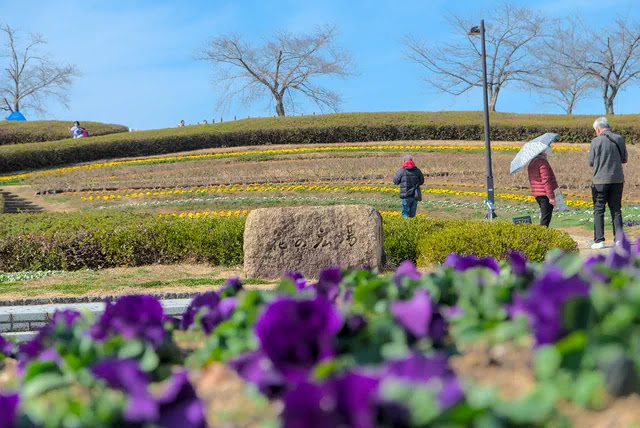
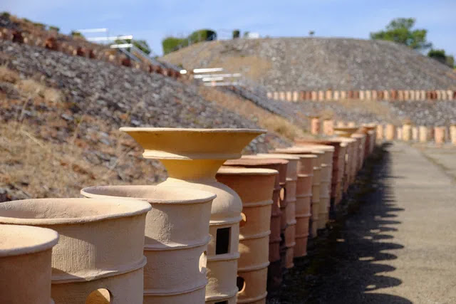

---
categories:
  - アウトドア
  - 公園
date: "2025-02-15T23:43:59+09:00"
description: 竹取物語の舞台と言われる奈良県広陵町の竹取公園をご紹介します。広陵町のキャラクター、かぐやちゃんやちいさな竹林が竹取物語を感じさせ、人工芝でソリ遊びのできるちびっこゲレンデが楽しめるおすすめの公園です。
draft: false
images:
  - images/0001.webp
summary: 竹取物語の舞台と言われる奈良県広陵町の竹取公園に遊びに行きました。広陵町のキャラクター、かぐやちゃんやちいさな竹林が竹取物語を感じさせてくれ、人工芝でソリ遊びのできるちびっこゲレンデがあり楽しめる公園でした。
tags:
  - かぐや姫
  - 奈良
  - 竹取公園
title: かぐや姫のふるさとにある公園 竹取公園
---

日本人の誰もが知っているかぐや姫の物語、竹取物語の舞台と言われている奈良県広陵町の竹取公園に遊びに行きました。広陵町のキャラクター、かぐやちゃんやちいさな竹林が竹取物語を少し感じさせてくれ、公園としては人工芝でソリ遊びのできるちびっこゲレンデがありとても楽しめる公園でした。

隣には広大な敷地の県営馬見丘陵公園もあり、遊具に古墳や梅の花など竹取公園とセットで一日中楽しむことができます。

## アクセス



車で西名阪自動車道法隆寺ICより車で約15分。駐車場は無料です。かなり多くの人が訪れますが駐車場も広いです。

## がぐやちゃんと竹取物語

入口の駐車場は高台になっており、公園内には下って入るようになっています。入口には広陵町のキャラクター、かぐやちゃんが出迎えてくれます。

竹の輪切りのような形の建物は、なんと公衆トイレ！かぐや姫の絵まで描かれています。

下の池には龍が泳いでいます。竹取物語と関係ありましたっけ？？

坂道を下り公園に入ると、小さな竹林に竹取物語の説明が書かれた看板がありました。公園脇の小さな小道で竹取物語に関するものは入口のかぐやちゃん、トイレ以外はここに写っているものだけです。

小さな竹林で展示のために整備された感じで、ここでかぐや姫が生まれたとは思えないですね。。。竹取物語は作者不明の日本最古の物語なので、「ここにかぐや姫がいた」とか、「竹取翁の家跡」みたいなはっきりとした痕跡は残っていないのですね。広陵町が竹取物語の舞台だというのも、後の研究での説であり、諸説あるようです。

ということで竹取物語を感じるには少々寂しいですが公園の東側、敷地外に竹林があったので「とりあえずここということにしよう」と自分の中で決め、写真を取りました。光る竹がありそうじゃないですか？

## ちびっこゲレンデでソリ遊び

南西に下るとちびっこゲレンデという、人工芝でソリ遊びができる場所があります。なんとこれが無料で、ヘルメットとソリまで貸してくれます。

子どもたちは大喜びで滑ります。混んでいますが3回で交代のルールがあり、少し待てば遊ぶことができます。

## すべり台、広場に古代住居

ちびっこゲレンデの隣はみんなの広場、かなり広いところでボール遊びなどができます。

大きな滑り台もあります。

古代住居広場に約1500年前の古墳時代の住居が復元されています。学校で習った竪穴式住居と高床式住居ですね。

## 隣接する県営馬見丘陵公園で梅と古墳を見る

竹取公園で遊んだあと、せっかくなので隣接する県営馬見丘陵公園にも行ってみることに。歩いても行けるのですが何せ敷地が広大なので大型遊具近くの駐車場に車を停めました。とても大きな駐車場でこの他にもいくつか駐車場が点在しています。

冬も終わりが近づき、花の広場にはパンジーやビオラが咲いています。

大型遊具のある遊び場です。長い滑り台が楽しそうです。

大型遊具のある場所から、池越しに見えるこんもりした部分はただの林にしか見えませんが池上古墳という古墳みたいです。公園内、周辺には古墳がたくさんあります。さすが奈良県です。

公園の南側、竹取公園に隣接するあたりには梅の花がたくさん咲いていました。

 

ちょうど満開で暖かい日だったので人がたくさん集まっていました。

ナガレ山古墳という復元され、登れる古墳があります。

土器が古墳を囲うように並べられています。教科書などで知られている仁徳天皇陵の上空から見た写真は鍵マークの前方後円墳が木で覆われ、周囲が池のようなイメージですが、作られた当時はこんな感じだったのですね。

階段を使いてっぺんまで登っていきます。

古墳の上から東側の眺めです。

古墳時代を感じた後はもう十分遊んだので帰宅しました。

## まとめ

竹取公園はソリ遊びが楽しめるなかなか貴重な公園でした。遊び盛りの子供がいる家族におすすめの公園です。竹取物語は、あまりにも古くその痕跡を感じるには物足りないですが。県営馬見丘陵公園も遊具に古墳に夏は水遊びもできるので竹取公園とセットで一日中遊べる場所です。
