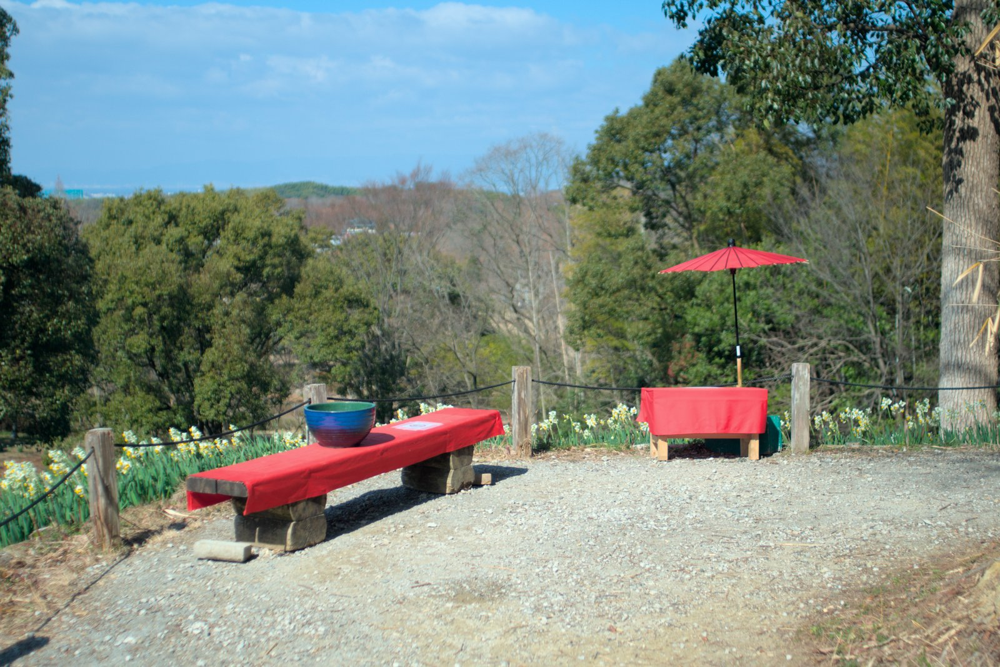

---
categories:
  - アウトドア
  - 公園
date: "2025-02-15T23:44:22+09:00"
description: 大阪府営の遊具が充実した広い公園、蜻蛉池公園には子供を遊ばせにたまに行くのですが、先日行った際に水仙の花がたくさん咲いているのに気づきました。穴場の水仙の名所をご紹介します。
draft: false
images:
  - images/0001.jpg
summary: 大阪府営の遊具が充実した広い公園、蜻蛉池公園には子供を遊ばせにたまに行くのですが、先日行った際に水仙の花がたくさん咲いているのに気づきました。穴場の水仙の名所をご紹介します。
tags:
  - 公園
  - 大阪
  - 花
  - 水仙
title: 【水仙の名所】蜻蛉池公園
---

大阪府営の遊具が充実した広い公園、蜻蛉池公園には子供を遊ばせにたまに行くのですが、先日行った際に水仙の花がたくさん咲いているのに気づきました。

## アクセス



大阪府岸和田市にあります。駐車場はかなり広いですが水仙郷、遊具に近い第1駐車場はかなり混雑していました。

## マップ

水仙郷は第1駐車場からすぐのところにあります。第1駐車場から公園に入るのに、いきなり急な坂を登ることになるので意外と疲れるかもしれません。

## 満開の水仙

この日は子供を遊ばせるために蜻蛉池公園へ行き、第1駐車場に車を停めていつものように遊具を目指し歩き始めると何やら水仙が咲いているのが見えます。

行ってみると「水仙郷」という6,000本の水仙が植えられたエリアがありました。

何故か茶屋のような赤いベンチと傘が設置してあり、ここが高台になっており下に一面水仙の花が咲いています。

ここから水仙郷を一望でき、ここから見える範囲が全てで敷地はそれほど広くはありませんが、すごい密度で群生しています。

ちょうど満開だったようで、あたりに水仙の香りが広がっています。1月上旬から2月下旬ごろまで咲いているようで、水仙は結構見頃の時期が長いのですね。

それにしてもすごい密度です。

下に降りて先程の赤い椅子と傘の高台を見上げます。ここが写真ポイントでしょうか、カメラを持った人が何人か来ておりました。

## 遊具と蜻蛉池

このあといつもどおり、大型滑り台、蜻蛉の形をした遊具で遊びました。

この蜻蛉の頭の形をしたオブジェ、怖いですね。。。

これが蜻蛉池、とおもいきや、いくつか池があるようであとで地図を確認したら「大池」でした。カモがたくさんいました。

## まとめ

水仙の群生というと、関西だと淡路島あたりが有名かと思っていましたがこんなところで見られるとは、意外な水仙の名所でした。

