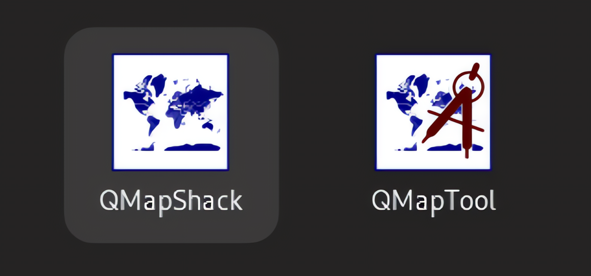
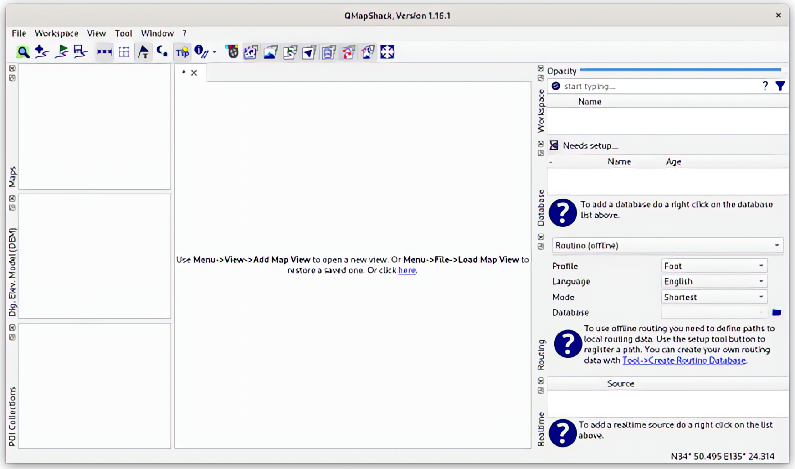
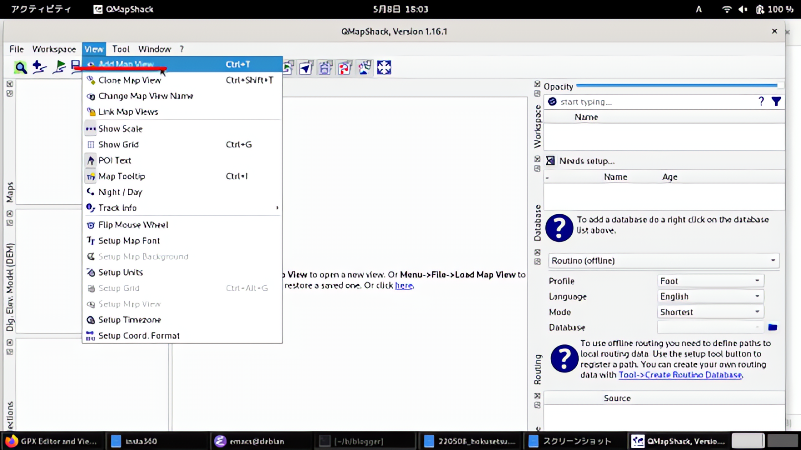
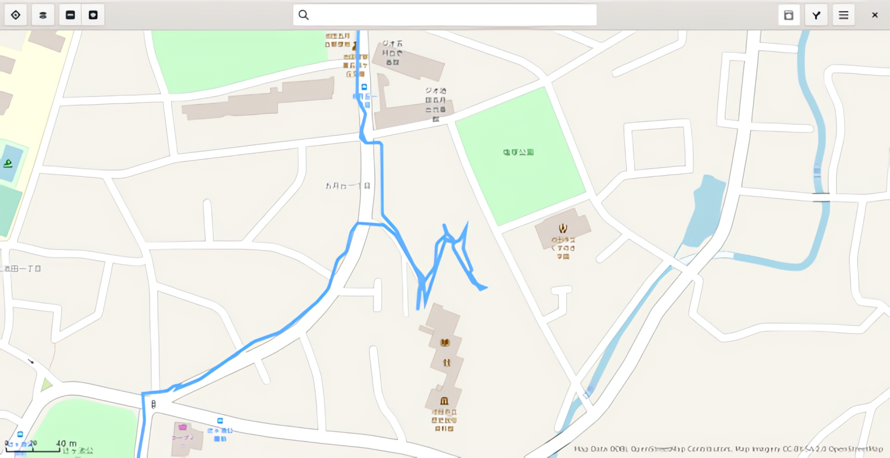

---
categories:
  - ソフトウェア
date: "2025-02-15T23:43:46+09:00"
description: GPSのトラックログを地図上に表示し、位置修正や分割など編集作業を行うことができるフリーソフト、QMapShackをご紹介します。
draft: false
images:
  - images/qmapshack.png
summary: 地図にGPSログを表示してマウスで選択して編集できるソフトが無いかなと探していたらQMapShackというソフトでできそうなのでインストールしてみました。
tags:
  - GPS
  - QMapShack
title: GPSトラックログを編集するフリーソフト QMapShack
---

サイクリングや登山に行った際、GPSサイコンやスマホアプリを使ってGPSログを残しています。後からGPSデータを見るとたまに一部のポイントが大きく外れた位置に飛んでしまっていたりすることがあります。GPX形式のファイルだと中身はテキストデータなので頑張れば削除できるのですが何千点のある中で手作業で異常なポイントを見つけるのは現実的で無く今までほったらかしにしていました。

地図にGPSログを表示してマウスで選択して編集できるソフトが無いかなと探していたら
QMapShack というソフトでできそうなのでインストールしてみました。

## QMapShackとは

地図上でルートを作成したりトラックログを編集できるフリーソフトです。GPLライセンスで使用でき、Windows,
MaxOS,
LinuxなどいろいろなOSで動くバイナリが配布されています。残念ながら日本語版は無いのですが英語でもGPSログの異常なポイントを削除する程度であれば感覚で使用できます。

WindowsであればGPX
Editorやカシミール3Dなど有名なソフトがあり、これらを使えばGPSデータの編集ができそうです。また、GPXEVというWebアプリもありましたが残念ながら2022年5月末でサービス停止とのことです。

## 入手とインストール

[QMapShack公式ホームページ](https://github.com/Maproom/qmapshack/wiki)
からダウンロードできます。Linuxの場合は、ディストリビューションのパッケージからもインストールできると思います。今回はDebianパッケージをインストールしました。

``` shell
$ sudo apt install qmapshack
```

## 起動画面と地図の表示

ランチャのアイコンが渋すぎます。QMapShackとQMapToolという2つのアイコンが現れましたが、QMapShackのアイコンで起動します。



起動画面は直感的に全く良くわからない感じですね。地図すら表示されていません。どうしたらよいか一瞬フリーズする画面です。



よく見ると画面ど真ん中に Use Menu-\>View-\>Add Map View
と書いてあるのでそのとおりにやってみます。



左のMapsのところに地図らしきリストが表示されました。


とりあえずOpenStreetMapを選択します。右クリックしてActivateを選びます。


地図が表示されました！ここは、どこ？？ドイツみたいです。


マウスで拡縮と移動してGPSログの範囲である大阪あたりを表示させました。


## GPXファイルの読み込み

今回はSTRAVAから落としてきたGPXファイルを読み込みます。ウィンドウ左上のルートに旗が立ったマーク(Load
projects from file)をクリックします。


地図上に青い細線でGPSログが表示されました。画面右上の「Workspace」に読み込んだファイル名が表示されています。


## トラックポイントの編集

マウスで地図上のGPSログを選択するといろいろとメニューが出てきます。ここで赤い線に十字矢印のアイコン、「Edit
the track points...」を選択します。


これで各点を編集できるようになります。線が黒色に見えるのは、各点が黒色のドットで描かれているためです。


問題となっているデータが飛んでしまったポイント付近です。1秒毎のトラックポイントなのですが、途中でスマホが固まり再起動し復帰した直後にGPSの測定精度が悪くなり変な位置にジャンプしてしまっています。


地図上部に編集ボタンがあり、デフォルトでは位置変更が選択されています。点をクリックすると動かせます。


×マークのアイコンを選択してから点をクリックすると消すことができます。


ポイントを1個消しました。


次々と異常な点を消していきました。細い青線はもとのデータで、黒点とピンクの線が編集中のデータです。終わったら「Save
to
original」ボタンを押して編集を終了します。本当に上書きしてよいか確認されますがOKで保存します。


編集後のデータです。


## 保存と確認

編集が完了したらWorkspaceのファイル名上で右クリックし、Saveを選択して保存します。ここでも一度本当に保存してよいか確認が出ます。


編集後のGPXファイルをGNOMEの地図アプリで表示させてみます。ちゃんと編集後のデータになっていました。



## まとめ

GPSトラックログを編集するフリーソフト、QMapShackで不要なトラックポイントを削除して保存することができました。ややクセのあるUIに英語なので少し戸惑いますが一度使い方がわかれば便利なソフトです。QMapShackでトラックログを編集してからGPSBabelで軌跡を間引いて簡略化することでブログへの地図とGPSログの埋め込み作業が捗りそうです。

QMapShackで登山地図によく使われる地理院タイルを使用する方法を見つけました。詳しくは下の関連記事も参照ください。
