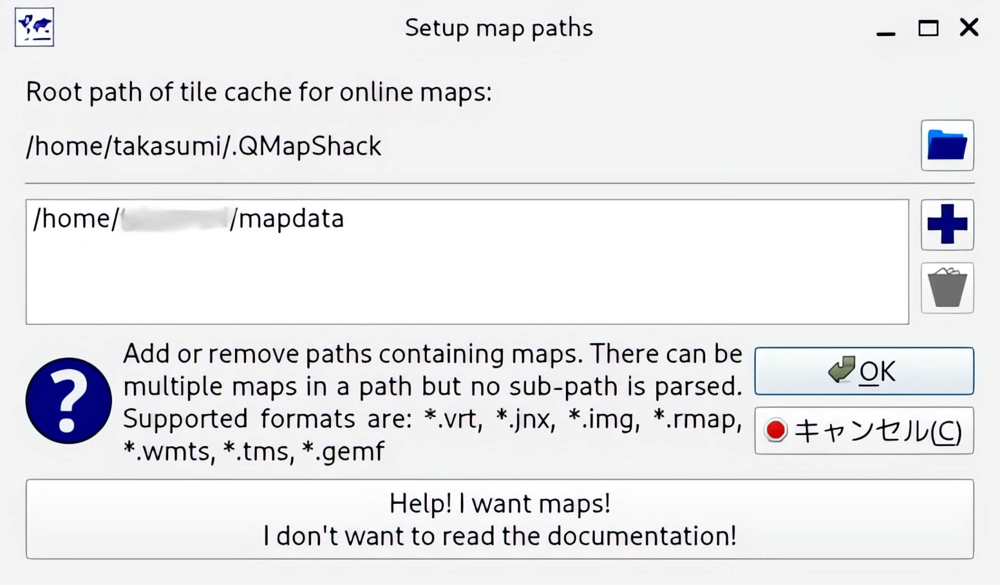

---
categories:
  - ソフトウェア
date: "2025-02-15T23:44:02+09:00"
description: サイクリングや登山で取ったGPSログを編集できる便利なソフト、QMapShackで登山地図でよく使われる国土地理院の1/2.5万図（地理院タイル）を表示するための設定方法を記載します。
draft: false
images:
  - images/qmapshack.jpg
summary: サイクリングや登山で取ったGPSログを編集できる便利なソフト、QMapShackで登山地図でよく使われる国土地理院の1/2.5万図（地理院タイル）を表示するための設定方法を記載します。
tags:
  - GPS
  - GPX
  - QMapShack
  - 地理院タイル
title: GPSログを編集するソフトQMapShackで地理院タイルを使う方法
---

サイクリングや登山で取ったGPSログを編集できる便利なソフト、QMapShackで登山地図でよく使われる国土地理院の1/2.5万図（地理院タイル）を表示するための設定方法を記載します。

## QMapShackデフォルトの地図はOpenStreetMap

サイクリングや登山で取得したGPSログを見ると、電波が悪かったのか一部の位置データがコースから大きく外れてしまうことがあり、GPSログを編集できるQMapShackで修正することがあります。

操作方法が分かりにくかったりしますが、Linuxで動くフリーソフトでログをグラフィカルに編集することのできるソフトがこれくらいしか見つけられなかったので使っています。




このQMapShack、デフォルトでいくつか地図が選択できますが、どれもOpenStreetMapベースの地図なので道路を走るサイクリングでは不満はありませんが登山の場合、下図のようにコースがよくわからないことになってしまいます。


ちなみに虹色の線がGPSログになります。

国土地理院の地図を表示したくなり、調べてみました。

## 地図を追加する方法がよくわからない

QMapShackのマップ選択画面には、いくつか地図が並んでいます。地図名を右クリックして「Activate」を選択すると地図が表示されるのですが、地図の追加に関しては何の情報も出てきません。


メニューバーの「File - Setup Map
Paths」を選ぶと、マップデータの保存フォルダが表示されました。ホームディレクトリ直下の
` mapdata ` フォルダに入っているようです。



このフォルダの中を覗いてみます。マップ選択画面に表示されていた名称のファイルが置いてありました。


拡張子が ` .tms ` 、 ` wmts `
の2種類のファイルがあります。サイズからしてこれらのファイルが地図データそのものでは無いでしょう。データのあるURLなどの情報が記載された設定ファイルではないかと思われます。ということは、このファイルをアレンジして地理院地図を読み込むようにできるのでしょうか。

## WMTSファイルは使えなかった

[地理院タイルのWMTSメタデータ](https://github.com/gsi-cyberjapan/experimental_wmts)
がGithubに公開されていました。
[QMapShackのドキュメント](https://github.com/Maproom/qmapshack/wiki/DocBasicsMapDem#wmts-maps)
によると、ダウンロードしたXMLファイルの拡張子を ` .wmts `
に変更してやればいけそうですが、マップを選択した際にエラーが出てだめでした。
WMTSファイルは複雑なXMLファイルで中身を見てみましたが何が問題なのか分かりません。

## TMSファイルを作る

もう一つのTMSファイルは地理院タイルに関する情報は探しても見つからなかったので、OpenStreetMapのTMSファイルの中身を覗いてみます。

```xml
<TMS>
 <Title>OpenStreetMap</Title>
 <MinZoomLevel>2</MinZoomLevel>
 <MaxZoomLevel>19</MaxZoomLevel>
 <Layer idx="0">
  <ServerUrl>http://c.tile.openstreetmap.org/%1/%2/%3.png</ServerUrl>
 </Layer>
 <RawHeader>
   <Value name="User-Agent">QMapShack</Value>
 </RawHeader>
 <Copyright>Map data: (c) OpenStreetMap contributors, ODbL | Rendering: (c) OpenStreetMap , CC-BY-SA</Copyright>
</TMS>
```

おや、だいぶあっさりしていますね！
[国土地理院のページ](https://maps.gsi.go.jp/development/siyou.html#siyou-haisin)
によると、地理院タイルのURLは下記のように指定するみたいです。

    https://cyberjapandata.gsi.go.jp/xyz/{t}/{z}/{x}/{y}.{ext}

OpenStreetMapのTMSファイルをコピーして、下記のようにアレンジしてみました。URLとCopyrightを変更しています。

```xml
<TMS>
 <Title>OpenStreetMap</Title>
 <MinZoomLevel>2</MinZoomLevel>
 <MaxZoomLevel>19</MaxZoomLevel>
 <Layer idx="0">
  <ServerUrl>https://cyberjapandata.gsi.go.jp/xyz/std/%1/%2/%3.png</ServerUrl>
 </Layer>
 <RawHeader>
   <Value name="User-Agent">QMapShack</Value>
 </RawHeader>
 <Copyright>地理院タイル https://maps.gsi.go.jp/development/ichiran.html</Copyright>
</TMS>
```

このファイルを ` 地理院タイル.tml ` という名前でマップフォルダ(
` ~/mapdata ` )に保存します。

## QMapShackで地理院タイルを表示

QMapShackを再起動すると、マップ選択ウィンドウに「地理院タイル」が表示されていました。


デフォルトのOpenStreetMapを右クリックしてDeactivateし、地理院タイルを右クリックしてActivateすると、無事地理院タイルを表示することができました！


これで登山のGPSログ編集が快適にできるようになりました。

## まとめ

QMapShackは使い勝手が独特でなかなか慣れませんがフリーソフトでGPSログが編集できる素晴らしいツールです。地理院タイルも使えるようになり、活用の幅が広がりそうです。
