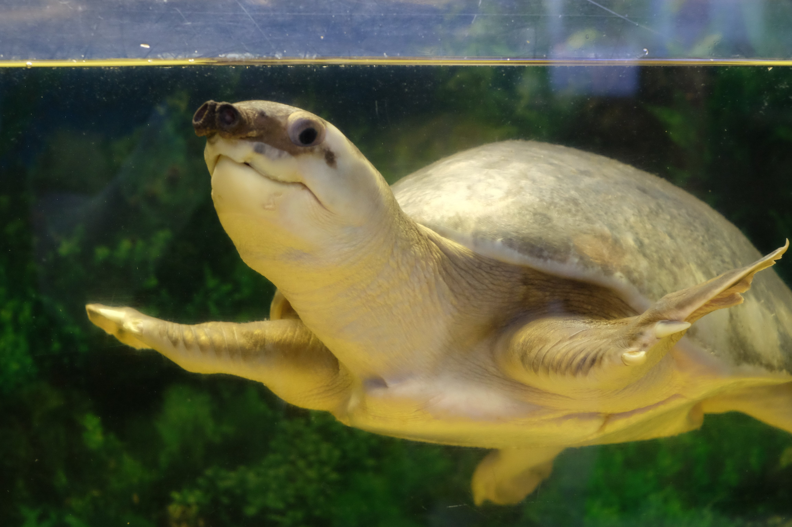
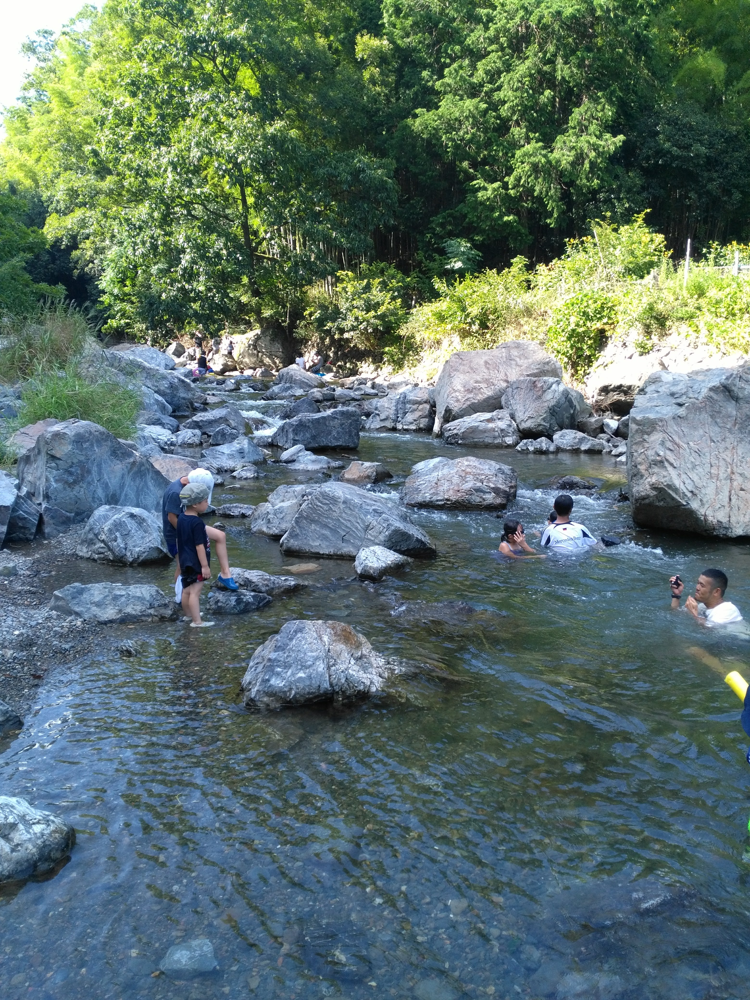

---
categories:
  - アウトドア
  - 川遊び
date: "2025-02-15T23:43:50+09:00"
description: 高槻市立自然博物館（あくあぴあ芥川）は魚などを見ることができるちょっとした水族館のような場所です。博物館の下に流れる芥川で魚採りなど、川遊びもでる穴場的な川遊びスポットをご紹介します。
draft: false
images:
  - images/DSCF6357.jpg
summary: 高槻市立自然博物館（あくあぴあ芥川）は小さな博物館ですがすぐ傍を流れる芥川の魚などを見ることができるちょっとした水族館のようなところです。下に流れる芥川で魚採りなどもでき穴場的な川遊びスポットです。
tags:
  - 川遊びスポット
  - 芥川
  - 大阪
  - 博物館
title: 川遊びスポット 高槻市立自然博物館（あくあぴあ芥川）
---

高槻市立自然博物館（あくあぴあ芥川）は小さな博物館ですがすぐ傍を流れる芥川の魚などを見ることができるちょっとした水族館のようなところです。下に流れる芥川で魚採りなどもでき穴場的な川遊びスポットです。

## アクセス

名神高速茨木ICより国道171号を東へ、左折し府道6号を北へ。茨木ICより15分。



小さな博物館のわりには駐車場は広く100台は停まれそうです。満車になることはほとんどなさそうです。駐車料金は1時間100円、最大400円と安いです。

## あくあぴあ芥川

駐車場から歩くとあくあぴあ芥川の入口です。公園の休憩所のような、博物館に見えない佇まいですがこの博物館は谷にへばりつくように建設されており4階の最上階が入口になっています。ここからどんどん下っていくことになります。池には鯉が飼われており餌をあげることもできます。

入口のゲートをくぐるとテーブル、椅子と自動販売機のある休憩所のようになっており山側の景色が開けています。

正面やや左の山がポンポン山です。

並木でよく見えませんが眼下には芥川が流れています。

早速階段を降りて建物の中に入ります。

3階はちょっとした図書コーナーがあるだけみたいなので2階まで降ります。ここがメインで水槽の中に芥川に生息する水生生物が展示されています。

どこにでもいる川魚なので本格的な水族館のような華やかさは無いですがこれらが芥川にいると思うとこんなに種類があるんだと感心します。

外来生物のブルーギルやブラックバスも。。。

こちらはスッポンモドキという大きなカメです。こんなのもいるのか、と思ったらオーストラリアやパプアニューギニアに生息するカメみたいですね。芥川にいるのでしょうか、それとも展示用でしょうか？？

お魚を見たあとは1階に下ります。1階は鳥の剥製がたくさん展示されていましたが子供が怖がりスルーしてそのまま外へ出ます。1階の外から見ると立派な博物館のような建物全体が見渡せます。

横には原っぱがあり子供がセミ採りをしています。「バーベキュー禁止」の看板がありました。

芥川沿いを少し上流へ歩きます。

すると川へ降りられるところがいくつかあります。

たくさんの人が魚捕りをしています。今日は川の水量が少なく魚もとても小さな魚ばかりでした。以前、8月に訪問したときはすごい量のウグイと思われる魚がうじゃうじゃいたのですが7月だとまだ小さいのか、それとも今年は少ないのでしょうか。上流側の写真です。

下流側もこんな感じで浅い川が続きます。川底は藻がたくさんあり綺麗とはいえません。

もう少し上流へ行くと少し深そうな場所がありました。

泳ごうと思うような水質ではありませんが子供はこの通りです。。。

少し遊んで帰りました。夕方になるとカエルがたくさん出てきます。

## さらに上流には摂津峡公園

この先上流へさらに進むと摂津峡公園があります。歩いていくには大変ですが駐車場(\\1,000円とやや高い)もありもう少し岩のゴツゴツした川で遊ぶこともできます。

## まとめ

高槻市立自然博物館（あくあぴあ芥川）は小さな水族館のような川魚を見ることができ、下を流れる芥川で魚を捕まえたり川遊びが楽しめる場所です。川は綺麗ではなく泳ぐのはちょっとキツいかなと思います。最大400円の駐車場代のみで楽しめるのでちょっと川遊びをするには良いスポットです。
