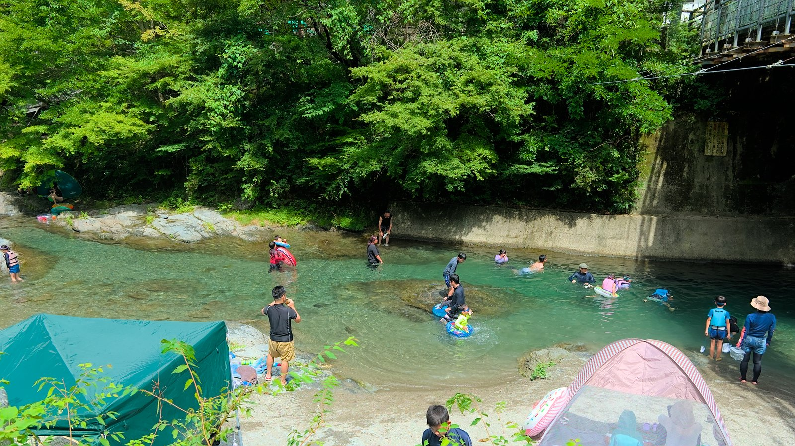
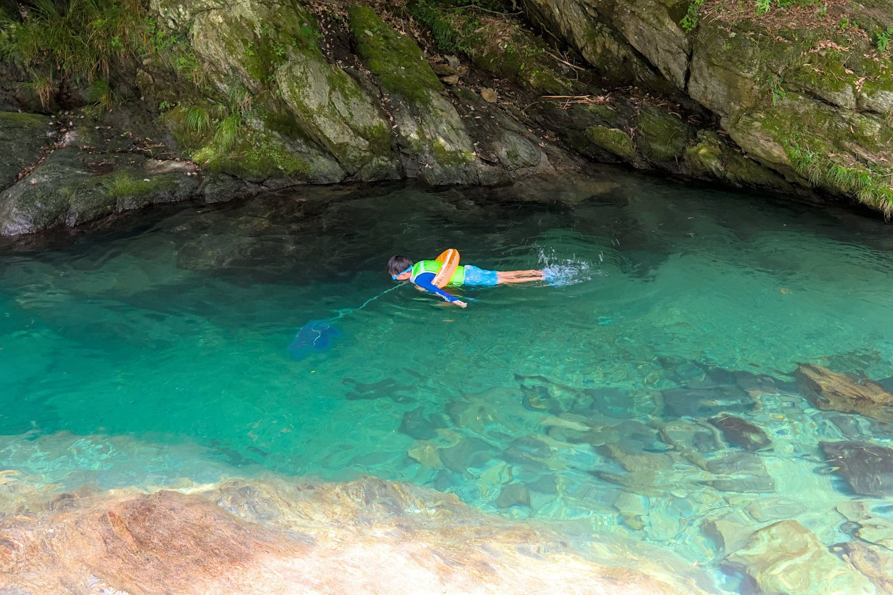
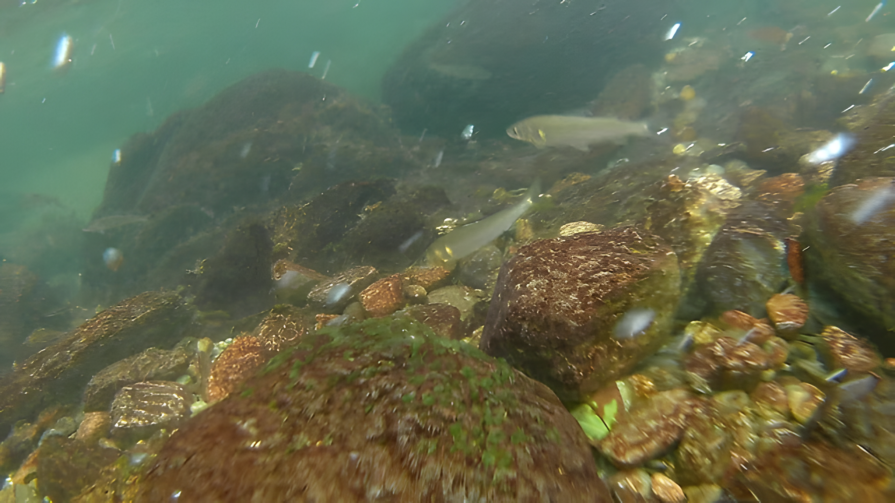
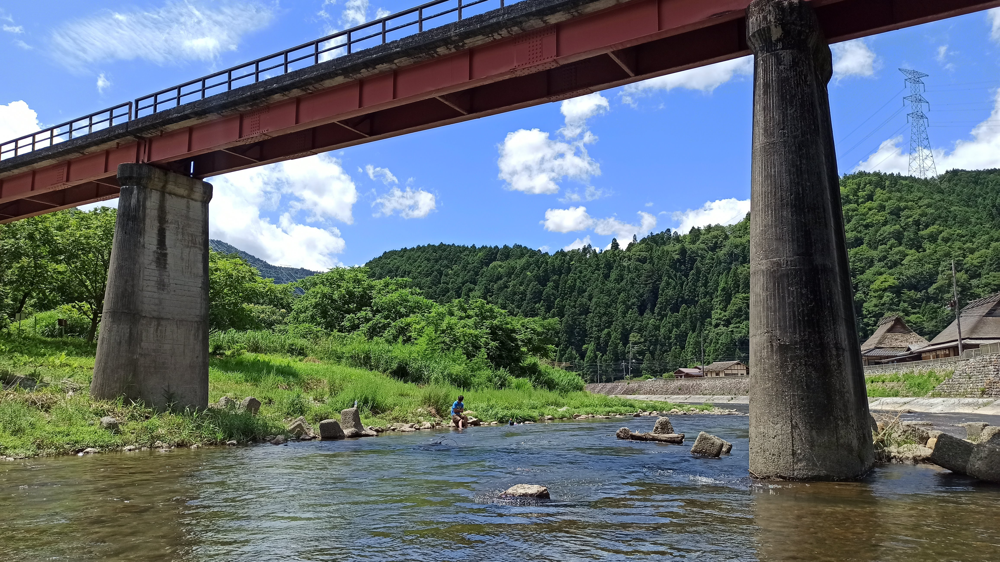
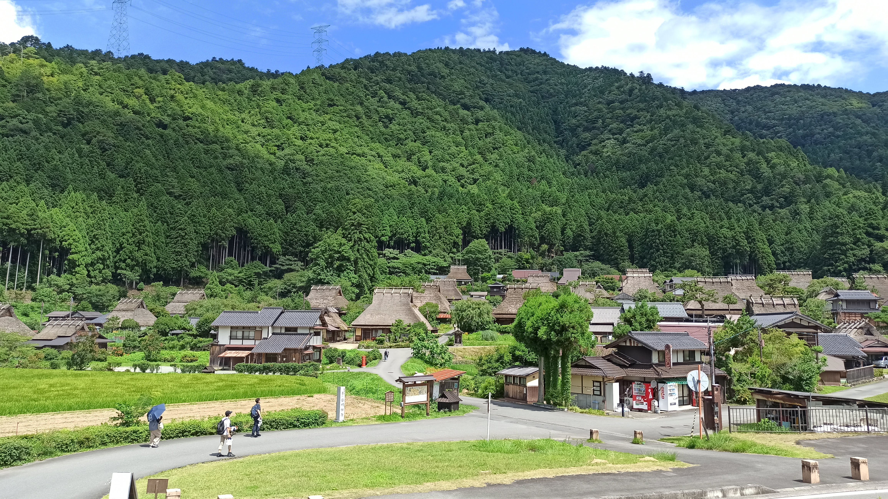

+++
title = '関西 大阪近郊の すすめ日帰り川遊びスポット'
description = '大阪近郊には冷たい清流で川遊びができる場所がたくさんあります。大阪から車で日帰り可能な場所を中心に、一部1泊キャンプと組み合わせて行けるおすすめの川遊びスポットをご紹介します。'
date = 2025-08-08T06:51:37+09:00
draft = false
images = [ 'images/008.jpg' ]
js = 'js/gmap.ts'
tags = [ '川遊びスポット', '川遊びスポットランキング', '奈良', '和歌山', '京都' , '温泉' ]
+++

暑い夏のアウトドアは涼を求めて高原でのキャンプや海、プールなどが定番ですが、大阪近郊には冷たい清流で川遊びができる場所がたくさんあります。

ここでは、大阪から車で日帰り可能な場所を中心に、一部日帰りでは少し遠いですが1泊キャンプと組み合わせて行けるおすすめの川遊びスポットをご紹介します。

## 関西 大阪近郊日帰り川遊びスポットマップ

日帰り圏内の定義は人によって異なるかと思いますが、大阪の起点としてよく使われる大阪府庁を始点として、車で渋滞の無い時間帯に2時間以内で行ける場所を選びました。

{{< gmap json="river.json" center="{ \"lng\": 135.741518049,  \"lat\": 34.7 }" zoom="8" style="roadmap" >}}

筆者のよく行く奈良県吉野郡が多くなり、ピンがまとめられてしまいましたが、拡大して確認してみてください。

## おすすめの日帰り川遊びスポットランキング

評価項目は、水の透明度、魚の多さ、泳ぎが楽しめるか、川遊びスポットの広さの4項目を★五段階で評価しました。大阪からのアクセス時間とその他特記事項も表に記載しています。

川の透明度や水量は直近の天気に大きく左右されますし、魚の多さも日によって変わるかもしれません。評価はあくまで筆者が行ったときに感じた主観であることはご了承ください。

### 第1位: 奈良県 やはた温泉

| 項目 | 評価 |
| ---- | ---- |
| 透明度| ★★★★★|
| 魚| ★★★★ |
| 泳ぎ| ★★★★ |
| 広さ| ★★★ |
| アクセス| 大阪より車で1.5時間|
| 特記| 温泉あり|

第1位は、奈良県吉野村の山奥、清流の四郷川で川遊びができるやはた温泉です。透明度が高く、エメラルドグリーンの冷たい水は、真夏でも体が冷えて寒く感じることもあるくらい、夏の涼を求めるに抜群のスポットです。

子供でも安心して足がつく浅場で魚を追いかけたり、大人でも足のつかない深い淵を浮輪で流れたりと子供から大人まで楽しめます。深場は相当な深さなので、特に子供はライフジャケット必須です。

魚も多く、水が澄んでいるため、ゴーグルを付ければ大量の魚の中を泳ぐことができ楽しめる川です。

川遊びのあとは温泉に入ってサッパリできるのも魅力ですね。

### 第2位: 和歌山県 猪谷川水辺公園

| 項目 | 評価 |
| ---- | ---- |
| 透明度| ★★★★ |
| 魚| ★★★ |
| 泳ぎ| ★★★★ |
| 広さ| ★★★★★ |
| アクセス| 大阪より車で2時間|
| 特記|

第2位は、和歌山県の日高川町にある猪谷川水辺公園です。ここの魅力はなんといっても広いことです。入口付近の水辺の遊び場では、浅いプールがつながっており、子供も安心して遊べ、川辺は石畳になっているため汚れずに遊べるのもGoodです。

水辺の広場から上流は少し深く、魚がたくさん見られます。下流側はだいぶ先まで行くことができ、やや水の透明度は落ちますが人工的に作られた四角いプールのような場所が終点です。

第1位のやはた温泉、第3位のたかすみ温泉と比べると透明度はやや落ちる印象ですが、広い川で思う存分遊べるのが魅力です。

### 第3位: 奈良県 たかすみ温泉

| 項目 | 評価 |
| ---- | ---- |
| 透明度| ★★★★★ |
| 魚| ★★★★ |
| 泳ぎ| ★★ |
| 広さ| ★★ |
| アクセス| 大阪より車で1.5時間|
| 特記| 温泉あり|

第3位は奈良県の高見山麓を流れる高見川沿いにあるたかすみ温泉です。第1位のやはた温泉、第4位の丹生川上神社とは近場にあり、どれも素晴らしい川遊びスポットです。

たかすみ温泉の魅力は、河原が整備されており汚れずに遊べること、そして水が透明で適度な深さの中に魚がたくさん泳いでいるため、魚を見るには絶好の場所であることです。エリアが狭く限定されているため、目が届き比較的安心できます。浮輪で流れるにも絶好のスポットです。

やはた温泉同様に、遊んだあとは温泉ですっきりできるのも魅力。駐車場は無料ですが、温泉利用が条件となっているためそのつもりで訪れましょう。

これだけきれいで整備され安心できる川遊びスポットですが、狭いのが玉に瑕です。また、安心できるといっても大人が沈むくらいの深場がスポット的に存在するため子供はライフジャケット必須で目を離さないでください。

清流で魚を見ながら川遊びをしたい初心者にぜひおすすめしたい場所です。

### 第4位: 奈良県 丹生川上神社

| 項目 | 評価 |
| ---- | ---- |
| 透明度| ★★★★ |
| 魚| ★★★★★ |
| 泳ぎ| ★★★★ |
| 広さ| ★★★★ |
| アクセス| 大阪より車で1.5時間|
| 特記| 歴史ある神社に参拝|

第4位は奈良県の丹生川上神社です。たかすみ温泉のある高見川、やはた温泉を流れる四郷川の合流地点にある、1300年の歴史をもつ神社、丹生川上神社です。

上述の川遊びスポットのやや下流にある分、透明度はやや落ちますが、魚がとてもたくさんいます！駐車場が狭い分、人が少なめなのもいいですね。

### 第5位: 京都府 美山かやぶきの里

| 項目 | 評価 |
| ---- | ---- |
| 透明度| ★★★★ |
| 魚| ★★ |
| 泳ぎ| ★★★ |
| 広さ| ★★★★ |
| アクセス| 大阪より車で1時間40分|
| 特記| 美山のかやぶき里が見どころ|

最後の第5位は京都の北、山奥の南丹市美山町にかやぶき屋根の日本の原風景を保った集落、美山かやぶきの里。特に冬の雪景色とライトアップが有名な観光地ですが、かやぶきの里の付近を流れる由良川の川遊びスポットです。

駐車場には続々と車が来ますが、観光目的の方がほとんどなので少し外れた由良川沿いはほとんど人が来ず、静かに川遊びを楽しむことができます。

川幅は広く、手前は浅いため足を浸けて歩いたり、川岸にいるとても小さな小魚を網で掬ったりして楽しめます。大きな魚はあまり見られませんでした。奥はそれなりに深く流れもあるため、小さな子どもは近づかず、浮輪で流れて遊ぶにしてもライフジャケットは着ましょう。

川遊びのあとは駐車場でご飯やアイスクリームを食べることができ、美山かやぶきの里で観光も満喫すれば満足度も高い川遊びスポットです。

## まとめ

関西にはきれいな清流がたくさんあり、ここでご紹介した以外もおすすめのスポットはたくさんありますが、水の綺麗さ、川の流れに身を任せながら魚を観察する楽しさ、そして温泉付きということで「やはた温泉」を一番のおすすめとしました！

もう少し手軽に遊べる都市部から近場の公園や、さらに遠くには温泉の出る川やさらに広く泳ぎを楽しめる川などもあるためまた別の記事でご紹介したいと思います。

<!--
## 住宅地から近い日帰り川遊びスポット

### 第1位: 京都府 賀茂川

### 第2位: 大阪府 箕面西公園

### 第3位: 兵庫県 兵庫県立甲山森林公園の仁川

### 第4位: 大阪府 アクアぴあ芥川

## キャンプと組合せておすすめの川遊びスポット

### 第1位: 和歌山県 川湯温泉

### 第2位: 和歌山県 高田自然プール

### 第3位: 奈良県 池郷川
-->
