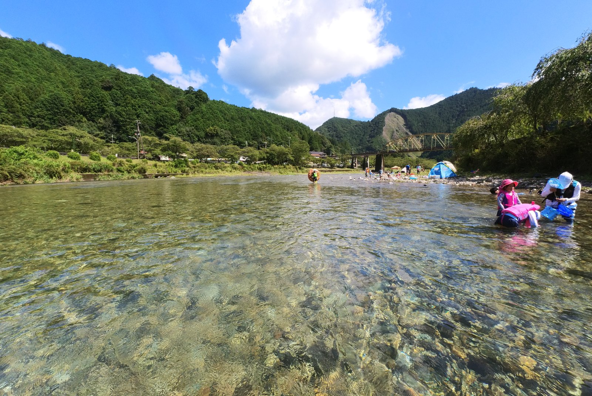

---
categories:
  - アウトドア
  - 川遊び
date: "2025-02-15T23:44:13+09:00"
description: 紀伊山地の奥深く、奈良県と三重県との県境近くを流れる池郷川での川遊びスポットをご紹介します。水がきれいで流れが穏やかな上流は浮輪で流れたり小魚を捕まえたり楽しく遊べます。近くにはダムの下でキャンプができるきなりの郷キャンプ場もあります。
draft: false
images:
  - images/0013.jpg
summary: 紀伊山地の奥深く、三重県との県境近くにある奈良県下北山村のきなりの郷キャンプ場で1泊し、きなりの郷のすぐ近くにある川遊びスポット、池郷川に行ってきました。
tags:
  - 川遊びスポット
  - 池郷川
  - きなりの郷
  - 奈良
title: 川遊びスポット 奈良県 池郷川
---

紀伊山地の奥深く、三重県との県境近くにある奈良県下北山村のきなりの郷キャンプ場で1泊し、きなりの郷のすぐ近くにある川遊びスポット、池郷川に行ってきました。

## アクセス、駐車料金



大阪、奈良から南阪奈道路の終点、新庄出入口まで行き、国道169号を南へ2時間ほどつき進み、池原ダムを左手に見ながら坂を下り、きなりの郷の手前、上池原交差点で右折し国道425号に入り、池郷川にかかる橋を越えたらすぐ左にスロープ状の入口があります。

駐車料金が1,500円と高いですが、きなりの郷でキャンプしている場合は500円に割引してくれます。

## 池郷川について

池郷川は、ネットで調べてもあまり情報が無かったのですが、Googleマップで見ると大日岳の谷あたりから始まり、今回ご紹介する池原橋下の川遊びスポットまで住宅街をいっさい通らず流れてくるようです。そのため、水は非常にきれいで雨上がりにもかかわらず全く濁りの無い清流でした。ここから上流は、沢登りの上級者向けコースとして有名みたいです。

## マップ

川遊びスポットは、駐車場から川へ下りたあたりの池原橋付近、上の図で右から左（北から南）へ流れている部分と、カーブして上流側の図で上から下（西から東）に流れている部分になります。

## 池原橋付近と下流側

駐車場からいくつか川に下りるスロープがあります。（濡れている場合は滑るので注意！）

下りると池郷川の清流が広がります。結構流れは速いです。

池原橋を越えて下流側です。河原は広いのでテントを張ってゆったりスペースを使えます。右後ろに見えているテントの並びはキャンプのようで、ネットには詳細は一切出ていないのですが、キャンプもできるみたいです。

川の中に入り歩いて奥へ行ってみます。真ん中あたりまでは水深は浅く膝程度でしたが流れが早く、気を抜くと転びそうです。下流から見た池原橋です。

河原の方を振り返ります。

アクションカメラを水中に入れてみました。とても澄んだ水ですね。このあたりは流れも早く浅いためか魚は全く写りませんでした。

奥は水深がいきなり深くなりそうな雰囲気で、流れも速いので退散です。戻る途中に下流側の写真を撮りました。

流れの緩やかな場所で何やら子供が魚を捕まえたようです。

ハゼ系の魚ですね。吸盤で水槽の壁にひっついています。

浅瀬には他にも写真には写らないほどとても小さな小魚がたくさん見られます。それにしても水がきれいです。

このあたりでは浮輪に乗って流れて遊んでいる人もいましたが、流れが速いので下に親がいて短距離を子供が流れて遊ぶ感じでした。普段より水量が多いと思うのでいつもはもっと穏やかなのかもしれません。

## 上流側は穏やかな流れで小魚たくさん

池原橋を上流側に越えて、川が西側へ曲がった先まで行ってみると、先程とは様相が変わり、川幅が広く、それなりに一様に深く穏やかな流れになっていました。

深いところで大人の腰の深さ程度と、泳ごうと思えば泳げますし、浮輪でゆっくりと流れるのも安心して楽しめます。

対岸の草むら付近には、1cm程度のとても小さな小魚がうじゃうじゃいます。生命反応に期待してガサガサをしていますが、特に何も捕れなかったようです。

たまに大きな魚も通るのですが、捕まえるのは至難の業でしょう。その代わり、小魚が大漁です。

2時間ほど川遊びを満喫し、冷たい水で寒くなってきたのでキャンプ地のきなりの郷へ戻りました。

写真は撮っていませんでしたが、トイレはあります。着替えはもしかするとトイレにスペースがあるかもしれませんが、入らなかったので分かりません。駐車場と車の中で着替えました。駐車場は結構な料金ですが、とくに施設らしいものも無く、ただの河原といった感じです。

## まとめ

池郷川の川遊びスポットは、とても綺麗な水で自然を満喫し川遊びができます。

池原橋付近と下流側の特に奥は流れが速く、深さもありそうでかつ岩も多いため行かないように注意した方がよいでしょう。

上流側は流れが穏やかで水深もほどほど、小魚もたくさん見れるため子供と遊ぶのは上流側がおすすめです。
