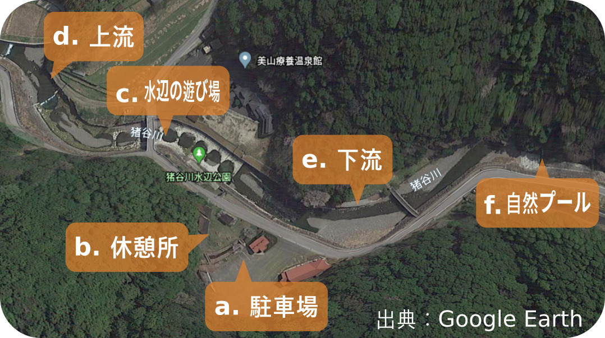
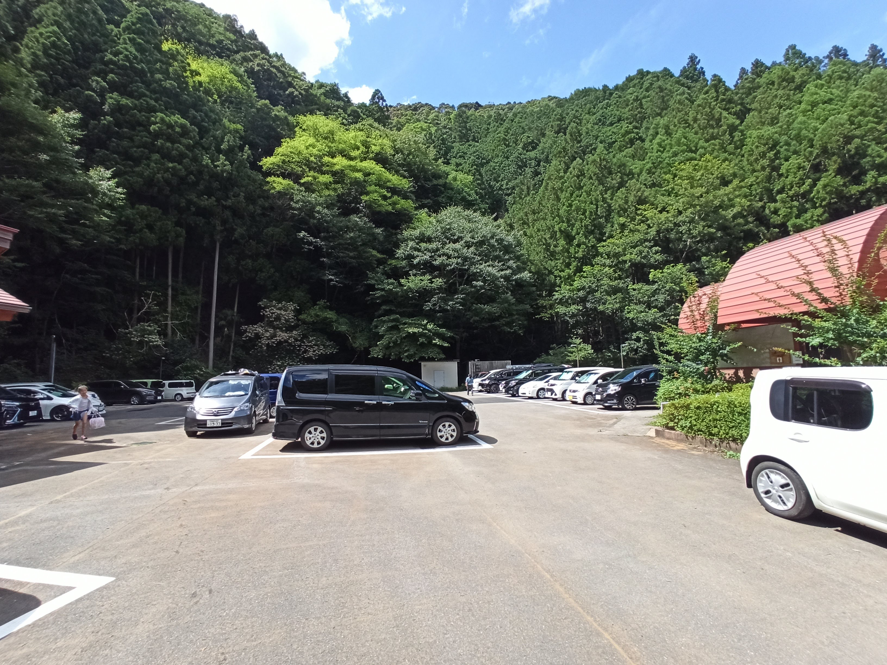
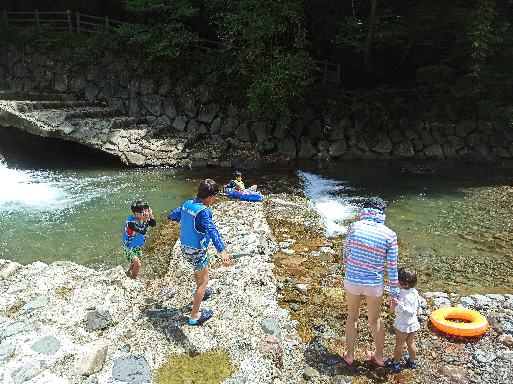

---
categories:
- アウトドア
- 川遊び
date: "2025-02-15T23:42:51+09:00"
draft: false
image: images/IMG_20200812_103120.jpg
summary: 和歌山県の川遊びスポット、猪谷川水辺公園をご紹介します。清流の川をプールのように整備した公園で、小さな子どもでも比較的安全に遊べるおすすめのスポットです。
tags:
- 川遊びスポット
- 猪谷川
- 和歌山
title: 川遊びスポット 猪谷川水辺公園
---

和歌山県の猪谷川水辺公園に川遊びに行きました。

 

## アクセス



E42 阪和自動車道 有田IC
から約50分。国道424号を猪谷川との出会い分岐を左折。

住所：〒644-1231 和歌山県日高郡日高川町大字初湯川１７５１

URL：
[猪谷川水辺公園のご利用案内について](https://hidakagawa-kanko.jp/whats-new/%E7%8C%AA%E8%B0%B7%E5%B7%9D%E6%B0%B4%E8%BE%BA%E5%85%AC%E5%9C%92%E3%81%AE%E3%81%94%E5%88%A9%E7%94%A8%E6%A1%88%E5%86%85%E3%81%AB%E3%81%A4%E3%81%84%E3%81%A6/)

## 猪谷川水辺公園紹介

猪谷川水辺公園のマップです。入り口はa.駐車場からc.水辺の遊び場へ坂を下ります。c.水辺の遊び場が人も多くメインの遊び場となります。上流はマップ左端の滝まで、人の背以上の落差があるのでこれ以上は行けません。下流は自然プールまでが猪谷川水辺公園の範囲です。

### a. 駐車場

道沿いに40台程度駐車できます。無料です。昼前には満車で路駐する車もありましたが、それなりに出ていく車もあるので満車でも待っていれば入れそうです。

トイレも駐車場内にあります。上の写真右手の建物です。

### b. 休憩場

駐車場の隣に芝生スペースがあり、ここでバーベキューができます。お昼頃はテントを立ててバーベキューする人たちでいっぱいでした。

### c. 水辺の遊び場

石畳で整備されており、丸いプールが細い水路でつながっていて水深も深いところで大人の膝くらいなので小さな子供も安心して遊べます。ここが一番人が多いエリアです。

### d. 上流

c\.
水辺の遊び場上流端は落差の小さな段差になっており、その上は普通の河原になっています。さらに少し奥に落差の大きい滝がありこれ以上は勧めません。滝の周辺は水深が深く魚が見られます。

### e. 下流

c\.
水辺の遊び場を下っていくと下流側も普通の河原になります。くるぶしくらいの非常に浅い流れです。

少し進むと岩があり、岩の下側が深くなっています。深いところで大人の背丈くらいあります。魚もいます。

さらに進むとしばらく膝くらいの深さの流れが続きます。おたまじゃくしやカニが見られました。

### f. 自然プール

どんどん下流側に進んでいくと、人工物で作られた滝があり、下側が四角いプールのように囲って整備された自然プールに着きます。

整備されたといっても滝部分は少し崩壊していて、流れに運ばれてきた砂利で水深はそれほど深くありません。子供が泳げるくらいの水深はあります。ここにも魚がたくさんいました。

さらに一段下がった写真手前も四角く囲われプール状になっていたと思われますが、砂利でほとんど埋まっているので泳げるだけの水深はありません。

## まとめ

水深の浅い場所が多く、泳ぐのにはあまり向いていませんが、小さな子供には安心して遊ばせられるところだと思います。山奥なので水はきれいですがさらに山深い奈良県の天川村やたかすみ温泉、はやた温泉あたりほどではないです。完全無料で整備されたきれいな川でこれだけ遊べる場所はそうは無いので素晴らしいスポットです。
