---
categories:
  - アウトドア
  - 川遊び
date: "2025-02-15T23:44:22+09:00"
description: 京都市の市街地から近く、アクセスも良く綺麗な川で遊べる賀茂川沿いの川遊びスポットをご紹介します。
draft: false
images:
  - images/0000.jpg
summary: 京都市の市街地から近く、アクセスも良く綺麗な川で遊べる賀茂川沿いの川遊びスポットをご紹介します。
tags:
  - 川遊びスポット
  - 賀茂川
  - 公園
  - 京都
title: 川遊びスポット 京都府 賀茂川
---

京都市の市街地から近く、アクセスも良く綺麗な川で遊べる賀茂川沿いの川遊びスポットをご紹介します。

## アクセス

京都南ICから北へ車で約32分。賀茂川沿いにある鴨川公園運動場に駐車場（無料）があります。公園名は賀茂川ではなく鴨川！？



## 賀茂川川遊び場マップ

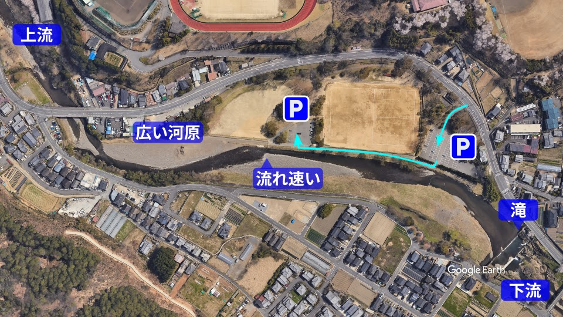

駐車場は、入口すぐに100台程度止められそうなエリアと、奥にさらに20台程度と広いですが結構車はいますね。奥の駐車場は川沿いにすれ違いのできない細い道を通る必要があります。

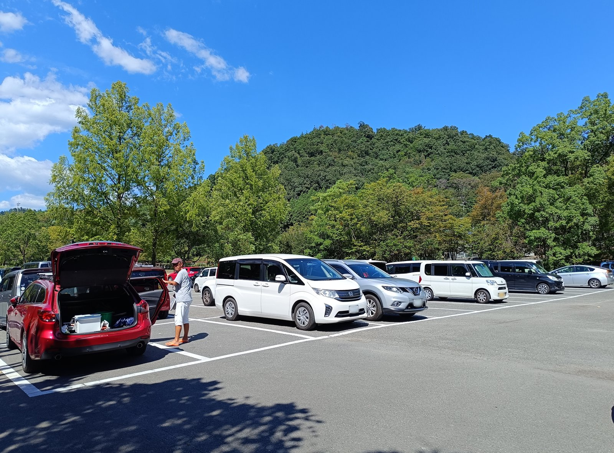

上流は府道61号の橋の下あたりから下流は滝の手前あたりまでが川遊びしている人が多いエリアです。

## レポート

夏も終わり少しずつ涼しくなってきた頃、今年最後の川遊びに行きました。車で鴨川運動公園に向かいます。

ちなみに京都には、鴨川と賀茂川、2つの「かもがわ」が存在します。同じ川なのですが、上流が賀茂川、途中で高野川と合流した下流側が鴨川です。そして今回行くのが賀茂川沿いにある鴨川公園運動場です。ややこしいですね。

駐車場に車を停めてすぐ目の前の川に早速入ってみます。このあたりは浅いですね。

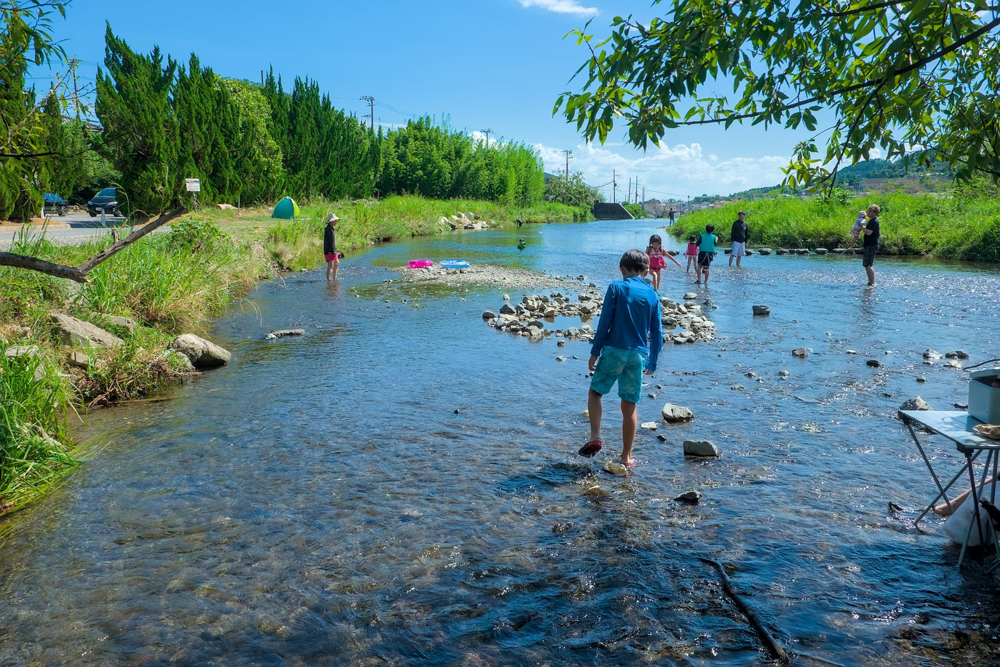

京都中心部からそれほど離れていないですが水は思ったよりきれいです。

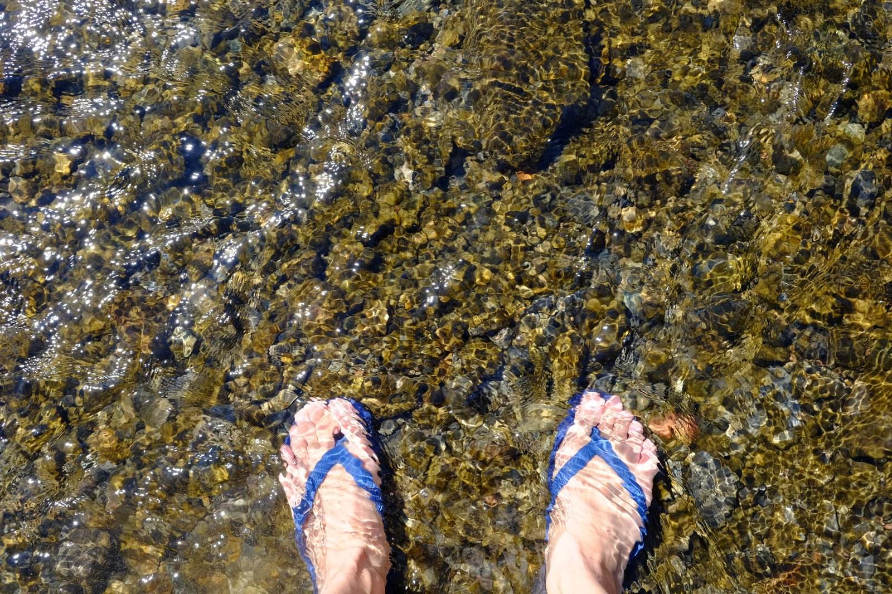

駐車場から下流側です。先に段差があり、滝のように落下していくのでこの手前までが川遊びできるスポットとなります。流れは緩やかになり深さも腰あたりまであるので泳ぐには良い場所ですがあまり先端に近づかないよう注意しましょう。

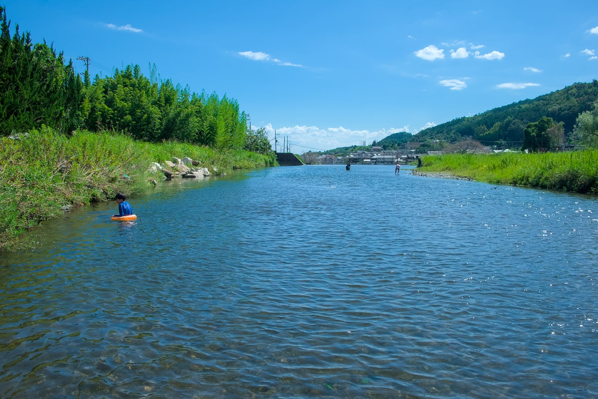

2つの駐車場の間あたりです。ここは川幅が狭く流れがあります。奥のカーブ開始あたりに白い波が立っていますが、このあたりから浮輪で流れて楽しめます。水深はそれほど深くないので子供でも比較的安心して遊べると思います。

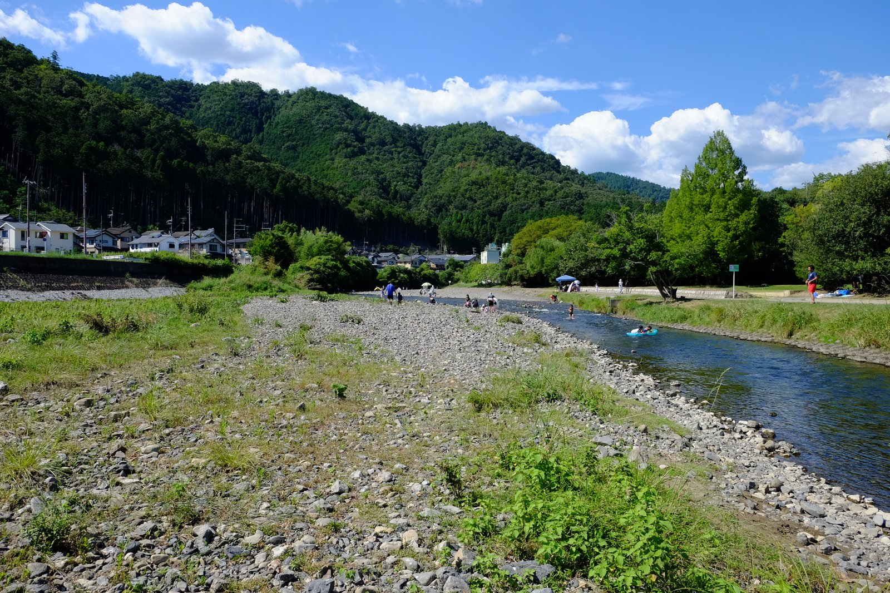

上流側は石が敷き詰められた広い河原があり、テントを張っている人もちらほら見かけます。このあたりは川幅が広くなり、浅いのでカニや小魚を追いかける子供達が少し遊んでいるくらいで泳ぐことはできません。

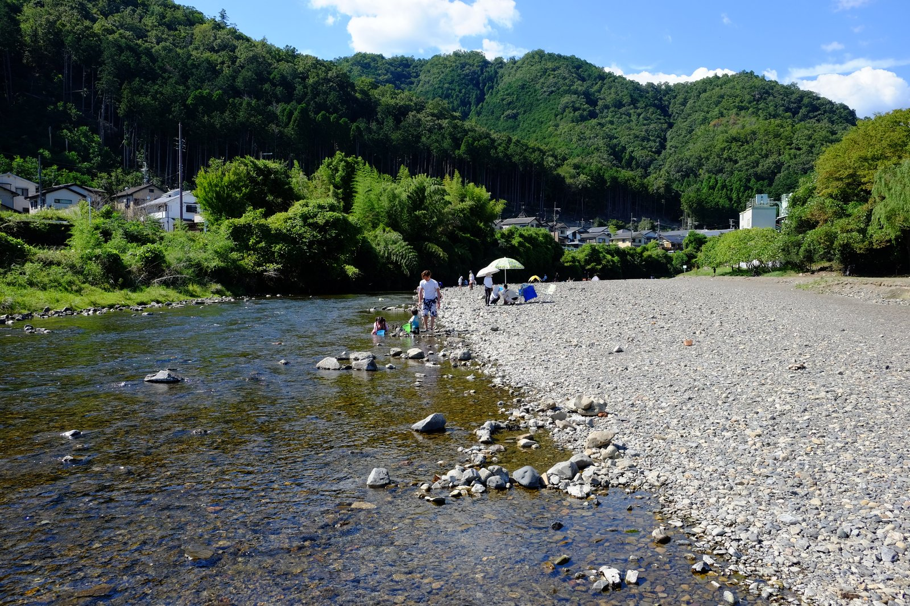
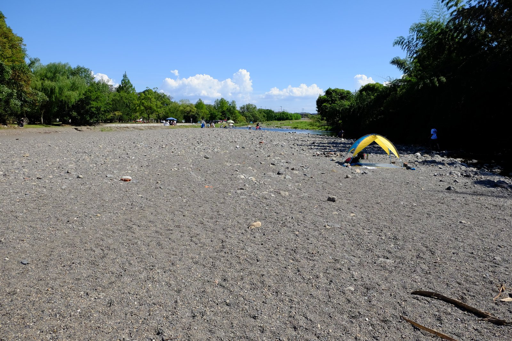

上の写真で木陰になっているあたりからまた川幅が狭く、少し深くなり流れも出るので、午後には日陰になることもあり泳いでいる人も多かったです。

上流側、橋の手前あたりが一番深くなっているようでちょうどいい小岩からジャンプで飛び込む子供の姿も見られます。川は、さすがに透明ではありませんがまあ泳いでもいいかな、という程度にはきれいです。

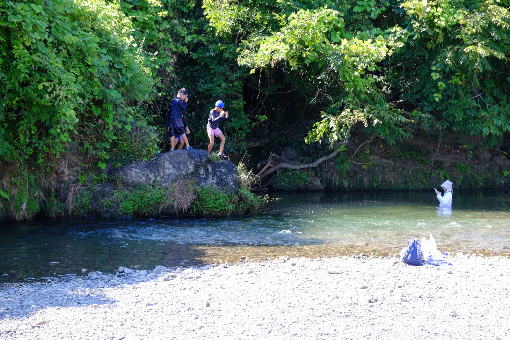

橋から先は人が少なくなりますが、ここまで来ている人もいますね。

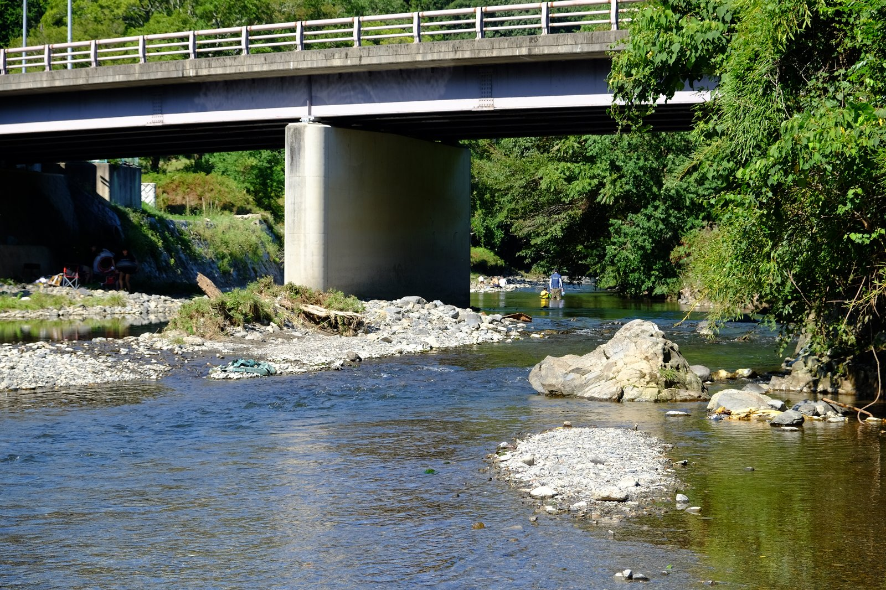

下流側から上流まで遊びつつ歩いていき、最後は流れて下ります。子供でも足が付き安心しながら流れにまかせて泳いでいけるのがいいですね。

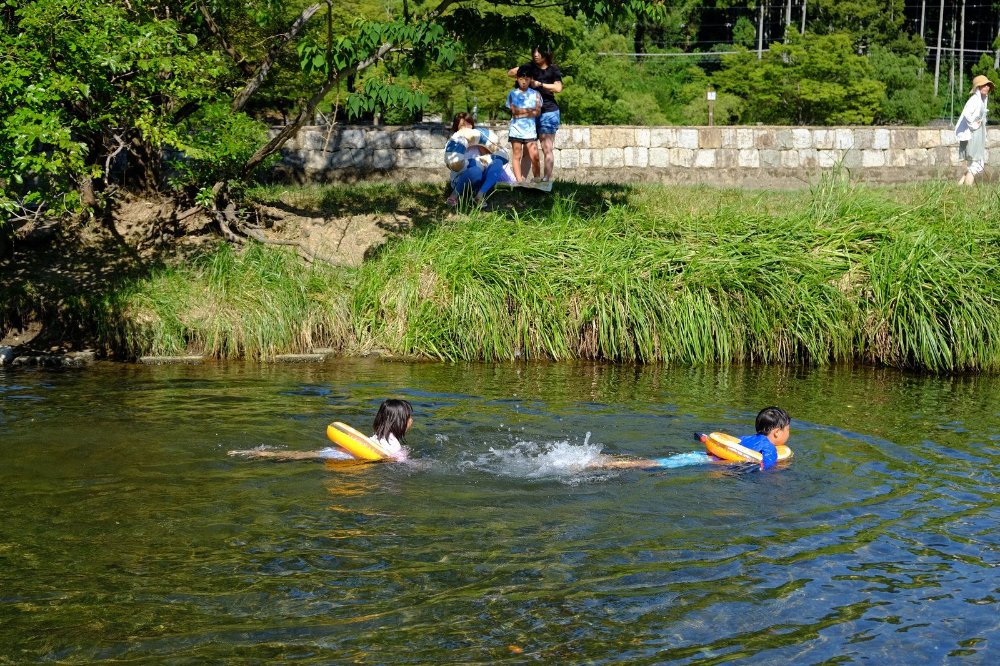

子供達は優雅に流れていきます。小魚も結構いるので網を持ってくればさらに楽しめたかもしれません。

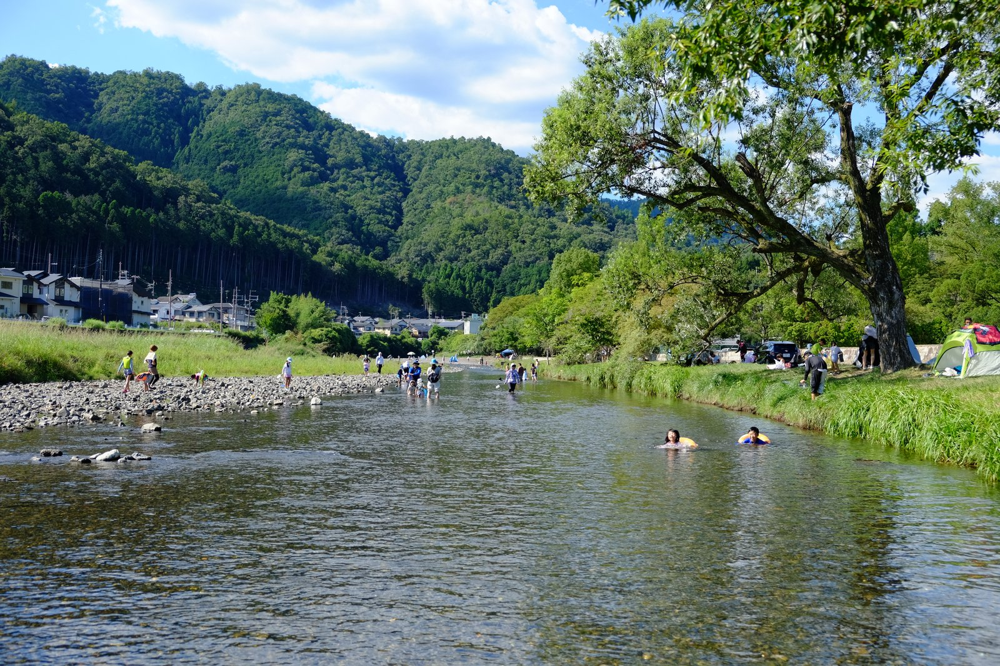

一通り遊び満喫しておしまいです。

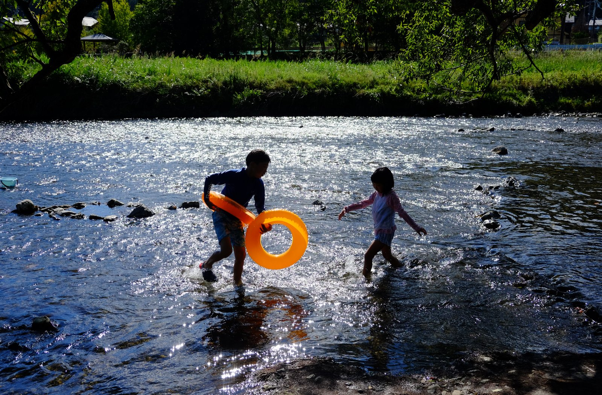

全体的に浅く流れは穏やかなので幼稚園、小学生低学年くらいの子供がいる家族におすすめできるスポットでした。
