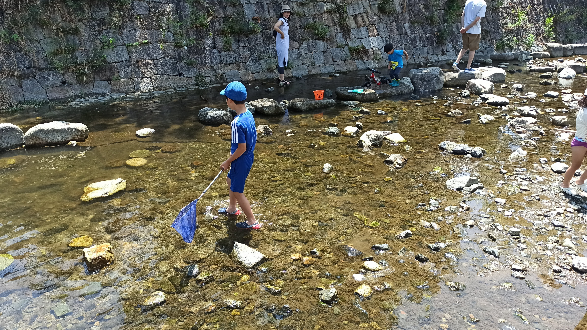

---
categories:
  - アウトドア
  - 川遊び
date: "2025-02-15T23:43:50+09:00"
description: 大阪箕面市、住宅街の中にある箕面西公園は浅い川に小魚がたくさんいる、手軽に行ける川遊びスポットです。なんとオオサンショウウオがいてびっくり！
draft: false
images:
  - images/IMG_20220709_105415.jpg
summary: 大阪箕面市、住宅街の中にある箕面西公園は浅い川に小魚がたくさんいる、手軽に行ける川遊びスポットです。なんとオオサンショウウオがいてびっくり！
tags:
  - 川遊びスポット
  - 箕面川
  - 大阪
  - 公園
  - オオサンショウウオ
title: 【川遊びスポット】大阪 箕面西公園でオオサンショウウオに遭遇！
---

夏は清流で川遊びを家族で楽しんでいます。大阪近郊だと奈良県から和歌山県にかけての紀伊山地に非常にきれいな川がたくさんあり、滋賀県の湖西あたりもおすすめです。

しかし遠いためなかなか頻繁には行く気にならず、近場で公園に行くような感覚でちょっと楽しめる場所として大阪府箕面市にある箕面西公園をご紹介します。

## アクセス



電車で：阪急箕面線牧落駅から徒歩8分

車で：国道423号御堂筋を箕面方面へ行き国道171号を左折、国道171号から箕面市役所方面へ右へ折れ細い道を進みます。最後は対面通行が難しいくらい細い道幅なので注意。駐車場は2箇所あり各30台程度停められます。料金は無料です。

## 箕面西公園マップ

駐車場は箕面川を挟んで公園の南側に1箇所、公園の西側、野球場の方に1箇所あります。公園の東側に箕面川が流れ、広い階段で川へ降りられるようになっています。普通の公園なので遊具も少しあり、2022年7月9日現在は工事をしていて今後遊具が増えていくかもしれません。

## 公園に流れる箕面川

箕面西公園の魅力は何と言っても公園に流れる箕面川で川遊びができることでしょう。広い階段から川へアクセスでき、階段に荷物を置いたり階段下の河原や階段上の公園の芝生に簡易テントを建てる人もいました。

川は全体的に水深は非常に浅く泳ぐことはできません。足を浸けて魚やカニ、アメンボなどを採ったり観察するような遊び方になります。水量の少ない日でしたが階段直下はこんな感じです。

川の上流側は大人の膝下くらいまで水深があり、魚が多いです。

川下の方も魚採りができます。

下の写真は少し水量が多かった5月頃、下流側の写真です。

## 遊具やテニスコートも

川へ下る階段を挟んでテニスコート側、その反対側にそれぞれ小さな広場があり少し遊具があります。テニスコート側の広場です。芝になっています。

反対側の広場です。見えている道路は車道ではなく、交通公園のような歩道程度の幅の道です。遊具は小さな子供がちょっと遊ぶくらいのものがあります。

## 浅くて清流とはいえないが魚はいっぱい

朝や夕方にはカニを見ることもできるのですが、今回は昼前頃に到着したので早速、川の上流側で魚を追いかけます。

住宅街にある公園なので水はそれほど綺麗な清流とは言えず、藻がたくさんあってほんの少しにおいがする感じです。足を浸けての川遊びは全然気にならない程度ですがたとえ水深が深くても泳ごうとは思わない水質です。水は透明ですが人が歩くと藻と泥が舞いあがりこのとおり濁ります。

とはいえ、子どもたちは元気に魚採りをしていて夏の暑い日に足を浸けて涼めるのは気持ちが良いです。

まさかの嫁さんが大きな魚を捕まえました！グロテスクな外見に手のひらサイズの大きな魚です。カジカでしょうか。

もう一匹追加、こちらはオイカワ！？

## オオサンショウウオを発見！

子供が大声をあげた先を見てみると、なんとオオサンショウウオ！目を疑いました。ノソノソと歩いています。

後で調べたところ、箕面川にはオオサンショウウオが200匹程度いるみたいです。ここ箕面西公園はオオサンショウウオが見られることで有名みたいですね。階段から上流側の対岸、コンクリートで歩道のように固められたところの下が住処みたいです。ノソノソと入っていきたまに顔を出していました。

オオサンショウウオは清流にしか生息できないと聞いていたので、こんな住宅街の川にいるとは、、、驚きです。

## まとめ

箕面西公園の川は水深が浅く泳ぐことはできませんが、魚やカニなどを採って遊ぶにはちょうどよいところです。そして、運がよければなんと特別天然記念物であるオオサンショウウオが見られるというなかなか貴重な場所です。大阪市内からもアクセスがよく、気軽に行けるおすすめの川遊びスポットです。
