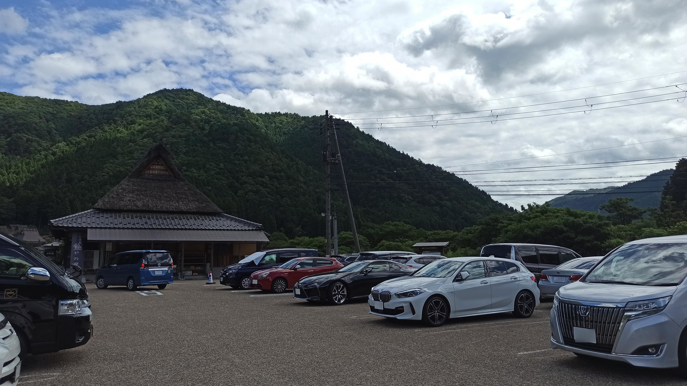
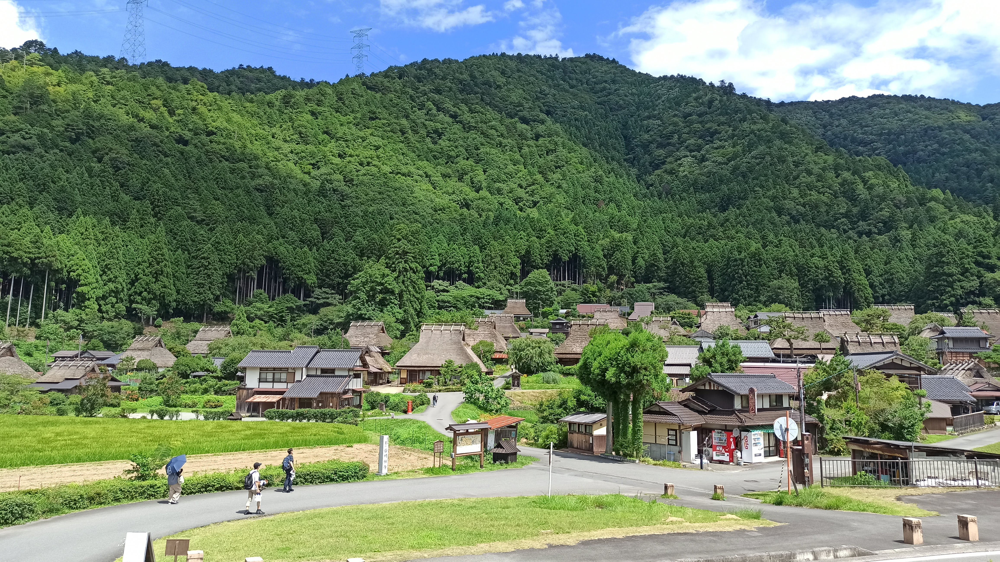
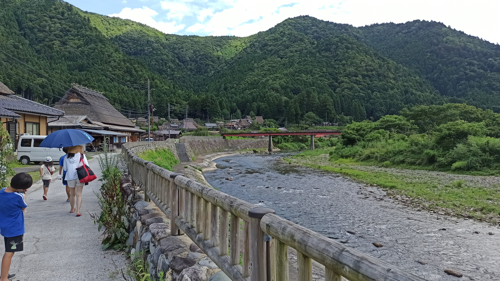
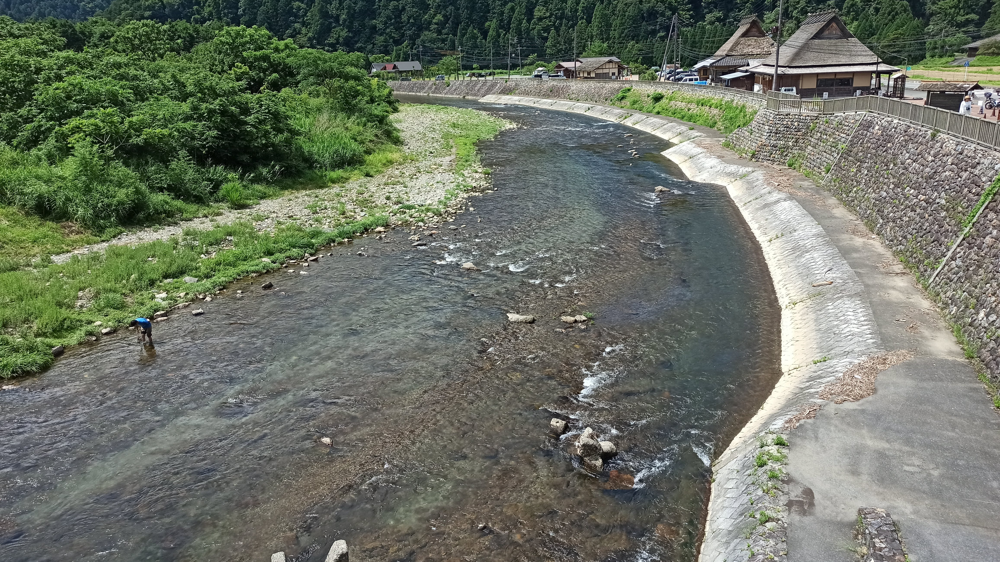
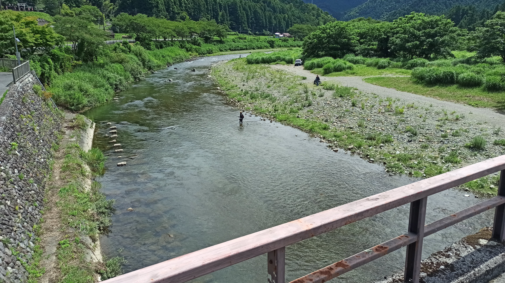
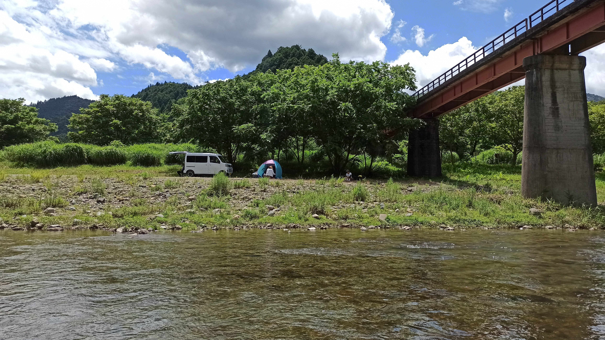
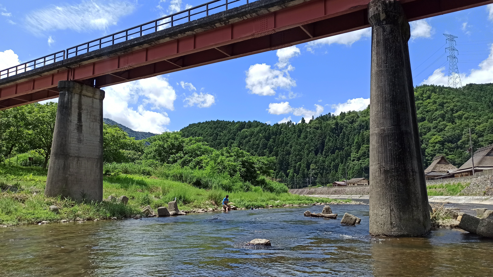
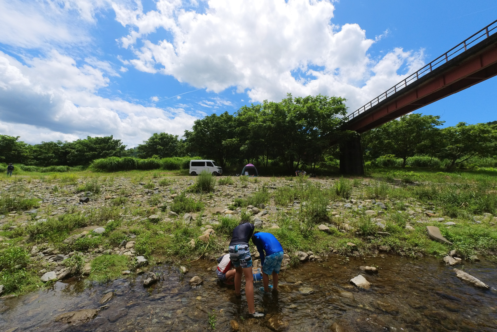
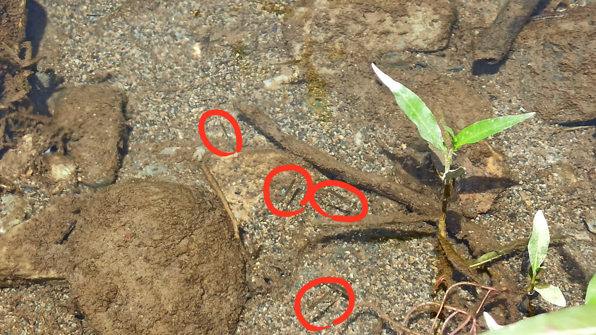
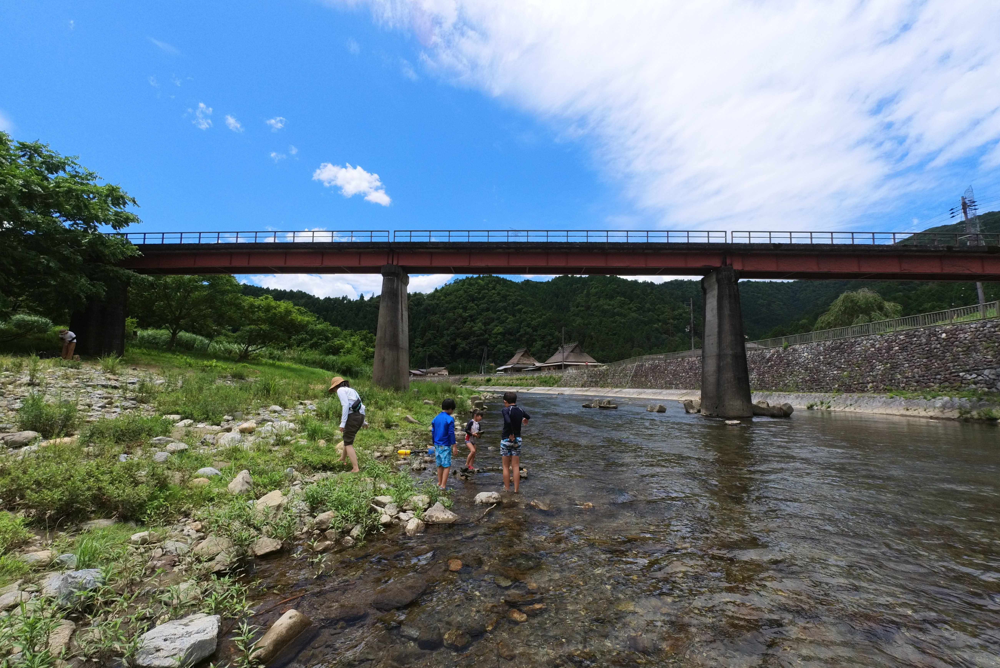

---
categories:
  - 自転車
  - bike
date: "2025-02-15T23:43:52+09:00"
description: 京都の北、山奥の南丹市美山町にかやぶき屋根の日本の原風景を保った集落があります。深山かやぶきの里を流れる由良川の川遊びスポットをご紹介します。
draft: false
images:
  - images/130.jpg
summary: 京都の北、山奥の南丹市美山町にかやぶき屋根の日本の原風景を保った集落があります。深山かやぶきの里を流れる由良川で川遊びをしました。
tags:
  - 自転車
title: 川遊びスポット 京都 美山かやぶきの里
---

暑い夏が続きますが、夏は海や川で遊べる楽しい季節でもあります。関西で清流の川といえば奈良県、三重県、和歌山県に広がる紀伊山地の方面、川湯温泉やたかすみ温泉、天川村のキャンプ場あたりに行っていましたが今回は京都の山奥、かやぶき屋根の家が並ぶ観光地の前を流れる由良川に行ってみました。

## 美山かやぶきの里と由良川

京都の北、山奥の南丹市美山町にかやぶき屋根の日本の原風景を保った集落があります。かやぶき屋根の集落は岐阜県の白川郷や五個荘が有名ですが関西からアクセスの良い場所にもこのような風景が見られるのは驚きです。国の重要伝統的建造物群保存地区に選定されています。

かやぶきの里は観光地化しており、多くの人は茅葺き屋根の集落を散策して食事をしたり、冬の夜はライトアップされた雪景色を見たりといった楽しみ方をするのですがすぐ傍に流れる由良川もなかなかの清流で釣りや川遊びができます。

## アクセス



大阪、京都方面から京都縦貫自動車道 園部ＩＣより府道19号を北進し約30分、国道162に突き当たり右へ、少し進み左折し府道38号鞍馬街道へ入り北へ約10分進むと右手に大きな駐車場があります。

## マップ

駐車場からかやぶきの里入口付近まで歩き、由良川にかかる小さな橋、長除大橋を渡ると河原へ降りることができます。橋を渡らずに川へ下る階段がいくつかありますが、いきなり深いので橋の向こう側がおすすめです。

## 観光地なのできれいな駐車場

途中までの道のりは人の少ない山奥の田舎といった感じですが、美山かやぶきの里は結構有名な観光地で、しっかりとした駐車場があります。（有料）

## かやぶき屋根の村

川へ向かう人はほとんどいなく、みんな茅葺き屋根を見るために来ています。日本むかし話に出てきそうな風景です。

川遊びのあとに散策をしたかったのですが子どもたちが興味無しだったので入口手前から見るだけです。

## 橋を渡って川へ降りる

駐車場から川に降りる階段がありましたが、コンクリートの遊歩道（？）からいきなり深い川になるので川に入ることができなさそうです。

川沿いに上流を見ると赤い橋がかかっているのが見えます。

細くて小さな橋ですが、長除大橋という名前です。驚いたことに軽自動車が橋を渡っていきました。鮎釣りの人が河原まで車を乗り付けるようです。車幅ぎりぎりでなにより車の重量を支えられるのかとハラハラ見て、車が渡り終えた後に歩いて渡ります。

橋の上から下流側です。家のような建物が駐車場にあるお食事どころです。

上流側です。

橋を渡ると小石がごろごろした河原に降りることができました。

## 人が少ない穴場スポット

川の水はなかなかきれいです。手前側は浅くくるぶしから膝下くらいの深さで、奥側は深いところで腰くらいでしょうか。奥へは行っていないのでもう少し深い場所もあるかもしれません。全体的に流れが早く浅いので泳ぐよりは歩いて魚を探したり涼む感じでしょうか。

川の中央あたりから川岸を見た写真です。私達以外は1組家族がいて、車で来た鮎釣り師が2人いました。

人が少ないので静かな雰囲気で落ち着きます。古くて小さな橋が味わい深い雰囲気を出しています。

## カエルと小魚がたくさん。大きな魚は少ない

川岸にはたくさんのカエルや小魚がいました。子どもたちは早速捕まえようとします。

小魚は2〜3センチ程度の非常に小さくて写真を撮ってもよくわからないくらいのサイズです。青丸が小魚です。

小魚がたくさんいるし、釣り師もいたので深場には魚がたくさんいるのでは？と期待しましたが奥に行っても魚の気配がありません。アクションカメラを沈めてみましたが全く何も映らず。鮎とかいるのでしょうか？

あまり泳げる感じでは無いため、小魚を捕まえ、バシャバシャ歩き回って石を積んでみたりして遊び、河原でお昼ご飯を食べたあと駐車場の売店で豆腐ソフトクリームを食べて帰りました。

## まとめ

美山かやぶきの里前の由良川は清流ですが浅く流れも速いためあまり泳ぐには適していないと思います。小魚がたくさんいたので目の細かい網があると捕まえられます。人が少ないため場所取りとか考える必要が無く静かで落ち着けます。一日中遊ぶには飽きてしまうので2,3時間川遊びをしてかやぶきの里の観光を合わせるのがよさそうですが子供にとっては茅葺き屋根に興味を持ってくれるか微妙ですね。

