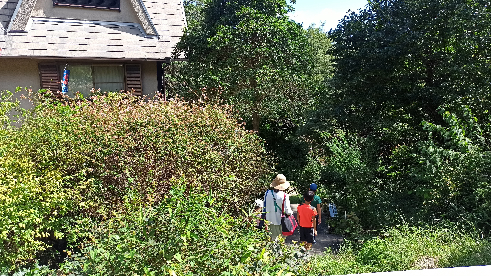

---
categories:
  - 自転車
  - bike
date: "2025-02-15T23:43:55+09:00"
description: 川遊びスポット、兵庫県立甲山森林公園の脇を流れる仁川をご紹介します。浅くて小さな川遊びスポットですが、都会に近いながらなかなかの清流で、魚もたくさんいて人も多くないのでゆっくりできる穴場です。
draft: false
images:
  - images/001.jpg
summary: 兵庫県立甲山森林公園の脇を流れる仁川に行きました。浅くて小さな川遊びスポットですが、都会に近いながらなかなかの清流で、魚もたくさんいて人も多くないのでゆっくりできる穴場です。
tags:
  - 自転車
title: 川遊びスポット 兵庫県立甲山森林公園の仁川
---

川遊びの季節も終わりが近づいてきました。今年も最後の川遊びと近場で気になっていた兵庫県立甲山森林公園の脇を流れる仁川に行ってみました。

浅くて小さな川遊びスポットですが、都会に近いながらなかなかの清流で、魚もたくさんいて人も多くないのでゆっくりできる穴場です。駐車場からななり歩くので行きづらい場所になっています。

## アクセス

兵庫県、六甲山の東麓あたりにあります。中国道宝塚ICから西へ進むか阪神高速神戸線西宮出口から北へ進みます。どちらとも高速を降りてから20〜25分程度で兵庫県立甲山森林公園の駐車場に着きます。



駐車場は公園南側の道路沿いにあり、無料ですがそれほど広くなく、4ヶ所に散らばっています。入口に一番近い駐車場は満車近くになっていました。駐車場は無料です。

## 兵庫県立甲山森林公園と仁川のマップ

駐車場からは仁川までは歩いて約30分かかります！公園は森の中をハイキングするような道が続いています。たくさんの人がウォーキング、ランニングをしているので運動のつもりで川まで行きましょう。

甲山森林公園の北を走る道路に出ると、さらに車道を歩き、レストランのような建物の脇に河原に下る階段があります。河原はそれほど広くないですが砂地に芝が生えておりきれいな河原です。

## 駐車場から仁川までは徒歩30分！

昼前に駐車場に到着しました。早速甲山森林公園に入ると、立派な管理事務所が目に着きます。仁川まで歩いて約30分かかること、仁川は公園の管理外である注意書きの看板が設置されていました。

公園を北へ進むのですが、すこし周り道をしてみくるま池を通ってみます。遊べるようなところではなく、橋の上から池を眺めるだけなのですが、人が通るとカメ、コイ、カモがどんどん湧いて寄ってきます。餌付けされているのでしょう。なかなか面白い光景です。

公園内はこんな感じの道が続きます。子供が遊びに来るというよりはウォーキングやランニングをする人たちで賑わっています。

途中の展望台からは富士山のようにきれいな山形をした甲山がよく見えます。山頂を目指したいところですが家族から反対され見るだけにします。

やっと公園の北側出口まで着きました。

さらに車道を歩きます。

右手に建物が見え、脇に小さな階段があり、そこを降りると河原に到着です。

## 小さな川だけど清流です

河原は明るく開け、砂地に芝が生えているので比較的汚れにくいのが好感触です。

川幅は広い所でも4,5mほどでしょうか、深いところでも大人の膝上くらいまでと小さな川です。

川の水は少し泡が流れてきたりするのですが、透明度は高く意外ときれいです。川底が砂地なので濁りにくいのかなと思います。

魚も泳いでいます、指くらいのサイズの魚がちらほら見かけ、ニジマスと思われる大きな魚も一匹見ました。よく見るとシラスのような小魚がたくさんいます。

網で掬うと網目から抜けてしまいますが何匹か捕ることができました。

近くに木陰もあるのでテントが無くても大丈夫でした。木陰でお昼ご飯を食べて少し遊んだら撤収です。帰りの道のりが長いですね。。。

## まとめ

兵庫県立甲山森林公園の北側を流れる仁川は、都会に近い割には綺麗な清流で魚捕りを楽しめる川遊びスポットです。水深は浅いので泳ぐことはできませんが、人もそれほど多くないのでのんびり川遊びを楽しめました。

