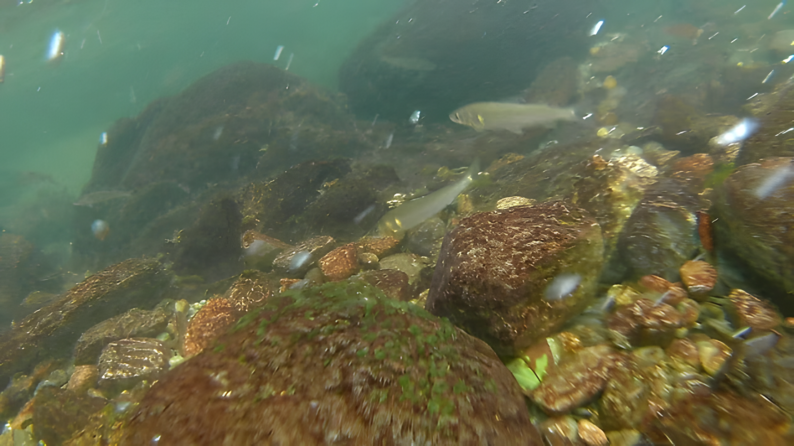
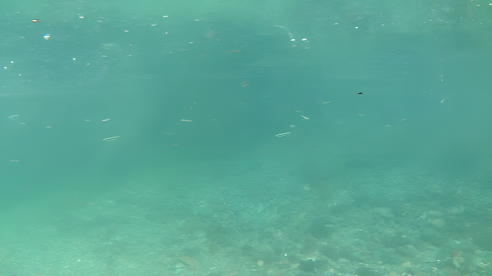
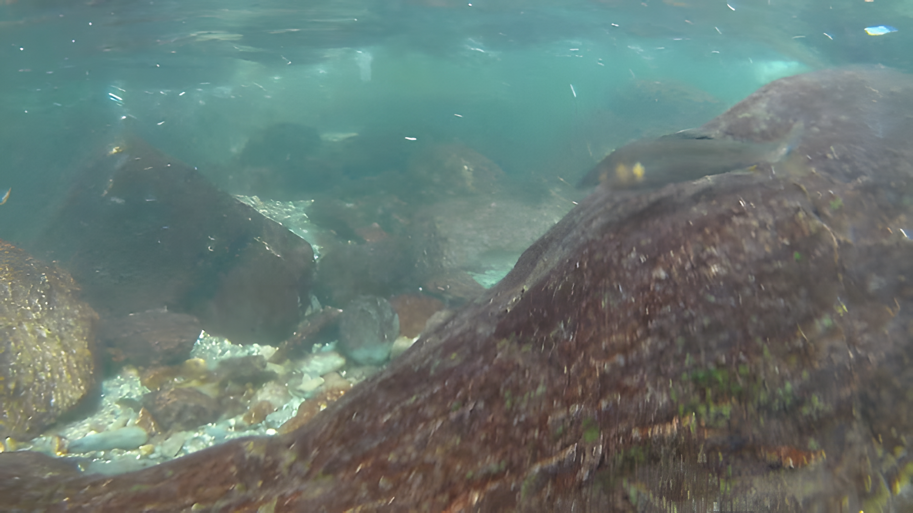

---
categories:
  - アウトドア
  - 川遊び
date: "2025-02-15T23:43:22+09:00"
description: 奈良県の高見山地に流れる高見川、日高川、四郷川の合流地点に歴史ある丹生川上神社で川遊びができます。清流に魚がたくさん見られる川遊びスポットをご紹介します。
draft: false
images:
  - images/07.webp
summary: 暑い夏は海も良いけど、清流での川遊びも楽しいですね。ここ近年は毎年東吉野村のたかすみ温泉ややはた温泉で川遊びをしましたが、途中にある丹生川上神社が気になっていました。調べてみるとここでも川遊びができるみたいなので行ってみました。
tags:
  - 川遊びスポット
  - 高見川
  - 奈良
  - 神社
title: 川遊びスポット 丹生川上神社
---

暑い夏は海も良いけど、清流での川遊びも楽しいですね。ここ近年は毎年東吉野村のたかすみ温泉ややはた温泉で川遊びをしましたが、途中にある丹生川上神社が気になっていました。調べてみるとここでも川遊びができるみたいなので行ってみました。

## アクセス

大阪方面から、南阪奈道路から国道165を東へ行き、橿原市の藤原宮跡を越えて国道166との分岐で国道166に入ります。

国道166を南東に進み宇陀市を越えて県道16号、220号と南に進み高見川沿いに日裏川、四郷川との出会いで左手に神社があります。道路沿いに目立つので見逃すことは無いと思います。



### 駐車場

参拝専用駐車場と川遊び用の駐車場があり、川遊び用は13台程度とあまり多くありません。到着が15時と遅かったので入れましたが、朝ゆっくりくらいの到着だと入れないかもしれません。

駐車料金は¥1,500と少し高い印象ですが、神社1300年前からあるという歴史ある神社への参拝を兼ねると思えば安いものでしょうか。

## 丹生川上神社について

丹生川上神社の成り立ちについて、
[公式ホームページ](https://niukawakami-jinja.jp/about/ "神社について")
によると、奈良時代、1300年前に建てられたようです。

> 今を去る事1300年余り前、第40代天武天皇白鳳4年（675）「人聲の聞こえざる深山吉野の丹生川上に我が宮柱を立てて敬祀らば天下のために甘雨を降らし霖雨（長雨の事）を止めむ」との御神教により、創祀せられました。

しかしながらその後所在不明となり、明治時代に再調査がなされた結果、大正11年にこの神社が丹生川上神社とされた経緯が書かれています。

## 神社境内

写真が一番大きな建物、拝殿です。この奥の階段を登ると本殿があるようですが、登ってよいのかよくわからず、ここから見るのみにしました。

拝殿横に叶えの大杉という大きな杉があります。目の前に絵馬がかけられています。

## 高見川で川遊び

神社から道路を渡ると高見川が見下ろせます。

きれいな清流です。駐車場が狭いためか人はあまり多くなく広々とスペースが使えそうです。

階段を降りると河原に出ることができます。

河原は石がゴツゴツしていますが、ところどころ平らな砂地もあり、テントを張ったりできます。

水はきれいです。たかすみ温泉ややはた温泉の方が上流なのと、すぐ上に東吉野キャンプ場があり、そこでもたくさんの人が水遊びしているので気持ち透明度は劣るかもしれません。

お約束で子供達はまずは流れます。

## 川の中は魚だらけ！

ゴーグルをしてアクションカメラを持って川の中を見ながら流れてみます。

川の中は魚だらけで、小魚もいれば大きな魚もたくさんいます。

人が少ないからか、今までで一番魚がたくさんいる川でした。

水深はところどころ大人も足がつかない場所があるので子供はライフジャケット必須です。下流側は川幅が広くなり流れが緩やかで全体的に浅くなるので流される心配は少ないと思います。

到着が遅かったので1時間半ほど遊び、16:30には帰路につきました。

## まとめ

丹生川上神社での川遊びは、駐車場が小さいだけに駐車できれば人混みを避けて川を広々と使えます。魚のたくさんいる清流をひろびろと使えるおすすめのスポットです。
