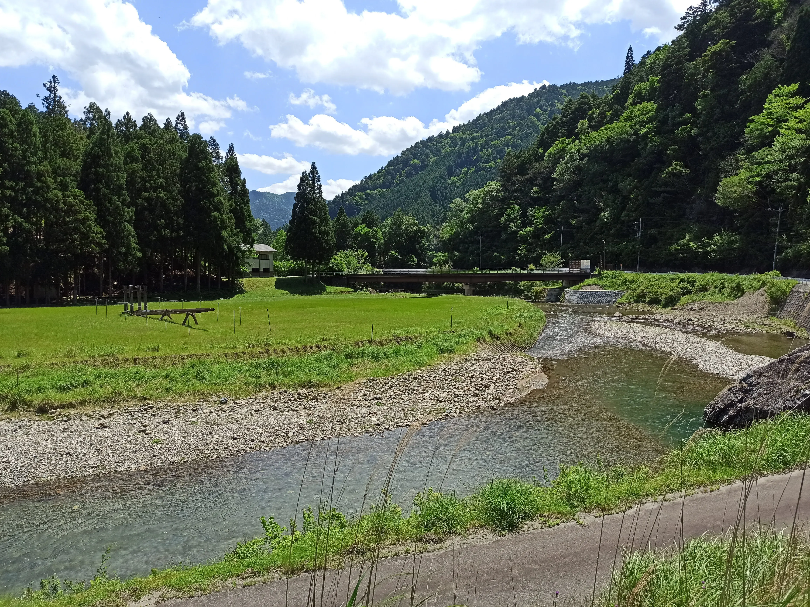
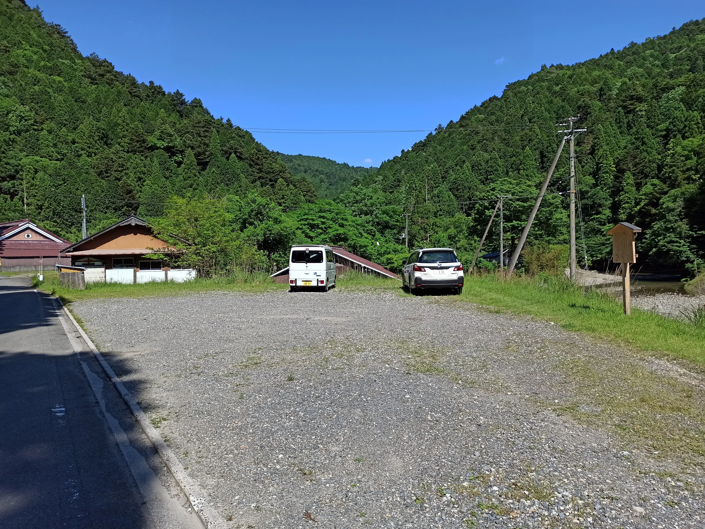
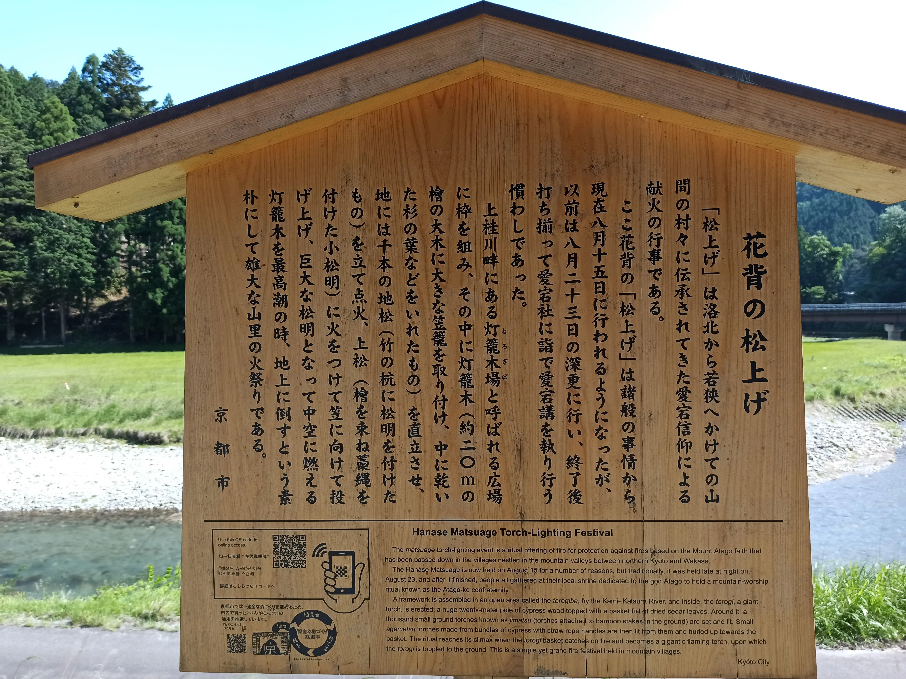
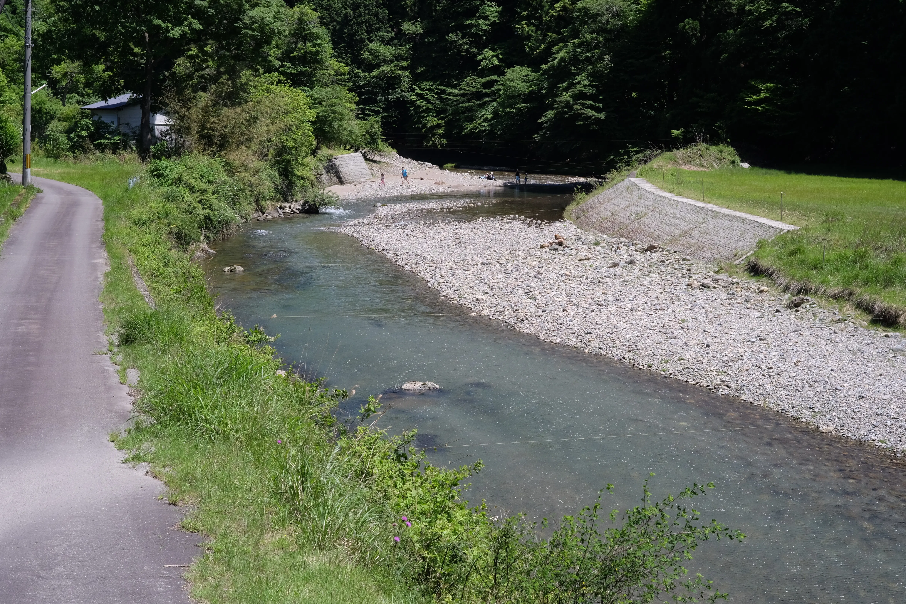
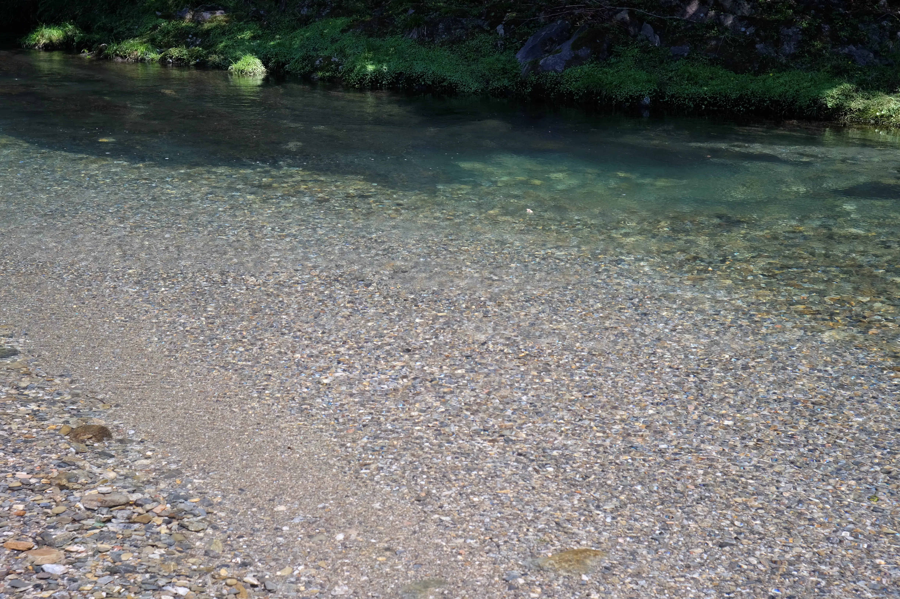
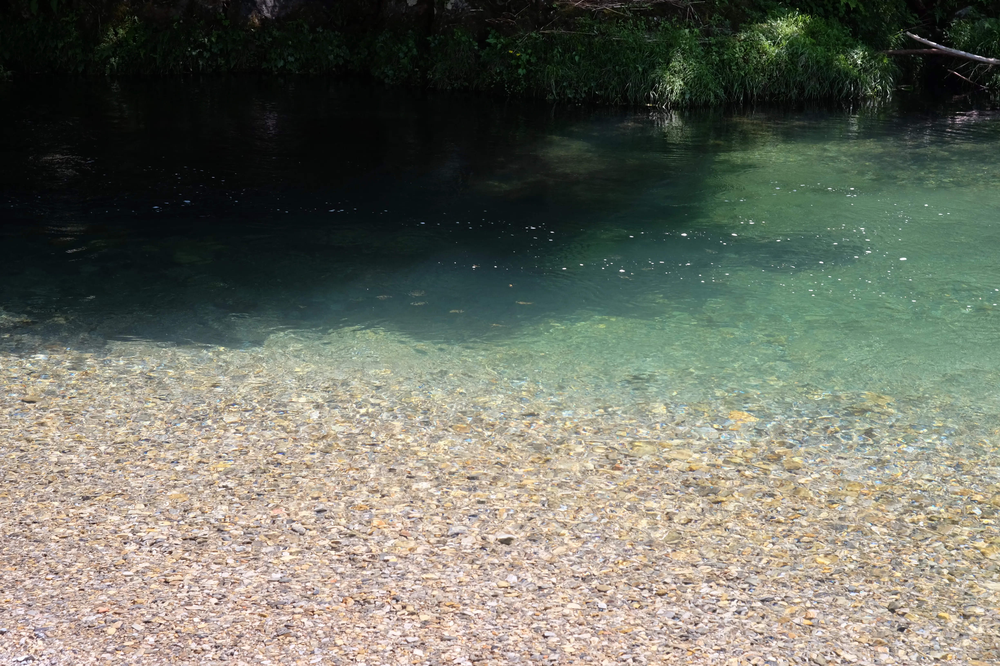
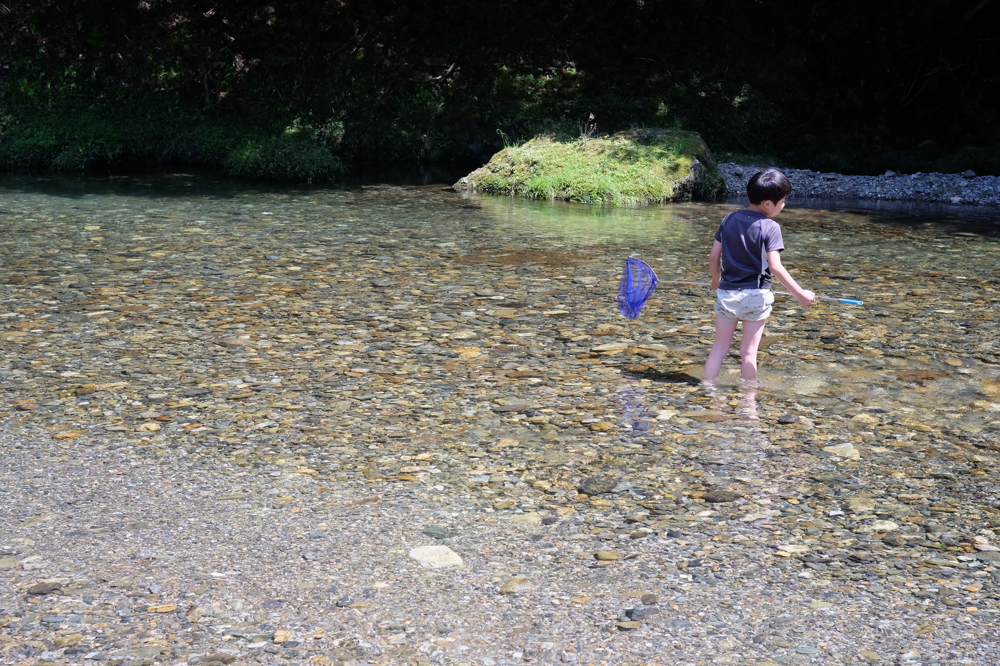
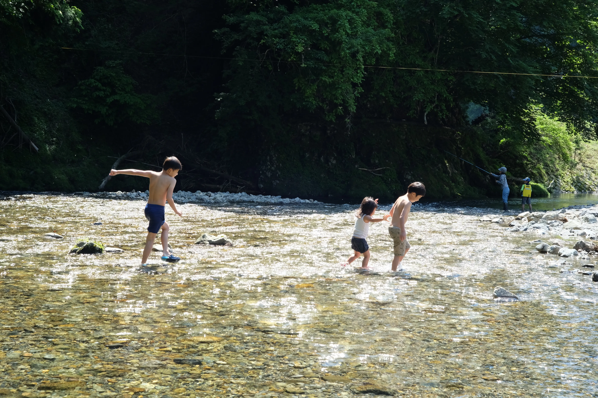
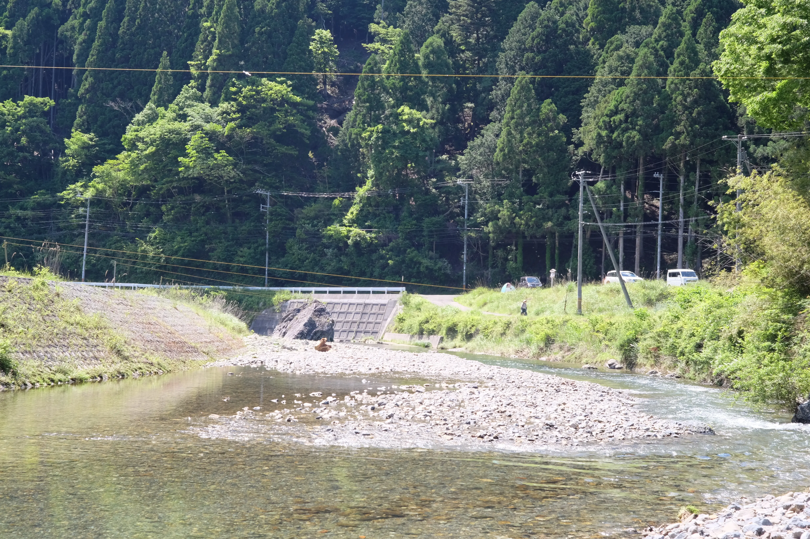
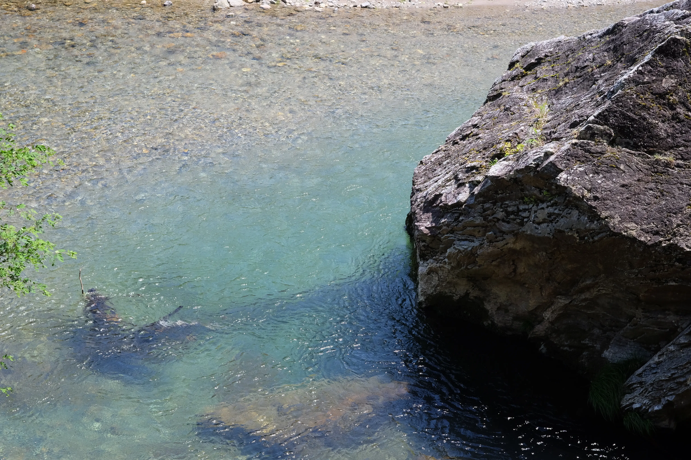

---
categories:
  - アウトドア
  - 川遊び
date: "2025-02-15T23:43:17+09:00"
description: 京都の都市部から北へ約1時間、花背の山奥にあるリゾート施設、京都花背リゾート 山村都市交流の森の前を流れる大堰川の清流で川遊びができるスポットを紹介します。
draft: false
images:
  - images/DSCF4538.webp
summary: 京都の都市部から北へ約1時間、花背の山奥にあるリゾート施設、京都花背リゾート 山村都市交流の森の前を流れる大堰川の清流で川遊びができるスポットを紹介します。
tags:
  - 川遊びスポット
  - 猪谷川
  - 和歌山
title: 川遊びスポット 大堰川 － 京都花背リゾート山村都市交流の森
---

京都の都市部から北へ約1時間、花背の山奥にあるリゾート施設、京都花背リゾート 山村都市交流の森の前を流れる大堰川の清流で川遊びができるスポットを紹介します。

## アクセス

名神高速京都南ICを降りて国道1号を北へ。そのまま府道38号に入り賀茂川沿いを登り鞍馬川との出会いで右へ曲がり鞍馬川沿いを進む。鞍馬街道を北へ花脊峠を越えて進み右手に京都花背リゾート山村都市交流の森入り口の橋があります。橋を過ぎたところに車を止められる広場があります。



花脊峠手前の登りはすれ違いできないほど狭い箇所がいくつかあるので運転注意です。

## 京都花背リゾート山村都市交流の森は閉まってました

目的地は京都花脊リゾート山村都市交流の森でしたが、訪問したときはコロナ禍で閉まっていました。写真川の奥が京都花脊リゾート山村都市交流の森の敷地です。さらに奥に入り口の橋が見えます。見事に無人です。

京都花脊リゾート山村都市交流の森入り口をを少し越えたところにちょっとした駐車スペースがありました。ここに車を停めます。

花脊の松上げというお祭りのことを説明した看板がありました。川の奥の原っぱで行う行事のようです。この空き地から見るのでしょうか。

## 大堰川の河原で遊ぶ

駐車場から少し上流に川まで降りられそうなところがありました。

川の水はこの通り、とても澄んできれいです。

小魚もたくさん見られます。

川をゆうゆうと泳いでいる魚たちは追いかけるも素早くて全然つかまりません。ハゼ系の石の上でじっとしている小魚を少し取ることができました。

子どもたちは6月にもかかわらず冷たい水にざぶんと浸かって遊びはじめます。水に浸かっては「冷たいー！」と走り回り、元気です。

上流側はこの通り、浅い場所が多いので小さな子どもでも楽しめます。右側はやや深く、魚がたくさん泳いでいます。

[上流側](IMG_20210530_133404.webp)

下流側はカーブの先がやや流れが早く深くなっていそうです。

しばらく遊んで撤収です。駐車場真下は結構深いところもあり、夏は泳げそうです。

まだ季節が6月上旬だったこともあり、泳ぐには寒いですが、真夏に来れば思いっきり泳いで楽しめそうな川遊びスポットでした。
