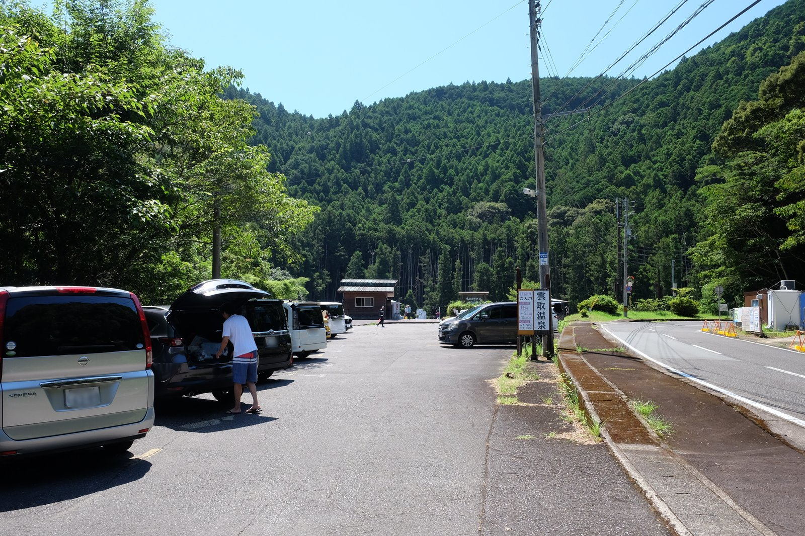
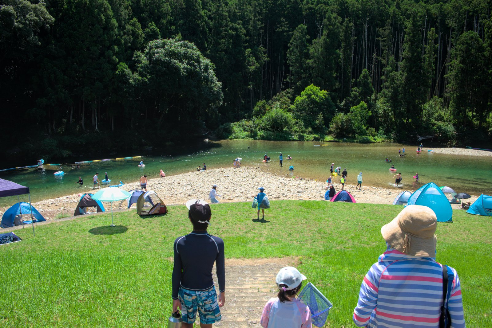
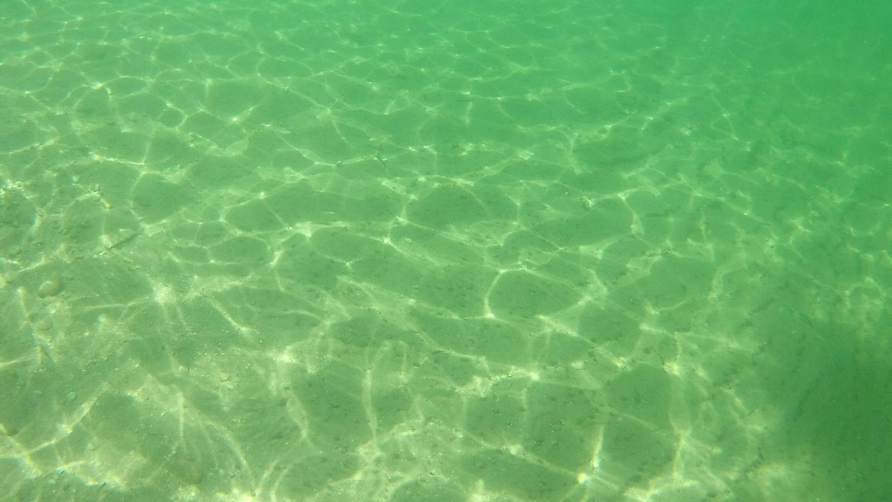

---
categories:
  - アウトドア
  - 川遊び
date: "2025-02-15T23:44:11+09:00"
description: 奈良県の奥地から和歌山県の熊野灘へ流れる熊野川、その下流域の支流高田川にある川遊びスポット、「高田自然プール」をご紹介します。透き通る水に監視員さんもいて安心して川遊びができる場所です。
draft: false
images:
  - images/DSCF9609.jpg
summary: 奈良県の奥地から和歌山県の熊野灘へ流れる熊野川、その下流域の支流高田川にある川遊びスポット、「高田自然プール」をご紹介します。透き通る水に監視員さんもいて安心して川遊びができる場所です。
tags:
  - 川遊びスポット
  - 高田川
  - 高田自然プール
  - 和歌山
title: 川遊びスポット 和歌山県 高田自然プール
js: js/paad.ts
---

奈良県の奥地から和歌山県の熊野灘へ流れる熊野川、その下流域の支流高田川に「高田自然プール」という川遊びスポットがあります。

プールという泳いで楽しめそうな名前の付く高田川で川遊びをしてきました。

## アクセス



新宮市街地から国道168号を熊野川に沿って上り約7分、左へ曲がり県道230号に入ります。そこからすぐに左手に駐車場があります。

## 開設期間・遊泳時間

-   開設期間： 7月15日より8月31日 (2024年)
-   遊泳時間： 午前10時より午後5時まで

開設期間は、例年7月15日より8月31日ですが、[和歌山県のWebサイト](https://www.pref.wakayama.lg.jp/prefg/081300/d00214693.html)をご確認ください。雨天、増水時には遊泳禁止になるようです。ペット、釣り、バーベキュー禁止です。

## 駐車場

駐車料金は無料です。駐車場には係員さんがいたり、川の方も見てくれている方々がおられ、更衣室やトイレ、砂を洗う水道とホースもありますが、入場料などもかからず、完全に無料でした。

駐車場はそれほど広くなく、約30台程度でしょうか。着いたのは朝10時30分頃でしたが、既にほぼ満車で滑り込みセーフという感じでした。

午後1時頃、帰りもこの通り満車でしたが、ぽつぽつと出ていく人がいればまた埋まる感じです。

## マップ

高田川が大きく湾曲する部分が川遊び場になります。駐車場と河原の間に更衣室とトイレの建物があり、その先が芝生エリアでここにテントを立てている人もいました。芝生の階段を下りていくと河原です。

黄色点線部分にロープが張られていて、この間が遊泳区間になります。

## 更衣室・トイレ

県道230号沿いに駐車場があり、駐車場の奥に入口があります。入口には看板があります。

駐車場と河原の間に更衣室とトイレの建物があります。

水道もあり、ホースまで付けてくれているので帰りに足や浮輪なのに付いた砂を洗うことができます。

## 泳いで楽しい高田自然プール

駐車場から河原に出ると、眩しく美しい川が目に入ります。

川の水は透明で冷たく、流れは穏やかです。この透明度は驚きです。

浅場はこの通りの透明度！下にハゼ系の小魚がたくさんいるので網を持っていれば魚捕りも楽しめます。

テントは小石の河原に立てる人、階段上の芝生に立てる人と、駐車場が小さく入れる人も限られるため、場所確保には困りません。

川は穏やかな流れですがすぐに深くなり、泳ぎがいがありますが大人でも足が付かないため浮輪、ライフジャケットなど必須です。

泳ぎに行く前に、ライフジャケットを準備しましょう。ここはすぐに深くなるため、特に子供がいる場合は必須です。スマホの防水ポーチもあると川の中でも写真が撮れ、濡れる心配も無く安心です。



浮輪に乗って流れている人たちが気持ち良さそうなので、早速やってみましょう。上流のロープがあるあたりは浅いため、そこから浮輪に乗りスタートです。

水の中は砂地でまるで海のようです。透明感もすごいです。

すぐに足が全く付かないほど深くなります。深さが良くわからないですが、3-4mくらいはありそうな感じです。魚は一瞬だけ見ましたが、人が多いせいかその後は見られず。おそらく人のいない場所に逃げてしまうのだと思います。

カメラを下向きにして、川底です。写真では伝わりませんが、相当深いですが川底までこれだけ見えます。

途中になんと木が1本まるまる倒れてました。不思議な光景ですが大雨の日などに流されてくるのでしょうね。

魚捕り、泳ぎに満喫したら最後は飛込台です。下流側にあり、ここより下流（写真左）にはロープがあり、川遊びできるのはこのあたりまでです。ここから思いっきりジャンプして今回の川遊びはおしまいです。

## 高田第2自然プール

高田自然プールから少し登ったことろに高田第2自然プールがあります。高田自然プールが満車のときはそちらに行ってみてもよいかと思います。係員さんに聞いた限りですが、第2自然プールは水深が浅いとのことです。



## まとめ

高田自然プールは透明な水に緩やかな流れで川幅は広く川底は深く、その名の通り、プールのように泳いで楽しい川遊びスポットでした。大阪からは遠く、なかなか行きにくい場所ですがこれだけ思いっきり川遊びができる場所は無いのではないでしょうか。

イチオシの場所ですが、駐車場がすぐに埋まってしまうのでご注意ください。また、魚は思ったほどいなかったので、泳ぐよりも魚を見たい、捕りたいがメインであれば奈良のやはた温泉、たかすみ温泉あたりがおすすめです。
