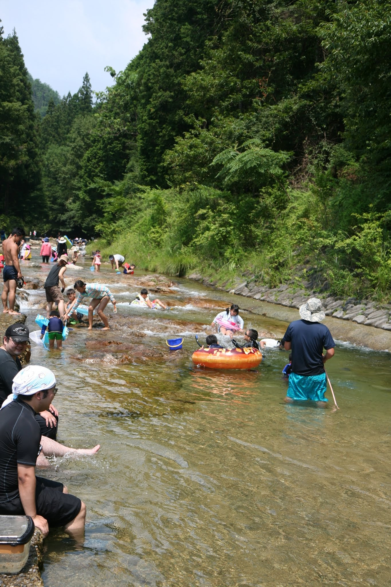

---
categories:
- アウトドア
- 川遊び
date: "2025-02-15T23:42:28+09:00"
draft: false
images: 
- images/IMG_4566.JPG
description: 奈良県の清流、高見川沿いにある川遊びスポット、たかすみ温泉をご紹介します。河川敷がコンクリートで整備されておりあまり汚れず川遊びができ、水が綺麗で魚も多くおすすめのスポットです。
summary: 関西で子供と川遊びができるきれいな川を探して奈良県の高見山付近、高見川沿いにあるたかすみ温泉へ行ってきました。河川敷がコンクリートで整備されておりあまり汚れず川遊びができ、水が綺麗で魚も多くおすすめのスポットです。
tags:
- 川遊びスポット
- 高見川
- 奈良
- 温泉
title: 川遊びスポット たかすみ温泉
---

関西で子供と川遊びができるきれいな川を探して奈良県の高見山付近にあるたかすみ温泉へ行ってきました。

## アクセス

場所は県道28号沿いで見落とすことはありませんが注意点が1つ。北側の道は車一台がやっと通れるような険道で対向車が来ると大変な思いをするので南側、国道166経由で来ることをおすすめします。



## 高見川で川遊び

土曜日の朝10時頃着きましたが駐車場はほとんど空いていてちらほら人がいる感じでした。たかすみ温泉の駐車場は無料です。ただ、車停めて川遊び後は温泉に入ってねという看板があります。

水が透き通っていてきれいです。

川岸は石の階段状になっており、人工的で少し味気ないですがテントを建てるスペースもあり、汚れないのがいいです。結構人が来ましたが8月上旬の晴れた土曜日でしたがスペースが全て埋まるということは無かったです。

川の中は岩があって少し起伏があり、浮き輪に乗って流れると楽しめます。

少し深い場所にはイワナかヤマメかと思いますが大きめの川魚もたくさんいます。水が透明なのでゴーグル付けて中を見るとかなり良く見えます。でも捕るのは難しいです。浅場のおたまじゃくしなどをつかまえていました。

子供たちはとにかく流れているだけで楽しいみたいです。

何度も何度も下流まで流れては浮き輪を持って上流に歩いていきます。

最後は温泉に入りさっぱりして帰ります。4時頃には8割程度駐車場が埋まっていました。

小さな場所で大人には物足りないですが子供を遊ばせるには最高の場所でした。水がとにかくきれい、魚がたくさんいる、川岸が整備されているのであまり汚れない、温泉があると狭いながらもいろいろ条件が良くおすすめのスポットです。

