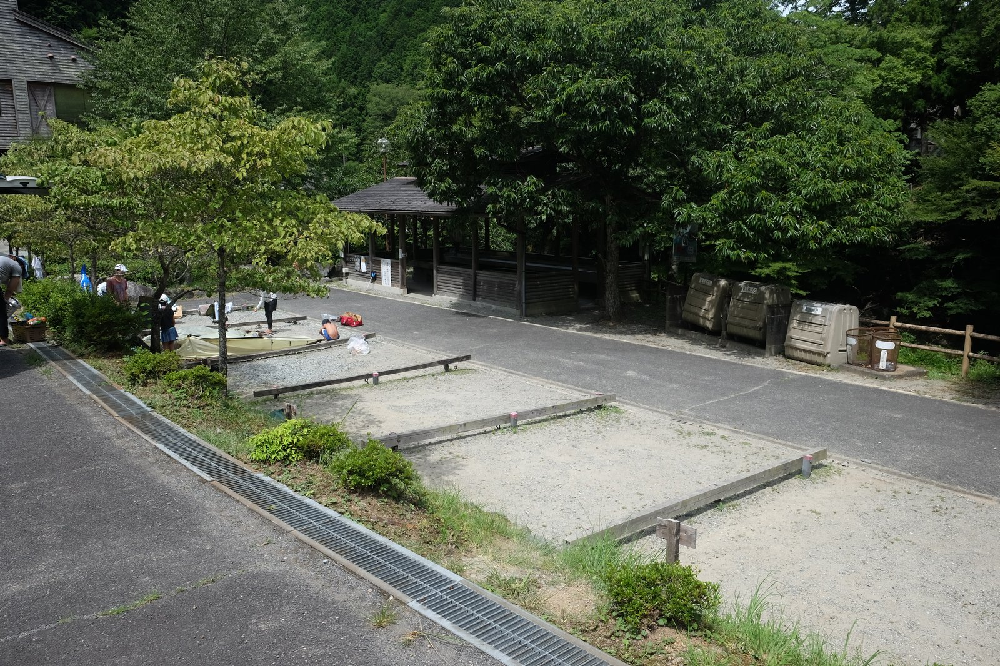

---
categories:
  - アウトドア
  - 川遊び
date: "2025-02-15T23:44:14+09:00"
description: 奈良県の山奥、四郷川の清流で川遊びができるやはた温泉をご紹介します。透明度の高いエメラルドの水で、深い淵にはたくさんの魚が泳ぐ姿を見ることができます。
draft: false
images:
  - images/008.jpg
summary: とびきり暑い今年の夏、休日に外へ出るのは海やプール、川遊びが多くなります。中でも標高が高く、気温も少し低くて冷たい水が流れる山奥での川遊びは特に真夏におすすめです。奈良県の山奥、四郷川の清流で川遊びができるやはた温泉に行きました。
tags:
  - 川遊びスポット
  - 四郷川
  - 温泉
  - 奈良
title: 川遊びスポット やはた温泉
---

とびきり暑い今年の夏、休日に外へ出るのは海やプール、川遊びが多くなります。中でも標高が高く、気温も少し低くて冷たい水が流れる山奥での川遊びは特に真夏におすすめです。

数年前にコロナ禍の中、訪れたやはた温泉ですが、今年は外出規制も無くなり思いっきり川遊びができるようになったので再度訪問しました。

## アクセス



大阪から、南阪奈道路を東へ、終点の新城まで進み、国道165号を藤原神宮を通り過ぎて国道166号で宇陀へ。さらに国道166号を南へ走り、鷲家トンネルの手前で右へ県道16号へ入り、高見川に出会った分岐で左、県道220号へ。細い道を川沿いに走り、丹生川上神社を越えたところで右折、四郷川沿いにしばらく進むと左手にやわた温泉の建物が現れます。

駐車場は30〜40台程度でしょうか。10時過ぎ頃に到着しましたが、ぎりぎり入れました。無料で出入りは管理されておらず、思い思いに停める感じです。その後満車になりましたが、やはた温泉前の道路が比較的広いため、路上にも車が停められていきました。

やはた温泉直前に、四郷川を渡りふるさと村がありここにも駐車場がありますが、着いたときには既に満車の看板が出ていました。

## マップ

駐車場からやはた温泉の建物手前に四郷川へ下る階段があります。駐車場の脇にキャンプサイトがいくつかありました。

やはた温泉下からふるさと村の橋までは浅場で小さな子どもはこのあたりがメインの遊び場になります。橋を越えてさらに下流側は深場がありますが、このあたりはふるさと村から下りた人達のメインの遊び場です。

上流側に深い淵があり、魚がたくさん泳いでいます。そこからさらに上流はまた浅い流れです。

## 冷たい清流にたくさんの魚

駐車場に車を停めたら、早速四郷川へ。駐車場脇のキャンプサイトが7区画あり、1区画は前日から泊まっているようでお片付け中の人が。調べてみるとふるさと村のキャンプサイトと一緒に運営されており、なっぷでオンライン予約できるみたいです。

やはた温泉建物手前の階段から四郷川へ降ります。

眼の前にエメラルドグリーンの綺麗な清流が広がります。

下流側は足のつく深さで、水がクリアです。編みを持って魚とりをしている人もいます。

上流側は吊橋の向こう側あたりに深場があり、浮輪で流れたり岩から飛び込んだりできます。かなり深いので子供はライフジャケット必須です。

深場の上流側から下流を見た写真です。浅いように見えますが、左手の人が立っている岩からすぐにズドンと深くなっています。

浮輪で流れるのも楽しいですし、魚がたくさんいるので子供が編みを持って魚捕りを試みますが魚は素早くぜんぜん捕獲できません。水質は鉱物のせいか、透明というよりはやや霞みがかった綺麗なブルーです。

安物アクションカメラを手に、泳いでみました。

いきなり小魚の群れです。水はとても冷たいです！

まだ足が付きます。さらに流れていきます。

最深部あたりです。魚がうじゃうじゃいますが、画像だとあまりわからないですね。。。写真ではわかりませんが、川底は深さ4-5mはあると思います。

人の足が左上に見えますが、川の深さが分かりますでしょうか？

深場はすぐに終わり、また浅くなり足がつきます。魚を見るのが楽しくて何回も流れてしまいました。😁

深場のさらに上流です。

浅い場所は水がほんとうに透き通るように透明です。

3時間ほど遊び、寒くなったので温泉に入り帰りました。とても冷たい水なので帰りに温泉に入れるのは最高ですね。

## まとめ

やはた温泉は、水がとても綺麗で魚もたくさん見ることができ、温泉も入って満喫できました。この付近はたかすみ温泉、丹生川上神社
中社など川遊びスポットがたくさんあり、どこも水質が良く魚も見られますが、たかすみ温泉より深く、大人も泳いで楽しめ、魚もたくさん見ることができるため一番のおすすめ川遊びスポットです。深い場所があるため子供を連れて行かれる方はライフジャケットを準備しましょう。
