---
categories:
  - 車
date: "2025-02-15T23:43:36+09:00"
description: 季節の変わり目でタイヤを交換する際など、タイヤの摩耗が気になります。タイヤの溝深さを測定するゲージを購入したのでレビューします。
draft: false
images:
  - images/SSOEV.webp
summary: 今年も冬を迎え、マイカーのスバル エクシーガ クロスオーバー7のタイヤをDIYでスタッドレスタイヤに交換しました。どれくらい溝が残っているかタイヤ溝ゲージを購入して測ってみました。
tags:
  - タイヤ溝ゲージ
  - 工具
title: タイヤの残り溝をチェック −BALタイヤ溝ゲージ−
---

今年も冬を迎え、マイカーのスバル エクシーガ
クロスオーバー7のタイヤをDIYでスタッドレスタイヤに交換しました。タイヤが摩耗しスリップサインが出ると寿命なのは知っていましたが、あとどれくらい溝が残っているかタイヤ溝ゲージを購入して測ってみました。

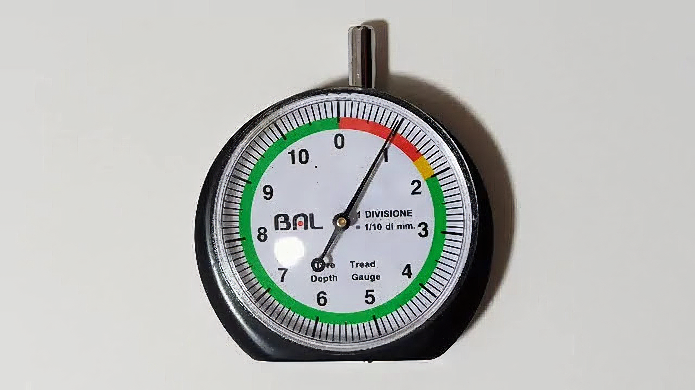

## タイヤの摩耗とスリップサイン

タイヤの溝は1.6ミリ以上必要で、1.6mm未満になると整備不良として使用禁止になります。タイヤの側面にある△マークの延長線上の溝内に1.6mmの凸部があります。

タイヤが摩耗してこの凸部が露出するとスリップサインが出たということで使用できなくなります。

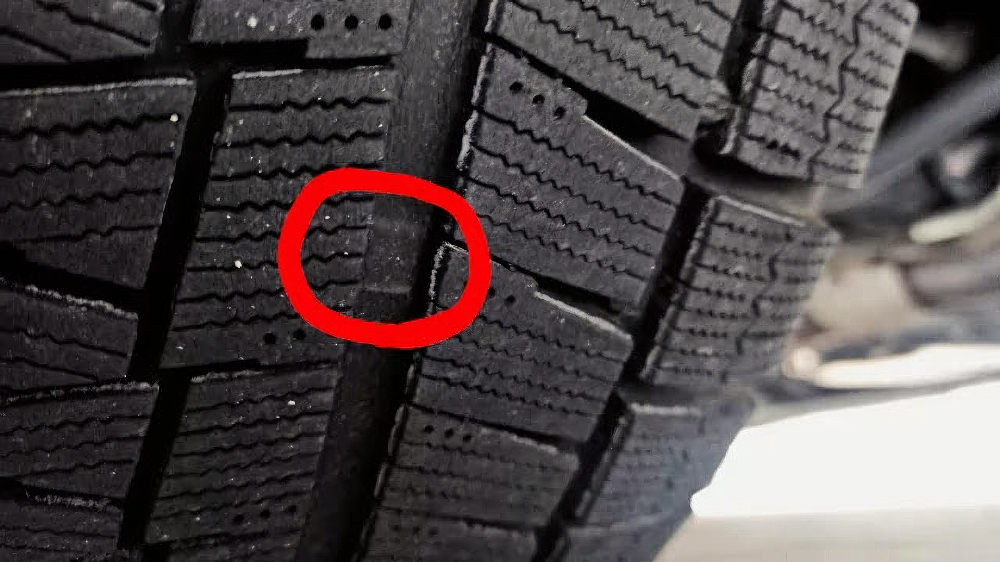

## スタッドレスタイヤはプラットホームを確認

スタッドレスタイヤの場合、この他にタイヤ側面の↑マークの延長線上にタイヤ溝深さ50%の高さでスリップサインとは別に凸部があり、プラットホームと呼びます。

プラットホームが露出するとスタッドレスタイヤとしての機能が低下するため、スタッドレスタイヤの場合はプラットホームが出たら交換時期ということでしょう。（ちなみにプラットホームが露出してもスリップサインが出るまでは夏用タイヤとしては使えます）

## BAL（大橋産業）タイヤ溝ゲージ 1225

タイヤ溝ゲージですが、大きく分けてノギス式のものとダイヤル式のもの、それぞれアナログとデジタル表示があります。

| 表示  | ノギス式  | ダイヤル式  |
|:-:|:-:|:-:|
| アナログ  | 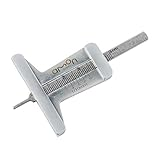  | 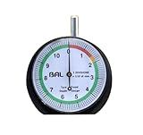  |
| デジタル  | 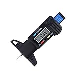  |   |

年に1回測定するかどうかという使用頻度になりそうなので、電池不要のアナログ式を選択。ノギス式とダイヤル式はどちらでも良いのですが、ダイヤル式の方が針が見やすく、一目でわかるのでダイヤル式にしました。

どれも似たような物でしたが、BAL（大橋産業）のタイヤ溝ゲージを購入しました。千円台で安いものです。

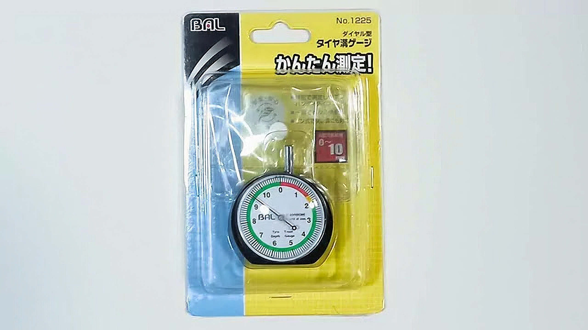

中身はこんな感じです。大きなダイヤルが見やすく、一目盛り1/10mmです。1.6mm以下が赤でNGが一目でわかります。

棒状の測定子を上から押すと下側に出て、出た分だけダイヤルが回転します。

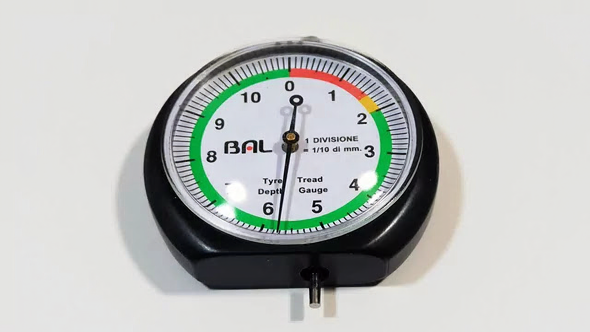

裏側には摩耗限度が記載されています。乗用車は1.6mmですが、トラック・バスや二輪は摩耗限度が違ったり、高速走行時でも異なったりするのですね。

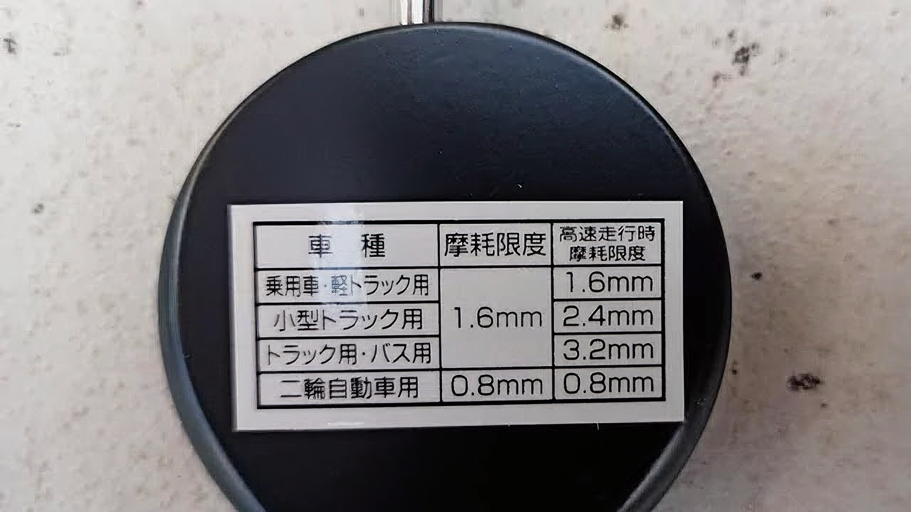

しょぼいビニールの入れ物まで付いてきます。これは、、、要らないかも。

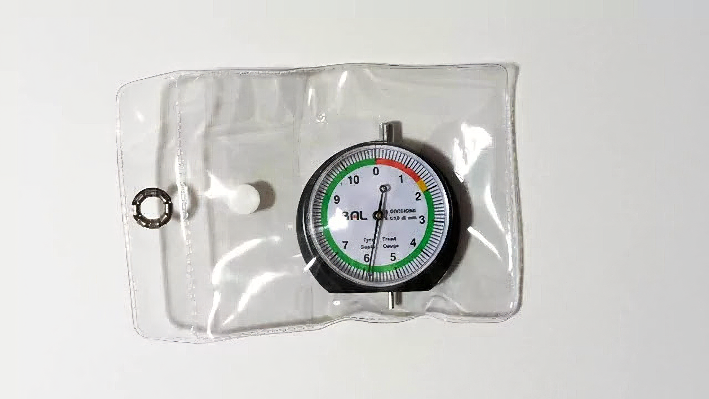

## タイヤの残り溝を測定する

測定方法は簡単、タイヤ表面に本体の座面を当て、棒状の測定子を溝底に当てるだけです。といっても、溝底を測定してもスリップサインが出てるか出てないか目視で確認できるので面白くないので、スリップサインの凸部に当て、スリップサインまでどれだけ溝が残っているか見てみましょう。

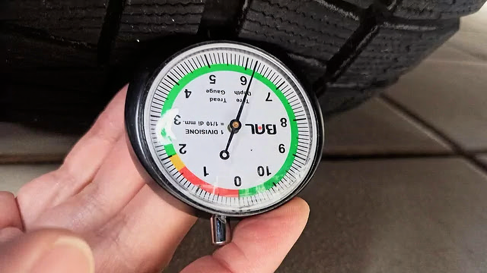

6.2mmありました。溝底まではさらに1.6mm、合計7.8mmあるはずです。まだまだ大丈夫ですね。

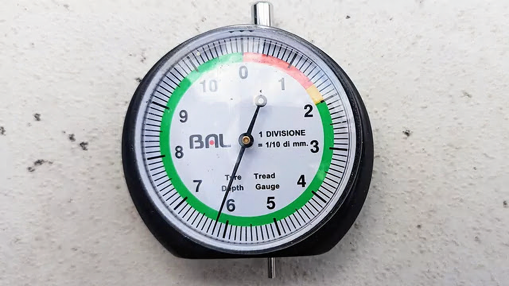

スタッドレスタイヤなので、プラットホームからの残り溝も確認してみましょう。

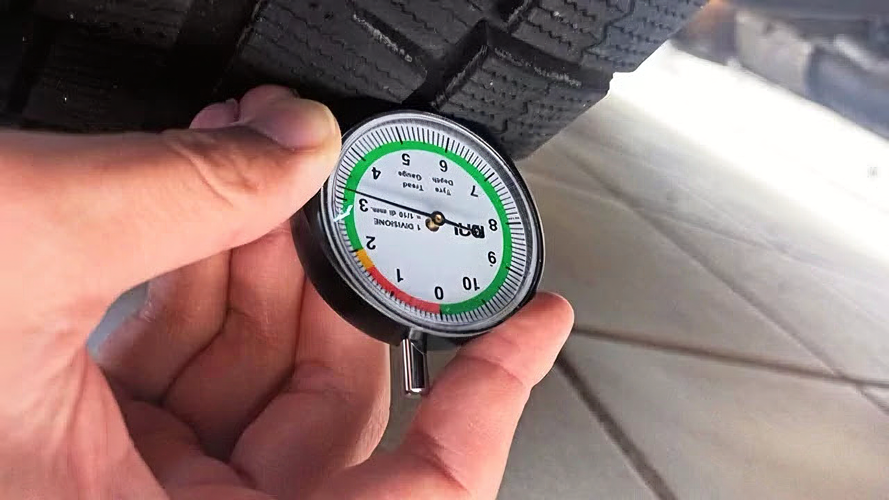

3.1mmでした。こちらは意外と早く摩耗限度がくるかもしれません。冬シーズン後のタイヤ交換時にまた測定してみましょう。

ということで、4本測定して今シーズンはまだ大丈夫でしょう！

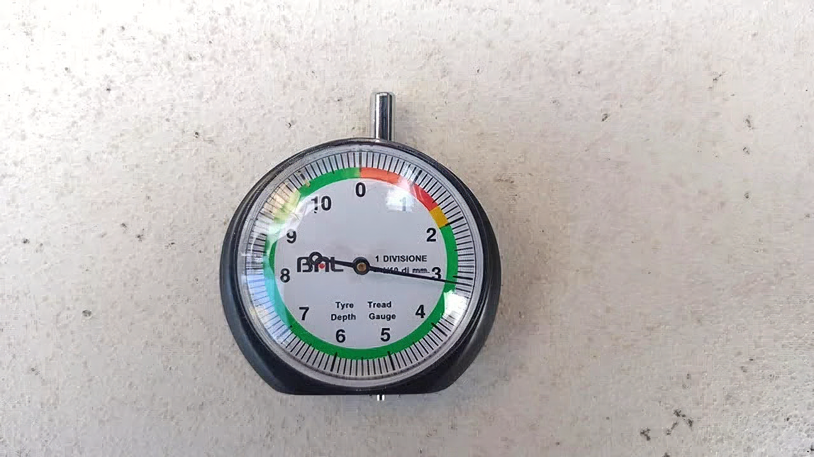

## まとめ

タイヤの残り溝は乗用車の場合、1.6mm以上必要です。スタッドレスタイヤは50%のプラットホームが先に露出して交換時期になるので注意しましょう。タイヤ溝ゲージを使うとあとどれだけ溝が残っているか確認できます。

タイヤの残り溝は、無くても1年毎の点検や車検で測定してくれるし、目視でも確認できるので正直、タイヤ溝ゲージは必ずしも必要だとは思いませんが、数字で確認できると交換時期もある程度推定できてくるので安心できます。千円程度と安いものなので1つ持っておいて損は無いものです！

