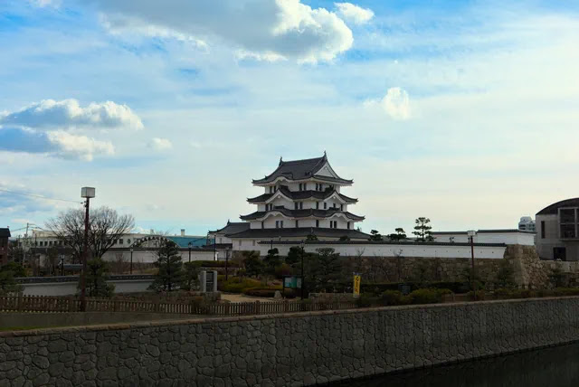

---
categories:
  - アウトドア
  - 旅行
date: "2025-02-15T23:44:03+09:00"
description: 兵庫県尼崎市にあるお城、尼崎城に行ってみました。2019年にグランドオープンしたピカピカ新築のお城です。中で剣術体験コーナーができるなどなかなか新しい楽しみ方ができるお城でした。
draft: false
images:
  - images/05.webp
summary: 兵庫県尼崎市にあるお城、尼崎城に行ってみました。2019年にグランドオープンしたピカピカ新築のお城です。中で剣術体験コーナーができるなどなかなか新しい楽しみ方ができるお城でした。
tags:
  - 兵庫
  - 尼崎
  - 城
title: 現代に蘇った新築の城 尼崎城
---

兵庫県尼崎市にあるお城、尼崎城に行ってみました。2019年にグランドオープンしたピカピカ新築のお城です。中で剣術体験コーナーができるなどなかなか新しい楽しみ方ができるお城でした。

## アクセス



電車でJR、阪神尼崎駅南口から庄下川を渡ってすぐです。

車の場合は尼崎城敷地内に駐車場があります。

## 尼崎城について

尼崎城は元和3年(1617年)に戸田氏鉄の城として築城されました。明治6年(1873年)の廃城令により取り壊されてしまいます。この尼崎城の本丸跡が尼崎市立明城小学校の敷地内にあります。

[本作品には、知られている限り、著作権の制約が存在していません](http://creativecommons.org/publicdomain/mark/1.0/ "license")

時は流れ、家電量販店旧ミドリ電化の創業者、安保詮が私財を投じ天守を再建しました。市内外の個人・団体からの寄付もあり2016年に着工、2019年3月29日にグランドオープンしました。なのでオリジナルの尼崎城とは別の場所に復元されたものですが、現代の城として楽しめるものになっています。

## 新築できれいな外観

尼崎駅南口から庄下川を挟み、すぐ近くに尼崎城が見えます。

築城されたばかりのきれいで立派な天守です。

お堀は管理が面倒なためか砂利になっています。

天守前の広場も人工芝だったりして現代的ですね。

## お城の中では様々なイベントが楽しめる

お城の中に入ることができます。

有料で大人500円、小・中・高生は250円でした。

入るといきなりエレベーターで最上階の5階へ！北側の展望は尼崎の街と奥には池田の五月山が見渡せます。どうやら上から階段で下っていくシステムのようです。

下には公園と左は尼崎駅です。

最上階の部屋の中はこんな感じです。家として快適に住めそうですね。

3階は「なりきり体験ゾーン」と、甲冑や忍者、お姫様の衣装などを着ることができます。

我が家のお姫様です。

2階まで降りると剣術体験、鉄砲体験と面白いアトラクションがありました。

こんなのも。

## 公園もあります

お城の敷地にはちょっとした遊具のある公園があるのでお城の中のアトラクションなどと合わせ子供に楽しめる場所です。

少し遊んで帰路につきました。

## まとめ

尼崎城はできたばかりの新築の城で、松本城や彦根城のように昔からの天守が残っているものではなく建物から歴史を感じることはできませんがとても綺麗なのでこれはこれで一見の価値ありです。城の中や外の公園でいろいろ遊べるので子供連れの家族におすすめできるお城でした。
